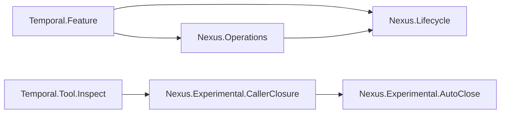

# Clarify core Nexus lifecycles and isolate AutoClose experiments

## Overview

Replace the inverted Nexus model hierarchy with one ordinary Feature surface for starting,
canceling, and successfully completing operations, and one explicitly experimental surface for
the detailed AutoClose and caller-closure models. Remove the `Examples` module layer completely.

## Goal & Context
<!-- scope: business -->

A Temporal model author should encounter the smallest useful Nexus lifecycle first. The current
layout makes an experimental AutoClose proof authoritative for the introductory model and labels
the basic lifecycle as example code. The cleanup makes basic operation meaning the normal import
path while preserving the detailed experiment for explicit opt-in use.

## Architecture & Data Models
<!-- scope: technical -->

The ordinary Nexus lifecycle is a deep module with four focused states, three events, three valid
transitions, and the existing single-capability checked Umpire target. The operations module uses
that target for three Property → Behavior → Query → planning walkthroughs. Neither ordinary module
imports experimental code.

AutoClose and caller closure move together under an Experimental namespace because caller closure
directly consumes AutoClose configuration and proofs. The inspector remains an explicit opt-in
consumer. Core and experimental tests compile through separate aggregate targets.



The detailed approved design is recorded in
`docs/superpowers/specs/2026-08-26-nexus-lifecycle-cleanup-design.md`.

## Approach

- Replace the introductory lifecycle's AutoClose dependency with a focused local state/event
  transition relation and extend its checked target domain with cancellation.
- Move the two existing walkthroughs to the root Nexus namespace, add cancellation in the same
  authored-to-planned shape, and delete the old module paths without compatibility aliases.
- Relocate the experimental Lean modules and fixture together, preserve comments and semantic
  declaration identities, and update source provenance and opt-in imports.
- Separate ordinary and experimental test aggregates while keeping both in the default/full
  regression build.
- Update authored docs and regenerate source-path-bearing projections from their owners.

## Quick commands

```bash
cd model && mise exec -- lake build Temporal.Feature.Nexus.LifecycleTests Temporal.Feature.Nexus.OperationsTests Temporal.Feature.Nexus.Experimental.CallerClosureTests TemporalModelTests TemporalExperimentalTests
make umpire-check-regression
make lint-model
```

## API Contracts
<!-- scope: technical -->

- The focused lifecycle states are `scheduled`, `started`, `canceled`, and `succeeded`.
- Its only valid transitions are scheduled/start/started, started/cancel/canceled, and
  started/succeed/succeeded; every other state/event pair has no transition.
- Start and successful-completion semantic declaration identities remain stable. Cancellation adds
  new identities. Target/provider/kernel/domain contract digests change only where the admitted
  semantic surface changes.
- Moved experimental declarations retain their semantic IDs and digests. Their source provenance
  truthfully records the Experimental path.
- The ordinary Feature facade exports Lifecycle and Operations and exports no Experimental module.

## Edge Cases & Constraints
<!-- scope: technical -->

- Terminal states cannot restart, cancel again, or complete again.
- Successful completion remains handler-reported progress rather than a caller protocol verb.
- Missing/conflicting provider and Property/Behavior/Query failures retain their typed errors.
- The caller-closure fixture, inspector provenance, generated projection catalog, and exact
  verification-consumer names move atomically with the experimental source paths.
- Existing comments in moved or refactored files are preserved and updated only when their path or
  described ownership becomes false.
- Concurrent dirty Flow planning artifacts, especially the active fn-31 review, are not modified.

## Acceptance Criteria
<!-- scope: both -->

- **R1:** The ordinary Nexus lifecycle owns exactly the four focused states and three valid
  transitions, has no import of Experimental code, and returns no transition for all other pairs.
  Errors: terminal restart/recancel/recompletion and unsupported initial/event pairs are rejected
  as absent transitions.
- **R2:** Root Nexus operations expose deterministic start, cancellation, and successful-completion
  Property, exact-action Behavior, checked Query, and planned artifact paths over one shared target.
  Errors: wrong actions are not admitted, target-inconsistent outcomes fail the Property, and
  declaration/check failures retain typed errors.
- **R3:** AutoClose, caller closure, their tests, and fixture exist only under the Experimental
  namespace/path, with existing comments, proofs, semantic declaration identities, and scenario
  behavior preserved. Errors: old module-path compatibility aliases, stale provenance, changed
  semantic IDs/digests, or fixture drift fail verification.
- **R4:** Ordinary and experimental facades/build roots are mechanically separate: Temporal.Feature
  exports only the core Nexus modules, TemporalModelTests excludes the experiment, and an explicit
  TemporalExperimentalTests target plus the inspector opt-in keep experimental code compiled.
  Errors: transitive Experimental imports from the ordinary facade/test root or an uncompiled
  experiment fail build/lint gates.
- **R5:** All live source, build, lint-policy, fixture, generator, generated-projection, and model
  documentation references use the new paths and describe start/cancel/complete before the
  experiment. Errors: obsolete `Nexus.Examples`, root AutoClose/CallerClosure, or root fixture paths
  in live nonhistorical surfaces; hand-edited generated output; lost existing comments; or failed
  deterministic regeneration blocks completion.

## Early proof point

Task `.1` proves the focused Lifecycle target can own start, cancel, and completion without an
AutoClose import. If it fails, re-evaluate the core/experimental semantic seam before moving the
experimental modules or generated artifacts.

## Boundaries
<!-- scope: business -->

- No Nexus runtime, SDK, handler, endpoint, retry, timeout, failure, termination, or rejection
  behavior changes.
- No compatibility aliases for deleted Examples or pre-Experimental module paths.
- No new Umpire language, planner capability, inspector scenario, or artifact format.
- No rewrite of historical completed Flow specs/tasks merely because they mention the old layout.
- No edits to the concurrently dirty fn-31/fn-34 Flow planning state.

## Decision Context
<!-- scope: both — conditionally substructured -->

### Motivation
<!-- scope: business -->

The simple product lifecycle should be the first and normal Nexus model surface; experimental
design detail should require an explicit import.

### Implementation Tradeoffs
<!-- scope: technical -->

A clean break is preferred over compatibility facades because there is no external Lean module
compatibility contract and two import paths would preserve the discoverability problem. The core
model intentionally stays focused instead of extracting the experiment's ten-state graph, so its
interface communicates exactly the requested start/cancel/complete scope. Experimental tests get a
separate aggregate rather than being dropped from default verification.

## References

- Approved Nexus lifecycle cleanup design.
- Completed basic Nexus Umpire DSL showcase spec (`fn-11-basic-nexus-umpire-dsl-showcases`).
- Completed import-graph boundary enforcement (`fn-34-enforce-lean-model-boundaries-with`).
- Pending target-deepening consumer migration (`fn-31-deepen-umpire-target-and-simplify`).

## Requirement coverage

| Req | Description | Task(s) | Gap justification |
|-----|-------------|---------|-------------------|
| R1 | Focused independent lifecycle | `.1` | — |
| R2 | Three root operation walkthroughs | `.1` | — |
| R3 | Experimental relocation and semantic preservation | `.2`, `.3` | — |
| R4 | Facade and build separation | `.1`, `.2`, `.4` | — |
| R5 | Live paths, generated projections, docs, and comments | `.2`, `.3`, `.4` | — |
