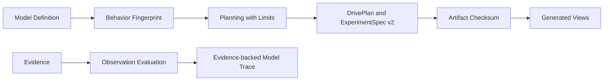

# Hard-cut Umpire vocabulary and current artifacts

## Overview

Replace the prototype's legacy modeling vocabulary in one deliberate break. Lean APIs, module paths, tests, examples, persisted DrivePlan and ExperimentSpec fields, Go consumers, generated regression views, and active documentation move to the terms defined by the Umpire4 vision. No compatibility aliases, v1 reader, or v1 migration survive the cutover.

The cutover covers the currently implemented vertical slice: model authoring through deterministic planning, artifact emission, inspection, checked-in Switch and Nexus fixtures, and their Go-generated views. Future runtime, evidence transport, replay, and release artifact families remain owned by their downstream specs, which must start from this vocabulary and v2 baseline.

Fn-18 subsequently superseded only this spec's pre-release compact canonical spelling and checksum preimages. The retained v2 schemas, Definition IDs, Behavior Fingerprints, Artifact Checksum vocabulary, and no-compatibility rule remain authoritative; exact persisted v2 bytes are now deterministic fixed-order two-space pretty JSON with exactly one terminal LF, with no normalization or migration from the compact spelling.

## Goal & Context
<!-- scope: business -->

An engineer new to Temporal and formal modeling should be able to follow the code using the same ordinary words as the vision: a Definition ID names a Model Definition, a Behavior Fingerprint changes with modeled behavior, an Artifact Checksum identifies exact persisted content, a Limit bounds one stage, and a Known Gap states what is absent. Today those concepts are obscured by overloaded `semanticIdentity`, `semanticDigest`, `Bound`, `Omission`, `Qualification`, and `Projection` names.

The repository is still a prototype and its checked-in v1 artifacts are disposable. Clarity is therefore more valuable than preserving a compatibility layer that would keep both vocabularies alive.

## Architecture & Data Models
<!-- scope: technical -->

One small fingerprint module owns domain-separated SHA-256 derivation and its typed results. Authoring languages produce Definition IDs and Behavior Fingerprints. Planning produces Limits and Known Gaps. Artifact encoding produces an Artifact Checksum over exact canonical content. Observation evaluation produces an Evidence-backed Model Trace and Evidence Links without making a final Claim Assessment.



Definition IDs, Behavior Fingerprints, and Artifact Checksums are distinct types, not interchangeable strings:

- A Definition ID is an authored, stable, dot-separated name.
- A Behavior Fingerprint is `sha256:` plus 64 lowercase hexadecimal characters, derived from a domain tag and canonical behavior-relevant content. Documentation, source locations, and declaration order do not affect it.
- An Artifact Checksum has the same textual encoding but a different type and domain tag. It covers the complete canonical artifact, including its format version, Behavior Fingerprints, provenance, Limits, and Known Gaps, while excluding only its own checksum field.

Target fingerprinting is grounded in executable behavior, not in metadata about that behavior. Every checked Target supplies a complete finite `TargetBehaviorDomain` independently of whether finite Planning is available. The Target owner provides canonical encoders and complete Setup, State, Action, Outcome, and Observation domains. The checker mechanically evaluates `initialStates` and `steps` across those domains to construct a sorted `TargetBehaviorDescription` of initial-state and transition rows. Existing soundness/completeness proofs plus new domain-coverage and transition-closure proofs establish that those rows describe the authoritative kernel. A Target without that coverage does not become a checked Target; it fails with a typed authoring diagnostic rather than receiving a metadata-only fingerprint. `FinitePlanningAvailability.unavailable` therefore disables Planning only—it does not weaken fingerprint coverage.

Laws follow the same rule. The arbitrary `LawRequirement.semanticDigest`/`LawStatement : DefinitionId → Prop` pairing is replaced by a typed `LawDefinition`: its inert, canonicalizable body is interpreted into the proposition proved by a `LawWitness`. Capability Contracts and Target fingerprints include the canonical law body. Changing a law body therefore changes both its interpreted proposition and the owning fingerprints; a free-form string can no longer stand in for law meaning.

`KnownGap` is one exact closed record, not a string or an open-ended placeholder:

```text
KnownGap {
  kind: capability-contract | input | interpretation | claim,
  code: DefinitionId,
  subject: DefinitionId | null,
  detail: string | null
}
```

`code` is the stable, namespaced identity of the gap; `subject` optionally names the affected Model Definition; and `detail` is human explanation, not identity. Canonical JSON uses the field order shown above. Known Gaps are sorted by `(kind, code, subject-or-empty, detail-or-empty)` and exact duplicates are rejected; two rows with the same `(kind, code, subject)` but different detail also reject as conflicting descriptions. Their complete canonical rows participate in Artifact Checksums.

The current artifact family changes atomically to `umpire-drive-plan/v2` and `umpire-experiment/v2`. V2 is the only supported format after the cutover. Existing consumers reject v1 as an unsupported major format; they do not translate it.

## API Contracts
<!-- scope: technical -->

The source and wire migration follows meaning rather than global text replacement:

| Legacy name | Replacement | Contract |
| --- | --- | --- |
| `DeclarationId`, `DeclarationKind`, declaration metadata/errors | `DefinitionId`, `DefinitionKind`, definition metadata/errors | Names and validates Model Definitions. |
| `SemanticSource` | `SourceLocation` | Points to authored source; never identifies behavior. |
| `SemanticValue`, `SemanticTraceStep`, `SemanticTrace` | `ModelValue`, `ModelTraceStep`, `ModelTrace` | Pure model data with no runtime Evidence. |
| `semanticDigest` and `semanticDigestOf` | `behaviorFingerprint` and `behaviorFingerprintOf` | Generated from behavior-relevant canonical content. |
| artifact `semanticIdentity` | `artifactChecksum` | Identifies exact canonical v2 Artifact content. |
| tie-break `semanticIdentity` | `definitionId` | Orders choices by Definition ID; it is not a checksum. |
| `BoundUnit`, `TypedBound`, expanded bounds | `LimitUnit`, `Limit`, expanded limits | Bounds one named planning or evaluation stage. |
| omissions | Known Gaps | States absent or unsupported Capability Contracts, inputs, interpretations, or claims. |
| `SemanticCoordinate`, `SemanticDerivation` | `ModelCoordinate`, `EvidenceLink` | Identifies a fact in a Model Trace and records why Evidence established it. |
| Qualification module, results, and `QualifiedTrace` | Observation Evaluation, `ObservationResult`, and `EvidenceBackedTrace` | Evaluates Evidence into Model Facts; it is not Claim Assessment. |
| regression Projection command and API | Generated View command and API | Reproducibly derives checked-in Go and Markdown views from an Artifact. |

Public identifiers, module/file paths, constructors, record fields, JSON keys, diagnostic text, test names, and user-facing commands use the replacement vocabulary. There are no deprecated aliases or forwarding modules. Ordinary internal uses of technical words are changed only when they denote one of these model concepts; the cutover is not a blind replacement of English prose.

Behavior Fingerprints are generated by checked model-language constructors rather than accepted as arbitrary author-supplied labels. Target fingerprints include the mechanically enumerated executable kernel rows and interpreted law bodies; other model languages include their checked behavior data. The fingerprint view excludes its own field and non-behavioral documentation/source data. Artifact Checksum generation excludes only the checksum field, eliminating the current ambiguity between a model fingerprint and exact artifact identity.

Observation Evaluation exposes `accepted`, `unknown`, `conflict`, and `unsupported` outcomes. Only `accepted` carries a complete Evidence-backed Model Trace. Every accepted Model Fact carries an Evidence Link; raw, redacted, rejected, missing, contradictory, or causally unsupported Evidence cannot establish a fact. Final environment Claim Assessment remains a separate downstream concept.

The v2 JSON schema retains the current artifact content and deterministic ordering while renaming fields according to the table. References use context-qualified Definition ID and Behavior Fingerprint fields; Planning uses Limits and the exact Known Gap record above; DrivePlan and ExperimentSpec each carry their own Artifact Checksum. As superseded by fn-18, canonical persisted bytes are exactly fixed-order two-space pretty JSON with canonical string escaping and base-10 natural numbers, no trailing spaces, and one terminal LF. Each Artifact Checksum uses those exact pretty bytes with only the owning checksum omitted. Go first classifies a v1 top-level `formatVersion` as unsupported, then strictly decodes v2, re-encodes it canonically, and requires byte-for-byte equality. Unknown keys, old v1 keys, malformed fingerprints/checksums, checksum mismatches, duplicate keys, reordered fields, compact or alternate whitespace/escaping/numeric forms, missing or extra LF, and unsupported format versions reject.

## Edge Cases & Constraints
<!-- scope: technical -->

- A documentation or source-location edit must not change a Behavior Fingerprint, while any behavior-relevant change must change it.
- Mutating an executable initial-state/transition result or an interpreted law body must change the owning Target Behavior Fingerprint even when all Definition metadata is unchanged.
- Any canonical artifact change other than the checksum field itself must change the Artifact Checksum, including provenance, Limits, Known Gaps, nested plan content, and format version.
- DrivePlan and ExperimentSpec use separate artifact domains; equal payload fragments cannot accidentally share a checksum across artifact kinds.
- V1 input fails with one stable unsupported-format classification before field-level validation. There is no best-effort normalization, legacy-key fallback, reader alias, or migration registry entry.
- Module and command renames remove their old paths. Aggregate imports, import-boundary tests, Make targets, examples, and documentation move in the same cutover.
- Checked-in fixtures and Generated Views are replaced through their authoritative generators. A failed generation must not leave partially published output.
- The Generated View production manifest is closed over both prototype examples: Switch and Nexus. Each entry binds its v2 fixture and Artifact Checksum to one Go view and one Markdown view; completeness tests reject a missing, extra, or stale output.
- Existing model meaning and selected Nexus/Switch traces do not change merely to make new checksums convenient. Changes to identifiers and bytes are expected consequences of the new derivation and v2 schema.
- Existing comments are preserved and reworded where their vocabulary changes.

## Quick commands

```bash
cd model && mise exec -- lake build UmpireTests TemporalModelTests TemporalExperimentalTests temporal-model-inspect
go test ./tools/umpire/...
make umpire-check-regression-views
make umpire-check-regression
```

## Acceptance Criteria
<!-- scope: both -->

- **R1:** All current Umpire and Temporal model source APIs use Definition, Source Location, Model Value, and Model Trace vocabulary with no legacy public aliases or forwarding modules. Existing comments remain present with updated wording. Errors: old imports, old public identifiers, or wrong context-specific replacements fail compilation or the legacy-name gate.
- **R2:** Behavior Fingerprint and Artifact Checksum are separate typed, domain-separated SHA-256 values with deterministic canonical inputs and cross-language golden coverage. Target fingerprints cover mechanically enumerated executable kernel rows and interpreted law bodies under a complete finite Target Behavior Domain, including when finite Planning is unavailable. Documentation/source-only changes preserve Behavior Fingerprints; transition or law changes alter them; every Artifact content change except its own checksum alters its Artifact Checksum. Errors: incomplete behavior domains, malformed values, wrong domain, self-inclusion, arbitrary author labels, metadata-only Target hashes, or Lean/Go disagreement fail verification.
- **R3:** Target, Property, Behavior, Query, Planning, and Artifact-facing code uses Behavior Fingerprints, Limits, Limit Reached, and the closed Known Gap record consistently, with each Limit scoped to one stage. Known Gap kinds are exactly Capability Contract, input, interpretation, and claim; ordering and conflict rules are deterministic. Errors: a legacy digest/bound/omission field, free-form gap string, duplicate/conflicting Known Gap, cross-stage Limit reuse, or Limit Reached reported as exhaustive absence fails tests or the legacy-name gate.
- **R4:** Observation Evaluation replaces Qualification and returns only accepted, unknown, conflict, or unsupported; accepted results contain one complete Evidence-backed Model Trace with an Evidence Link for every established Model Fact. Errors: raw-value leakage, missing Evidence Links, partial traces, legacy Qualification APIs, or a result that performs Claim Assessment fails focused tests.
- **R5:** Lean emits only canonical `umpire-drive-plan/v2` and `umpire-experiment/v2` artifacts with renamed fields and verified Artifact Checksums, and existing Go consumers accept only their exact canonical bytes. Errors: v1 input, legacy keys, unknown keys, duplicate keys, malformed fingerprints/checksums, checksum mismatch, reordered fields, alternate whitespace/string escaping/numeric encoding, or a missing/extra terminal LF rejects without migration; v1 is classified before field-level validation.
- **R6:** Switch and Nexus still prove the vertical slice through model build, inspection, v2 fixture emission, Go verification, and deterministic Generated View regeneration. The closed production manifest contains both examples and binds each fixture checksum to complete Go/Markdown output. All checked-in query/artifact fixtures and views are regenerated from authoritative Lean sources. Errors: changed modeled trace meaning, stale or missing output, partial publication, editable generated behavior, or a new CI/drift framework fails completion.
- **R7:** The complete open downstream closure—fn-5, fn-18–fn-22, fn-24–fn-30, fn-32, and fn-33—has reconciled spec plans and task Markdown/JSON, a direct or transitive dependency on the hard cutover, and uses Implementation Link, Run Evaluation, Observation Evaluation, Evaluation Receipt/Profile, Generated View, Claim Assessment, and the v2 Artifact baseline without promising v1 compatibility. Errors: a downstream task remains runnable against the old vocabulary, introduces a second term for the same concept, or retains a v1 reader/migration requirement.

## Early proof point

Task `.1` proves that one isolated Lean fingerprint module can produce standards-correct, domain-separated SHA-256 values that agree with Go before the repository-wide rename depends on it. If that proof fails, reconsider checksum ownership and representation before tasks `.2`–`.7` proceed.

## Boundaries
<!-- scope: business -->

- No v1 reader, v1 migration, compatibility alias, deprecated forwarding module, or dual-format output.
- No implementation of fn-18's future runtime, run, raw-evidence, Result, coverage, receipt, replay, or artifact-set families.
- No live Temporal execution, evidence collection, Property evaluation over a Run, replay, promotion, or release Claim Assessment.
- No new generated-API drift verifier, CI workflow, or generic code-generation framework; only the existing regression fixtures and views required by the schema cutover are regenerated.
- No change to Umpire3 or compatibility path from Umpire3.
- No support for an unchecked or non-finite Target behavior domain in this prototype slice; such authoring fails before fingerprinting rather than receiving a misleading fingerprint.
- No indiscriminate replacement of ordinary mathematical or engineering terms that do not denote a Umpire model concept.

## Decision Context
<!-- scope: both -->

### Motivation
<!-- scope: business -->

The prototype exists to demonstrate a small but capable end-to-end modeling slice. Carrying both old and new names would make that demonstration harder to understand and would spend effort preserving artifacts that have no external compatibility value yet. A hard break leaves one vocabulary for engineers to learn and one artifact contract for the Nexus example to prove.

### Implementation Tradeoffs
<!-- scope: technical -->

The cutover is a new cross-cutting spec rather than part of fn-31 because it spans Core, every authoring language, Observation, Artifact, Go tooling, generated output, and downstream plans. It waits for fn-31 and fn-4 so it rewires settled Target and Observation APIs instead of racing their active implementations.

A central pure fingerprint module is preferred over per-language string conventions. SHA-256 gives a normal, independently testable checksum representation already understood by the Go side; explicit domain tags and result types prevent Behavior Fingerprints and Artifact Checksums from being mixed even though their wire encodings look alike.

Only the then-current DrivePlan/ExperimentSpec vertical slice changed format here. Fn-18 later completed the deeper sole-v2 persisted-artifact boundary and superseded this spec's compact spelling without changing its v2 schema identities; migrations remain reserved for a future post-v2 successor. Fn-32 and later conformance work must begin with Implementation Link and Run Evaluation vocabulary rather than adding Refinement or Conformance APIs that immediately need renaming.

## References

- `.plans/UMPIRE4_SPEC.md` — approved Umpire4 vocabulary and rules.
- `.plans/UMPIRE4_ORDER.md` — prototype priority and vertical-slice sequencing.
- `.flow/specs/fn-31-deepen-umpire-target-and-simplify.md` — settling the Target facade before the cutover.
- `.flow/specs/fn-4-umpire-observation-and-semantic-verdicts.md` — settling Observation behavior before its vocabulary changes.
- `.flow/specs/fn-18-versioned-umpire-artifact-boundary.md` — current sole-v2 Artifact authority that supersedes this spec's compact spelling and checksum preimages.
- `.flow/specs/fn-32-add-umpire-refinement-and-the-first.md` — downstream correspondence work that must use Implementation Link vocabulary.

## Requirement coverage

| Req | Description | Task(s) | Gap justification |
| --- | --- | --- | --- |
| R1 | Core source vocabulary hard cut | `.2`, `.7` | — |
| R2 | Typed fingerprints and checksums | `.1`, `.3`, `.5`, `.6` | — |
| R3 | Behavior Fingerprint, Limit, and Known Gap adoption | `.3`, `.7` | — |
| R4 | Observation Evaluation and Evidence Links | `.4`, `.7` | — |
| R5 | V2-only Lean and Go artifact boundary | `.5`, `.6` | — |
| R6 | Switch/Nexus vertical slice and Generated Views | `.5`, `.6`, `.7` | — |
| R7 | Downstream plan reconciliation | `.7` | — |
