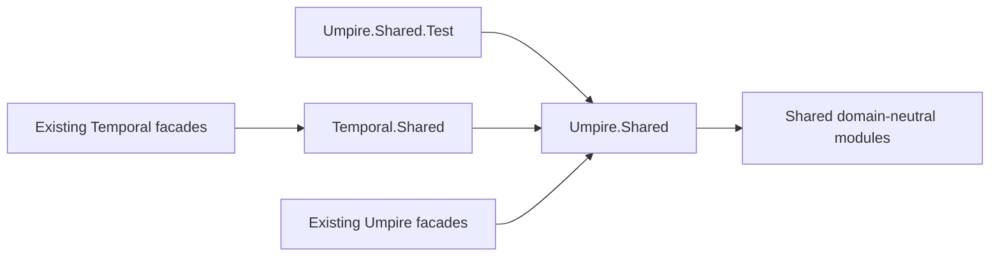

# Consolidate layered model helpers without API churn

## Overview

Consolidate repeated Lean constructors and test fixtures at the narrowest model layer that owns their types, while preserving every existing public declaration, import path, observable value, and comment. Existing Umpire and Temporal modules remain the consumer-facing facades; new shared modules are implementation and test-support dependencies.

The change is deliberately evidence-driven. `Umpire.Shared` owns reusable construction over Umpire core types, `Umpire.Shared.Test` owns repeated Umpire test fixtures, and `Temporal.Shared` owns reusable Temporal-specific construction. `Shared.Test` and `Temporal.Shared.Test` remain reserved destinations until at least one concrete helper qualifies for their ownership boundary and has multiple real consumers.

## Goal & Context
<!-- scope: business -->

Model contributors currently encounter repeated Definition ID, Source Location, and Definition Metadata construction across examples, feature definitions, and test fixture families. The duplication obscures default values and makes source and metadata behavior easier to change inconsistently.

This refactor gives developers one small, testable implementation seam per owning layer without requiring any existing consumer to rename a declaration or import a new facade. End users and operators see no behavior, configuration, deployment, or persisted-format change.

## Architecture & Data Models
<!-- scope: technical -->

The dependency graph remains one-way and keeps test support out of production umbrellas:



`Shared.*` remains independent of Umpire and Temporal. `Umpire.Shared*` may use Umpire vocabulary but never Temporal vocabulary. `Temporal.Shared` may compose only the lower Shared/Umpire layers; it may not import Feature or System modules. Test-support modules are reachable only from tests and are not re-exported or imported by production modules.

No new data model is introduced. Shared helpers construct the same existing Definition IDs, Source Locations, and Definition Metadata with caller-supplied values and preserved defaults.

## API Contracts
<!-- scope: technical -->

- Every existing public declaration retains its fully qualified name, visibility, type, and existing import path. This includes the Switch example facade and the Nexus Lifecycle, Operations, Observation, and experimental Caller Closure facades.
- Existing public modules continue to own their declarations and delegate internally; consumers are not required to import any shared module.
- Shared helper signatures preserve all values that affect source diagnostics, metadata equality, fingerprints, serialization, or generated outputs. Call-site-specific defaults remain explicit when they are not truly common.
- Formerly private local helpers do not become an advertised stable API merely because their implementation is centralized. New helper modules are documented as internal reuse seams rather than consumer facades.
- `Shared.Test` is valid only for helpers whose imports, signatures, and bodies are domain-neutral. `Temporal.Shared.Test` is valid only for helpers shared across compatible Temporal test owners without introducing a Feature-to-System or System-to-Feature dependency path. No qualifying helper means no module is created.

## Edge Cases & Constraints
<!-- scope: technical -->

- Source Location paths, line and column values, provenance, and source-sensitive diagnostics must remain byte-for-byte or value-for-value equivalent as applicable.
- Definition Metadata defaults, documentation, canonical behavior, versioning, and digest-related values must not drift when constructors are centralized.
- Similar-looking fixtures with different semantics or defaults remain local; the refactor does not force a lowest-common-denominator helper.
- Helper names and namespaces must not introduce ambiguous unqualified resolution for existing consumers.
- New imports must remain narrow, must not rely on transitive umbrella imports, and must satisfy the complete transitive import policy.
- All existing comments and doc comments are preserved. A comment moves only with the declaration or invariant it explains, and its meaning remains accurate after delegation.
- Existing unrelated worktree changes remain untouched.

## Approach

1. Prove the production seam by extracting the repeated Umpire constructors and routing the Switch example through them without changing the example API or values.
2. Introduce Umpire-owned test helpers and migrate the six fixture families in two cohesive groups, retaining concern-specific semantic data locally.
3. Extract Temporal production construction behind the existing Nexus facades, using Umpire shared primitives only where ownership and signatures agree.
4. Extend the executable import policy so the new shared and test-support boundaries are rejected directly and transitively, rather than relying on prefix classification alone.
5. Pin facade and complete fixture-value compatibility, then update the architecture documentation and run the complete model regression gates.

## Quick commands

```bash
cd model && mise exec -- lake build UmpireTests TemporalModelTests TemporalExperimentalTests temporal-model-inspect
make lint-model
make umpire-check-regression
```

## Risks & Mitigations

- **Silent semantic drift:** preserve caller-specific parameters and compare existing source, metadata, identity, and canonical-output assertions before and after each migration.
- **Import cycles or layer leakage:** add the shared modules incrementally, import exact leaf dependencies, and run the transitive import-graph gate as part of the early and final proof.
- **Accidental API expansion:** keep existing facades authoritative, avoid umbrella re-exports, and describe the shared modules as internal implementation/test-support seams.
- **Speculative abstraction:** require an existing repeated shape with compatible semantics before moving it; otherwise leave the local helper in place.
- **Merge overlap with active work:** avoid the already-modified Implementation Link source and coordinate only if an active task later changes the same fixture imports.

## Rollout & Rollback

This is an internal compile-time refactor with no runtime rollout, data migration, or feature flag. Land the Umpire production seam first, then the independent Umpire fixture and Temporal migrations, followed by compatibility and documentation gates. If any shared signature cannot preserve existing values or boundaries, keep that helper local and narrow the extraction before downstream tasks proceed.

## Acceptance Criteria
<!-- scope: both -->

- **R1:** Every moved helper lives at the narrowest valid ownership layer: domain-neutral helpers under `Shared`, Umpire-typed production/test helpers under `Umpire.Shared*`, and Temporal-specific production helpers under `Temporal.Shared`. Errors: any direct or transitive `Shared.*` reachability to Umpire/Temporal, any `Umpire.*` reachability to Temporal, any `Temporal.Shared*` reachability to Feature/System modules, any production reachability to test-support modules, any Feature/System boundary leak, or an empty/speculative helper module fails the import policy or plan contract.
- **R2:** Repeated Definition ID, Source Location, and Definition Metadata construction used by production examples and Temporal feature definitions is centralized without changing caller-specific values or defaults. Errors: changed paths, positions, provenance, metadata fields, fingerprints, diagnostics, canonical outputs, or forced common defaults fail focused compatibility tests.
- **R3:** The six Umpire concern fixture families reuse `Umpire.Shared.Test` for their genuinely common constructors while concern-specific semantic fixtures remain local. Errors: a differing default is silently normalized, an unrelated concern dependency is introduced, or a single-use fixture is moved only for symmetry fails focused builds and review.
- **R4:** Existing Temporal production facades delegate to `Temporal.Shared` or the lower Umpire seam only where reuse is proven, with feature meaning remaining in its current owner. Errors: public declarations move, a feature imports system behavior, a system fixture is promoted into a broad Temporal test facade, or a single-use Temporal test helper is centralized speculatively fails compilation or boundary checks.
- **R5:** Existing consumers compile unchanged through their current imports and fully qualified declaration names, and observable source, identity, metadata, serialization, and generated behavior remain unchanged. All existing comments and doc comments remain present and accurate. Errors: any required caller rename/import, visibility/type change, changed observable value, missing comment, or stale comment fails compatibility review.
- **R6:** The complete production/test aggregate build, transitive model lint, and regression gate pass, and architecture documentation records helper ownership without advertising test helpers as public consumer facades. Errors: missing source inventory, import-cycle/layer violation, aggregate regression, undocumented ownership, or a new build/test command surface fails completion.

## Early proof point

Task `.1` validates the core approach by routing the Switch example through one Umpire-owned helper seam while preserving its public declarations, source values, metadata, and focused tests. If it fails, re-evaluate the helper signatures and ownership boundary before tasks `.2`–`.7` proceed.

## Boundaries
<!-- scope: business -->

- No public declaration move, caller migration, compatibility alias, forwarding facade, or aggressive API cleanup.
- No empty `Shared.Test` or `Temporal.Shared.Test` module and no generic fixture framework invented for future use.
- No promotion of configuration-specific test fixtures into a repository-wide Temporal test facade.
- No production umbrella export of test-support modules.
- No Lean module-system migration, new Lake library, dependency upgrade, generated-format change, or behavioral model change.
- No cleanup of unrelated duplication, comments, naming, or active worktree changes.

## Decision Context
<!-- scope: both -->

### Motivation
<!-- scope: business -->

The source-compatible option is the planning decision: it removes proven duplication while keeping the refactor invisible to current consumers. If intentional API churn is desired instead, this spec should be revised before work starts rather than letting individual tasks make inconsistent migration choices.

### Implementation Tradeoffs
<!-- scope: technical -->

The narrow ownership split follows MOD-01, MOD-09, and the Feature/System isolation rules. Putting Umpire-typed constructors in `Shared` would reduce visible duplication at the cost of violating the enforced architecture, so it is rejected. Moving public declarations into the shared modules would create unnecessary API churn, so existing modules remain thin authoritative facades.

Creating every proposed test-helper file immediately is also rejected as speculative. No current helper qualifies for a domain-neutral `Shared.Test`, and the only multi-consumer Temporal fixture is configuration-specific and already has a cohesive owner. Reserving those destinations until real cross-owner reuse exists keeps the modules deep and prevents a broad Temporal test import from becoming a path to System internals.

## References

- Umpire rules MOD-01, MOD-04, MOD-07, MOD-08, MOD-09, MOD-10, and MOD-11.
- [Lean Source Files and Modules](https://lean-lang.org/doc/reference/latest/Source-Files-and-Modules/) — module paths, imports, and visibility.
- [Lean Namespaces and Sections](https://lean-lang.org/doc/reference/latest/Namespaces-and-Sections/) — fully qualified declaration identity.
- [Lake library targets](https://lean-lang.org/doc/reference/latest/Build-Tools-and-Distribution/Lake/#2413131-library-targets) — existing roots discover new submodules without a new library.

## Requirement coverage

| Req | Description | Task(s) | Gap justification |
| --- | --- | --- | --- |
| R1 | Narrowest-layer ownership and import purity | `.1`, `.2`, `.4`, `.5` | — |
| R2 | Production constructor consolidation without value drift | `.1`, `.4`, `.7` | — |
| R3 | Umpire fixture consolidation | `.2`, `.3`, `.7` | — |
| R4 | Source-compatible Temporal production reuse | `.4`, `.5`, `.7` | — |
| R5 | Consumer compatibility and comment preservation | `.1`, `.2`, `.3`, `.4`, `.7` | — |
| R6 | Complete gates and documented ownership | `.5`, `.6` | — |
