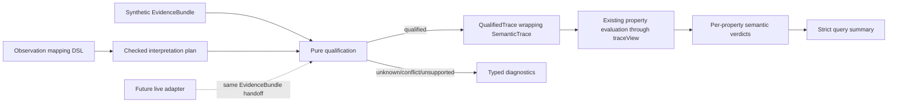

# Umpire observation and semantic verdicts

> HTML render lens: local file `.flow/artifacts/fn-4-umpire-observation-and-semantic-verdicts/spec.html` — regenerable, markdown is the record. <!-- flow-next:artifact-link -->

## Overview

Complete the offline semantic loop by interpreting synthetic evidence into qualified semantic traces and evaluating existing reusable properties without putting runtime facts, evidence profiles, or derivations into property definitions. The same checked property and unchanged Lean denotation must evaluate both model-generated traces and qualified synthetic evidence, with every verdict explaining its evidence and bounds.

## Goal & Context
<!-- scope: business -->

The primary user is an Umpire model engineer diagnosing why a property is satisfied, violated, unknown, conflicting, or unsupported. Developers gain one reusable `Umpire.Observation` boundary. Operations, deployment, and live Temporal behavior remain unchanged.

## Architecture & Data Models
<!-- scope: technical -->

Introduce one deep, Temporal-independent `Umpire.Observation` package.



`SemanticTrace` remains pure model data. `QualifiedTrace` wraps it with stable trace and mapping identities, source/profile identity and closure, the applied typed evidence-volume bound, established vocabulary, complete derivations, and approved field-disposition evidence. Every derivation is keyed by one stable `SemanticCoordinate`: `initialState`, or a one-based step position plus `selectedAction`, `modelOutcome`, `resultingState`, or a one-based observation position. Qualification proves a bijection between these coordinates and every slot in the emitted trace, so repeated equal values remain distinct and auditable.

Mapping declarations are inert data. They declare evidence kinds and fields, symbolic bindings, semantic outputs, ordering, closure, an explicit positive evidence-record bound, and one disposition per consumed field. Their closed typed expression grammar contains literals, field references, binding references, a fixed versioned set of total normalization primitives, presence/equality/Boolean predicates, contribution markers, and named/versioned digest-token construction. It has no callbacks, general string interpolation, recursion, or user code. Compilation canonicalizes expressions into the checked-plan identity and applies static information-flow labels: only literals and retained normalized values may construct clear semantic values; redacted inputs may contribute only markers; hashed inputs may contribute only digest tokens; rejected inputs may not be consumed.

Qualification is a pure, total transformation from a checked plan and bounded finite typed synthetic evidence. It never retains the raw bundle or exposes a partial trace. Each emitted semantic coordinate carries exactly one derivation linking mapping version, evidence identities, bindings, ordering facts, closure, field dispositions, and the applied evidence bound.

## API Contracts
<!-- scope: technical -->

- Mapping compilation follows the existing authored-to-checked `Except` pattern and returns either one deterministic typed error or one complete checked plan.
- Expression checking is closed and static: operators and result types are fixed, normalization primitives are named/versioned and total, expression identities are canonical, and disposition labels determine which output constructors may consume each value.
- Qualification returns exactly one of `qualified`, `unknown`, `conflict`, or `unsupported`; only `qualified` exposes a `QualifiedTrace`.
- The checked plan carries a positive `TypedBound` in `evidence-records`. Qualification debits one unit per input record before normalization; an over-limit bundle returns canonical `unknown / evidence-bound-exhausted` diagnostics containing the limit and observed count, exposes no partial trace, and never invokes property evaluation.
- Compatible alternatives produce `unknown` with canonical alternatives and the missing discriminator. The first release neither guesses nor quantifies over all alternatives.
- `retain` preserves an approved normalized value; `redact` preserves only a contribution marker; `hash` preserves only a deterministic token under a named/versioned synthetic digest policy; `reject` prevents qualification when the field is present.
- `evaluateQualifiedProperty` validates qualification, the coordinate-to-derivation bijection, vocabulary, applied evidence bound, and required logical-time coordinates before using the existing capability-limited property trace view and evaluator. Clause spans cite semantic coordinates rather than values.
- Boolean property failure maps to `violated`; qualification failure never masquerades as a property violation.
- Strict aggregation is `satisfied` only when every required property has one satisfied result for the same trace, `violated` only when every required result is resolved and at least one is violated, and otherwise `incomplete`. Individual results remain inspectable.

## Edge Cases & Constraints
<!-- scope: technical -->

- Empty evidence cannot qualify. A zero-transition trace may qualify only when the initial state and every required source closure are established.
- Zero evidence-record bounds are compile errors. Exactly-at-limit evidence follows ordinary qualification; limit-plus-one evidence is unknown with no normalization or evaluation beyond the bound.
- Missing, non-numeric, or non-monotone logical time required by a property yields `unknown` before evaluation.
- Duplicate evidence identities are never silently deduplicated, and qualified Lean values remain immutable and reusable across independent evaluations.
- Raw evidence remains an external controlled artifact and is not serialized into portable traces or verdicts.
- Synthetic hashing promises deterministic non-retention only; production cryptography and key management belong to a future runtime adapter.

## Quick commands

```bash
cd model && mise exec -- lake build Umpire.Observation.Tests.Compilation
cd model && mise exec -- lake build Umpire.Observation.Tests
cd model && mise exec -- lake build Temporal.Feature.Nexus.ObservationTests
make umpire-check-regression
```

## Acceptance Criteria
<!-- scope: both -->

- **R1:** Typed composable mapping declarations compile into a deterministic checked interpretation plan before evidence processing. The closed expression grammar, canonical operator identities, fixed normalization/digest versions, result types, static information-flow labels, and positive evidence-record bound are part of that plan. Errors: empty, invalid, or duplicate profile/rule/field identities; unknown evidence profile, kind, or field; unknown operator/version; type mismatch; callback or recursive expression; unauthorized clear-value flow from redacted/hashed/rejected input; unknown or unauthorized semantic declaration; wrong output kind; missing or duplicate disposition; overlapping outputs; incompatible bindings; contradictory or cyclic ordering; missing or duplicate closure declarations; invalid bound unit/value; and hash without a named/versioned digest policy all return a typed canonical compile error with no partial plan.
- **R2:** Synthetic evidence is bounded, normalized, identity-bound, canonically ordered, checked for source closure and sequence/causal completeness, and converted into a qualified wrapper around the unchanged pure `SemanticTrace` before any property runs. Errors: empty evidence, evidence-bound exhaustion, missing initial state or closure, gaps, missing causal parents, normalization failure, unresolved bindings, or incomparable ordering produce `unknown`; profile/version/kind/field mismatches produce `unsupported`; duplicate identities, contradictory facts/bindings/order, and misdirected fault receipts produce `conflict`; no failure exposes a partial trace.
- **R3:** Every emitted semantic trace slot has exactly one auditable derivation keyed by its stable semantic coordinate and covering mapping identity/version, matched evidence identities, bindings, ordering, closure, dispositions, and applied bound. Errors: absent, duplicate, extra, or inconsistent coordinates or derivation elements; unconsumed references; missing closure/order support; or raw/redacted/rejected value leakage prevent qualification and evaluation.
- **R4:** Compatible interpretations return `unknown` with canonical alternatives and a missing discriminator; contradictory interpretations return `conflict`. Errors: source order, rule order, duplicate evidence, or stable sorting never selects an interpretation silently; zero usable interpretations follow R2.
- **R5:** Every consumed evidence field enforces exactly one disposition through the expression type system. Errors: undeclared disposition; cleartext interpolation or clear semantic construction from redacted/hashed inputs; digest use without the declared policy; and any rejected-input read are compile errors; rejected-field presence and digest-policy mismatch are `unsupported`; a same-bundle collision between distinct normalized values is `conflict`; disallowed raw material prevents qualification.
- **R6:** Checked properties evaluate independently through existing capability-limited views, producing structured `satisfied`, `violated`, `unknown`, `conflict`, or `unsupported` verdicts and a strict query summary. Verdicts expose the applied evidence bound and coordinate-based clause derivations. Errors: unqualified traces, incomplete/non-bijective derivations/evidence, an exhausted evidence bound, or invalid required logical time skip evaluation; missing vocabulary/capability or digest mismatch is `unsupported`; missing, duplicate, unexpected, or divergent results make the summary incomplete and can never aggregate to success.
- **R7:** Independent fixtures and layer-specific mutations prove model, mapping, and property mistakes fail at the responsible boundary. Errors: a surviving mutation, wrong-boundary diagnosis, or an oracle computed by the implementation under test fails verification; valid controls remain deterministic.
- **R8:** Public documentation describes the Observation lifecycle, synthetic-only scope, dispositions, strict aggregation, and the future live-runtime handoff. Errors: no documentation or import may claim this release starts Temporal, collects live evidence, proves runtime conformance, persists raw evidence, supports a second profile, or performs promotion.

## Early proof point

Task `fn-4-umpire-observation-and-semantic-verdicts.1` proves a domain-neutral typed mapping language can compile deterministically against current Umpire vocabulary and reject every structural conflict before evidence processing. If it fails, reconsider the single deep-module boundary and mapping/profile split before qualification or verdict work.

## Boundaries
<!-- scope: business -->

- No live Temporal server, runtime driver, evidence collector, or live adapter.
- No profile beyond one synthetic Temporal lifecycle profile and no raw-evidence store or wire format.
- No distributed-clock reconstruction or evaluate-all-compatible-traces semantics.
- No change to `SemanticTrace`, the Property DSL, its evaluator, or Lean denotation.
- No production cryptographic claim, generated regression projection, generated API drift gate, or CI change.
- No dependency on, inspection of, or reuse of Umpire3.
- Discovery and promotion remain owned by downstream fn-5.

## Decision Context
<!-- scope: both -->

### Motivation
<!-- scope: business -->

Evidence interpretation is independently useful, but reusable properties must remain portable and pure. An offline fixture-first layer proves that boundary before a live adapter can create false confidence.

### Implementation Tradeoffs
<!-- scope: technical -->

Qualification and provenance wrap rather than alter `SemanticTrace`; the existing Property evaluator remains the semantic oracle. Inert compiled mappings avoid callback ambiguity. Ambiguity is preserved instead of guessed, and synthetic hashing guarantees only deterministic non-retention. All captured R1-R7 paraphrases were corroborated by the current design and are now ordinary criteria.

## Requirement coverage

| Req | Description | Task(s) | Gap justification |
|-----|-------------|---------|-------------------|
| R1 | Typed DSL and deterministic checked mappings | `.1`, `.5` | — |
| R2 | Synthetic evidence qualification | `.2`, `.4`, `.5` | — |
| R3 | Complete derivations | `.2`, `.3`, `.5` | — |
| R4 | Ambiguity and conflict semantics | `.2`, `.3`, `.5` | — |
| R5 | Field dispositions and non-retention | `.1`, `.2`, `.4`, `.5` | — |
| R6 | Per-property and strict aggregate verdicts | `.3`, `.4`, `.5` | — |
| R7 | Independent mutation assurance | `.5` | — |
| R8 | Public contract and runtime handoff | `.4`, `.6` | — |
