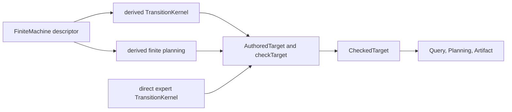

# FiniteMachine target authoring

## Overview

Introduce one deep, Lean-native `FiniteMachine` abstraction for the ordinary Umpire Target case where finite enumerators are the authoritative behavior. Model authors declare ordered domains, encoders, initial states, transitions, and the semantic evidence that cannot be inferred; the abstraction derives the membership relations, routine soundness/completeness proofs, complete behavior domain, and target-owned finite-planning capability. Migrate the Temporal Nexus Feature and System lifecycle targets to this path without changing checked meaning or downstream behavior.

## Goal & Context
<!-- scope: business -->

Small finite state machines currently require model authors to repeat the same membership predicates, identity proofs, domain record wiring, coverage plumbing, and planning assembly around a much smaller semantic transition function. This obscures the machine being modeled and makes routine targets harder to review. The target users are Lean model authors and maintainers; Temporal users, operators, artifacts, and runtime code observe no behavior change.

## Scope

- Add a public Umpire Target authoring abstraction for complete, enumerator-authoritative finite machines.
- Keep finite domains, canonical encoders, initial-state enumeration, transition enumeration, closure evidence, and executable-action evidence explicit at the model boundary.
- Derive the membership-based authoritative relations, their routine proof fields, a complete behavior domain, and finite planning tied to the exact derived kernel.
- Migrate the ordinary Temporal Nexus Feature Lifecycle and System Nexus lifecycle targets while preserving their existing public proof seams and checked outputs.
- Retain direct `TransitionKernel` construction as the expert path for independently specified authoritative relations.
- Add focused contract, migration, compatibility, architecture, and authoring documentation.

## Architecture & Data Models
<!-- scope: technical -->

`FiniteMachine` belongs inside the Umpire Target layer because it depends on Target kernel, behavior-domain, and planning types. It does not belong in Shared and does not create a second semantic representation above `CheckedTarget`.



The descriptor owns five ordered finite domains and their encoders, the initial-state and list-valued transition enumerators, proofs that emitted values stay within those domains, and evidence that every advertised planning action is executable somewhere. Its derived kernel defines each domain and authoritative relation by list membership. Its derived planning capability uses the same action list and exact kernel relation. List-valued transitions intentionally support multiple results for a state/action pair.

The existing direct `TransitionKernel` route remains public and unchanged for targets whose authoritative propositions are intentionally independent of their enumerators. Both routes converge at the existing `AuthoredTarget` and `checkTarget` boundary; Query, Planning, Artifact, and Temporal layers continue to consume only the checked target.

## API Contracts
<!-- scope: technical -->

- `Umpire.Target` and the Umpire umbrella expose `FiniteMachine` as the ordinary finite-target authoring adapter.
- A complete descriptor supplies kernel metadata; ordered setup, state, action, outcome, and observation lists; canonical encoders; initial-state and transition enumerators; closure evidence for every enumerated value; and an executable witness for each listed planning action.
- The adapter exposes a derived checked kernel and a planning value dependent on exactly that kernel, so callers do not restate authoritative predicates, identity soundness/completeness proofs, domain membership equivalences, or planning action-completeness plumbing.
- Derived initial and step authority are definitionally membership-based and also have stable public rewrite theorems. Local target lemmas can remain small without downstream consumers unfolding adapter internals.
- The adapter preserves the supplied lists and enumerator results. It does not sort, deduplicate, normalize, or invent domain members or transitions before the existing Target canonicalization and validation boundary.
- The descriptor is proof-carrying and represents only complete finite machines. Missing closure or executable-action evidence prevents construction in Lean. Duplicate or non-injective canonical encodings continue to fail through the existing located typed Target diagnostic.
- Existing `TransitionKernel`, `KernelAvailability`, `AuthoredTarget`, and `checkTarget` interfaces remain available for expert and incomplete-authoring workflows.

## Approach

1. Add the focused Target-layer descriptor, derived kernel/planning projections, public import seam, and contract tests for authority, closure, ordering, empty domains, list-valued nondeterminism, and existing validation failures.
2. Re-express the Temporal Feature Nexus Lifecycle target through `FiniteMachine`, delegating its existing public kernel, planning, authority, and named transition declarations to the derived values.
3. Re-express the Temporal System Nexus lifecycle target through the same abstraction while retaining its family-owned case theorems and Implementation Link proof seam.
4. Pin the direct expert route and cross-layer compatibility with Switch, Query/planning/artifact, and System-to-Feature correspondence regressions.
5. Document the ordinary versus expert Target authoring paths after the API and migrations settle.
6. Run the focused and full model gates from the integrated tree and audit compatibility-sensitive outputs and comments.

## Quick commands

```bash
cd model && mise exec -- lake build Umpire.Target.Tests.FiniteMachine Umpire.TargetTests Temporal.Feature.Nexus.LifecycleTests Temporal.System.Nexus.Tests Temporal.System.Nexus.ImplementationLinkTests Temporal.ImplementationLinkTests.Nexus TemporalModelTests
make umpire-check-regression
make lint-model
```

## Edge Cases & Constraints
<!-- scope: technical -->

- Empty finite domains are permitted when the proof fields establish that the corresponding enumerators emit nothing; an empty action domain makes executable-action evidence vacuous.
- Duplicate domain values or distinct values with colliding encodings are not silently normalized. Existing Target validation rejects any non-unique encoded finite domain with its current typed diagnostic.
- Every listed planning action must have an explicit state/result witness in the transition enumerator. Unreachable advertised actions cannot be hidden behind the adapter.
- Every emitted initial state, transition source/action, result state, outcome, and observation must be covered by the declared domains. There is no incomplete `FiniteMachine`; callers that need incomplete authoring continue to use the existing kernel availability types.
- Multiple transition results for one state/action pair are supported and retain their authored enumeration order. Independently authored authority, rather than nondeterminism itself, is the boundary for the expert path.
- Derived authority must remain reducible or rewritable as membership so existing named target theorems and Implementation Link proofs do not depend on private representation details.
- Existing Definition IDs, source locations, canonical metadata, Behavior Fingerprints, Query values, planner results, Artifact bytes, imports, public declarations, and comments are compatibility commitments for both migrations.
- Unrelated worktree changes remain untouched. Generated regression views and fixtures are reviewed as compatibility evidence and are not regenerated to accept drift.

## Acceptance Criteria
<!-- scope: both -->

- **R1:** Model authors can declare a complete enumerator-authoritative finite target once and obtain the exact `TransitionKernel` and finite-planning values required by ordinary Target authoring, with membership domains/authority and routine proof plumbing derived by the abstraction. Errors: missing closure or executable-action evidence makes the descriptor unconstructable in Lean; no partial machine is silently promoted.
- **R2:** The abstraction preserves authored finite behavior: domain and action list order is passed through unchanged, initial and step authority are equivalent to enumerator membership, empty domains are valid only with vacuous emission proofs, and multiple listed results per state/action remain supported. Errors: normalization, dropped/added results, out-of-domain emissions, unreachable advertised actions, or non-reducible authority fails focused contract tests or Lean proof obligations; duplicate/non-injective encodings retain the existing typed Target failure.
- **R3:** Direct `TransitionKernel` authoring remains public and source-compatible for independent authoritative relations, with Switch continuing to use that route and retaining its two-result behavior, proofs, Query, plan, and Artifact bytes. Errors: forcing Switch through `FiniteMachine`, weakening its independent relation, or changing any pinned output fails expert-path compatibility tests.
- **R4:** Temporal Feature Nexus Lifecycle uses `FiniteMachine` while retaining all existing semantic declarations, public names and types, named authoritative lemmas, source provenance, comments, checked metadata/fingerprint, planning action order, Query values, plans, and Artifact bytes. Errors: any unsupported transition change, consumer-facing proof break, identity/provenance drift, fixture churn, or comment loss blocks completion.
- **R5:** Temporal System Nexus uses `FiniteMachine` while retaining its semantic declarations, public names and types, case and authoritative lemmas, source provenance, comments, checked metadata/fingerprint, planning behavior, and System-to-Feature Implementation Link results. Errors: any target behavior drift, downstream representation unfolding, correspondence failure, identity/provenance drift, or comment loss blocks completion.
- **R6:** Architecture and model-authoring documentation presents `FiniteMachine` as the ordinary typed convenience constructor below checked Target, presents direct `TransitionKernel` as the expert independent-relation route, and keeps Shared and optional verification integrations outside this authoring boundary. Errors: documentation that introduces a second behavior language, changes the module DAG, or suggests optional checker or legacy-code dependence fails review and import-policy lint.
- **R7:** Focused Target, Nexus, Implementation Link, and Temporal builds plus the complete model regression and lint gates pass from the final tree with no new warnings, trusted-proof shortcuts, generated fixture changes, or unrelated worktree edits. Errors: any failed gate, `sorry`/`admit`, unapproved native proof use, stale fixture, or task-owned diff outside declared scope blocks completion.

## Boundaries
<!-- scope: business -->

- No custom Lean syntax, macro grammar, general `feature ... where` language, or second semantic IR.
- No Veil integration, checker translation, or third-party state-machine dependency.
- No reuse, migration, compatibility layer, or dependency involving the abandoned Umpire3 code.
- No CallerClosure migration or generic first-order view.
- No redesign of Query, Planning, Artifact, Property, Behavior, Implementation Link, or runtime behavior.
- No removal of the direct expert `TransitionKernel` path.
- No acceptance of changed canonical outputs by regenerating fixtures.
- No deletion or cleanup of unrelated legacy files.

## Decision Context
<!-- scope: both -->

The repeated code is not inherent to every Lean state machine; it comes from manually instantiating the richer Umpire checked-target contract. A proof-carrying typed constructor removes the mechanical layer while leaving domain choices and semantic evidence explicit. A macro DSL was rejected because the existing ordinary Target path is already the sole semantic authority and a second grammar would add another representation to learn and maintain. A Shared abstraction was rejected because the five-domain transition result, complete behavior description, and planning capability are Umpire Target concepts. Replacing `TransitionKernel` was rejected because independently specified relations need a lower-level expert seam. An external library or optional checker was rejected because neither owns Umpire's checked-target and canonical-artifact contracts.

## Early proof point

Task `fn-41-finitemachine-target-authoring.1` validates the core approach by constructing a complete finite target with derived membership authority and planning while preserving the existing Target diagnostic boundary and direct kernel escape hatch. If it fails, re-evaluate the descriptor inputs and derivation boundary before migrating either Nexus target.

## References

- Umpire 4 specification: authoring, checked Target authority, finite behavior domains, and Lean-native verification rules.
- Lean model guidelines: deep modules, stable public theorem signatures, semantic proofs, comment preservation, and verification gates.
- Completed fn-31 Target deepening: one checked Target route and explicit rejection of a general authoring grammar.
- Active fn-38 helper consolidation: predecessor for overlapping Lifecycle source/metadata construction work.
- Active fn-39 Nexus browsing refactor: reverse dependent that should split the simplified Lifecycle rather than relocate its current boilerplate.
- Existing Switch model: reference for independent authoritative relations and finite nondeterminism.

## Requirement coverage

| Req | Description | Task(s) | Gap justification |
|-----|-------------|---------|-------------------|
| R1 | Complete finite descriptor derives ordinary Target kernel and planning plumbing | fn-41-finitemachine-target-authoring.1 | — |
| R2 | Membership authority, ordering, empty-domain, nondeterminism, and validation contracts | fn-41-finitemachine-target-authoring.1, fn-41-finitemachine-target-authoring.2, fn-41-finitemachine-target-authoring.3 | — |
| R3 | Direct expert kernel path and Switch compatibility | fn-41-finitemachine-target-authoring.1, fn-41-finitemachine-target-authoring.4 | — |
| R4 | Feature Nexus Lifecycle migration compatibility | fn-41-finitemachine-target-authoring.2, fn-41-finitemachine-target-authoring.4 | — |
| R5 | System Nexus and Implementation Link migration compatibility | fn-41-finitemachine-target-authoring.3, fn-41-finitemachine-target-authoring.4 | — |
| R6 | Architecture and authoring documentation preserves module and semantic boundaries | fn-41-finitemachine-target-authoring.5 | — |
| R7 | Focused and full verification with comment, fixture, and dirty-tree protection | fn-41-finitemachine-target-authoring.1, fn-41-finitemachine-target-authoring.2, fn-41-finitemachine-target-authoring.3, fn-41-finitemachine-target-authoring.4, fn-41-finitemachine-target-authoring.6 | — |
