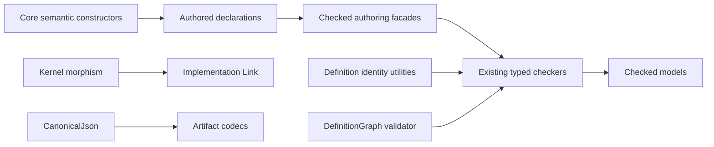

# Deepen ordinary Property, Behavior, and Query authoring

## Overview

Deepen Umpire's existing Lean modules so ordinary model authors work through small semantic APIs instead of representation-level extraction, repeated record literals, and duplicated validation/rendering plumbing. The scope includes six connected abstractions: checked declaration authoring, semantic constructors, canonical Definition identity utilities, deterministic definition-graph validation, reusable implementation-link forward simulation, and ordered canonical JSON.

The change is intentionally additive at the public boundary and compatibility-preserving underneath it. Existing typed checkers remain the diagnostic path, existing model structures remain the data model, and canonical semantic and artifact bytes remain unchanged.

## Goal & Context

The primary users are Temporal model authors and reviewers, especially engineers with basic Lean knowledge who should not need to understand `Except` extraction, dependent re-ascription, local sorting helpers, graph algorithms, or string-concatenation JSON to read an ordinary model. End users and operators observe no runtime, configuration, deployment, or artifact-schema change.

Success means the learner-facing Switch and Nexus models read in domain terms while the reusable plumbing is owned by deep modules with small, documented interfaces and focused tests.

## Scope

- Add proof-taking checked authoring facades for Property, Behavior, Query, and Observation while retaining every raw `check*` function and typed error.
- Add narrow semantic constructors for exact Property patterns, role-equality setup, one-step traces, trace steps from transition results, mapped transition results, and the stable one-action Behavior shape when it can return the existing declaration type without a second DSL.
- Centralize canonical Definition ID ordering, duplicate discovery, validation primitives, and source-path display behavior.
- Centralize deterministic definition-graph validation for Behavior and Observation while adapting failures back to their existing domain errors.
- Extract the current implementation-link mapping and preservation laws into a reusable kernel morphism/forward-simulation boundary.
- Add an ordered canonical JSON value and renderer, then migrate the retained planning artifact codecs without changing bytes or checksum preimages.
- Migrate the ordinary checked examples and update the learner-facing architecture documentation.

## Architecture & Data Models



The new APIs deepen existing ownership boundaries rather than introducing a framework above them. Core owns representation-independent values and constructors. Property, Behavior, Query, and Observation own authoring and domain diagnostics. A shared graph module owns deterministic graph mechanics. Implementation Link owns declaration index and coverage obligations around a smaller forward-simulation core. JSON field meaning remains in each codec; ordered construction and rendering move behind `CanonicalJson`.

## API Contracts

- `checkedProperty`, `checkedBehavior`, `checkedQuery`, and `checkedObservation` produce the corresponding checked value from the same inputs as their raw checker plus an explicit validity proof. They hide extraction and any required re-ascription, but do not default to `native_decide` and do not replace the raw diagnostic API.
- Semantic constructors return the existing `PropertyPattern`, `SetupConstraint`, `BehaviorTrace`, `ModelTraceStep`, `TransitionResult`, and `BehaviorDeclaration` types. They encode one named invariant each and do not create a builder DSL or parallel model representation.
- `DefinitionId.canonicalSet`, deterministic duplicate discovery/validation primitives, and `SourceLocation.displayPath` expose stable normal forms without owning Property-, Behavior-, Query-, or Observation-specific error types.
- `DefinitionGraph` accepts the current Definition-ID nodes and directed edges and returns a deterministic total analysis partitioned into node findings, edge findings, canonical order, and cycle evidence. Behavior and Observation consume those findings at their existing validation stages and derive their historical domain error and cycle witness rather than accepting a new global error precedence.
- `KernelMorphism`/`ForwardSimulation` own only the mappings and initial/step preservation laws needed by the two current Implementation Link paths, together with step/trace translation built on the Core `TransitionResult.map` combinator. Link-specific declaration indexing, coverage, Known Gaps, and diagnostics stay outside.
- `CanonicalJson` supports typed null, string, natural, array, ordered-object, option-to-null, and required scalar construction plus compact and pretty rendering. Object fields render in supplied order, strings reuse Lean's JSON escaping, and persisted bytes add exactly one terminal LF.

## Approach

1. Establish the Core-owned semantic and identity primitives with equational contracts and focused regressions.
2. Add checked authoring at the existing language boundaries and migrate the domain-neutral Switch plus ordinary Nexus walkthroughs.
3. Replace local ID/source helpers as each language is touched, adapting shared results to unchanged typed diagnostics.
4. Extract graph mechanics after the authoring migrations so Behavior and Observation retain one authoritative validation order.
5. Extract the current forward-simulation seam after FiniteMachine target authoring lands, consuming the Core transition-result mapping and preserving Implementation Link's higher-level obligations.
6. Introduce ordered canonical JSON and migrate the retained artifact codecs under exact-byte and checksum fixtures.
7. Finish with documentation, import-boundary review, focused suites, the complete model build, linting, and axiom/trust audits for changed public declarations.

## Edge Cases & Constraints

- Invalid declarations continue to cross public boundaries as the current typed `Except` errors. Checked facades are compile-time proof-taking conveniences and add no runtime recovery path.
- New reusable declarations introduce no hidden `native_decide` default or unreviewed compiler-trust dependency. Existing trust baselines are audited before and after migration.
- Canonical ID ordering, the selected duplicate witness, blank/malformed ID handling, and unknown source-path fallback remain deterministic and compatible with current diagnostics.
- Definition-graph analysis is total and staged: node and edge findings are consumed at each language's existing validation points, so mixed graph/non-graph faults retain their historical precedence. Each adapter derives the same cycle witness it reported before extraction.
- Semantic constructors are additive and definitionally or propositionally equivalent to the record values they replace. They do not silently deduplicate, reorder, or broaden authored meaning.
- Canonical JSON preserves current null encoding for optional fields, field order, escaping, natural-number spelling, compact/pretty forms, checksum preimages, fingerprints, and exactly-one-LF persisted bytes.
- Existing comments, module explanations, teaching comments, and authored `documentation` values are preserved or moved intact when ownership moves.

## Quick commands

```bash
cd model && mise exec -- lake build Umpire.Property.Tests Umpire.Behavior.Tests Umpire.Query.Tests Umpire.Observation.Tests Umpire.ImplementationLink.Tests UmpireTests
make umpire-build-model
make lint-model
```

## Boundaries

- No new authoring language, macro DSL, type-class selection path, or generic declaration builder.
- No removal or deprecation of raw `check*` functions and no change to existing typed diagnostic schemas.
- No artifact schema/version change, field-semantic move, fingerprint/checksum change, or runtime serialization format change.
- No general JSON parser, unordered object map, schema engine, or replacement for Lean's string escaping.
- No repo-wide migration of unrelated private canonicalization helpers; this spec migrates the four authoring languages and artifact codecs it changes.
- No exposure of `DefinitionGraph` through the umbrella facade unless a consumer outside the owning language modules demonstrates a public need.
- No generated API or dynamic-configuration catalog changes except mechanically regenerated outputs already required by an owning compatibility gate.

## Decision Context

- Keep validity proofs explicit: approachable authoring should hide extraction mechanics without hiding a compiler-trust decision in a reusable public default.
- Keep shared validators structural and domain errors local: one algorithm removes duplication while existing language diagnostics remain understandable and compatible.
- Keep the morphism no more general than the duplicated Umpire kernel mapping: a categorical or cross-language framework would be overkill for the current reuse evidence.
- Keep JSON construction typed and ordered but codec meaning owner-local: this removes string plumbing without centralizing artifact schemas.
- Sequence after helper, PlannerPolicy, and FiniteMachine work to avoid competing ownership seams and repeated canonical-output migrations.
- Make the planned Nexus file split consume the simplified authoring surface so ceremony is not copied into the new files.

## Acceptance Criteria

- **R1:** Property, Behavior, Query, and Observation expose documented checked-authoring facades that eliminate `Except.toOption.get` and dependent re-ascription from valid ordinary authoring while preserving the existing raw checkers. Errors: invalid declarations still return the same typed checker errors; facade use without a validity proof fails at elaboration; no hidden `native_decide` default is introduced.
- **R2:** Narrow semantic constructors cover exact Property patterns, role-equality setup, one-step Behavior traces, trace steps built from transition results, mapped transition results, and the evidenced exactly-one-action Behavior shape, all returning existing model types. Errors: constructors add no runtime failure surface; empty, duplicate, or unordered collections are neither accepted nor normalized unless that behavior is already part of the represented type's contract.
- **R3:** Definition ID canonicalization, deterministic duplicate discovery/validation, and source-path display are owned once and used by Property, Behavior, Query, and Observation without changing their public diagnostics. Errors: blank or malformed IDs, duplicate IDs, ties, and missing source paths produce the same deterministic offending value, related IDs, and fallback path as before.
- **R4:** Behavior and Observation use one deterministic `DefinitionGraph` analysis for duplicate nodes/edges, self edges, unknown endpoints, canonical ordering, and cycles while consuming node, edge, and cycle findings at their historical validation stages and retaining domain-specific errors/witnesses. Errors: mixed graph/non-graph and multiple-graph faults preserve each language's existing winning error and cycle witness; disconnected nodes, empty graphs, and acyclic graphs remain valid.
- **R5:** Implementation Link witness and checked-link application share one documented kernel morphism/forward-simulation abstraction for value, step, and trace translation plus initial/step preservation, reusing Core transition-result mapping while declaration indexing, coverage, Known Gaps, and diagnostics remain Link-owned. Errors: absent/ambiguous mappings, uncovered definitions, invalid Known Gaps, and failed preservation continue to surface through the current Implementation Link failures; no new runtime error surface is added by pure translation.
- **R6:** `CanonicalJson` owns ordered typed construction and compact/pretty rendering for retained planning artifacts, including explicit null and option-to-null construction, and migrated codecs produce byte-for-byte identical JSON, checksum preimages, fingerprints, field order, escaping, and terminal-newline behavior. Errors: malformed raw JSON is outside the new API; typed nodes cannot render malformed JSON; duplicate object keys are not introduced by migrated codecs; absent optional fields render as JSON null; natural values beyond machine-word ranges retain their decimal spelling.
- **R7:** The Switch and Nexus ordinary examples use the new authoring APIs, public module docstrings and architecture guides explain all six boundaries in plain language, and existing comments/documentation values are preserved. Errors: learner examples retain explicit access to typed diagnostic results where they teach failure handling; documentation/import/build drift fails the focused or full verification gates; no runtime error surface is introduced.

## Early proof point

Task 2 validates the core authoring approach by replacing Property and Behavior extraction ceremony with explicit proof-taking facades and semantic constructors in the smallest complete Switch example while keeping its typed diagnostics and canonical outputs unchanged.
If it fails, re-evaluate the checked-facade and constructor contracts before continuing with Tasks 3, 4, and 7.

## Requirement coverage

| Req | Description | Task(s) | Gap justification |
|-----|-------------|---------|-------------------|
| R1 | Checked authoring facades | Tasks 2, 3, 7 | — |
| R2 | Semantic constructors over existing types | Tasks 1, 2, 5, 7 | — |
| R3 | Shared Definition identity and source-path utilities | Tasks 1, 2, 3, 6 | — |
| R4 | Shared deterministic DefinitionGraph | Tasks 4, 7 | — |
| R5 | Kernel morphism/forward simulation | Tasks 5, 7 | — |
| R6 | Ordered CanonicalJson with exact compatibility | Tasks 6, 7 | — |
| R7 | Learner examples, public docs, preserved comments | Tasks 2, 3, 4, 5, 6, 7 | — |

## References

- Umpire 4 specification: approachable authoring, checked declarations, stable IDs, and a single authoring path.
- Lean authoring guidelines: deep modules, human-readable API boundaries, and explicit proof-trust audits.
- Completed Target-deepening specification and its `checkedTarget` authoring precedent.
- Helper-consolidation, PlannerPolicy-constructor, FiniteMachine-target, Nexus-browsability, artifact-boundary, and verification-receipt specifications that constrain sequencing and compatibility.
