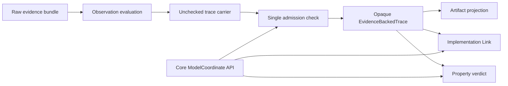

# Seal Observation traces and centralize semantic coordinates

## Overview

Make semantic trace positions and accepted Observation output trustworthy by construction. One Core-owned coordinate API will define canonical Model Trace enumeration, strict one-based lookup, and coordinate kinds. Observation will admit its wide evidence-backed record once into an opaque `EvidenceBackedTrace`, after which Property, Implementation Link, and Run Evaluation consume only the checked value through a small read-only interface.

This is a readability and correctness refactor. It removes repeated positional logic and downstream envelope validation, and it fixes the current inconsistency where zero-valued coordinates alias the first trace slot in some consumers but fail in another. Model meaning, accepted Evidence, Property evaluation, Implementation Link source replay, artifacts, and persisted bytes remain unchanged for valid inputs.

## Goal & Context
<!-- scope: business -->

Umpire developers should be able to read trace-processing code in semantic terms without auditing repeated list indexing, coordinate classification, or sixteen-field envelope invariants at every consumer. A successfully accepted Observation trace should already mean that the Observation boundary checked it; later stages should validate only their own responsibilities.

The change affects model authors and maintainers only. End users and operators receive no new command, configuration, runtime behavior, or artifact format.

## Architecture & Data Models
<!-- scope: technical -->

`Umpire.Core` owns `ModelCoordinate` and the canonical relationship between a Model Trace and its positions: enumeration order, strict one-based lookup, and Definition kind. `Umpire.Property` owns the adapter from its existing `PropertyTraceField` vocabulary to that Core coordinate semantics, including the existing prior-state boundary rules. Observation, Property verdicts, and Implementation Link application consume those APIs instead of carrying private positional implementations.

Observation keeps one low-level unchecked carrier for evaluation assembly and negative admission tests, but the ordinary facade exposes an opaque accepted `EvidenceBackedTrace`. The existing checker becomes the single admission operation and returns that opaque value. `ObservationResult.accepted` carries only the admitted type. Read-only dot-notation projections expose the fields required by existing semantic consumers and artifact projection; no public constructor or record-update path can create an accepted value.



## API Contracts
<!-- scope: technical -->

- `ModelCoordinate` is Core semantic vocabulary. `ModelTrace.coordinates` returns initial state followed by each step's selected action, model outcome, resulting state, and observations in their existing order. `ModelTrace.valueAt?` rejects every zero or out-of-range step/position and otherwise returns the exact `ModelValue`. `ModelCoordinate.definitionKind` is the sole coordinate-kind mapping.
- `PropertyTraceField` retains its current vocabulary and owns one compatibility operation over a trace and coordinate. Initial-state, prior-state, resulting-state, observation, and relation compatibility remain exactly as today; the operation delegates position validity and kind semantics to Core.
- The semantic `EvidenceBackedTrace` type is opaque and denotes successful Observation admission. A focused unchecked carrier remains available only through the low-level evaluation/test surface. The admission checker returns either the existing `ObservationDiagnostic` or one `EvidenceBackedTrace`; no proof-only, unchecked, or compatibility constructor is added.
- `ObservationResult.accepted`, `evaluateObservationProperty`, `applyImplementationLink`, Run Evaluation, and artifact projection consume the opaque accepted type. Existing field-style access remains available through documented read-only projections. Existing equality, decidable equality, and debug rendering behavior is preserved where live consumers require it, without exposing construction or record update.
- Implementation Link continues to replay the accepted source trace against its source Target, enforce its application Limit, translate through the checked link, and produce complete link Evidence. It no longer owns Observation envelope admission. Malformed unchecked wrappers fail at Observation admission and cannot become an Implementation Link status.

## Approach

1. Move coordinate vocabulary and trace-position semantics to Core with exact positive, zero, out-of-range, empty-trace, and ordering regressions.
2. Replace Observation, Property-verdict, and Property-field positional helpers with the Core API while preserving stage-specific diagnostics and prior-state rules.
3. Seal the accepted Observation trace behind the existing semantic name, retain a narrow unchecked admission fixture surface, and migrate Observation results and tests to the hard boundary.
4. Require the accepted type in Property verdict and Implementation Link consumers, remove redundant Observation envelope checks, and retain Link-owned source-target, mapping, Limit, Known Gap, and translation failures.
5. Carry the accepted boundary through composed Run Evaluation and artifact projection without changing stage statuses or persisted bytes.
6. Update public documentation and run exact semantic, artifact, import, trust, build, and lint compatibility gates.

## Edge Cases & Constraints
<!-- scope: technical -->

- Zero is invalid for selected-action, model-outcome, resulting-state, and either observation coordinate component. Oversized indices are invalid. Lookup returns no value; each owning caller maps absence to its existing applicable diagnostic.
- An empty Model Trace enumerates only its initial state. Canonical order remains initial state, then action/outcome/resulting-state/observations for each step in source order. Repeated equal values remain distinct by coordinate.
- Property prior-state compatibility keeps its current edge behavior: initial state is a prior state only when a step exists, and a resulting state is a prior state only before a later step. Observation/relation compatibility and all other field mappings remain unchanged.
- Admission preserves every existing Observation failure kind, status, related-identity ordering, Limit, and failure precedence. `evaluateEvidence` returns the same non-success result for invalid input and the same accepted semantic content for valid input.
- The hard type boundary intentionally retires direct application of forged trace records. Negative fixtures mutate the unchecked carrier and assert the same Observation admission diagnostics. No raw overload remains on Property or Implementation Link.
- Accepted-trace projections preserve Model Trace content, Evidence Links, vocabulary, mapping/profile identity, Evidence Limit, fingerprints, artifact content, checksums, and debug/equality behavior required by current consumers. Raw Evidence remains absent from the accepted value.
- The change introduces no new axiom, native-decision default, third-party dependency, type-class selection path, callback, or import-boundary exception. Existing comments are preserved and revised only where their stated ownership changes.
- At ten times the trace/evidence size, the pipeline performs the complete Observation envelope check once. Coordinate enumeration remains linear in trace slots; no speculative cache or index is introduced in this spec.

## Quick commands

```bash
cd model && mise exec -- lake build Umpire.CoreTests Umpire.Observation.Tests Umpire.ImplementationLink.Tests
cd model && mise exec -- lake build UmpireTests TemporalModelTests
make umpire-build-model
make umpire-check-regression
make lint-model
make lint-code
```

## Acceptance Criteria
<!-- scope: both -->

- **R1:** Core owns one documented Model Trace coordinate API whose enumeration order, strict one-based lookup, and Definition-kind mapping are authoritative for all Umpire consumers. Errors: step or observation position zero and every out-of-range coordinate return no value; empty traces enumerate only initial state; repeated equal values retain distinct coordinates.
- **R2:** Observation, Property field compatibility/verdicts, and Implementation Link use the Core coordinate API with no remaining private coordinate enumeration, list-index lookup, or kind classifier. Errors: invalid coordinates retain the owning stage's applicable diagnostic and deterministic precedence; prior-state, resulting-state, observation, and relation boundary behavior is unchanged.
- **R3:** The ordinary semantic `EvidenceBackedTrace` is opaque, can be produced only by successful Observation admission, and exposes only documented read-only projections required by current consumers. Errors: malformed or forged unchecked carriers cannot reach Property, Implementation Link, Run Evaluation, or artifact projection; there is no unchecked/proof-only constructor or raw compatibility overload.
- **R4:** Observation admission preserves the current fail-closed validation matrix and returns identical accepted semantic content for valid bundles. Errors: missing, duplicate, extra, shifted, zero, inconsistent, unordered, unsupported, raw-material, disposition, closure, bound, identity, and fingerprint failures retain their existing Observation status, diagnostic kind, related identities, and precedence.
- **R5:** Property verdict, Implementation Link, Run Evaluation, and artifact projection consume the accepted type without repeating Observation envelope validation, while retaining their own query/property compatibility, source-Target replay, mapping, Limit, Known Gap, translation, and artifact checks. Errors: an Observation non-success never invokes later stages; source-target or link failures remain at Implementation Link; artifact bytes, checksums, fingerprints, and valid pipeline results do not change.
- **R6:** Focused regressions, public import checks, architecture documentation, aggregate model builds, regression gates, and model/code lint prove the new ownership boundary. Errors: a duplicate coordinate semantic body, exposed accepted-record constructor/update, lost or stale comment, new axiom/trust dependency, import-boundary violation, warning, or generated/runtime/schema drift fails completion.

## Early proof point

Task `.1` proves that one Core API can reproduce every existing coordinate and reject zero uniformly before any accepted-trace or consumer migration. If it cannot preserve exact ordering, lookup, and kind semantics, reconsider the Core ownership seam before continuing with Task `.2` and later work.

## Boundaries
<!-- scope: business -->

- No new Property, Behavior, Query, Observation, Space, or scenario language and no DSL syntax or macros.
- No change to model outcomes, Target authority, Property meaning, Implementation Link translation, runtime execution, Evidence collection, or Run Evaluation statuses for valid accepted input.
- No artifact schema/version, JSON field, checksum, fingerprint, generated-code, API-catalog, or dynamic-configuration change.
- No consolidation of Observation ordering/closure algorithms, Observation field-authoring handles, Space constructors, or unrelated helper literals; those remain separate findings.
- No general trace cache, index, collection framework, compatibility wrapper, or deprecation period.

## Decision Context
<!-- scope: both — conditionally substructured -->

The coordinate seam belongs in Core because Observation, Property, and Implementation Link all consume the same pure Model Trace positions; keeping it under Observation would make shared semantic vocabulary depend on one evidence language. Property-specific field compatibility remains in Property so Core does not import a higher authoring language.

The accepted type uses a hard opaque boundary rather than a shallow wrapper plus raw overloads. A compatibility overload would preserve the duplicate validation and layer-confused diagnostics this spec removes. The unchecked carrier remains only for the single admission implementation and negative tests, while the existing semantic name denotes the value ordinary developers should use.

Reject a cached coordinate-view object as unnecessary for the current scale: direct semantic operations are shorter at call sites and preserve the option to deepen internals later without committing another public representation. Reject merging the larger ordering/closure-validator simplification into this spec because it has different diagnostic-precedence risk and is not required to establish the accepted-trace boundary.

## Requirement coverage

| Req | Description | Task(s) | Gap justification |
|-----|-------------|---------|-------------------|
| R1 | Authoritative Core coordinate semantics | `.1` | — |
| R2 | Coordinate consumer migration and compatibility | `.2`, `.4` | — |
| R3 | Opaque accepted EvidenceBackedTrace | `.3`–`.5` | — |
| R4 | Exact Observation admission behavior | `.3` | — |
| R5 | Downstream checked consumption and artifact compatibility | `.4`–`.6` | — |
| R6 | Tests, imports, docs, trust, build, and lint gates | `.1`–`.6` | — |

## References

- Umpire 4 rules MOD-06 through MOD-08, AUT-01 through AUT-03, AUT-07, EVD-02 through EVD-05, and EVD-09.
- Lean Authoring Guidelines sections 2, 4, 5, and 6.
- Completed Observation, artifact-boundary, and Implementation Link specs (`fn-4`, `fn-18`, and `fn-32`) define the preserved semantics.
- Open authoring-deepening spec `fn-43` should consume this coordinate and accepted-trace seam rather than create a parallel helper.
