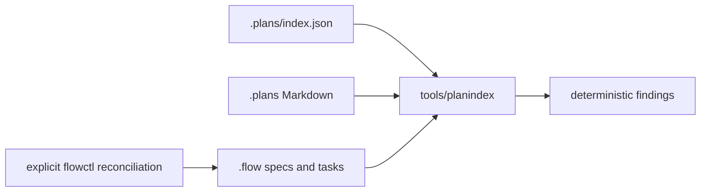

# Index and reconcile Umpire plan authority

## Overview

Create one machine-readable authority registry for `.plans/`, validate it without mutation, and
reconcile the current Flow backlog to the retained Umpire 4 prototype order. This is developer and
agent infrastructure; it changes no runtime behavior.

## Goal & Context

The repository has 25 plan documents with different authority and lifecycle roles, while current
Flow readiness and task scope do not consistently match the reduced prototype roadmap. Future agents
need one explicit place to learn which plans govern, which are descriptive or historical, and which
Flow specs are retained, completed prerequisites, deferred, or superseded.

Developers and planning agents gain deterministic checks and an accurate ready queue. End users and
operators see no product, deployment, configuration, or monitoring change.

## Architecture & Data Models

`.plans/index.json` is the manually authored source of plan-governance metadata. A small Go command
under `tools/planindex` parses the closed schema, validates the registered documents and local links,
and compares the declared Umpire roadmap dispositions and required dependencies with tracked Flow
JSON. It reports drift only; all Flow mutation remains an explicit, one-time `flowctl` operation.



The registry root has exactly `format`, `documents`, and `flowSpecs`. Its closed field contract is:

| Field | Type and invariant |
|-------|--------------------|
| `format` | String literal `umpire-plan-index/v1`. |
| `documents` | Array containing every `.plans/*.md` exactly once, sorted by `path`. |
| `documents[].path` | Unique normalized repository-relative `.plans/*.md` string. |
| `documents[].lifecycle` | `active|reference|historical|superseded|unclassified`. |
| `documents[].authority` | `normative-rules|delivery-order|architecture|scoped-contract|descriptive|historical|unclassified`. |
| `documents[].authorityParents` | Sorted unique array of registered document paths; no self edge; the complete graph is acyclic. |
| `documents[].supersededBy` | Registered document path or JSON `null`; non-null exactly when lifecycle is `superseded`. |
| `documents[].allowedMissingLinks` | Sorted unique array of objects with exactly non-empty `target` and `reason` strings plus `anchor` as a non-empty string or JSON `null`; the containing document is the source. |
| `flowSpecs` | Array containing every `.flow/specs/*.json` exactly once, sorted by canonical `id`. |
| `flowSpecs[].id` | Canonical unique Flow spec ID matching its JSON filename/body. |
| `flowSpecs[].scope` | `umpire-roadmap|umpire-support|other`. |
| `flowSpecs[].disposition` | `retained|completed-prerequisite|deferred|superseded|out-of-scope|unclassified`. |
| `flowSpecs[].phase` | `p0|p1|p2|p3|verification|support|none`. |
| `flowSpecs[].status` | `open|done`, exactly matching the tracked Flow spec body. |
| `flowSpecs[].ready` | Boolean matching the explicit Flow readiness flag; an absent/null flag normalizes to `false`. |
| `flowSpecs[].completionReview` | `unknown|ship|needs_work|needs_human`, matching the tracked completion-review status with absent/null normalized to `unknown`. |
| `flowSpecs[].specDependencies` | Sorted unique array containing the exact canonical spec dependency set. |

Objects allow no extra fields. The complete cross-field matrix is:

- `scope=other` iff `disposition=out-of-scope` and `phase=none`; direct Flow state fields still match.
- `scope=umpire-roadmap` requires `phase=p0|p1|p2|p3|verification` and a disposition other than
  `out-of-scope`; `scope=umpire-support` requires `phase=support` and the same disposition rule.
- `disposition=retained` requires `status=open`; readiness and completion-review status match Flow.
- `disposition=deferred|superseded` requires `status=open`, `ready=false`, and a non-`ship`
  completion-review status.
- `disposition=completed-prerequisite` accepts `status=done`; it also accepts `status=open` only
  when `ready=false` and `completionReview=ship`. The checker does not infer completion from stale
  committed task-status snapshots or external runtime state.
- `unclassified` is accepted by the parser while editing but always fails the checked registry.

At the current snapshot, fn-21 is a completed-prerequisite Umpire-roadmap spec whose stale ready
flag is reconciled to false by task .6. Fn-42, fn-44, and fn-50 are completed-prerequisite
Umpire-support specs that remain open/unready; fn-43 and fn-45 through fn-49 plus fn-51 are retained Umpire-support specs.
The fn-43/fn-48/fn-49/fn-51 simplicity track is retained and non-prototype-gating, not deferred.
The registry reports committed Flow state and does not claim that spec-level readiness captures a
live task's external authorization or blocked reason.
Any later-created spec fails the checker until an owner explicitly classifies it.

## API Contracts

- `make umpire-check-plan-index` runs the read-only checker from the repository root.
- Success returns exit 0 with one stable success line. Any schema, document, link, authority-graph,
  Flow-state, or dependency mismatch returns non-zero with sorted diagnostics on stderr.
- The checker never invokes mutating Flow commands, edits the registry, repairs links, or changes
  readiness.
- Registry paths are normalized repository-relative paths. Absolute paths, `..`, symlink escapes,
  duplicate object keys, unknown fields, and unknown format versions are rejected.
- Local Markdown links and anchors must resolve unless the exact missing target is recorded in that
  document's `allowedMissingLinks`; external URLs are not fetched.

## Approach

1. Build and test the strict parser and pure checks against temporary fixture repositories.
2. Classify every current `.plans/*.md`, register the Umpire roadmap rows, and wire the focused Make
   target.
3. Repair active/reference documentation links and make any intentionally historical missing link
   explicit in the registry.
4. Reduce fn-5 and fn-17 task contracts to the retained prototype scope and correct fn-33's serial
   campaign contract.
5. Use `flowctl` to reconcile explicit readiness for superseded, deferred, and decision-gated work.
   Preserve the roadmap's P2/P3 decision gate in the authority registry and prose rather than adding
   retroactive dependencies to completed specs or turning delivery priority into hard Flow edges,
   then validate the full Flow graph and the plan index.

## Quick commands

```bash
go test -count=1 -tags test_dep ./tools/planindex/...
make umpire-check-plan-index
$FLOWCTL validate --all --json
```

## Edge Cases & Constraints

- The registry covers every `.plans/*.md` exactly once, including historical and superseded files;
  deletion, rename, or a new unregistered plan fails deterministically.
- Authority-parent references and `supersededBy` targets must exist and be acyclic. The single
  normative-rules root and delivery-order root remain explicit rather than inferred from prose.
- Duplicate JSON names are rejected even though legacy Go JSON decoding normally accepts them.
- The checker reads only beneath the repository root and does not follow an index path outside it.
- Flow reconciliation is a one-time quiescent-checkout migration: the conductor dispatches only one
  writer and no external writer may participate during tasks .4-.6. Each supported setter runs
  serially and is followed immediately by paired Markdown/JSON verification. Bundled flowctl provides
  no compare-and-set primitive, so concurrent editing is explicitly unsupported rather than
  presented as protected; interruption resumes by re-reading authoritative state and applying only
  remaining setters idempotently.
- The reduced fn-5/fn-17 tasks must retain existing comments and history while removing dependencies
  on deferred machinery. Old task IDs remain stable where possible.
- At 10x the current number of plans/specs, checks remain adjacency-list and sorted-slice based; no
  prose inference, network access, or all-pairs content analysis is introduced.

## Boundaries

- No automatic Flow repair, watcher, daemon, tracker sync, or CI workflow change.
- No generated replacement for hand-authored Umpire plans or `.plans/UMPIRE4_COMPONENTS.md`.
- No general Markdown linter outside `.plans/` and no external-link availability check.
- No implementation of deferred fn-5, fn-17, or fn-33 capabilities.

## Decision Context

Use one manual versioned registry because lifecycle and authority are human decisions that cannot be
reliably inferred from filenames or prose. Keep the checker read-only so validation cannot silently
rewrite the roadmap. Rejected generated status Markdown as a second stale authority. Rejected a
generic repository documentation framework as unnecessary for the Umpire-specific need.

Authority precedence is: Umpire 4 normative rules, prototype delivery order, architecture, scoped
contracts, then descriptive material. Historical and superseded documents remain discoverable but do
not override active authority.

## Acceptance Criteria

- **R1:** `.plans/index.json` uses the closed field table above, lists every current `.plans/*.md` and
  `.flow/specs/*.json` exactly once, records an acyclic authority/lifecycle graph, and explicitly
  classifies every Flow spec as Umpire roadmap, Umpire support, or other. Errors: malformed or
  duplicate-key JSON, wrong types/nullability, unknown/extra fields, unsupported version/enums,
  duplicate/missing/stale paths or IDs, `unclassified` rows, invalid scope/disposition/phase
  combinations, dangling graph targets/dependencies, noncanonical arrays, and cycles all fail with
  sorted diagnostics.
- **R2:** The focused checker and Make target are deterministic, read-only, repository-confined, and
  validate registered local links/anchors plus tracked Flow status/readiness/dependencies. Errors:
  absolute or escaping paths, symlink aliases/escapes, missing files/anchors, undeclared missing links,
  unreadable files, invalid Flow JSON, and state disagreement fail non-zero without changing files;
  external URLs are ignored.
- **R3:** Flow retains fn-14 as its supported open/unready superseded tombstone; records fn-15,
  fn-23 through fn-26, fn-29, and fn-30 as deferred/unready; records open-SHIP fn-21, fn-42, fn-44,
  and fn-50 as completed prerequisites with readiness false; and retains fn-43, fn-48, fn-49, and fn-51 as unready,
  non-prototype-gating support. Retained P3 work, including fn-5, fn-17, fn-22, fn-33, and fn-40,
  remains unready until the fn-28 evidence decision without adding retroactive dependency edges;
  fn-28 keeps its existing fn-27 prerequisite. Fn-17 and fn-33 drop their obsolete fn-5 dependency,
  while fn-33 gains the real fn-40 prerequisite its retained campaign consumes. Errors: missing IDs,
  unexpected current state, duplicate/cyclic dependencies, obsolete hard-edge insertion, or
  incomplete post-write verification fail the migration; an interrupted multi-spec run remains
  checker-visible and idempotently resumable. Concurrent mutation is outside this migration's
  supported execution contract.
- **R4:** fn-5 tasks describe only coherent list/explain for retained Nexus declarations and one
  checked review-only promotion path for the minimized duplicate-delivery failure. Errors: any
  retained task still requires a generic semantic graph, generated glossary, machine catalog index,
  broad stable regression set, or general artifact evolution fails the checker/review.
- **R5:** fn-17 tasks describe only bounded exhaustive enumeration, one uncovered-coordinate-guided
  policy, and pinned regressions outside the exploration budget; fn-33 describes a serial bounded
  campaign. Errors: pairwise/t-wise families, symmetry proofs, multiple source kinds, generalized
  resume/reporting, adaptive corpora, campaign concurrency, leases, or crash-safe state remaining in
  retained task contracts fail the checker/review.
- **R6:** Active/reference plan links and authority statements are synchronized with the registry;
  the delivery-order queue contains only remaining work and does not reintroduce completed fn-42 or
  fn-50 entries; and `flowctl validate --all --json` plus `make umpire-check-plan-index` pass after reconciliation.
  Errors: intentionally historical missing links must be explicitly allowlisted; any new warning,
  retained-to-deferred dependency, or checker mutation is a failure.

## Early proof point

Task fn-45.1 proves a strict registry can detect complete plan, authority-graph, link, and Flow drift
without mutation; task fn-45.2 completes the disposition-aware dependency invariant against the
production classification. If those checks cannot produce deterministic fixture output, reconsider
the registry schema before rewriting Flow plans.

## Requirement coverage

| Req | Description | Task(s) | Gap justification |
|-----|-------------|---------|-------------------|
| R1 | Closed complete registry | fn-45.1, fn-45.2 | — |
| R2 | Deterministic read-only checker | fn-45.1, fn-45.2 | — |
| R3 | Flow disposition and gate reconciliation | fn-45.6 | — |
| R4 | Reduced fn-5 scope | fn-45.4, fn-45.6 | — |
| R5 | Reduced fn-17/fn-33 scope | fn-45.5, fn-45.6 | — |
| R6 | Documentation and full validation | fn-45.2, fn-45.3, fn-45.6 | — |

## References

- `.plans/UMPIRE4_SPEC.md` — normative Umpire 4 rules.
- `.plans/UMPIRE4_ORDER.md` — retained scope, deferred scope, and prototype gates.
- `.plans/UMPIRE4_SPEC_COMPS.md` — descriptive architecture and authority boundary.
- `.plans/UMPIRE4_COMPONENTS.md` — descriptive implementation inventory requiring status/link repair.
- `.flow/memory/declined/generated-api-drift-verification.md` — broad generated API/CI drift gates
  remain declined; this spec does not reopen them.
