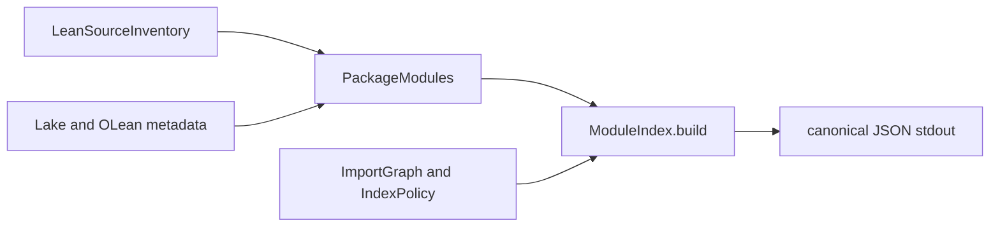

# Export Lean model module impact index

> HTML render lens: `.flow/artifacts/fn-46-export-lean-model-module-impact-index/spec.html` — regenerable; Markdown remains the record. <!-- flow-next:artifact-link -->

## Overview

Add an on-demand deterministic JSON view of the Lean model's first-party module graph so agents can
identify direct/reverse dependencies, public facades, and focused test roots before changing code.
The output is ephemeral and non-semantic; no repository-wide snapshot is checked in.

## Goal & Context

`ModelLint` already discovers every owned Lean source, builds it, loads OLean import metadata, and
reconciles that metadata with the model import policy. That useful graph is currently available only
inside the lint executable. Developers and coding agents need a stable impact-analysis command that
reuses the same trusted inventory without duplicating the loader or mistaking the result for Umpire
semantic identity.

End users and operators are unaffected. The only operational surface is a local developer command.

## Architecture & Data Models

Extract the effectful source/build/reconciliation orchestration into `ModelLint.PackageModules`,
reusing and extending the existing `Tools.LeanImportGraph.Metadata` traversal rather than creating
a second OLean loader. Keep a pure
`ModelLint.ModuleIndex.build` boundary that validates policy, constructs first-party direct and reverse
adjacency once, and projects configured public facade and focused test roots. A thin executable buffers
and prints canonical JSON only after all work succeeds.



The root JSON object has exactly `format` and `modules`. `format` is
`temporal-model-module-index/v1`. Each lexically ordered module row has exactly `name`, `sourcePath`,
`classification`, `directDependencies`, `reverseDependencies`, `publicFacades`, and `focusedTests`.
All nested arrays are de-duplicated and lexically ordered.

`classification` exhaustively maps the existing constructors to these v1 strings:
`shared`, `testpilot`, `umpire`, `umpire-veil`, `temporal-shared`, `temporal-feature`, `temporal-system`,
`temporal-implementation-link-test`, `temporal-verify`, `temporal-tool`, `temporal`, `model-tests`,
`opt-in-verify`, and `lint-infrastructure`. All 14 constructors are covered, including reserved
classes that currently have no source rows; existing classification precedence is unchanged.

Direct and reverse dependencies contain first-party modules only. V1 `publicFacades` are exactly
`Shared`, `Temporal`, `Temporal.API`, `Temporal.DynamicConfig`, `Temporal.Feature`,
`Temporal.Feature.Nexus`, `Temporal.System`, `Temporal.System.Configuration`,
`Temporal.Testpilot`, `Testpilot`, `Testpilot.Authoring`, `Testpilot.ProtoJSON`, `Testpilot.Protocol`,
`Umpire`, `Umpire.Artifact`, `Umpire.Scenario`, `Umpire.Case`, `Umpire.Case.Compiler`, `Umpire.Core`,
`Umpire.the deleted execution handoff`, `Umpire.Exploration`, `Umpire.ImplementationLink`, `Umpire.Json`,
`Umpire.KnownGap`, `Umpire.Evidence`, `Umpire.OutcomeClassification`, `Umpire.Search`,
`Umpire.Promotion`, `Umpire.Property`, `Umpire.Query`, `Umpire.Inventory`, `Umpire.Variations`,
`Umpire.Model`, and `Umpire.Model.Check`.

V1 `focusedTests` roots are exactly `ModelLint.ImportGraphTests`,
`Temporal.Tool.SemanticInventoryMainTests`, `Temporal.Tool.SemanticInventoryMakeTestsMain`,
`Temporal.Tool.SemanticInventoryTests`, `TemporalExperimentalTests`, `TemporalModelTests`,
`Testpilot.Tests`, `Testpilot.Tests.ProtoJSONMain`, `Umpire.Case.ScopedTests`,
`Umpire.Evidence.Tests`, `Umpire.OutcomeClassification.ImportTests`,
`Umpire.Search.SemanticsImportTests`, `Umpire.Property.Tests.Scoped`,
`Umpire.Model.CheckImportTests`, and `UmpireTests`. Reachability is reflexive: a configured root
appears in its own row and in every imported descendant row. These sets are explicit policy, never
filename heuristics. The 34 facade roots and 15 test roots are module names, not Lake target names;
compilation impact does not itself prove an executable test suite ran.

Full reachable external metadata remains available through reconciliation, import-policy validation
and configured-root reachability. Only emitted rows and direct/reverse adjacency omit external
modules. Direct edges are actual first-party imports, never shortcuts through external intermediaries;
root impact still follows the complete validated graph. Configured roots must exist and classify.

## API Contracts

- `ModelLint.PackageModules.load(policy, buildOutput)` is the only Lake/OLean loading seam used by both
  lint and index. Discovery failure stops immediately; source validation reports all sorted issues;
  quiet Lake build failure stops metadata loading and reports its captured transcript; independent
  per-module OLean lookup/read failures are accumulated and sorted before returning no result; and
  successful metadata reports all sorted inventory issues and architecture violations as current lint
  does. Source issues stop the build; metadata failures continue independently known queued nodes,
  but do not claim to inspect undiscoverable descendants of failed nodes. No failed phase returns
  borrowed records or a partial loaded result. Compacted regions remain owned through consumers.
- `ModelLint.ModuleIndex.build(policy, sources, modules)` is pure and returns either a complete index
  or deterministic issues.
- Exporter-only root preflight loads the current directory's Lake root configuration and requires
  package name `temporal-model`, canonical root-directory equality, and the root-owned `modelLint`,
  `modelLintTests` and exporter declarations with their expected module roots. It rejects an unrelated
  valid Lake package before inventory/build work. Use the pinned Lake root-loading adapter without
  dependency resolution, toolchain updates or ambient CLI renaming; capture configuration diagnostics.
  This identifies the project shape, not a security principal. Keep it outside shared lint loading
  so current `modelLint` discovery behavior is unchanged; relocated valid checkouts remain supported.
- Harmless permutations and equivalent valid platform path spellings normalize. Duplicate source,
  metadata or edge identities, unsafe paths and malformed closed values reject; graph utilities must
  not silently deduplicate invalid index inputs. Empty arrays remain present in the closed v1 JSON.
- `cd model && mise exec -- lake -q exe temporal-model-module-index` emits exactly one compact JSON
  document plus LF on stdout, with empty stderr and status 0.
- Inventory, build, OLean, policy, graph, or serialization failure returns non-zero, emits no stdout,
  and writes diagnostics only to stderr. A failure in the final stdout write also returns non-zero and
  reports best-effort diagnostics, but the OS stream may already contain a prefix; atomic stdout is not
  promised.
- `make umpire-export-model-module-index` builds and invokes the command from the canonical `model/`
  package root with quiet Lake invocations and no stdout banner. `make umpire-check-model-module-index`
  captures stdout/stderr/status separately and tests the process contract without checking in output.

## Approach

1. Extract and regression-test the current `ModelLint` package loading pipeline without changing lint
   diagnostics or import-policy behavior.
2. Implement and test the pure index projection with an explicit `IndexPolicy` for facade and test
   roots, first-party reverse adjacency, cycle rejection, and canonical bytes.
3. Register the thin Lake executable and root Make target, then document when the ephemeral index is
   useful and what it does not mean.

## Quick commands

```bash
cd model && mise exec -- lake -q build modelLintTests modelLint temporal-model-module-index
cd model && mise exec -- lake exe modelLintTests
make umpire-export-model-module-index >/tmp/umpire-module-index.json
make umpire-check-model-module-index
make lint-model
```

## Edge Cases & Constraints

- Invocation outside the canonical `model/` Lake root fails clearly; the root Make target normalizes
  normal usage.
- Source aliases, symlink escapes, duplicate source/module identities, uncovered sources,
  unclassified first-party modules, unknown first-party imports, missing/stale OLeans, and import cycles
  fail before serialization.
- External imports are validated as external leaves but are not emitted as index rows or reverse
  dependencies.
- Import edges come from Lean/Lake compiled metadata, never source-text scanning or direct OLean byte
  parsing.
- Reverse adjacency is constructed once in O(V+E); configured facade/test reachability does not run an
  all-pairs traversal. A synthetic graph at roughly 10x current size protects this scaling shape.
- Paths are slash-normalized and relative to `model/`, so equivalent macOS/Linux checkouts produce the
  same bytes.
- The executable builds the complete payload in memory before the final write, preventing prefixes
  from validation/serialization failures. A short/failing final stdout write can truncate the stream;
  callers must honor its non-zero exit rather than treating a prefix as valid JSON.
- Both the outer `lake -q exe` and the loader's nested `lake -q build` are quiet on success. The loader
  captures child streams: `modelLint` may replay them to their original channels, while the exporter
  discards successful build chatter and reserves stdout for JSON.
- Child streams are captured without pipe deadlock. Lint replays them to their original channels;
  exporter failures retain both transcripts on stderr. Preserve existing lint diagnostic prefixes,
  source/build ordering and exclusions, success text, and subsequent declaration-lint execution.
- Cold/stale process tests use isolated scratch packages and actual outer Lake/Make entrypoints;
  never delete a shared build cache or infer outer quietness from a mocked inner loader.

## Boundaries

- No checked-in full module-index output, daemon, watcher, editor plugin, or query language.
- No behavior fingerprints, Definition IDs, Artifact Checksums, provenance, or semantic catalog claim.
- No external dependency graph, transitive path dump, source parser, or import-policy relaxation.
- No new third-party library.
- No new CI coverage, broad generated API drift verification, or Nexus cancellation work.

## Decision Context

Reuse the existing source inventory and OLean metadata loader because they already enforce the model's
filesystem and classification trust boundary. Keep the index builder pure so graph behavior is cheap
to test independently. Use one complete JSON export rather than a configurable query surface; agents
can filter it downstream. Rejected a checked snapshot because it would create high-churn generated
state with no semantic authority.

The refresh consumes delivered Testpilot, semantic-only Target, scoped monitoring and neutral outcome
owners. It retains every originally configured facade that still exists, including
`Umpire.the deleted execution handoff`; only absent historical roots are removed. Reserved Veil classification
cases remain even though their former executable roots are absent. Unfinished fn-77 owners are not
silently added by filename discovery. Root policy changes require explicit reviewed choices.

## Acceptance Criteria

- **R1:** `ModelLint.PackageModules` is the single source/build/OLean/reconciliation pipeline used by
  both `modelLint` and the exporter, with existing lint policy, diagnostics, and comments preserved.
  Errors: discovery failure stops; source issues are all sorted; build failure stops later phases with
  captured output; independent per-module lookup/read failures are all sorted; and reconciliation
  reports all duplicate/missing metadata, unknown first-party imports, and unclassified modules.
  Every failure returns no partially loaded result.
- **R2:** The pure module-index builder emits one row per reconciled first-party source with the exact
  v1 classification strings and enumerated facade/test policies above, reflexive root reachability,
  and correct direct/reverse dependencies.
  Errors: duplicate rows/edges, missing endpoints, cycles, unknown roots, unclassified modules, and
  malformed/noncanonical values reject the whole result; equivalent input ordering normalizes.
- **R3:** `temporal-model-module-index/v1` JSON is byte-identical across repeated and reordered
  equivalent inputs, has the exact closed field set and terminal LF, uses model-relative normalized
  paths, and is produced only after complete validation. Errors: unsupported/internal serialization
  state, wrong working root, or Lake/OLean failure yields non-zero, diagnostics on stderr, and empty
  stdout; a failing final stdout write yields non-zero but may leave a truncated OS stream.
- **R4:** The Lake executable, root export target, and model documentation expose the on-demand index
  without adding it to default targets or version control and explicitly state its non-semantic role.
  Quiet cold/stale Lake and Make paths keep stdout JSON-only and successful stderr empty. Errors: a
  checked snapshot, semantic identifier field, hidden default build cost, stdout banner/progress, or
  undocumented heuristic classification is a failure.
- **R5:** Focused fixtures cover disconnected graphs, diamonds, cycles, missing/duplicate metadata,
  external leaves, each classification string, reflexive and multi-root facade/test reachability,
  reordered input, cross-platform path normalization, multiple simultaneous metadata failures, cold
  and stale builds, wrong-root invocation, final-write failure, and a graph around 10x current size.
  Existing model lint must pass with terminal evidence. Mandatory nonfixing aggregate Go lint may
  retain only its verified inherited failure multiset, with no new findings; a killed process or
  missing result is never a passing gate. Errors: no error surface beyond R1-R4.

## Early proof point

Task fn-46.1 proves the effectful package loader can be shared without changing `modelLint` behavior.
If that extraction changes diagnostics, build ordering, or loaded metadata, reconsider the seam before
building a second consumer.

## Requirement coverage

| Req | Description | Task(s) | Gap justification |
|-----|-------------|---------|-------------------|
| R1 | Shared fail-closed package loader | fn-46.1 | — |
| R2 | Pure impact index | fn-46.2 | — |
| R3 | Canonical no-partial JSON contract | fn-46.2, fn-46.3 | — |
| R4 | Lake/Make/docs integration | fn-46.3 | — |
| R5 | Negative, determinism, and scale tests | fn-46.1, fn-46.2, fn-46.3 | — |

## References

- `model/ModelLint.lean` — current effectful source/build/OLean/reconciliation flow.
- `model/ModelLint/ImportGraph.lean` — existing classification and import-boundary policy.
- `model/Tools/LeanImportGraph.lean` — deterministic pure graph traversal.
- `model/Tools/LeanSourceInventory.lean` — canonical confined source inventory and reconciliation.
- `model/lakefile.lean` — support library and executable registration.
- `model/README.md` and `model/ARCHITECTURE.md` — model tooling and import-policy documentation.
- [Lean source files and modules](https://lean-lang.org/doc/reference/latest/Source-Files-and-Modules/)
- [Lake reference](https://lean-lang.org/doc/reference/latest/Build-Tools-and-Distribution/Lake/)
