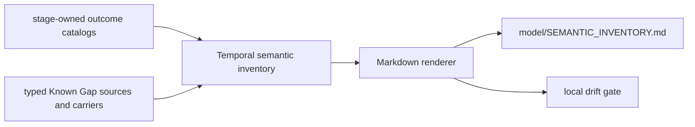

# Generate Umpire semantic outcome and Known Gap inventory

## Overview

Make the current Umpire stage outcomes and Known Gap flows discoverable from typed Lean catalogs,
then generate one checked Markdown inventory with a narrow repository-local drift gate. Preserve each
stage's vocabulary and the existing Run Evaluation/result schemas rather than collapsing semantics
into a universal status.

## Goal & Context

Outcome and Known Gap behavior is distributed across planning, runtime execution, Observation,
Implementation Link, Property evaluation, strict Query aggregation, and artifact composition. Hand
written plan text has already drifted from current constructors. Developers and planning agents need
one reviewable, source-derived inventory before extending receipts, profiles, campaigns, or property
behavior.

This work begins only after fn-44 finalizes accepted-trace migration and fn-20 finalizes the current
Run Evaluation documentation boundary. It changes no user-visible runtime behavior, artifact bytes,
or operational deployment surface.

## Architecture & Data Models

Each owning Lean stage exposes a typed ordered catalog of constructor descriptors plus an exact-one
classifier proof over its existing outcome type. Payload-free finite enums may use their values as
descriptors; payload-bearing outcomes such as `PlanningOutcome.found` and `.invalid` use constructor
matchers, so arbitrary payloads do not have to be enumerated. A small reusable
`Umpire.SemanticInventory` module defines documentation descriptors and the closed Known Gap
lineage/scope vocabulary; it does not define a replacement status enum. A Temporal leaf aggregator
combines the stage catalogs and current gap sources into deterministic Markdown.



Outcome families remain distinct: Planning; execution phase, control, source closure, cleanup, and
operational status; Observation; Implementation Link; semantic Property verdict; and strict Query
summary. Optional-stage projection sentinels such as `not-evaluated` are documented separately and
never inserted into the owning status type.

Known Gap inventory entries have a stable catalog ID, owning stage, lineage, scope, source shape,
field mapping, and description. Lineage is exactly `authored`, `synthesized`, or `carried`; scope is
exactly `production` or `test-only`. Source shape distinguishes an exact existing `KnownGap`, a
namespaced generated `KnownGap` family, a typed authored `ImplementationLinkKnownGap` family, an
`EvidenceGap` admission projection, and a reference to an earlier catalog entry. Carry mappings
separately identify exact four-field `KnownGap` propagation and the intentionally lossy Observation
admission mapping `code -> code`, `subject.toList -> relatedDefinitionIds`, with `kind` and `detail`
absent from `EvidenceGap`. The existing `KnownGapKind`, `ImplementationLinkKnownGap`, and
`EvidenceGap` types remain unchanged.

## API Contracts

- Every stage-owned status catalog returns constructor descriptors in canonical display order and a
  classifier proving every value of the existing status type matches exactly one descriptor. Finite
  payload-free families may use existing values directly; payload-bearing families use matchers that
  ignore payload identity while retaining the owner's current name function.
- The aggregator validates unique family/catalog IDs, unique rendered status names within each
  family, valid namespaced gap codes/prefixes, resolved carried-from references, canonical order, and
  complete production/test classification before rendering.
- `cd model && mise exec -- lake exe temporal-model-semantic-inventory` validates and buffers exactly
  the complete Markdown bytes plus terminal LF before one stdout write; validation/render errors
  produce non-zero status, diagnostics on stderr, and no Markdown. A failure during the final OS
  stdout write may leave a prefix on that process stream but still returns non-zero; generation never
  installs such output.
- `make umpire-gen-semantic-inventory` atomically replaces the checked document from a sibling
  temporary file only after successful complete rendering.
- `make umpire-check-semantic-inventory` renders to a temporary file and diffs without mutation;
  `lint-model` includes this narrow check.

## Approach

1. Define the small descriptor types and exact-one Planning/runtime constructor classifiers next to
   their owners, with compile-time and executable tests.
2. Add exhaustive Observation, Implementation Link, semantic Property, and strict Query catalogs,
   keeping optional projection sentinels separate.
3. Catalog fixed and synthesized production Known Gaps and make actual producers reuse the named
   typed declarations after fn-44 lands.
4. Complete authored, carried, and test-only gap coverage and validate that Result composition retains
   distinct stages without schema changes.
5. Add the deterministic Markdown renderer, checked document, atomic generation target, read-only
   drift target, and concise model documentation links.

## Quick commands

```bash
cd model && mise exec -- lake build Umpire.SemanticInventory.Tests temporal-model-semantic-inventory
cd model && mise exec -- lake exe Umpire.SemanticInventory.Tests
make umpire-check-semantic-inventory
make lint-model
```

## Edge Cases & Constraints

- A new status constructor must make an owning exact-one classifier proof or test fail until
  classified; payload values are not enumerated and completeness is not inferred from source text.
- Duplicate rendered names are rejected within a family but identical words in different stage
  families remain valid and visibly distinct.
- Non-constructible error diagnostics are documented as diagnostics, not promoted into outcome
  values. Optional stages remain explicit projection absence, not false runtime reachability.
- Fixed planner gaps, request/raw-evidence gaps, Observation-derived gaps, typed Implementation Link
  authored families, EvidenceGap admission projections, Result carriers, and test fixtures retain
  their actual origin and propagation role.
- The request/raw gap path is documented twice where behavior differs: Observation admission is an
  explicitly lossy `KnownGap -> EvidenceGap` projection, while Result aggregation is an exact
  four-field `KnownGap` carry. Neither is mislabeled as the other.
- Unknown/dynamic request gap codes are represented by the carried source that admitted them, not by
  inventing a wildcard semantic definition. Generated observation families use one validated
  namespaced prefix.
- Rendering buffers and validates the complete document before its final stdout write or replacement.
  A final stdout failure may expose an OS-level prefix but returns non-zero. Failed or interrupted
  generation preserves the prior checked document; check mode never writes.
- Catalog construction and rendering are linear in catalog size plus lexical sorting and remain small
  at 10x current entries.
- Existing comments are preserved in every touched outcome/gap owner.

## Boundaries

- No universal status/outcome enum and no normalization of equal-looking words across stages.
- No `ResultArtifact`, Run Evaluation protocol, canonical JSON, checksum, or persistence schema change.
- No behavioral change to planning, Observation, Implementation Link, Property, Query, or runtime
  evaluation.
- No broad generated Lean API drift framework, GitHub Actions edit, public docs, or CHANGELOG entry.
- No fn-24 receipt vocabulary, fn-26 profile behavior, fn-33 campaign behavior, or deferred fn-43
  Known Gap/codec behavior implemented here.

## Decision Context

Typed owner-local constructor classifiers make additions fail near the source and avoid a second
handwritten vocabulary without pretending payload-bearing outcomes are finite value sets. One leaf
aggregator is a deep, testable module: it knows how to validate and render all inventory rows while
callers see only a complete document. Rejected source scanning because syntax is not semantic
authority. Rejected one umbrella outcome enum because stage distinctions are part of the current
Result contract.

`.flow/memory/declined/generated-api-drift-verification.md` previously declined broad generated API
and CI drift gates. The user's 2026-08-30 approval narrowly reopens only this semantic inventory's
local checked-document drift test; the broader policy remains declined.

## Acceptance Criteria

- **R1:** Every current Planning, execution phase/control/source-closure/cleanup/operational,
  Observation, Implementation Link, semantic Property, and strict Query status constructor appears
  exactly once in its owning typed constructor catalog with its current rendered name and an
  exact-one classifier proof. Payload-bearing outcomes are classified by constructor, not enumerated
  by value. Errors: missing/overlapping constructors, duplicate family-local names, unclassified
  additions, or noncanonical ordering fail compilation or focused tests.
- **R2:** Aggregation and documentation preserve separate stage families and separately identify
  optional projection sentinels without changing `RunEvaluation` or `ResultArtifact`. Errors: a
  universal enum, cross-family name collapse, false reachability, added artifact/protocol fields, or
  changed canonical bytes is a failure.
- **R3:** The Known Gap catalog records every fixed production gap, generated family, typed authored
  Implementation Link family, EvidenceGap admission projection, exact Result carry boundary, and
  test-only fixture with typed `authored|synthesized|carried` lineage and `production|test-only`
  scope, while actual fixed/synthesized producers reuse named declarations. The Observation admission
  row pins its lossy field mapping separately from exact Result propagation. Errors: duplicate
  IDs/codes, invalid namespaces, unresolved carries, invalid field mappings, wildcard invented
  semantics, missing scope/lineage, or a `KnownGapKind` expansion fail atomically.
- **R4:** `model/SEMANTIC_INVENTORY.md` is a deterministic complete projection with the title and
  generated-warning preamble, ordered Outcome families and Projection sentinels sections, and one
  Known Gap flows table with columns Catalog ID, Owner, Lineage, Scope, Shape, Source/reference,
  Field mapping, and Description. It has canonical ordering, no timestamps or machine paths, exact
  source owners, and terminal LF. Errors: validation/render failure occurs before stdout; final-write
  failure is non-zero; interrupted generation leaves the prior file; missing/stale/extra document
  content makes the read-only check fail with a deterministic diff.
- **R5:** The Lake executable, atomic generation target, narrow check target, `lint-model` integration,
  and model documentation links pass after fn-20 and fn-44 complete. Errors: running against an
  unfinished dependency, changing broad CI workflows, generating additional files, or folding
  deferred fn-24/fn-26/fn-33/fn-43 behavior into this spec is a failure.

## Early proof point

Task fn-47.1 proves owner-local constructor descriptors plus exact-one classifiers can cover both
payload-free and payload-bearing outcomes without introducing a shared status type or changing
existing rendered values. If that proof requires representative payload enumeration, semantic
duplication, or invasive type changes, reconsider the classifier interface before touching the
remaining stages.

## Requirement coverage

| Req | Description | Task(s) | Gap justification |
|-----|-------------|---------|-------------------|
| R1 | Exhaustive stage-owned outcomes | fn-47.1, fn-47.2 | — |
| R2 | Preserve stage composition and schemas | fn-47.2, fn-47.4 | — |
| R3 | Complete typed Known Gap lineage/scope | fn-47.3, fn-47.4 | — |
| R4 | Deterministic generated Markdown | fn-47.5, fn-47.6 | — |
| R5 | Dependency-safe narrow integration | fn-47.6 | — |

## References

- `model/Umpire/Planning/Engine.lean` — Planning outcomes.
- `model/Umpire/Artifact/Runtime.lean` — execution outcome families.
- `model/Umpire/Observation/Evaluation.lean` — Observation status and diagnostics.
- `model/Umpire/ImplementationLink/Application.lean` — Implementation Link status.
- `model/Umpire/Observation/Verdict.lean` — semantic Property and strict Query statuses.
- `model/Umpire/Planning/Types.lean` and `model/Umpire/Artifact/Types.lean` — Known Gap contract and
  fixed planner gaps.
- `model/Umpire/Artifact/Result.lean` — stage-preserving Result composition.
- `model/Temporal/Tool/RunEvaluation.lean` — current synthesis and carry boundary after fn-44.
- `.flow/specs/fn-20-local-execution-semantic-conformance.md` and
  `.flow/specs/fn-44-seal-observation-traces-and-centralize.md` — required baselines.
