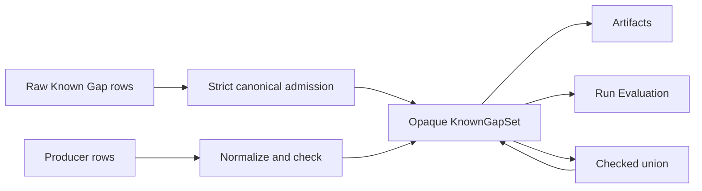

# Canonicalize Known Gaps as a checked set

## Overview

Replace repeated raw-list sorting, validation, deduplication, and union logic with one opaque `KnownGapSet` owned by Planning. Raw `KnownGap` rows remain the decoding and authoring input, while checked producers, artifacts, and Run Evaluation exchange a collection whose canonicality and conflict invariants are already established.

The refactor shortens Lean semantic consumers and makes malformed external arrays fail at their existing admission boundaries. Valid artifact content, canonical JSON, checksums, fingerprints, and Run Evaluation results remain unchanged.

## Goal & Context
<!-- scope: business -->

Model developers should be able to pass Known Gaps between Planning, persisted artifacts, and Run Evaluation without repeatedly auditing sort keys, duplicate rules, or namespaced identifiers. Operators and end users receive no new command, format, policy, or runtime behavior.

## Architecture & Data Models
<!-- scope: technical -->

Planning continues to own the public `KnownGap` row and introduces an opaque `KnownGapSet` as the canonical collection. Strict decoders check an externally supplied ordered list without repairing it. Trusted producers may submit unordered rows for canonical checking. Checked sets expose ordered read-only contents and a checked union operation for composing phase-owned gaps.



Lean Artifact models and semantic consumers carry only `KnownGapSet`. The existing Go persisted-artifact and Run Evaluation protocol decoders continue to admit raw arrays independently, reject malformed/noncanonical input, and verify responses; they do not receive or trust Lean's opaque in-memory type. Lean negative tests exercise strict set admission directly, while Go negative tests retain persisted-wire coverage.

## API Contracts
<!-- scope: technical -->

- `KnownGapSet.checkCanonical` accepts only a list already in the established canonical order with valid namespaced identifiers, no exact duplicates, and no conflicting entries for the same subject.
- `KnownGapSet.ofUnordered` is a producer-facing checked constructor that applies the established order before validation. It does not repair invalid identifiers, duplicates, or conflicting details.
- `KnownGapSet.toList` returns the canonical ordered rows used by existing JSON renderers. An empty set projects to `[]`.
- `KnownGapSet.union` combines checked phase collections deterministically, collapses exact cross-input duplicates, and rejects cross-input conflicts rather than selecting a winner.
- Existing `KnownGapErrorKind`, error identity, canonical sort key, row JSON, and raw `validateKnownGaps` diagnostic behavior remain available at the low-level admission surface. Ordinary semantic consumers accept the checked collection.

## Approach

1. Establish and test the opaque collection around the existing Known Gap key, validation, and JSON vocabulary.
2. Hard-cut Lean Artifact semantic models and validation to checked collections while preserving the independent Go raw decoder boundary.
3. Migrate Runtime, Evidence, and Result projections without altering their canonical bytes.
4. Replace Run Evaluation's private sorting/deduplication and raw-list unions with checked construction and union.
5. Document the boundary and run exact artifact, generated-view, model, and lint gates.

## Edge Cases & Constraints
<!-- scope: technical -->

- Empty collections are valid and serialize exactly as `[]`.
- Strict external admission rejects reordered otherwise-valid rows, exact duplicates, conflicting details for one subject, blank or non-namespaced codes, and invalid optional subjects with the existing error classification.
- Producer normalization changes order only; it never silently drops invalid or duplicate authored rows.
- Checked union may collapse an identical row contributed by multiple phases, but incompatible rows for the same subject fail deterministically.
- Equality and debug rendering compare canonical semantic contents. No public constructor or record-update path can forge a checked set.
- Persisted field names, format versions, row JSON, ordering, bytes, checksums, and fingerprints do not change for valid artifacts.
- Go artifact and Run Evaluation admission retains its independent Known Gap validation, canonical response verification, and defense-in-depth role; this spec does not remove or duplicate it in Lean.
- The change adds no generic collection framework, alternate Known Gap taxonomy, policy engine, Limit, third-party dependency, or runtime configuration.
- At ten times the current gap count, construction and union remain deterministic sort-and-scan operations; no cache or index is introduced.

## Quick commands

```bash
cd model && mise exec -- lake build Umpire.Planning.Tests.KnownGaps Umpire.Artifact.Tests.Codecs Umpire.Artifact.Tests.Runtime Umpire.Artifact.Tests.Evidence Umpire.Artifact.Tests.Result Temporal.Tool.RunEvaluationTests
cd model && mise exec -- lake build UmpireTests TemporalModelTests TemporalExperimentalTests
go test -count=1 -tags test_dep ./tools/umpire/internal/artifactv2 ./tools/umpire/runevaluation
make umpire-check-regression
make lint-model
make lint-code
```

## Acceptance Criteria
<!-- scope: both -->

- **R1:** Planning exposes an opaque `KnownGapSet` whose read-only contents are always valid, canonical, duplicate-free, and conflict-free. Errors: blank or non-namespaced codes, invalid subjects, duplicate rows, conflicting subject details, and noncanonical strict input return the established typed Known Gap error; empty input succeeds.
- **R2:** Strict decoder admission and producer normalization are separate contracts. Errors: strict admission rejects reordered input without repair; producer construction sorts otherwise-valid unordered input but rejects invalid identifiers, duplicates, and conflicts rather than dropping or rewriting rows.
- **R3:** Checked union deterministically composes phase-owned sets, preserves canonical order, and collapses only exact cross-input duplicates. Errors: conflicting entries for the same semantic subject return a typed failure and no partial set; empty-left and empty-right unions preserve the other input exactly.
- **R4:** Planning and every Lean Artifact semantic family carry checked Known Gaps, while the existing Go persisted-artifact decoder retains strict raw-array admission and negative-wire coverage. Errors: malformed, reordered, duplicate, conflicting, stale, or checksum-inconsistent persisted artifacts remain rejected by Go; invalid Lean lists fail set admission; valid canonical JSON bytes, checksums, fingerprints, and format versions remain unchanged.
- **R5:** Lean Run Evaluation parses external Known Gaps into checked sets and uses their union/projection with no private Lean rank, key, sort, deduplication, or raw-list validation implementation. Errors: invalid run/raw-evidence inputs fail with the existing protocol classification; cross-phase conflicts fail closed; valid response Known Gaps and generated views are unchanged. The Go protocol boundary retains independent validation and canonical response verification.
- **R6:** Public documentation, checked examples, focused Lean and Go tests, aggregate builds, regression checks, and lint describe and enforce one checked Lean semantic boundary plus the independent Go wire boundary. Errors: an exposed checked-set constructor/update, a second Lean canonicalization implementation, weakened Go admission, stale raw-list guidance, generated-byte drift, lost comment, warning, or lint failure blocks completion.

## Early proof point

Task `.1` proves that strict admission, producer normalization, projection, and union can reproduce the existing canonical Known Gap behavior without exposing a forgeable collection. If it cannot preserve the exact sort key and error identities, reconsider the opaque collection boundary before migrating artifacts.

## Boundaries
<!-- scope: business -->

- No new Known Gap kinds, policies, severity, ownership, suppression, reporting, or Limit semantics.
- No artifact schema/version, JSON row shape, checksum preimage, protocol field, or generated-view change.
- No generalized canonical-set abstraction or coercion from raw lists.
- No Lean compatibility overload that lets ordinary semantic Artifact or Run Evaluation consumers accept unchecked lists, and no removal of Go defense-in-depth validation.

## Decision Context
<!-- scope: both — conditionally substructured -->

The collection belongs in Planning because that layer already owns the row vocabulary, sort key, validation, and canonical JSON. An opaque semantic collection is deeper than another validation helper: consumers no longer have to remember when validation is required.

Strict admission is intentionally separate from producer normalization. Automatically sorting external artifacts would broaden the accepted wire language, while forcing every trusted Lean producer to pre-sort would retain the boilerplate this work removes. A checked union owns the only legitimate exact-deduplication case inside the Lean semantic pipeline: the same gap reported by multiple already-checked phases.

The Go artifact and protocol packages remain independent trust boundaries because an opaque Lean value cannot cross the process/wire boundary. Their validation is not a competing semantic implementation; it protects persisted input and verifies checker output.

Reject a generic checked-set framework as overkill; the Known Gap conflict key and decoder rules are domain-specific. Keep raw rows public for authoring and decoding, but do not retain raw compatibility fields on semantic artifacts because they would preserve the duplicate validation path.

## Requirement coverage

| Req | Description | Task(s) | Gap justification |
|-----|-------------|---------|-------------------|
| R1 | Opaque canonical Known Gap collection | `.1` | — |
| R2 | Separate strict and producer admission | `.1`, `.2` | — |
| R3 | Checked deterministic union | `.1`, `.4` | — |
| R4 | Checked artifact migration and byte compatibility | `.2`, `.3`, `.4` | — |
| R5 | Run Evaluation checked consumption | `.4` | — |
| R6 | Documentation and verification | `.1`–`.5` | — |

## References

- Umpire 4 rules MOD-06 through MOD-08, AUT-01 through AUT-03, ART-01, ART-03, and ART-09.
- Lean Authoring Guidelines sections 2, 4, 5, and 6.
- Completed Artifact and Run Evaluation specifications define the preserved wire and diagnostic behavior.
- The open ordinary-authoring deepening specification remains the sequencing boundary for Implementation Link ownership.
