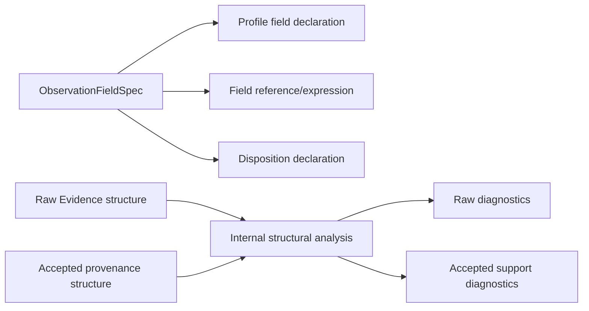

# Centralize Observation field and structural contracts

## Overview

Make each typed Observation field an authored value that owns its evidence kind, field identity, value type, and projections into profile declarations, field references, expressions, and dispositions. Then extract the shared structural ordering and closure analysis currently repeated between raw Evidence admission and accepted-trace provenance checks.

The result is shorter Temporal Observation declarations and one internal structural authority without flattening the deliberately different compile-time, raw-evidence, and accepted-provenance diagnostics. Valid mappings, Evidence Links, Observation results, artifact identities, and persisted bytes remain unchanged.

## Goal & Context
<!-- scope: business -->

Observation authors should declare a field's identity and type once and use a typed handle everywhere else. Observation maintainers should be able to change ordering or closure mechanics in one place while each boundary continues to report errors at its own semantic altitude. End users and operators receive no new evidence format, status, command, or runtime behavior.

## Architecture & Data Models
<!-- scope: technical -->

`Umpire.Observation` owns a small `ObservationFieldSpec` value. It projects the existing inert `EvidenceFieldDeclaration`, `EvidenceFieldReference`, field expression, and `FieldDispositionDeclaration`; it does not replace the existing profile, expression, mapping, or checked-plan types.

Observation Evaluation owns internal ordering and closure analysis over normalized structural facts. Raw Evidence and accepted provenance adapt their existing records into that analysis and map findings back to their current `ObservationDiagnostic` kinds, related identities, and precedence.



Compilation-time graph validation remains owned by the checked Observation language. The structural analysis in this spec concerns evidence sequence, causality, ordering support, and closure support; it does not create another public Observation language or replace Definition-graph validation.

## API Contracts
<!-- scope: technical -->

- `ObservationFieldSpec` is inert data containing one evidence-kind identity, field identity, and `ObservationValueType`.
- Its projections reproduce the exact existing declaration/reference/expression values. Disposition projection requires the author to choose the existing `FieldDisposition`; no default retention policy is introduced.
- Existing record literals remain the expert/compatibility path, but ordinary Temporal profiles, mappings, and shared fixtures use field specs as their single field authority.
- Ordering and closure analysis remains internal to Observation. It reports normalized structural findings; raw Evidence and accepted provenance retain separate adapters and public diagnostics.
- Raw Evidence continues to distinguish duplicate identity, sequence gap, incomparable ordering, missing causal parent, contradictory order, misdirected fault receipt, and missing closure. Accepted provenance continues to report missing order support or missing closure support with its established related identities.

## Approach

1. Add the field specification and prove each projection equals the existing inert record shape.
2. Migrate shared fixtures plus Feature and System Nexus profiles/mappings without changing checked identities.
3. Isolate common sequence, causality, support-consistency, and closure calculations behind internal structural findings.
4. Route raw and accepted validation through those primitives while preserving every diagnostic and failure-order regression.
5. Update Observation architecture guidance and run focused, composed, regression, trust, and lint gates.

## Edge Cases & Constraints
<!-- scope: technical -->

- Unknown evidence kinds or fields, duplicate profile fields, wrong value types, missing or duplicate dispositions, rejected-field presence, and digest-policy mismatches retain their current compile/admission errors.
- Field specs do not auto-register fields, dispositions, closures, bindings, or rules. Existing declaration lists remain explicit and authoritative.
- Empty, single-source, and multi-source Evidence retain their current sequence origins and first-failure precedence.
- Duplicate identities, missing parents, cycles, reverse edges, mixed origin modes, gaps, incomplete source closure, inconsistent per-link support, empty-record required kinds, and byte/count mismatches preserve current outcomes.
- Raw and accepted paths may share calculations but not diagnostic vocabularies. No generic public validator or catch-all structural error replaces the owning boundary's typed error.
- All existing comments are preserved and revised only where duplicated field or structural ownership becomes factually stale.
- Valid Model Traces, Evidence Links, statuses, related-ID ordering, fingerprints, canonical artifacts, and persisted bytes remain unchanged.
- At ten times the current evidence size, the refactor does not add a second traversal beyond the existing validation work; no cache or index is introduced.

## Quick commands

```bash
cd model && mise exec -- lake build Umpire.Observation.Tests Temporal.Feature.Nexus.ObservationTests Temporal.System.Nexus.Tests
cd model && mise exec -- lake build UmpireTests TemporalModelTests
make umpire-check-regression
make lint-model
make lint-code
```

## Acceptance Criteria
<!-- scope: both -->

- **R1:** One inert Observation field specification owns kind, field, and value type and projects the exact existing declaration, reference, expression, and author-selected disposition values. Errors: invalid or duplicate identities, unknown kinds/fields, wrong value types, missing/duplicate dispositions, and digest-policy misuse continue to fail in the existing checker rather than being hidden or defaulted by the specification.
- **R2:** Ordinary shared fixtures plus Feature and System Nexus Observation declarations use field specifications as their sole field authority while retaining explicit profile/rule/order/closure/disposition lists. Errors: a field omitted from a profile or disposition, an incompatible projection, duplicate declaration, or changed checked identity fails focused compilation; canonical mapping/profile identities and artifact bytes do not change.
- **R3:** Observation Evaluation owns one internal structural analysis for sequence, causality, ordering support, and closure relationships that is consumed once per admission by raw Evidence and accepted provenance validation. Its normalized facts are reused for finding mapping without a second normalization/sort traversal. Errors: duplicate IDs, gaps, missing parents, cycles, reverse order, mixed origins, missing or inconsistent closure/support, and count/byte mismatches are represented without loss; no second public validator or language is exposed.
- **R4:** Raw Evidence maps structural findings to its current detailed diagnostics and exact failure precedence. Errors: single-source, multi-source, empty, duplicate, incomparable, causal, fault-target, closure, and mixed-fault fixtures retain their diagnostic kind, status, related identities, and no-partial-trace behavior.
- **R5:** Accepted provenance maps the same applicable structural findings to its current missing-order-support or missing-closure-support diagnostics. Errors: missing/duplicate/inconsistent per-link support, origin/sequence drift, closure drift, and incomplete identity coverage retain their diagnostic kind and related identities; no raw diagnostic leaks across the accepted boundary.
- **R6:** Documentation, checked examples, mutation and 10× structural fixtures, call-path inspection, aggregate builds, regression checks, and lint make the single field and structural authorities discoverable. Errors: a duplicate structural algorithm or normalization traversal, stale field helper, lost comment, changed canonical byte/fingerprint, new trust assumption, warning, or lint failure blocks completion.

## Early proof point

Task `.1` proves one field specification can reproduce all existing Observation field shapes without defaults or identity drift. If its projections require a second semantic language or hide checker failures, reconsider the handle boundary before migrating Temporal declarations.

## Boundaries
<!-- scope: business -->

- No new Observation expression, rule, profile, disposition, ordering, closure, status, or diagnostic semantics.
- No macro, coercion-driven DSL, callback, recursive authoring form, default disposition, or automatic profile registration.
- No reopening of the accepted-trace, Model Coordinate, checked-authoring, or DefinitionGraph boundaries owned by predecessor specs.
- No raw Evidence schema, runtime adapter, artifact schema/version, checksum, fingerprint, or generated-code change.
- No generic graph or validation framework outside Observation.

## Decision Context
<!-- scope: both — conditionally substructured -->

Field specifications are typed handles over existing inert records, not a new authoring language. This keeps ordinary declarations short while preserving explicit lists and the current checker as semantic authority.

The raw and accepted validators share structural facts but intentionally keep separate adapters. Their inputs and diagnostic altitude differ: raw Evidence diagnoses transport/evidence faults precisely, while an accepted envelope can only report missing or inconsistent provenance support. A single public validator would erase that distinction.

Sequence this work after the accepted-trace and ordinary-authoring deepening specs so it consumes their final Observation surfaces. Reject merging it into either predecessor because both explicitly preserve narrower boundaries and have already passed plan review.

## Requirement coverage

| Req | Description | Task(s) | Gap justification |
|-----|-------------|---------|-------------------|
| R1 | Typed field specification and projections | `.1` | — |
| R2 | Fixture and Temporal declaration migration | `.2` | — |
| R3 | Shared internal structural analysis | `.3`, `.4` | — |
| R4 | Raw Evidence diagnostic preservation | `.4` | — |
| R5 | Accepted provenance diagnostic preservation | `.4` | — |
| R6 | Documentation and complete verification | `.1`–`.5` | — |

## References

- Umpire 4 rules MOD-06 through MOD-08, SEM-04, AUT-01 through AUT-03, AUT-07, and EVD-02 through EVD-09.
- Lean Authoring Guidelines sections 2, 4, 5, and 6.
- The accepted-trace spec defines the opaque admission and unchecked-test seam consumed here.
- The ordinary-authoring deepening spec defines the checked Observation and DefinitionGraph surfaces this work must preserve.
