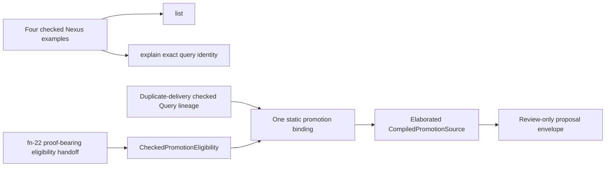

# Umpire discovery promotion and artifact

> HTML render lens (local): open `.flow/artifacts/fn-5-umpire-discovery-promotion-and-artifact/spec.html` — regenerable, markdown is the record. <!-- flow-next:artifact-link -->

## Umpire4 architecture reconciliation

This stable Flow handle is retained so completed prerequisite and downstream references do not move.
The implementation scope is the two capabilities below and nothing implied by the historical title.

## Overview
<!-- scope: both -->

Give the current Nexus model a small, concrete discovery surface and give the one duplicate-delivery
failure a checked path to a Lean source proposal for human review. The discovery rows are a closed
projection of already checked Nexus values; the promotion path is a closed binding for one already
known failure, not a new semantic authority.

## Goal & Context
<!-- scope: business -->

Contributors can currently inspect one scenario when they already know its identity, but cannot ask
which retained Nexus examples exist or explain the checked declarations that make up one example.
The later fn-22 workflow also needs a static, compile-checked proposal target after it has reproduced,
minimized, and Exactly Replayed the duplicate-delivery failure. This spec supplies those two seams
without reversing the dependency: fn-22 consumes fn-5.

## Architecture & Data Models
<!-- scope: technical -->

`Temporal.Tool.NexusDiscovery` owns one closed `NexusDiscoveryEntry` list. It contains exactly these
four current examples, in canonical query-identity order:

1. `temporal.nexus.basic-lifecycle.query.async-start`
2. `temporal.nexus.basic-lifecycle.query.cancellation`
3. `temporal.nexus.basic-lifecycle.query.successful-completion`
4. `workflow-nexus.query.exact-action-caller-closure`

Each entry is constructed from its existing checked Property, Behavior, Query, and planned
`ExperimentSpec`; it carries their canonical identities and source locations rather than copied
semantic prose. `list` projects deterministic summaries from all four entries. `explain` performs
an exact query-identity lookup and projects the same summary plus the checked declaration and plan
lineage for that one example. Neither command infers entries by scanning imports or source text.

`Umpire.Promotion` owns a sealed `CompiledPromotionSource` and the smallest checker needed to prove
that a proposal uses a checked original Query, its target-owned `.found` trace, fresh fixed promoted
Behavior/Query identities, fixed imports, deterministic source bytes, and successful clean
elaboration. `Temporal.Tool.PromotionBinding` owns exactly one static
`PromotionCandidateBinding`,
`temporal.nexus.caller-closure.promotion.cancel-unique-regression`. The binding uses the existing
duplicate-delivery negative-control Query lineage but promotes the checked expected count-one trace,
never the observed count-two trace.

`Temporal.Tool.PromotionEligibility` defines one proof-bearing
`umpire-reviewed-promotion-eligibility/v1` handoff and a private-constructor
`CheckedPromotionEligibility`. The handoff cross-binds the fixed candidate, original result and
Violation Signature, reproduced-result receipt, complete `minimized|irreducible` reduction receipt,
minimized candidate, and Exact Replay receipt by their canonical identities and digests. Its checker
recomputes every receipt identity, requires the same Query/result/signature/candidate lineage across
all three gates, and rejects any incomplete or non-success gate before producing the checked token.
Only that token can resolve the static binding.

Fn-22 remains responsible for producing the handoff after runtime reproduction, complete minimized or irreducible reduction, and Exact Replay, but consumes the fn-5 checker and type; fn-5 does not import fn-22. The fn-5 executable accepts exactly one canonical handoff on stdin, no candidate argument or override, and emits one canonical
`umpire-promotion-proposal/v2` envelope plus one LF only after eligibility checking. Runtime,
reduction, and replay lineage gates proposal resolution but never enters `CompiledPromotionSource`.



## API Contracts
<!-- scope: technical -->

- `temporal-model-inspect list` emits one canonical `umpire-nexus-discovery/v1` JSON value containing
  the four summaries in exact query-identity order, followed by one LF and empty stderr.
- `temporal-model-inspect explain <query-id>` accepts exactly one canonical query identity from the
  closed list and emits one canonical `umpire-nexus-explanation/v1` JSON value followed by one LF.
  Unknown, case-shifted, ambiguous, or extra selectors emit empty stdout, one structured diagnostic
  plus one LF on stderr, and status 1. Existing positional scenario inspection remains unchanged.
- Discovery rows expose only existing checked identities, kind labels, source locations, Behavior
  Fingerprints, and planned `ExperimentSpec` identity. Output ordering is independent of authoring
  order and repeated calls are byte-identical.
- `temporal-model-promote` accepts no arguments and reads exactly one canonical
  `umpire-reviewed-promotion-eligibility/v1` value from stdin. There is no alternate candidate,
  source path, executable path, import, promoted identity, trace, or unchecked-ID mode. Success emits
  exactly one canonical `umpire-promotion-proposal/v2` value plus one LF; malformed, incomplete,
  crossed, non-success, noncanonical, elaboration, or serialization failure emits no partial stdout.
- The promotion envelope binds the candidate identity, original Query/artifact/target/kernel
  identities, fixed promoted identities, source identity, SHA-256, and exact source bytes. The source
  is a review artifact only and is never written into a Lean package by the command.

## Edge Cases & Constraints
<!-- scope: technical -->

- The four-entry Nexus inventory is explicit and checked for duplicate identities, wrong kinds,
  missing source/fingerprint fields, crossed Property/Behavior/Query ownership, missing plans, and
  nondeterministic order before either discovery command can succeed.
- `explain` is exact: it does not case-fold, prefix-match, alias, or silently redirect selectors.
- Promotion rejects non-`.found` planning, target/kernel/query drift, observed-trace substitution,
  reused promoted identities, missing imports, nondeterministic rendering, digest drift, or source
  that does not elaborate in a clean focused Lake build.
- Promotion eligibility is fail-closed inside fn-5 before binding resolution. A bare candidate identity,
  raw violation, incomplete reduction, non-reproduction, missing Exact Replay result,
  receipt-digest mismatch, or crossed lineage cannot produce `CheckedPromotionEligibility` or invoke
  the review-only proposal path.
- Existing comments and current single-scenario inspector behavior are preserved.

## Quick commands

```sh
cd model && mise exec -- lake build Temporal.Tool.NexusDiscoveryTests Temporal.Tool.PromotionTests TemporalExperimentalTests temporal-model-inspect temporal-model-promote
make umpire-check-regression
```

## Acceptance Criteria
<!-- scope: both -->

- **R1:** `temporal-model-inspect list` and `explain` expose one coherent, deterministic, exact view
  of the four retained Nexus examples and their existing checked Property, Behavior, Query, source,
  fingerprint, and plan identities. Invalid inventory state or selectors fail structurally without
  partial output, while existing positional inspection remains byte-compatible.
- **R2:** Exactly one checked binding can compile the minimized duplicate-delivery failure's original
  target-owned expected count-one trace into deterministic Lean source and a canonical review-only
  proposal. Binding resolution requires fn-5's private checked eligibility token, constructed only
  from a canonical fn-22 handoff whose reproduced-result, complete minimized-or-irreducible, and
  Exact Replay receipts recompute and cross-bind to the same fixed lineage. Bare identity invocation,
  observed count-two evidence, incomplete or crossed receipts, drift, unelaborated source, or any
  override produces no proposal and nothing is installed automatically.

## Early proof point

Task `.1` must prove the four current examples form one deterministic closed inventory without
copying their checked meaning. Task `.4` must prove a proposal cannot substitute the observed
count-two trace for the target-owned expected count-one trace. If either proof fails, revise the
concrete adapter or sealed-source boundary before wiring a command.

## Non-goals
<!-- scope: business -->

- A generic semantic graph or reusable reference graph.
- A generated glossary or machine index.
- A broad stable regression set or generalized regression suite.
- General artifact evolution, schema migration, or a new persisted artifact family.
- Source scanning, automatic proposal installation, runtime replay, minimization orchestration,
  SDK history replay, campaign management, remote execution, or CI/release Claim Assessment.

## Decision Context
<!-- scope: both -->

### Motivation
<!-- scope: business -->

The existing inspector and checked Nexus values already provide the authority needed for the
retained discovery surface. Extending that concrete tool keeps the user experience coherent and
avoids introducing a second vocabulary.

### Implementation Tradeoffs
<!-- scope: technical -->

A single static promotion binding preserves the useful checked-source seam required by fn-22 while
keeping runtime evidence and review policy outside the reusable Lean source type. The closed
four-entry adapter is deliberately concrete: adding an entry requires a reviewed code change, but
that cost makes current scope and ownership obvious.

## Requirement coverage

| Requirement | Tasks | Notes |
|---|---|---|
| R1 | `.1`, `.2`, `.3`, `.7` | Closed Nexus inventory plus exact list/explain and focused integration checks |
| R2 | `.4`, `.5`, `.6`, `.7` | Sealed source, one duplicate-delivery binding, elaboration, and review-only command checks |
