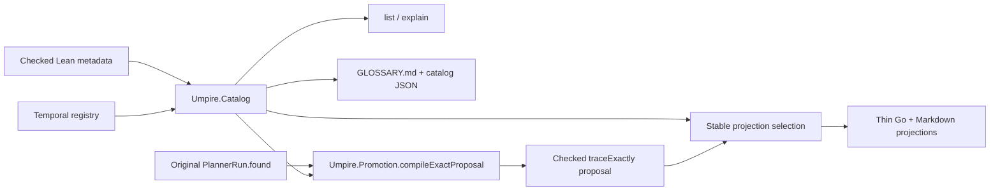

# Umpire discovery promotion and artifact evolution

> HTML render lens: local file `.flow/artifacts/fn-5-umpire-discovery-promotion-and-artifact/spec.html` — regenerable, markdown is the record. <!-- flow-next:artifact-link -->

## Overview

Make the current Lean-owned semantic vocabulary discoverable and give selected in-memory model witnesses one checked path into exact regressions. One reusable catalog feeds a generated glossary, a machine index, deterministic list/explain commands, exact promotion proposals, and the existing thin Go/Markdown regression projections.

Strict persisted-artifact decoding, compatibility, and migrations are deliberately moved to `fn-18-versioned-umpire-artifact-boundary`; this spec never adds a permissive reader or a second semantic representation.

## Goal & Context
<!-- scope: business -->

Model engineers can find a term, understand its kind and dependencies, inspect which scenarios are eligible for stable projection, and turn a complete selected model trace into a reviewable `traceExactly` regression without reauthoring its meaning. Generated documentation remains synchronized with the checked Lean catalog, and promoted proposals retain why and from where they were selected.

## Architecture & Data Models
<!-- scope: technical -->



`Umpire.Catalog` is a deep, Temporal-independent module over existing checked metadata, including fn-16's canonical `CheckedSpaceMetadata`. A `CatalogEntry` carries stable identity, declaration kind, summary, source, version, semantic digest, required/provided capabilities, exact references, aliases, deprecation/replacement metadata, and a closed disposition. `CheckedCatalog` canonicalizes and validates the complete entry graph before lookup or encoding. It copies no Property clauses, Behavior traces, target kernels, space compiler logic, or planner logic.

The Temporal production registry composes reusable framework entries with current Switch and Nexus entries. Its closed dispositions are `discoverable`, `stableRegression`, `exploratory`, `internal`, and `deprecated`. A disposition controls presentation and projection eligibility only; it does not alter semantics.

The Temporal list/explain/check adapter imports `Temporal.Tool.Catalog.Core` from fn-15 for exact selector parsing, canonical ordering, result/error envelopes, and effect-thin command dispatch. The fn-5 semantic registry remains a distinct domain adapter and executable: it does not merge its entries with API/config input catalogs or reimplement the generic query mechanics.

`Umpire.Promotion.compileExactProposal` consumes the canonical `CheckedCatalog`, `originalQuery : CheckedQuery LawStatement`, an `originalRun : PlannerRun` whose outcome is `.found trace reason` with an artifact, explicit fresh promoted Behavior and Query declaration IDs, and `kernel : IncrementalPlannerKernel originalQuery.target`. It never accepts a loose caller-authored trace/reason pair. It validates that the run's found trace/reason, artifact identities, and semantic digests bind exactly to `originalQuery`, then rejects promoted IDs that collide with any canonical identity or alias and validates the original declarations, digests, and references against catalog authority. It constructs a new authored `traceExactly` Behavior plus a new checked Query through existing checkers, proves the promoted target equals the original target so the kernel can be transported, replans through the existing planner, and returns a `PromotionProposal` only when the witness, reason, properties, target, query form, policy, expanded bounds, and independently expected semantic digests agree. Promotion necessarily creates new Behavior, Query, plan, and artifact identities; the proposal records those identities and ordinary recomputed promoted provenance plus explicit lineage to the original Query/artifact identities and provenance rather than claiming identity preservation.

The reusable proposal contains canonical authored data and lineage but no Temporal names or source renderer. A validated Temporal-owned `PromotionCandidateBinding` supplies module imports and qualified Behavior, Query, target, and kernel constants for deterministic Lean source generation. Its sealed `CompiledPromotionSource` is created only while the candidate module is elaborated: the exact emitted declaration is elaborated against those imports and typed constants before canonical bytes enter the closed registry. The CLI can emit only registered compiled-source tokens, so invalid source fails model build/registration and is never returned successfully. A separate validated `CatalogProjectionBinding` supplies inspector selectors, checked-in fixture paths, and per-entry projection keys for `stableRegression` entries; the aggregate Go and Markdown output paths are owned once by the generator, not repeated per entry. These bindings have their own identities and appear in the generated machine projection, but they do not alter the semantic identity of the reusable catalog entry.

## API Contracts
<!-- scope: technical -->

- `checkCatalog` returns one canonical `CheckedCatalog` or a structured error before list, explain, generation, projection, or promotion.
- Catalog identity covers all meaning-bearing metadata and graph edges, but not source ordering or generated prose layout.
- `listCatalog` and `explainCatalog` are pure exact, case-sensitive queries. CLI success is canonical compact JSON on stdout with one terminal LF; errors are structured JSON on stderr with empty stdout and nonzero status.
- The Temporal presentation layer supplies semantic catalog records to fn-15's generic checked query core; generic query mechanics carry no semantic entry vocabulary or projection eligibility.
- Generated `model/GLOSSARY.md` and `model/Temporal/Tool/Generated/Catalog.json` are projections of the same checked production catalog. Neither is read back as semantic authority.
- `compileExactProposal` accepts only the canonical checked catalog, the original checked Query, and an original `PlannerRun` with a genuine `.found trace reason` and artifact that validate exactly against that Query. It supports every current `QueryForm` only with its exact reason/outcome semantics: `verify` requires an exhaustive query and a violating counterexample; `witness` requires a satisfying witness; `counterexample` requires a violating counterexample; `select` requires behavior selection. Outcomes without `.found` are not promotable. It returns no partial proposal and never accepts a loose trace/reason pair, raw JSON, evidence, a runtime Result, or caller-authored Lean source.
- Reusable promotion requires explicit promoted Behavior and Query declaration IDs that are fresh across canonical catalog identities and aliases. It preserves the original property set, target composition, query form, policy, expanded bounds, exact witness, selection reason, and source provenance while deriving new checked identities. It records original Query/artifact identities and provenance beside the promoted Behavior, Query, plan, and artifact identities and ordinarily recomputed promoted provenance. Target-owned outcomes are copied from the selected model trace, never guessed or authored independently.
- Temporal source rendering requires a validated `PromotionCandidateBinding`; its imports and qualified constant references participate in the candidate/source identity, not the reusable catalog identity. Only a sealed `CompiledPromotionSource` produced by successful elaboration of the exact emitted declaration can enter the production registry or reach the CLI; a clean integration compilation defends that structural gate.
- Every `stableRegression` entry requires exactly one validated Temporal `CatalogProjectionBinding`. Inspector selector, fixture path, or projection-key changes alter the projection-binding identity and generated projection, not the entry's semantic identity; aggregate output paths are validated once as set-level generator configuration.
- The existing projection generator selects `stableRegression` catalog entries, invokes the canonical inspector, verifies exact checked-in fixtures, and transactionally renders one aggregate ordinary Go test file and one aggregate Markdown file in canonical identity order.
- The first stable set contains the current Switch exact-action regression and Nexus caller-closure regression. Ordinary Go wrappers remain metadata/fixture checks only; they do not execute Temporal or claim conformance.

## Edge Cases & Constraints
<!-- scope: technical -->

Duplicate or case-colliding identities, wrong declaration kinds, missing sources/digests, dangling references, alias cycles, invalid deprecation replacements, conflicting dispositions, and duplicate semantic entries fail catalog checking. Authored source collections are canonicalized; exact encoded-order validation belongs to the persisted reader boundary in fn-18.

Unknown, internal, or ambiguous selectors fail without suggestions that change identity. Deprecated selectors return structured replacement guidance but do not silently redirect. Full-list output is finite and unpaginated because the production catalog is compiled and bounded.

Promotion rejects non-`.found` outcomes, a QueryForm/SelectionReason mismatch, property truth incompatible with that reason, unresolved roles, unknown declarations, promoted declaration IDs colliding with canonical catalog identities or aliases, catalog/reference/digest mismatch, incompatible bounds, failed promoted/original target equality, trace/reason drift after replanning, invalid source bindings, failed source elaboration, nondeterministic source rendering, and any proposal whose expected oracle comes from the renderer under test. The typed reusable compiler cannot receive a target-mismatched kernel; missing candidate kernels and stale textual kernel bindings fail at the Temporal candidate boundary. Reordered equivalent source collections yield identical checked values; the promoted declaration IDs, semantic digests, and artifact identities remain distinct from their recorded lineage identities.

Generation validates the entire candidate set before publication. Unsafe paths, missing fixtures, stale catalog identities, projection collisions, write/flush/close/replace failures, interruption, or concurrent publication preserve the prior complete generated set.

## Quick commands

```bash
cd model && mise exec -- lake build Umpire.Catalog.Tests Umpire.Promotion.Tests Temporal.Tool.CatalogTests
cd model && mise exec -- lake build temporal-model-catalog temporal-model-promote
make umpire-list-catalog
make umpire-explain-catalog SUBJECT=workflow-nexus.query.exact-action-caller-closure
make umpire-check-catalog
make umpire-check-regression
```

## Acceptance Criteria
<!-- scope: both -->

- **R1:** Public Lean metadata checks into one deterministic catalog and generates a checked-in `model/GLOSSARY.md` plus machine-readable index. The production seed registry is exactly the two public Switch Queries (`switch.query.exact-action`, `switch.query.exact-trace`), the six public Nexus Queries named in task `.2`, and fn-16's `temporal.nexus.basic-lifecycle.space.fault-matrix` checked-space metadata. The catalog is their least typed metadata closure and is checked against a golden identity/kind set; its Nexus partition is exactly 61 entries (BasicLifecycle 10, BasicOperations 6, VariationSpace 15, CallerClosure 30). Errors: missing/extra seeds or closure entries, duplicate/case-colliding identities, wrong kinds, missing source or semantic identity, dangling references, alias cycles, invalid deprecations, and conflicting dispositions fail before output. [paraphrase]
- **R2:** Top-level Makefile generation and non-mutating check targets fail when the glossary, index, stable fixtures, or projection selection is stale, incomplete, inconsistent, or nondeterministic; checks render expected bytes in memory and compare the checked-in outputs directly, and no model-local Makefile carries this wiring. [user]
- **R3:** Deterministic list/explain commands expose vocabulary, properties, behaviors, queries, capabilities, targets, scenarios, dispositions, aliases, and deprecations directly from the checked catalog without creating a second authority. Errors: malformed, unknown, internal, ambiguous, and deprecated selectors produce exact structured results. [paraphrase]
- **R4:** `compileExactProposal` uses the canonical checked catalog to turn explicit fresh promoted declaration IDs, `originalQuery : CheckedQuery LawStatement`, an exactly bound `originalRun : PlannerRun` with `.found trace reason` and artifact, and `kernel : IncrementalPlannerKernel originalQuery.target` into a checked `traceExactly` regression proposal with new Behavior/Query/plan/artifact identities and explicit lineage to the original Query/artifact identities and provenance. All four current QueryForms are supported only for their exact form/reason/property semantics, and the replanned trace/reason must match. It retains properties, target, query form, policy, expanded bounds, witness, selection reason, and source provenance while recomputing promoted provenance normally. A validated Temporal candidate binding can enter the production registry only with a sealed source token created by elaborating the exact emitted Lean declaration. Errors: original Query/run/artifact mismatch, non-`.found` or form/reason mismatch, catalog mismatch, IDs colliding with canonical identities or aliases, failed target equality, missing candidate kernel/binding, trace/reason drift, failed source elaboration, or partial rendering yields no successfully emitted proposal. [paraphrase]
- **R5:** Versioned readers and deterministic named migrations preserve declared compatible artifacts and reject unknown majors or semantic reinterpretation. This captured requirement is retained but implemented by `fn-18-versioned-umpire-artifact-boundary`, not by this spec; fn-5 adds no reader or migration. [paraphrase]
- **R6:** The existing regression projection generator selects the closed `stableRegression` catalog set and deterministically publishes aggregate thin Go and Markdown projections for the current Switch and caller-closure exact scenarios. Errors: catalog/fixture/digest mismatch, unsafe or colliding output, incomplete set, stale generated bytes, or a wrapper that performs runtime semantics fails verification. [paraphrase]
- **R7:** Catalog, discovery, promotion, and projection layers preserve the current semantic APIs and boundaries. Errors: a second semantic IR, copied property/behavior/planner logic, live evidence/runtime/replay/minimization behavior, generated API drift gate, model-local Makefile, Umpire3 dependency/inspection/use, or compatibility alias is a verification failure. [user]

## Early proof point

Task `fn-5-umpire-discovery-promotion-and-artifact.1` proves that heterogeneous checked framework and model metadata can form one deterministic reference graph without copying semantic bodies. Task `.4` is the promotion proof: an independently produced Switch checked Query plus its exactly bound `PlannerRun.found` and target-indexed kernel must compile through existing checkers and planning to the same trace/reason but new lineage-linked checked identities. Task `.5` must then structurally elaborate the exact Temporal-bound source before registry admission and compile the emitted bytes in a clean test invocation. If any proof fails, reconsider the catalog adapter, exact-proposal boundary, or source-binding contract before integration.

## Boundaries
<!-- scope: business -->

- No persisted artifact reader, compatibility parser, schema migration, or best-effort repair; fn-18 owns those.
- No runtime execution, raw evidence, Observation qualification, live replay, minimization, or deployment qualification.
- No graphical interface, network service, pagination, arbitrary query language, or Go authoring facade.
- No second Behavior/Drive language, semantic IR, target outcome authority, or hand-maintained glossary.
- No generated Lean API drift verification, temporary regeneration/diff gate, or CI workflow.
- No model-local Makefile; repository integration is root-Make only.
- No dependency on, inspection of, or use of Umpire3.

## Decision Context
<!-- scope: both -->

### Motivation
<!-- scope: business -->

Stable concepts are useful only when authors can find them and reviewers can understand their relationships. Exact promotion closes the in-memory model-witness-to-regression loop while retaining the existing Property, Behavior, Query, planner, and artifact semantics.

### Implementation Tradeoffs
<!-- scope: technical -->

One checked catalog is preferable to parallel glossary and generator manifests because it makes identity, reference, deprecation, and projection eligibility validation reusable. Checked-in generated Markdown and JSON make semantic surface changes reviewable, while keeping Lean as authority.

Fn-15 owns the reusable query mechanics because API, config, and semantic catalogs need the same exact command behavior. Fn-16 owns checked authored-space metadata and compilation. This spec owns only the semantic catalog/adapter and retains its independently checked `Umpire.Catalog` graph.

Promotion returns inert checked values and lineage rather than editing files. The Temporal adapter adds inspectable source through validated qualified-name bindings. Later live replay/minimization can call the same compiler after proving evidence binding. Strict persisted decoding and migrations form a different deep module and are therefore transferred intact to fn-18.

## Requirement coverage

| Req | Description | Task(s) | Gap justification |
| --- | --- | --- | --- |
| R1 | Checked catalog and generated glossary/index | `.1`, `.2`, `.3`, `.7` | — |
| R2 | Root generation/check integration | `.3`, `.6`, `.7` | — |
| R3 | Catalog list/explain | `.1`, `.2`, `.7` | — |
| R4 | Exact in-memory promotion | `.4`, `.5`, `.7` | — |
| R5 | Strict readers and migrations | — | Owned completely by `fn-18-versioned-umpire-artifact-boundary`; retained here only for captured-requirement traceability. |
| R6 | Catalog-selected stable regression projections | `.2`, `.6`, `.7` | — |
| R7 | Semantic and package boundaries | `.1`–`.7` | — |
