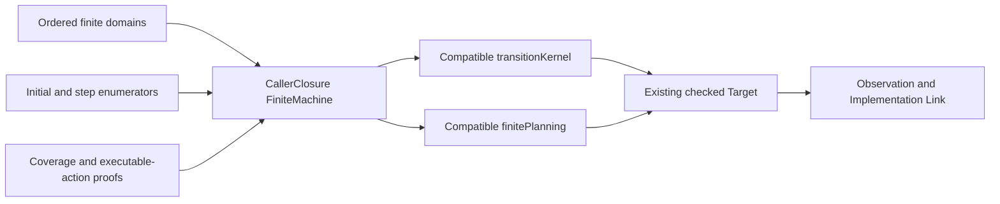

# Migrate System CallerClosure to FiniteMachine

## Overview

Replace the remaining hand-built Temporal System Nexus CallerClosure `TransitionKernel`, complete behavior domain, and finite planning proof with the existing `FiniteMachine` adapter. Keep every public semantic declaration and proof seam source-compatible so Observation, Implementation Link, Run Evaluation, and artifacts see the exact same checked Target.

This is a focused readability refactor. The finite enumerators become the single authority and the adapter derives the kernel and planning plumbing already proven by the ordinary Feature and System lifecycle targets.

## Goal & Context
<!-- scope: business -->

Developers reading CallerClosure should see its finite setup, states, action, result, and observations directly rather than re-deriving them from a long hand-written kernel proof. End users and operators receive no change to the caller-closure example, runtime evidence, results, or artifacts.

## Architecture & Data Models
<!-- scope: technical -->

CallerClosure defines explicit ordered domains, canonical encoders, initial-state enumeration, and transition enumeration in one `FiniteMachine`. The existing `authoritativeInitial`, `authoritativeStep`, `transitionKernel`, finite-planning, target-definition, target-authoring, and checked-target names remain public compatibility projections over that machine. A compatibility kernel preserves the current definitional domain equalities and authority conjunctions instead of exposing the adapter's list-membership representation; its soundness, completeness, and planning obligations are transported from the machine across those equivalent views.



The existing direct `TransitionKernel` route remains available elsewhere as the expert path. This spec migrates one complete finite family and adds no adapter or target-authoring abstraction.

## API Contracts
<!-- scope: technical -->

- `finiteMachine` enumerates exactly the current setup, open/closed states, force-close action, upgraded outcome, and three observations in their current order.
- Its initial-state and step functions return exactly the current lists for valid and invalid inputs. Canonical encoders reproduce the established complete behavior description and fingerprint.
- `authoritativeInitial` and `authoritativeStep` retain their existing signatures and truth conditions. Existing callers do not need to unfold `FiniteMachine`.
- `transitionKernel` retains its existing type, metadata, domains, enumerators, authority, completeness, and behavior description through a compatibility wrapper whose domains and authority predicates reduce to the current equalities and conjunctions. Existing `change` and `rcases` proof consumers remain definitionally valid while the wrapper transports soundness and completeness from the machine.
- `finitePlanning`, `targetDefinition`, `targetAuthoring`, and `target` preserve the existing action order, providers, capabilities, source provenance, Definition identities, and checked output.

## Approach

1. Express the existing finite domains and enumerators through `FiniteMachine`, using the lifecycle migrations as the exact pattern.
2. Rebind the public kernel, authority, planning, and target declarations without changing their names or comments, retaining the current definitional proof shapes through a compatibility kernel rather than directly exposing list membership.
3. Pin source compatibility with compile-time tests for the existing equality/conjunction `change` and `rcases` forms, then pin target identity, planner output, Implementation Link behavior, Run Evaluation output, and artifact fingerprints.
4. Run focused Temporal, aggregate Umpire, exact regression, trust/import, and lint gates.

## Edge Cases & Constraints
<!-- scope: technical -->

- The sole valid setup yields only the open state; any other setup yields no initial state.
- Only open state plus force-close action yields the existing close result. Closed state, wrong values, or any other state/action pairing yields no result.
- Domain order and encoder output are identity-sensitive and cannot be normalized, reordered, generalized, or inferred from metadata.
- All completeness, coverage, and executable-action obligations remain proof-carrying; no axiom, native-decision default, unchecked availability, or partial kernel is introduced.
- Existing public aliases, theorem rewrite points, comments, source paths, canonical behavior strings, IDs, providers, capabilities, Model Trace, planner result, fingerprints, artifacts, and generated views remain unchanged.
- Existing Implementation Link proofs that reduce setup/state/action domains to equalities and authorities to conjunctions must compile without representation-specific rewrites at their call sites.
- No physical CallerClosure split, Feature-model change, Observation mapping change, Implementation Link redesign, or new finite-machine API is in scope.
- The finite domains are constant-size. At ten times the modeled domain, behavior remains the adapter's existing finite enumeration and checking cost; no cache or index is added.

## Quick commands

```bash
cd model && mise exec -- lake build Temporal.System.Nexus.Tests Temporal.System.Nexus.ImplementationLinkTests Temporal.ImplementationLinkTests.Nexus
cd model && mise exec -- lake build TemporalModelTests TemporalExperimentalTests UmpireTests
make umpire-check-regression
make lint-model
make lint-code
```

## Acceptance Criteria
<!-- scope: both -->

- **R1:** System CallerClosure exposes one `FiniteMachine` whose ordered domains, encoders, initial states, steps, coverage proofs, and executable-action proof reproduce the existing complete finite semantics. Errors: omitted/reordered domain members, colliding encodings, uncovered results, non-executable advertised actions, invalid setup/state/action admission, or proof incompleteness fails compilation or target checking.
- **R2:** Existing `authoritativeInitial`, `authoritativeStep`, `transitionKernel`, and finite-planning APIs remain source-compatible projections with identical truth conditions, enumerator order, metadata, behavior description, and definitional equality/conjunction proof shapes. The compatibility kernel transports the machine's soundness, completeness, and planning proofs without forcing existing `change`/`rcases` consumers onto list membership. Errors: any former valid rewrite/caller failing, invalid pairing becoming admitted, or a changed kernel/planning value fails focused compile-time compatibility tests.
- **R3:** `targetDefinition`, `targetAuthoring`, and checked `target` retain exact IDs, source provenance, definitions, capabilities, providers, Model Trace behavior, planner result, canonical JSON, and Behavior Fingerprint. Errors: target-check diagnostic drift, declaration/order loss, identity drift, or artifact/checksum drift blocks completion.
- **R4:** Feature correspondence, System Observation, Implementation Link, composed Run Evaluation, and caller-closure regression consumers compile and produce their current results without direct dependency on the new representation. Errors: source/Feature trace drift, mapping failure, changed Evidence Link, changed semantic verdict/status, or a new cross-layer import fails completion.
- **R5:** Focused compatibility tests, aggregate model builds, exact regressions, trust/import checks, documentation review, and lint prove the migration is semantic-only. Errors: lost comment, stale direct-kernel claim, new axiom/trust dependency, warning, lint failure, generated drift, or unrelated file change blocks completion.

## Early proof point

Task `.1` proves the current CallerClosure kernel and finite planning can be reproduced exactly by the existing adapter while retaining public authority aliases and the definitional equality/conjunction forms consumed by Implementation Link proofs. If direct delegation exposes list membership, use the compatibility kernel and transport the adapter proofs before touching downstream correspondence code. If the target fingerprint or enumerator order changes, reconsider the domain/encoder projection before touching downstream correspondence tests.

## Boundaries
<!-- scope: business -->

- No new Target, FiniteMachine, Planning, Query, Property, Behavior, Observation, Space, or Implementation Link semantics.
- No change to CallerClosure Model Values, transition meaning, runtime evidence, source provenance, canonical identities, or artifacts.
- No migration of another target family and no removal of the direct expert `TransitionKernel` path.
- No CallerClosure module split, facade redesign, generated-code edit, or runtime change.

## Decision Context
<!-- scope: both — conditionally substructured -->

`FiniteMachine` is already the ordinary deep module for complete finite Targets: authors provide ordered finite meaning and proof obligations, while it hides repetitive kernel-domain and planning construction. CallerClosure meets that contract exactly and is the remaining high-value manual kernel.

Retain compatibility projections instead of hard-renaming public declarations because the Observation and Implementation Link layers use those semantic names as stable proof seams. Reject extending the adapter in this spec; the current machine contract is sufficient and already exercised by multiple lifecycle targets.

Keep this migration separate from the completed FiniteMachine introduction and from broader ordinary-authoring deepening. It validates reuse on a second System family and lets the later forward-simulation work consume the final target shape without reopening either predecessor.

## Requirement coverage

| Req | Description | Task(s) | Gap justification |
|-----|-------------|---------|-------------------|
| R1 | FiniteMachine representation and proofs | `.1` | — |
| R2 | Source-compatible kernel and planning APIs | `.1`, `.2` | — |
| R3 | Checked Target identity compatibility | `.2` | — |
| R4 | Cross-layer consumer compatibility | `.2` | — |
| R5 | Complete verification and comment preservation | `.1`–`.3` | — |

## References

- Umpire 4 rules MOD-06 through MOD-08, AUT-01 through AUT-03, and AUT-07.
- Lean Authoring Guidelines sections 2, 4, 5, and 6.
- The completed FiniteMachine authoring specification defines the adapter and preserved expert path.
- The ordinary Feature and System lifecycle migrations define the compatibility pattern reused here.
