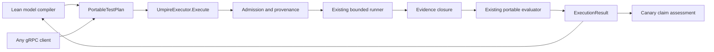

# Caller-neutral gRPC portable test plans

## Overview

Introduce one caller-neutral, fully typed `PortableTestPlan` protobuf that contains both the bounded execution program and the verification program for one exact test. Any gRPC client may author and submit a plan. Lean becomes the first model compiler into this format, not its exclusive authoring authority.

This is the successor execution interface to fn-28. Fn-28 remains the historical proof of a Lean-compiled `EvaluationContract`, generic Go evaluation, a deep resident executor, and protobuf-over-HTTP transport. The new interface reuses those semantics and modules while replacing the caller-facing opaque artifact envelope with one self-contained typed plan and a unary gRPC operation. Fn-29 consumes a pinned Lean-generated plan through this interface for production canary execution.

## Goal & Context
<!-- scope: business -->

Canaries and other callers need a stable language-neutral contract that says both what to do and what to verify. Requiring callers to assemble a Lean-produced evaluation contract plus opaque JSON execution artifacts makes the real interface difficult to understand, implement in another language, and govern as one versioned protocol. Requiring Lean as the only author also prevents purpose-built clients from expressing bounded plan-local tests.

The new contract makes the submitted plan authoritative for its exact execution and verification. A non-Lean-authored plan can establish only plan-local conformance. A plan compiled from the Behavior Model may additionally support model-bound claims when its provenance is independently validated. Lean may retain richer verification outside the portable vocabulary; those obligations remain explicit and cannot be mistaken for checks performed by the Go executor.

Affected stakeholders are developers producing plans in Lean or other languages, maintainers of the Go executor and model compiler, and operators feeding pinned plans to canaries. There is no direct end-user interface. Production authorization, target selection, fencing, recovery, and publication remain owned by fn-29.

Version one is an internal experimental contract rather than a public compatibility promise. Fn-52 is complete when a generic generated gRPC client proves both external plan-local and validated model-bound behavior against disposable local execution. Production canary consumption is a downstream fn-29 concern and does not gate fn-52 completion.

## Architecture & Data Models
<!-- scope: technical -->



`PortableTestPlan` is a closed, versioned protobuf value with exactly these top-level concerns:

- format version, plan identity, deterministic checksum, and provenance;
- a typed execution program containing setup, participants, symbolic/runtime bindings, preconditions, ordered actions, requested faults, checkpoints, termination, and cleanup obligations;
- a typed verification program containing admitted Evidence sources and fields, correlation and causal/source-local ordering, explicit source closure, trace construction, an explicit trace projection, Property clauses, and the fixed version-one decision policy;
- fresh nested structural, execution, Evidence, evaluation, and output Limits;
- Known Gaps and external verification obligations.

The plan contains no opaque serialized sub-artifacts, arbitrary executable, callback, shell command, regex engine, registry lookup, target endpoint, credential, trust anchor, environment selector, or extension hook. Runtime-specific identifiers are resolved only through declared typed binding slots by the executor's configured adapter. The plan cannot broaden the adapter's capabilities or repository hard maxima.

The version-one execution and verification vocabularies are finite. The execution schema retains the complete typed `ExperimentSpec`/`DrivePlan` and `RuntimeConfiguration` meanings already exercised by the bounded runner. Its list-shaped fields preserve those meanings, while version-one admission supports exactly the runner's current executable subset: one participant binding, one ordered occurrence and requested action, zero or one requested fault, and the fixed `preparation`, `realization`, `observation`, `isolation`, and `cleanup` phases. A later additive revision may support broader cardinalities; version one rejects rather than ignores them.

Verification reuses the fn-28 Evidence, Observation, trace, Implementation Link, Property, closure, and decision operators. `VerificationProgram.trace_projection` is a required oneof with exactly two variants: `direct_plan_trace` declares that Property clauses use the observed trace unchanged, while `rename_exact_link` applies the existing exact model-value mapping first. These are not separate evaluators: both follow `Evidence -> observed trace -> trace projection -> Property evaluation`, with direct projection acting as the identity operation. The explicit choice distinguishes an intentional direct check from an accidentally omitted link. Adding or changing an operator requires a new compatible minor revision or incompatible major version according to protobuf compatibility rules; unknown behavior-affecting fields, enums, and operators fail closed.

Provenance has two closed variants:

- `external`: the plan is authoritative only for its own plan-local execution and verification;
- `model_compiled`: the plan carries exact Test, Query, ExperimentSpec, RuntimeConfiguration, Property, Definition ID, Behavior Fingerprint, compiler-contract, and source bindings required to correlate it with one checked model input.

The protocol does not define a digital signature, key identifier, issuer, embedded trust proof, or caller-supplied validity claim. The language used by a caller never determines authority. For a model-compiled plan, the executor host's independently configured provenance verifier receives the admitted plan checksum and exact model/compiler bindings and compares them with trusted host configuration, including any host-owned validity window. Fn-29 additionally pins the expected plan checksum. Missing, invalid, expired, unsupported, or crossed trusted configuration rejects the model-bound request before runtime I/O and is never silently downgraded. An external plan needs no model provenance and receives an explicit `plan_local` result scope.

Lean lowering produces the same typed plan that other clients may construct. Every portable check is distilled into the verification program. A check outside the finite vocabulary becomes an explicit external verification obligation. An obligation marked required prevents a complete model-bound result until a separately trusted verification receipt is joined above this interface; it does not claim that the executor performed the check. Plan-local evaluation remains limited to the bundled portable clauses and always reports unresolved obligations and Known Gaps.

Decoded protobuf values, rather than raw gRPC wire encodings, are the canonical identity seam. Admission recursively rejects unknown fields and enum values, validates all cross-bindings and Limits, clears only `plan_checksum`, deterministically serializes the remaining value, and computes the checksum in the `umpire.portable-test-plan/v1` domain. All declared provenance bindings participate in this checksum. Semantically identical encodings from different conforming gRPC implementations therefore produce one identity; noncanonical field ordering on the transport is not an error.

`PortableTestPlanLimits` separates five independently enforced groups:

- structural admission: plan bytes, nesting depth, collection size, and operator count;
- execution: action/fault counts, phase attempts, per-phase duration, and total duration;
- Evidence: record and byte counts plus source closure;
- evaluation: expression depth, natural range, and charged work;
- output: diagnostic and complete result bytes.

The successor plan vocabulary lives in its own protobuf file, and the new service definition imports that file. The new file may import and reuse stable fn-28 leaf messages such as `DefinitionBinding`, `ModelValue`, and Evidence/Property vocabulary, but it does not add to or regenerate declarations in the legacy fn-28 message file. Its file descriptor, generated message types, request envelope, and checked fixtures remain byte-identical. Package-level descriptor sets may add the new files without rewriting the legacy file descriptor.

## API Contracts
<!-- scope: technical -->

The conventional Umpire `v1` protobuf package adds a separate service definition with one direct interface and no request or response wrapper:

```proto
service UmpireExecutor {
  rpc Execute(PortableTestPlan) returns (ExecutionResult);
}
```

The plan's top-level shape is:

```proto
message PortableTestPlan {
  FormatVersion version = 1;
  string plan_id = 2;
  bytes plan_checksum = 3;
  oneof provenance {
    ExternalPlanProvenance external = 4;
    ModelCompiledPlanProvenance model_compiled = 5;
  }
  ExecutionProgram execution = 6;
  VerificationProgram verification = 7;
  PortableTestPlanLimits limits = 8;
  repeated KnownGap known_gaps = 9;
  repeated ExternalVerificationObligation external_obligations = 10;
}
```

`ExecutionProgram` groups the exact query, behavior, target, kernel, role, symbolic-value, precondition, planned-trace, choice, variant, fault, capability, checkpoint, runtime-profile, participant-protocol, termination, and cleanup bindings. `RuntimeProgram` holds the authority-profile identity, participant/program binding, required capabilities, observation-configuration binding, and the five ordered phase Limits. The protobuf contains values and bindings only; the adapter owns all live runtime construction.

`VerificationProgram` has this closed outline:

```proto
message VerificationProgram {
  EvidenceProfile evidence = 1;
  ObservationProgram observation = 2;
  oneof trace_projection {
    DirectPlanTrace direct_plan_trace = 3;
    RenameExactLink rename_exact_link = 4;
  }
  repeated Property properties = 5;
  DecisionPolicy decision = 6;
}
```

`DirectPlanTrace` is an explicit empty marker, not an omitted field. `DecisionPolicy` has one supported version-one value and no caller-tunable pass/fail rules. `ExternalVerificationObligation` carries a stable definition identity, required-or-advisory classification, source, and bounded human-readable statement; it contains no callback or verifier location.

`ModelCompiledPlanProvenance` contains the exact Test and Query `DefinitionBinding`s, ExperimentSpec and RuntimeConfiguration `ArtifactBinding`s, the sorted Property bindings, compiler-contract binding, and canonical source locations. `ExternalPlanProvenance` contains only canonical authoring source locations. Neither message contains cryptographic material or trust configuration.

`ExecutionResult` contains the plan checksum, fresh run identity, provenance outcome (`external` or `model_verified`), claim scope (`plan_local` or `model_bound`), independent tooling/operational/Observation/trace-projection/Property/cleanup statuses, pass/fail/inconclusive decision, Evidence Links, work charges, Known Gaps, unresolved external verification obligations, and bounded diagnostics. Invalid model provenance never appears as a successful result outcome because it rejects before execution. `TraceProjectionResult` reports `direct` for identity projection or the existing applied/invalid/unknown/conflict/unsupported outcomes for exact rename projection without changing the legacy `ImplementationLinkStatus` enum.

The unary operation does not expose plan storage, listing, mutation, scheduling, environment selection, retries, arbitrary evaluation, or per-call options. The server assigns a fresh run identity only after structural and provenance admission. One executor remains single-flight and retains fn-28's `idle`, `active`, and permanently `poisoned` reuse semantics.

A decision applies only to the exact admitted plan and Evidence. It never implies model consistency, exhaustive coverage, compiler correctness, release eligibility, or authorization to deploy.

Admission deterministically constructs and sizes the minimum result envelope before runtime I/O. That envelope includes every mandatory plan-derived field, all Known Gaps and external obligations, the non-success status/decision skeleton, and one result-byte-limit diagnostic. A plan whose `max_result_bytes` cannot contain that envelope is rejected. Variable runtime Evidence Links, applications, clause results, work charges, and diagnostics are charged against the remaining result budget before append. If the next complete semantic result would exceed the budget, construction atomically discards partial semantic success, returns the reserved typed `inconclusive` result with the result-byte Limit diagnostic, and never truncates an accepted Evidence Link or returns a transport/internal error for ordinary Limit exhaustion.

gRPC status is reserved for failures that prevent an admitted execution result:

- `INVALID_ARGUMENT` for malformed structure, unknown fields or enum values, invalid checksum, duplicate identity, or crossed bindings;
- `FAILED_PRECONDITION` for unsupported versions/operators, unavailable or invalid requested model provenance, unmet adapter capabilities, or a poisoned executor;
- `RESOURCE_EXHAUSTED` for hard Limit violations or overlapping single-flight admission;
- `UNAUTHENTICATED` and `PERMISSION_DENIED` only for host transport policy, never for semantic plan decisions;
- `CANCELLED` or `DEADLINE_EXCEEDED` when the call ends before a result can be returned; and
- `INTERNAL` for a server invariant failure, with no fabricated semantic result.

After runtime dispatch, operational, evidence, verification, timeout, and cleanup failures are represented in the typed result whenever the transport remains available. Client cancellation never authorizes redispatch: the server completes bounded cleanup, but this spec adds no result store or recovery protocol. Production ambiguity and recovery remain fn-29 responsibilities.

The fn-28 HTTP endpoint, request envelope, fixture bytes, and results remain unchanged. There is no compatibility alias, transparent HTTP-to-gRPC reinterpretation, or removal in this spec. Both transports may share the deep executor implementation, but only the new gRPC interface accepts `PortableTestPlan`.

## Edge Cases & Constraints
<!-- scope: technical -->

- Empty plans, zero/unknown versions, unspecified provenance or trace-projection oneofs, duplicate IDs, invalid order graphs, unresolved bindings, crossed execution/verification identities, invalid checksums, unknown fields/enums/operators, nonpositive Limits, arithmetic overflow, and values beyond hard maxima fail before runtime I/O.
- Version one rejects a second participant, second ordered occurrence/action, second requested fault, missing/reordered execution phase, or any execution collection the current runner cannot execute completely. Schema breadth never implies runtime support.
- Direct trace projection preserves the observed trace and Evidence Links exactly. Rename projection must map every used value exactly once; missing, duplicate, contradictory, or cross-target mappings cannot fall back to direct evaluation.
- Execution and verification must be closed over the same exact plan identity. Evidence from another plan, run, source, binding, or post-closure record cannot satisfy a clause.
- Missing, ambiguous, conflicting, causally unrelated, unsupported, or unclosed Evidence cannot produce `pass`; trustworthy closed violations alone produce `fail`; every other admitted non-success is `inconclusive`.
- External authors cannot label a plan model-bound or convert plan-local conformance into a Behavior Model or Claim Assessment result. Model-bound scope comes only from an exact host-configured match of checksum and model/compiler bindings; the protocol accepts no signature, key, issuer, trust anchor, or caller-supplied expiry.
- Model-compiled plans with unsupported checks retain explicit external obligations. A required unresolved obligation prevents complete model-bound success; no obligation may be silently dropped during lowering or admission.
- Environment coordinates, credentials, authorization, and secrets never enter the plan, checksum diagnostics, or result. Adapters fill only contract-declared runtime slots and cannot change the modeled action or verification program.
- Exact Limit N is admitted and N+1 fails at the responsible pre-I/O or typed runtime stage. Structural, execution, Evidence, evaluation, and output budgets remain independent and are never substituted for one another. Work is charged before execution/evaluation.
- A result-byte Limit smaller than the mandatory result envelope rejects before I/O. Runtime N+1 output uses the reserved typed incomplete result atomically; it never truncates Evidence Links, leaks partial success, or becomes a fabricated transport failure.
- A 10x burst does not create a queue or parallel mutation: one request runs and overlapping calls receive `RESOURCE_EXHAUSTED` before runtime I/O. Fleet scheduling and horizontal scaling are separate modules outside this spec.
- A process crash or disconnected caller after dispatch may lose the response. Owned resources remain bounded by cleanup and server timeouts; callers must not automatically retry an unknown outcome. Durable recovery is delegated to fn-29.
- The gRPC adapter buffers one bounded plan and result. Streaming is intentionally excluded because one complete static plan must be admitted atomically before any side effect.

## Quick commands

```bash
make proto
cd model && mise exec -- lake build Temporal.Tool.PortableEvaluationContractTests
go test -count=1 -tags test_dep ./tools/umpire/testplan/... ./tools/umpire/executor/... ./tools/umpire/executorgrpc/... ./tools/umpire/portableevaluation/...
go test -count=1 -tags 'test_dep integration' ./tests -run '^TestUmpirePortableGRPCExecutor$'
make lint-model
make umpire-check-regression
make lint-code
```

## Acceptance Criteria
<!-- scope: both -->

- **R1:** Umpire's normative authority rules distinguish Behavior Model authority, portable plan authority, plan-local conformance, and independently validated model-bound claims. Lean is the first model compiler but not the exclusive plan author. Errors: an external plan being described as a Model Definition, unvalidated provenance producing model-bound scope, or runtime code inventing omitted semantics fails completion.
- **R2:** One versioned, fully typed, self-contained `PortableTestPlan` protobuf contains the complete execution and verification program, independent Limits, Known Gaps, obligations, identity, checksum, and provenance without opaque sub-artifact bytes or executable hooks. Its new declarations live outside the legacy fn-28 message file, and admission reserves a sufficient mandatory result envelope before I/O. Errors: missing lifecycle/closure data, unknown behavior-affecting data, crossed bindings, duplicate identity, invalid order, checksum mismatch, an undersized mandatory result envelope, N+1 Limit, or unbounded/open extension surfaces reject before runtime I/O.
- **R3:** Any conforming gRPC client can author and submit an external plan without Lean, Go-specific JSON, filesystem paths, or in-process callbacks and receives an explicit plan-local result. Model-compiled plans use the same message and gain model-bound scope only through independently validated provenance. Errors: caller language affecting behavior, caller-supplied trust anchors, forged/expired/missing/crossed provenance, or silent authority downgrade reject.
- **R4:** A generated unary `UmpireExecutor.Execute(PortableTestPlan) -> ExecutionResult` gRPC interface has deterministic message identity, bounded request/result handling, canonical status mapping, cancellation behavior, and no semantic/environment override surface. Errors: malformed or unknown input, unsupported versions/operators, busy/poisoned state, auth failure, Limit exhaustion, pre-result cancellation/deadline, and internal failure map to their specified gRPC statuses without fabricated results.
- **R5:** The resident executor executes the typed program through the existing bounded runner, closes and normalizes Evidence, and evaluates the bundled program through the existing portable evaluator while retaining all independent stage statuses and complete Evidence Links. Result construction charges variable output before append and atomically returns the reserved typed incomplete result on N+1 bytes. Errors: a second evaluator, phase orchestration by callers, wall-clock absence, post-closure Evidence, truncated Evidence Links, partial semantic success after result overflow, untrustworthy violation, incomplete cleanup, or any non-success mapped to `pass` fails completion.
- **R6:** Admission and execution remain fail-closed and resource-bounded under malformed plans, adversarial nesting/cardinality, 10x concurrency, cancellation, crash, ambiguous dispatch, and cleanup uncertainty. Errors: dispatch before full admission/provenance validation, automatic retry, queued overlap, cross-run adoption, secret/endpoint/credential ingestion, or executor reuse after uncertain cleanup fails completion.
- **R7:** Lean deterministically lowers checked Tests into `PortableTestPlan`, preserving exact ExperimentSpec and model bindings for existing identity consumers, and proves parity between Lean and Go for every portable operator and decision branch. Unsupported Lean checks become explicit external obligations rather than silently disappearing. Errors: changed model meaning, changed retained ExperimentSpec identity, approximate lowering, missing obligations, or unsupported checks contributing to local/model-bound success fails completion.
- **R8:** Fn-28's legacy protobuf file descriptor, generated message types, HTTP contract, checked fixtures, and historical acceptance remain byte-identical and operational while the new gRPC plan and service live in separate protobuf files as a versioned successor interface. Errors: extending the legacy message file, rewriting fn-28 history, accepting old envelopes as new plans, compatibility aliases, fixture drift, or removal of the HTTP proof fails completion.
- **R9:** This protocol is the required downstream seam for fn-29, which will feed its canary a pinned, provenance-validated Lean-generated `PortableTestPlan` through gRPC while retaining its closed workflow entry, public-Temporal-gRPC runtime profile, production authorization, fencing, cleanup, recovery, and publication ownership. Fn-52 documents and preserves that boundary but does not implement or prove production canary consumption. Errors: arbitrary production plan selection, caller semantic overrides, confusing executor ingress with Temporal target access, or moving canary policy/credentials into reusable Umpire fails completion.
- **R10:** Focused schema, admission, authority, execution, parity, gRPC, integration, mutation, compatibility, and documentation checks prove external authorship, trusted model compilation, exact N/N+1 bounds, status/scope separation, and generated-client disposable-local execution. Errors: generated-code drift, stale architecture claims, missing non-Lean fixture coverage, or omitted aggregate lint/regression commands fails completion.

## Early proof point

Task fn-52-caller-neutral-grpc-portable-test-plans.2 proves that one externally authored plan and one Lean-shaped model plan can be represented by the same closed typed schema, receive stable identities across equivalent protobuf encodings, and be rejected before I/O on every authority or structural mutation. If that proof cannot avoid opaque artifacts or caller-language assumptions, re-evaluate the unified plan before executor or canary integration continues.

## Boundaries
<!-- scope: business -->

- No arbitrary code, dynamic plugins, registry-selected operators, remote checker invocation, or generic workflow language.
- No plan repository, list/get/update methods, queue, scheduler, fleet manager, streaming protocol, persistent result store, or automatic retry.
- No production credentials, target selection, approval, fencing, recovery, publication, rollout, remediation, rollback, or release authorization; fn-29 owns those concerns.
- No public API or compatibility commitment for the internal experimental version-one service.
- No requirement that fn-29 production canary work complete before the local caller-neutral contract is accepted.
- No removal, migration, or semantic reinterpretation of fn-28 HTTP requests or artifacts.
- No claim that external plan conformance is Behavior Model validity, and no model-bound success without independently validated provenance and complete required verification.
- No requirement that every Lean proof be portable; nonportable obligations remain explicit and are verified above this interface.

## Decision Context
<!-- scope: both -->

### Motivation
<!-- scope: business -->

One typed plan is the smallest understandable contract for feeding a canary both instructions and checks. Caller neutrality matters because gRPC and protobuf should define the interface, while Lean remains a valuable producer and verifier rather than a mandatory runtime or exclusive plan author. The first milestone is an internal generated-client proof over disposable local execution; production authorization remains a separate downstream decision.

### Implementation Tradeoffs
<!-- scope: technical -->

Create a new successor spec instead of rewriting fn-28 because fn-28's completed HTTP proof and fixtures are useful compatibility evidence. Keep the protocol reusable rather than placing it in fn-29, where production-only authorization and recovery would contaminate the interface. Reject a gRPC wrapper around the old byte envelope because opaque JSON artifacts would preserve the current ambiguity and would not permit genuine non-Lean authoring.

Unary buffering trades streaming scalability for atomic admission and simpler crash semantics; hard size and duration bounds make that acceptable for one canary Test. Retaining single-flight execution rejects burst load rather than adding scheduler complexity. A closed operator vocabulary limits expressiveness but keeps non-Lean plans safe, portable, deterministic, and testable.

Retaining the complete list-shaped execution model preserves the existing artifact meaning, while strict version-one cardinalities avoid pretending the current runner supports broader orchestration. An explicit direct-or-rename trace projection avoids redundant identity mappings without turning a missing link into implicit semantics. Fresh nested Limit messages keep new plan admission understandable without changing fn-28's `EvaluationLimits` contract.

Model provenance validation adds one narrow host seam instead of a new cryptographic protocol. Exact checksum and compiler/model binding comparison is sufficient for the internal executor and fn-29's pinned-plan handoff; host-owned validity and trust configuration stay outside the semantic plan.

## References

- Umpire4 specification authority, Artifact, Evidence, and claim rules.
- Fn-19 bounded local Temporal execution and runner lifecycle.
- Fn-20 canonical Run Evaluation.
- Fn-28 portable evaluation contract and resident HTTP executor.
- Fn-29 bounded production canary execution and qualification.
- Fn-30 release evidence graph compatibility requirements.

## Requirement coverage

| Req | Description | Task(s) | Gap justification |
| --- | --- | --- | --- |
| R1 | Reconcile plan and model authority | fn-52-caller-neutral-grpc-portable-test-plans.1 | — |
| R2 | Define the complete typed plan and identity | fn-52-caller-neutral-grpc-portable-test-plans.2 | — |
| R3 | Support external and validated model authorship | fn-52-caller-neutral-grpc-portable-test-plans.2, fn-52-caller-neutral-grpc-portable-test-plans.3, fn-52-caller-neutral-grpc-portable-test-plans.5 | — |
| R4 | Expose the unary gRPC contract | fn-52-caller-neutral-grpc-portable-test-plans.2, fn-52-caller-neutral-grpc-portable-test-plans.6 | — |
| R5 | Reuse the bounded runner and portable evaluator | fn-52-caller-neutral-grpc-portable-test-plans.4 | — |
| R6 | Enforce failure, resource, crash, and concurrency bounds | fn-52-caller-neutral-grpc-portable-test-plans.3, fn-52-caller-neutral-grpc-portable-test-plans.4, fn-52-caller-neutral-grpc-portable-test-plans.6 | — |
| R7 | Compile Lean plans and retain explicit obligations | fn-52-caller-neutral-grpc-portable-test-plans.5 | — |
| R8 | Preserve the fn-28 compatibility surface | fn-52-caller-neutral-grpc-portable-test-plans.2, fn-52-caller-neutral-grpc-portable-test-plans.6 | — |
| R9 | Preserve the downstream fn-29 gRPC boundary without implementing production canary consumption | fn-52-caller-neutral-grpc-portable-test-plans.6 | — |
| R10 | Prove and document the complete interface | fn-52-caller-neutral-grpc-portable-test-plans.1, fn-52-caller-neutral-grpc-portable-test-plans.2, fn-52-caller-neutral-grpc-portable-test-plans.3, fn-52-caller-neutral-grpc-portable-test-plans.4, fn-52-caller-neutral-grpc-portable-test-plans.5, fn-52-caller-neutral-grpc-portable-test-plans.6 | — |

## Resolved via Codebase

- The existing checked runner currently admits exactly one target, one requested action, one occurrence, one participant, zero or one fault, and five fixed execution phases (`tools/umpire/runtime/request.go:46`, `tools/umpire/runtime/request.go:54`, `tools/umpire/runtime/request.go:61`, `tools/umpire/runtime/request.go:69`, `tools/umpire/runtime/request.go:115`, `tools/umpire/runtime/request.go:177`).
- Fn-28 already implements one Observation-to-Implementation-Link-to-Property pipeline; direct projection belongs as an identity projection inside that evaluator rather than as a second evaluator (`tools/umpire/portableevaluation/evaluator.go:100`, `tools/umpire/portableevaluation/evaluator.go:110`, `tools/umpire/portableevaluation/evaluator.go:120`).
- The current exact-rename validator requires a link and forbids identical source and destination targets, so successor direct mode needs its own explicit marker/result rather than a fabricated identity rename (`tools/umpire/evaluationcontract/validate.go:563`, `tools/umpire/evaluationcontract/validate.go:583`).
- Runtime endpoints, credentials, and live construction already sit behind the adapter and fixed local authority rather than in the semantic request (`tools/umpire/runner/runner.go:83`, `tools/umpire/temporal/local/profile.go:30`).
- The legacy Umpire protobuf already owns `EvaluationContract`, `EvaluationResult`, `ExecuteRequest`, and `ExecuteResponse`; successor declarations can reuse stable leaf vocabulary from a separate file without changing those declarations (`proto/internal/temporal/server/api/umpire/v1/message.proto:328`, `proto/internal/temporal/server/api/umpire/v1/message.proto:569`, `proto/internal/temporal/server/api/umpire/v1/message.proto:593`).
