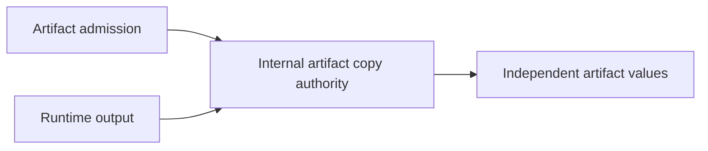

# Centralize Umpire artifact copies

## Overview

Consolidate Umpire's duplicated defensive-copy logic into the internal package that owns the artifact value model. Artifact admission and runtime output keep their existing immutable value semantics, while callers stop knowing how nested artifact fields must be copied.

## Goal & Context
<!-- scope: business -->

Umpire's artifact and runtime packages independently copy the same execution and Evidence graphs, and the artifact package also carries the rest of the artifact-model copy implementation. This duplicates representation knowledge, makes additions easy to miss, and leaves two packages responsible for one invariant.

The change is for Umpire Go maintainers. End users and operators receive no new command, configuration, format, behavior, performance contract, or deployment responsibility.

## Architecture & Data Models
<!-- scope: technical -->

The internal artifact-model package becomes the sole authority for deep-copying its root documents and nested mutable values. It exposes only cohesive root-level copy operations needed by artifact admission and runtime output; leaf pointer, slice, provenance, Known Gap, and plan copying remains hidden inside that package. Artifact-specific set-member and admitted-closure composition remains owned by the artifact package.



No artifact type, field, ordering rule, serialized representation, checksum preimage, or data-flow stage changes. The internal dependency remains one-way: artifact and runtime may depend on the internal artifact model, while the internal package must not import either caller.

## API Contracts
<!-- scope: technical -->

- Existing public artifact and runtime constructors, accessors, return types, diagnostics, and error precedence remain unchanged.
- Each internal root copy operation is a total value transformation over the schema-valid artifact domain: it returns the same scalar values and preserves nil versus empty collections, nil pointers, zero values, element order, and all nested mutable storage without sharing backing storage with the source.
- Raw Evidence field values admitted by the schema are immutable scalars only: nil, Boolean, string, or canonical integer `json.Number`. Constructors retain copies of all caller-owned mutable inputs in this admitted domain, and every accessor returns a value independent from both retained state and other accessor results.
- Admitted closures retain their original encoded bytes. Copying cannot decode, re-encode, normalize, validate, or recompute canonical bytes or checksums.

## Edge Cases & Constraints
<!-- scope: technical -->

- Tests cover nil and empty collections separately, zero-valued documents, every nested pointer and slice family, all four admitted Raw Evidence field-value types, repeated access, and mutation of both constructor inputs and returned values.
- Programmatically constructed Raw Evidence field values outside the admitted scalar domain, including maps, slices, pointers, and custom types, remain invalid inputs outside the copy-isolation guarantee. The refactor neither starts accepting or rejecting them at runtime construction nor adds generic copying for them.
- Malformed, crossed, unsupported, noncanonical, or otherwise invalid artifacts continue to fail at the same admission stage with the same diagnostic classification and precedence; the copy layer adds no errors or recovery behavior.
- Explicit type-aware copying is retained. Reflection, serialization round trips, unsafe aliasing, generated copy code, and a generic public copy framework are excluded.
- Copying remains linear in the mutable artifact graph and adds no traversal, normalization, synchronization, cache, or persistent state. At ten times current input size, asymptotic work and allocation behavior remain equivalent to the existing implementation.
- A process crash leaves no new recoverable state. Out-of-memory behavior remains the existing Go allocation failure mode.
- No network, credential, trust, authorization, or broader information-flow surface is introduced.
- Every existing comment in changed code is preserved; comments move only with the logic they describe and are updated only if ownership wording would otherwise become false.

## Scope

- Establish one cohesive internal defensive-copy implementation for all artifact-model roots currently copied by admission or runtime code.
- Replace artifact and runtime representation-specific copy implementations with that authority.
- Add direct internal copy-contract tests and retain caller-level immutability, canonical-byte, admission, and runtime regressions.

## Approach

1. Add root-level copy operations beside the internal artifact value model, composing private helpers for nested plans, provenance, Known Gaps, pointers, and slices.
2. Prove the copy contract directly across the complete schema-valid mutable graph, including nilness, zero values, admitted dynamic scalar types, and mutation isolation.
3. Make artifact admission and runtime output delegate to the internal authority, remove their redundant representation-copy code, and preserve artifact-specific closure composition.
4. Run focused package tests, the complete Umpire regression/live-test gate, formatting, and repository code lint.

## Quick commands

```bash
go test -count=1 -tags test_dep ./tools/umpire/internal/artifactv2 ./tools/umpire/artifact ./tools/umpire/runtime
make umpire-check-regression
make fmt-imports
make lint-code
```

## Acceptance Criteria
<!-- scope: both -->

- **R1:** The internal artifact-model package is the single defensive-copy authority for every artifact-model root and nested mutable value in the admitted schema domain currently copied by artifact admission or runtime output, with a small root-oriented interface and no reverse dependency on callers. Errors: an import cycle, a caller-visible leaf-copy API, or retained representation-specific clone implementation in artifact or runtime blocks completion; there is no new runtime error surface.
- **R2:** Copy-on-input and copy-on-output semantics remain complete for schema-valid artifact values: caller mutation cannot change retained state, and mutation of one returned value cannot change retained state or another returned value. Raw Evidence field values retain the admitted immutable domain of nil, Boolean, string, and canonical integer `json.Number`; unsupported composite dynamic values remain invalid and outside this guarantee. Errors: nil becoming empty, empty becoming nil, zero-value drift, element reordering, pointer aliasing, slice backing-array aliasing, an admitted scalar value changing type or value, or any uncovered schema-valid mutable descendant blocks completion.
- **R3:** Artifact admission, execution closure, runtime output, canonical bytes, checksums, diagnostics, and failure precedence remain behaviorally identical. Errors: malformed, crossed, unsupported, noncanonical, or otherwise invalid input being accepted, rejected differently, or reaching a later stage; valid bytes being re-encoded or normalized; or any checksum or retained-byte change blocks completion.
- **R4:** The refactor removes duplicate representation knowledge and improves ownership and naming without changing public APIs, artifact schemas, generated outputs, dependencies, or documentation contracts, and all existing comments are preserved. Errors: a public signature change, lost or misleading existing comment, new third-party dependency, generated-file delta, README contract drift, new lint finding, or incomplete focused or aggregate regression coverage blocks completion.

## Early proof point

Task `.1` proves that the internal package can copy the complete schema-valid mutable artifact graph through a small root-level interface while preserving nilness, admitted Raw Evidence scalar types, and mutation isolation. If that requires caller-specific knowledge, a reverse import, exposed leaf helpers, or generic handling of invalid composite field values, reconsider the ownership seam before migrating artifact and runtime callers.

## Boundaries
<!-- scope: business -->

- No admission-flow, validation, error-taxonomy, runtime invariant, or semantic hardening change.
- No public API, artifact schema/version, canonical serialization, checksum, fixture, generated output, or Lean change.
- No refactor of admission-stage orchestration, runner, Run Evaluation, portable evaluation, executors, transports, or Temporal adapters.
- No preimplementation of planned replay, campaign, qualification, Veil compatibility, canary, or release functionality.
- No user-facing documentation change; existing package READMEs remain accurate.

## Decision Context
<!-- scope: both — conditionally substructured -->

The internal artifact-model package already owns the copied types, so it is the deepest stable module for the invariant. Moving all current artifact-model root copies there, rather than only the two duplicated runtime roots, keeps callers from retaining partial knowledge of nested representation and gives new mutable fields one copy authority and one direct test surface. Artifact-set member copying stays in artifact because it belongs to that package's admitted-closure representation rather than the shared artifact model.

Explicit type-aware copies preserve current linear work, nilness, and compile-time field visibility. Reflection, JSON round trips, code generation, and a generic cloning framework are rejected as more complex, less readable, or capable of changing error and byte behavior. Validation and hardening are deliberately separate because a behavior-neutral refactor must not smuggle acceptance or diagnostic changes.

The two tasks are sequential because caller migration consumes the internal copy surface. No Flow spec dependency edge is required: the scope changes no contract needed by open replay, campaign, qualification, or verification work.

## Open Questions

None. The copy boundary, compatibility requirements, failure cases, and verification gates are fixed by existing behavior.

## Requirement coverage

| Req | Description | Task(s) | Gap justification |
|-----|-------------|---------|-------------------|
| R1 | Single deep internal copy authority | `.1`, `.2` | — |
| R2 | Schema-valid mutation isolation and nil/zero/scalar preservation | `.1`, `.2` | — |
| R3 | Admission, byte, checksum, and diagnostic compatibility | `.2` | — |
| R4 | Duplication removal, stable contracts, comments, and verification | `.1`, `.2` | — |

## References

- Umpire 4 rules MOD-06 through MOD-08 require small cohesive interfaces, explicit component boundaries, and isolated testability.
- Umpire 4 rules SEM-01, SEM-11 through SEM-14, and EVD-01 through EVD-04 require behavior-neutral runtime plumbing, exact plan authority, and fail-closed Evidence handling.
- The completed caller-neutral portable-plan work established the artifact admission and runtime contracts preserved here.
- Project memory requires behavior-neutral refactors to keep hardening separate and aggregate Umpire regression gates to cover the complete live-test selector.
