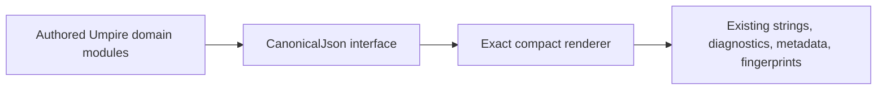

# Deepen authored Lean canonical JSON construction

## Overview

Consolidate duplicated handwritten JSON construction in the authored Lean Behavior Model behind the existing ordered `CanonicalJson` interface. This is an internal, behavior-preserving cleanup for model maintainers: public authoring interfaces, checked values, typed diagnostics, canonical bytes, Behavior Fingerprints, imports, and trust remain unchanged.

## Goal & Context

Maintainers currently have to understand and preserve several local combinations of quoting, arrays, optional values, source locations, and ordered object assembly. The cleanup should make `Umpire.Json` the single deep module for generic typed JSON construction and exact rendering while each domain module continues to own field names, field order, sorting, semantic projection, validation, and diagnostic precedence. End users and operations receive no new behavior, configuration, deployment, or migration surface.

## Architecture & Data Models



The seam is in-process and pure, so no adapter or dependency interface is warranted. Domain modules construct typed values through the shared interface; only `Umpire.Json` knows escaping and generic rendering mechanics. The external seam of every existing domain facade remains unchanged, and tests exercise observable strings, diagnostics, and fingerprints through those facades.

## API Contracts

- The `CanonicalJson` interface supports the typed values required by existing authored formatters: null, string, natural, boolean, array, ordered object, and optional-as-null construction.
- Object fields retain caller-supplied order. Arrays retain caller-supplied elements, duplicates, and order. Domain modules remain solely responsible for any existing canonical sorting or deduplication before construction.
- Existing compact, pretty, exactly-one-terminal-LF, and semantic-comparison formatters retain their names, types, and outputs.
- Existing public domain formatters, including Core limit rendering, checked constructors, diagnostic renderers, checked record shapes, and facade imports retain their names, types, visibility, and behavior.
- Typed construction is total and cannot represent malformed JSON. The module does not parse, validate domain data, define schemas, select field order, or introduce a second wire format.

## Edge Cases & Constraints

- Exact compatibility includes field order, empty and nested objects/arrays, duplicate and ordered array elements, `null` versus omission, base-10 naturals, booleans, control-character escaping, U+2028/U+2029 handling, terminal-newline policy, source fields, typed diagnostic payloads and precedence, canonical metadata, Artifact bytes, and Behavior Fingerprints.
- The refactor must not add validation, hardening invariants, recovery, caches, parsing/re-rendering, sorting, or an additional semantic traversal. A discovered behavior change becomes separate work.
- At ten times the current declaration size, generic rendering remains linear in the emitted JSON size apart from sorting already owned by a domain module. There is no runtime I/O, distributed load, mutable state, crash recovery, or security boundary; failure is a Lean build, compatibility-test, import-lint, trust-audit, or performance-regression failure.
- Existing comments and docstrings move intact with changed declarations. Unrelated comments and documentation remain untouched.
- The work uses the existing Lean toolchain and dependencies. No third-party library, protocol, generated source, or runtime consumer is added.

## Quick commands

```bash
(cd model && mise exec -- lake build UmpireTests Temporal TemporalModelTests TemporalExperimentalTests)
make umpire-build-model
make umpire-check-regression
make lint-model
GOLANGCI_LINT_FIX=false make lint-code
```

## Acceptance Criteria

- **R1:** `Umpire.Json` provides one small typed construction and exact-rendering interface covering every generic JSON value shape needed by the scoped authored formatters; callers do not duplicate quoting, array joining, optional/null encoding, or ordered-object punctuation. Errors and boundaries: malformed JSON is unrepresentable; empty/nested values, booleans, naturals, control characters, U+2028/U+2029, and supplied field order are covered; no new runtime error surface exists.
- **R2:** Core limit rendering, Target, Behavior, Query, Space, Exploration, Observation, and Implementation Link use the shared construction interface for their scoped handwritten canonical metadata and diagnostic rendering while retaining domain-owned field selection, ordering, canonical sorting, validation, and error precedence. Errors and boundaries: a domain that cannot migrate without changing an existing public interface or semantic contract fails its task; it is not hidden behind a second compatibility wrapper or alternate helper family.
- **R3:** All existing observable canonical strings, typed diagnostic JSON, source coordinates, canonical metadata, persisted Artifact bytes, Behavior Fingerprints, and identity predicates remain byte-for-byte and value-for-value compatible. Errors and boundaries: any byte difference, reordered field/element, changed `null`, altered escaping/newline, diagnostic-precedence change, or semantic-only equality masking a byte change is a failure.
- **R4:** Existing public facades, declaration names and types, visibility, module ownership, import rules, trust baseline, and comments remain stable. Errors and boundaries: edits under `Umpire.Property`, generated Lean, protocol/generator code, or unrelated tests/docs; new `Temporal.*` imports under `Umpire.*`; new axioms or nonconstructive dependencies; public surface growth beyond the minimal typed JSON capability; and deleted or rewritten unrelated comments all fail acceptance.
- **R5:** The cleanup does not worsen asymptotic rendering or checking behavior and remains practical for declarations ten times the current fixture size. Errors and boundaries: parsing/re-rendering, caching, new sorting, extra semantic traversals, or a large-fixture regression is a failure; no load-related error surface exists beyond allocation/elaboration failure already present in pure Lean evaluation.
- **R6:** Direct domain compatibility tests, aggregate model builds, regression gates, complete import-graph linting, and repository linting cover the changed surface, and architecture/module documentation remains accurate. Errors and boundaries: a representative-only test is insufficient; every applicable existing suite and inherited-failure baseline must be selected, and unexpected pre-existing failures are reported without broadening the cleanup.

## Early proof point

Task 1 validates the core approach by proving the typed `CanonicalJson` interface can reproduce all required generic shapes, escaping, ordering, and large-value rendering without a new error or trust surface.
If it fails, reconsider centralizing these formatters behind `CanonicalJson` before starting any domain migration.

## Boundaries

- No product/model semantic, validation, diagnostic, Definition ID, Behavior Fingerprint, Artifact, or public authoring-interface change.
- No edits to `Umpire.Property` while fn-58 partitions that language.
- No generated `Temporal.API` or `Temporal.DynamicConfig` source, proto, generator, golden-output, drift-check, or CI workflow changes.
- No repeat of completed DSL package, helper-layer, test-suite, authoring-facade, Observation-evaluator, or generator-plan decompositions.
- No broad module reorganization, new language/facade, test-suite restructuring, toolchain/dependency change, or Temporal Feature/System ownership change.
- Private naming is improved only where the duplicate helper is removed or a domain projection becomes clearer; public names remain stable.

## Decision Context

Use the existing canonical JSON module as the deep implementation seam because it already owns typed ordered values and exact rendering, and every scoped dependency is pure and in-process. Keeping domain projection and sorting local avoids turning the shared module into a schema language. Preserving existing string-returning interfaces avoids a breaking migration for callers.

A repo-wide freeform cleanup was rejected as too broad and overlapping with completed and active Flow specs. An inventory-only spec or a dependency on fn-46 was rejected because the current code already supplies a concrete, cohesive duplication cluster and exact compatibility tests. Waiting for fn-58 was rejected because Property can be structurally excluded. Generated API drift verification remains declined per `.flow/memory/declined/generated-api-drift-verification.md`. The recent behavior-neutral-refactor lesson requires byte and diagnostic baselines before relocation and forbids validation hardening in this work.

Performance favors a single direct typed renderer over parse/re-render or generic schema machinery. Scalability is bounded by emitted JSON size plus existing domain sorting; there is no distributed-system or operational scaling effect. Complexity drops through one construction interface, while the cost is a carefully staged compatibility migration. Security does not change because no input, I/O, capability, or trust boundary is added.

## References

- Lean Authoring Guidelines: interface design, deep modules, comment preservation, trust auditing, and focused-to-aggregate verification.
- UMPIRE4: SCP-02, SCP-03, MOD-01, MOD-03, MOD-06, MOD-07, MOD-08, MOD-09, MOD-10, AUT-01, AUT-03, AUT-04, and PLN-02.
- Project memory: behavior-neutral refactors must not strengthen validation; full integration gates must select the complete migrated suite.

## Requirement coverage

| Req | Description | Task(s) | Gap justification |
|-----|-------------|---------|-------------------|
| R1 | Deep typed canonical JSON interface | Task 1 | — |
| R2 | Scoped Core/domain migrations | Tasks 1-6 | — |
| R3 | Exact compatibility | Tasks 1-6 | — |
| R4 | Stable facades, imports, trust, and comments | Tasks 2-7 | — |
| R5 | No rendering/checking scalability regression | Tasks 1-6 | — |
| R6 | Complete verification and accurate documentation | Task 7 | — |
