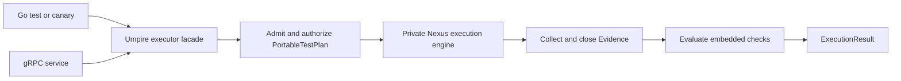

# Simplify the Umpire Go execution surface

## Overview

Replace the current caller-visible chain of artifact bindings, runner adapters, runtime authorities, participants, Evidence plumbing, and competing transports with one deep Go execution facade. A caller supplies an attached Temporal authority and the existing model-provenance verifier, then executes a protobuf `PortableTestPlan`; the same resident executor is hosted directly or behind the generated gRPC service and returns a protobuf `ExecutionResult`.

This is a deletion-oriented, behavior-preserving refactor. Evidence collection, participant execution, binding verification, eventual closure, and evaluation remain necessary implementation responsibilities, but become private to Umpire rather than concepts every test or service must assemble.

## Goal & Context
<!-- scope: business -->

The current prototype proves the required behavior but exposes too many intermediate abstractions. Developers must understand several packages and overloaded meanings of “binding” merely to run one generated test plan. The supported path should instead read as “construct executor, execute plan, inspect result,” while preserving the self-hosted disposable-cluster integration harness and the no-Lean canary decision path established by the caller-neutral gRPC work.

This spec runs after the artifact-copy and authored canonical-JSON cleanups so it can consolidate stable ownership and generated inputs instead of competing with those changes.

## Architecture & Data Models
<!-- scope: technical -->



The root Umpire package owns construction of the sole resident Nexus executor for an attached Temporal authority. The executor retains the existing single-flight lifecycle and exposes only the caller-neutral `Execute` method. Generated gRPC remains a transport wrapper over that exact interface, not a second execution implementation.

Runner admission, runtime slots, checked requests, authority construction, environment lifecycle, participants, Evidence accumulation, and output validation are consolidated under internal execution and Temporal adapter modules. Artifact and plan packages remain separate where they provide independently useful compilation/admission capabilities; the offline Run Evaluation tool also remains a separate supported capability.

## API Contracts
<!-- scope: technical -->

- The supported resident execution interface is `Execute(context.Context, *umpirev1.PortableTestPlan) (*umpirev1.ExecutionResult, error)`.
- Construction accepts the caller-owned attached Temporal authority and the existing independently configured model-provenance verifier. Umpire owns conversion of those inputs into environment, Nexus participant, runtime binding, and evidence machinery.
- Direct Go callers and the generated unary gRPC server use the same resident executor instance and therefore the same admission, single-flight, cleanup, poisoning, and evaluation behavior.
- Callers do not supply or receive artifact sets, generated input bindings, runtime authorities, checked requests, participants, raw Evidence, or adapter callbacks. Observable Evidence remains represented only through the admitted `ExecutionResult` fields and diagnostics.
- Failures before a result retain the existing portable error categories and canonical gRPC mappings. Admitted operational, semantic, cleanup, and canary outcomes remain typed fields in `ExecutionResult`.

## Edge Cases & Constraints
<!-- scope: technical -->

- Preserve plan admission and provenance verification before runtime I/O, including exact artifact/checksum/fingerprint equality, runtime-slot type checking, authority-capability closure, and existing failure precedence.
- Preserve one-active-run admission, overlap rejection without queueing, fresh run identities, cancellation/deadline propagation, detached bounded cleanup, and permanent poisoning after uncertain cleanup.
- Eventual runtime behavior remains bounded by the plan context and limits: execution returns only after the workload, source closure, evidence collection, cleanup, and evaluation reach the same terminal condition as today. The simplification must not replace these waits with sleeps or premature snapshots.
- The canary path remains independent of Lean at runtime. It evaluates the plan-carried checks against runtime Evidence using the Go evaluator.
- Typed-nil validation must continue to cover every nil-capable interface kind at retained boundaries. Invalid input or adapter state must fail before the same I/O boundary as today.
- This refactor must not add validation or hardening, change schemas or generated protobuf/Lean output, introduce a new transport, increase concurrency, add a fleet scheduler, or change trust policy. Newly discovered behavior defects become separate work.
- Existing comments and package documentation move intact with the code they describe; unrelated comments remain untouched.

## Quick commands

```bash
go test -count=1 -tags test_dep ./tools/umpire/...
go test -count=1 -tags 'test_dep integration' ./tests -run '^TestUmpirePortableGRPCExecutor$'
make umpire-check-regression
make fmt-imports
GOLANGCI_LINT_FIX=false make lint-code
```

## Boundaries
<!-- scope: business -->

- No protobuf, generated API, Lean model, Artifact vocabulary, or portable-plan semantic change.
- No replacement for gRPC, no HTTP compatibility layer, and no new network protocol.
- No production deployment, canary fleet, queue, autoscaling, environment selector, credential distribution, or multi-run concurrency.
- No redesign of the offline Run Evaluation, replay, exploration, or promotion semantics; later specs consume the simplified executor facade.
- No signature/key lifecycle or generated API drift CI work.
- No unrelated artifact, validation, naming, lint, or test-suite cleanup.

## Decision Context
<!-- scope: both -->

The existing `PortableExecutor.Execute` and generated gRPC service already form the correct deep seam, so the refactor promotes that contract instead of inventing another protocol. A root facade is preferable to exposing `runner.Adapter`: only the attached Temporal authority and provenance verifier are true caller-owned inputs. Bindings, participants, and Evidence are retained internally because they enforce real correctness boundaries, but package placement and construction stop making them part of normal developer workflow.

The legacy HTTP/`ExecuteRequest` resident path is removed rather than maintained as a compatibility layer because the generated gRPC `PortableTestPlan` path supersedes it and has the only repository-level caller. Existing generated proto messages may remain inert to keep this refactor schema-neutral. The interpreter may continue to use an internal evaluation-contract representation when that is the simplest compatibility-preserving implementation; it is no longer a caller-facing execution API.

Physical internalization is paired with removal of pass-through constructors, duplicate lifecycle owners, and obsolete tests. Merely moving the same abstractions behind an `internal` directory is insufficient. Conversely, rewriting the proven state machine solely to minimize line count is rejected: complexity reduction is measured by supported packages, caller imports, exported construction surface, duplicated orchestration, and deleted legacy paths while behavioral matrices remain intact.

Performance remains one resident process and one in-process execution pipeline per call; the refactor adds no subprocess or Lean startup. Scalability remains deliberately single-flight per resident executor, with multiple resident processes available to an external deployment if required later. Security and trust are unchanged because the caller-owned authority and host-configured provenance check remain mandatory and no new input or credential surface is introduced.

## Acceptance Criteria
<!-- scope: both -->

- **R1:** A direct Go test or canary constructs one resident Umpire executor from an attached Temporal authority plus the existing model-provenance verifier, then executes a `PortableTestPlan` through the sole `Execute` interface; generated gRPC hosts that same interface. Errors: nil/typed-nil or incomplete authority/verifier inputs fail before runtime I/O, and direct versus gRPC pre-result errors retain their established portable/gRPC classifications.
- **R2:** Normal execution callers outside `tools/umpire` no longer import or construct runner, runtime, local/Nexus adapter, artifact-set, evaluation-contract, portable-evaluator, binding, participant, checked-request, raw-Evidence, or output types. Errors: test-only fault injection remains possible inside Umpire package tests without reopening those types as a public execution seam.
- **R3:** Runner admission, runtime execution, Temporal environment/participant mechanics, Evidence closure, and portable evaluation live behind cohesive internal modules with one orchestration owner; pass-through constructors and duplicate lifecycle/evaluation ownership are removed rather than renamed. Errors: independently useful Artifact admission, portable-plan admission, gRPC transport, and offline Run Evaluation remain available and are not collapsed into the resident executor.
- **R4:** The legacy HTTP resident executor and non-portable `ExecuteRequest`/`ExecuteResponse` implementation have no serving code, tests, or documentation, and no second resident execution gate remains. Errors: generated legacy protobuf symbols may remain inert; the portable interpreter may retain an internal compatibility representation when required for byte-identical evaluation.
- **R5:** All current admission, provenance, runtime-slot, capability, single-flight, cancellation/deadline, cleanup-poisoning, source-closure, Evidence, evaluation, result-limit, and direct/gRPC status semantics remain exact, including eventual workloads that complete within plan limits. Errors: any changed failure precedence, I/O-before-rejection, premature Evidence snapshot, success after uncertain cleanup, or direct/gRPC parity drift fails acceptance.
- **R6:** The supported execution path has one documented package-level entry point and fewer caller-visible packages, exported construction types, and orchestration layers than the pre-refactor baseline, without increasing production Go lines in the migrated execution stack. Errors: pure file moves, compatibility wrappers for deleted APIs, new schemas/transports/dependencies, changed existing comments, or task-scoped lint regressions fail acceptance.

## Early proof point

Task `.1` proves that the root facade can construct the existing portable Nexus executor from only the true caller-owned inputs and serve the same object directly and over gRPC. If it cannot preserve provenance, lifecycle, and error behavior without leaking the adapter graph, reconsider the facade boundary before migrating callers or internalizing packages.

## References

- UMPIRE4 specification: caller-neutral portable plans, canary self-evaluation, bounded runtime execution, and exact Evidence/result authority.
- `fn-52-caller-neutral-grpc-portable-test-plans`: the protobuf plan/result and generated unary gRPC foundation promoted by this simplification.
- Project memory: behavior-neutral refactors must not strengthen validation; portable execution boundaries preserve typed slots, exact provenance/artifact equality, pre/post-dispatch classifications, typed-nil checks, and complete live-test selection.

## Requirement coverage

| Req | Description | Task(s) | Gap justification |
|-----|-------------|---------|-------------------|
| R1 | One root resident executor used directly and through gRPC | Task 1, Task 2 | — |
| R2 | Normal callers do not manipulate internal execution concepts | Task 2, Task 5 | — |
| R3 | Cohesive internal execution ownership | Tasks 3-5 | — |
| R4 | Obsolete HTTP and non-portable execution path removed | Task 6 | — |
| R5 | Exact execution and evaluation behavior retained | Tasks 1-7 | — |
| R6 | Measurably smaller supported surface and complete documentation/gates | Tasks 3-7 | — |
