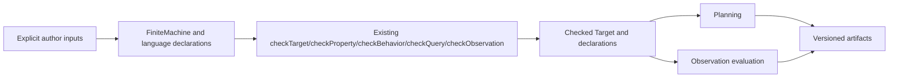

# Make ordinary Temporal model authoring approachable

## Overview

Reduce the Lean-specific ceremony required to author ordinary Temporal models while preserving Umpire's explicit semantics, checked declarations, stable identities, and single public authoring path. The work deepens the existing Target, Property, Behavior, Query, Observation, and Planning modules instead of introducing a new DSL or hiding model decisions.

## Goal & Context

The primary user is a Temporal engineer who knows general programming and basic Lean but should not need dependent-type, elaborator, or Umpire-internal expertise. Today the ordinary Nexus walkthrough still exposes repeated record assembly, dependent equality plumbing, copied identity/source data, positional Limits, repeated raw/check/proof declarations, and verbose Observation mappings. A successful authoring path reads like the Temporal behavior it describes, reports invalid declarations at their relevant source, and remains explicit about every state, Action, Model Outcome, Capability Contract, provider, Limit, fault, Known Gap, and unsupported case.

End users and operators receive no intended runtime, configuration, deployment, or product-behavior change. Their protection is compatibility: existing model meaning, generated execution, and fail-closed evaluation remain stable except where this spec intentionally makes source provenance or author-declared Known Gaps more accurate.

## Architecture & Data Models

The existing public languages and checked representations remain authoritative. New convenience is limited to deep constructors and adapters that produce the existing inert declarations or checked values.



Ordinary complete finite Targets continue through `Umpire.FiniteMachine`; expert independently specified relations continue through `Umpire.TransitionKernel`. Property, Behavior, Query, and Observation remain separate languages. Explicit provider and connector selection remains in Target composition. Model Outcomes remain Target-owned. Known Gaps become explicit checked model data that is composed with phase-owned gaps and carried to artifacts without becoming behavior.

## API Contracts

- Finite Target authoring groups routine assembly behind semantic constructors, but authors still supply ordered domains, encoders, enumerators, coverage evidence, Action executability evidence, providers, connectors, and metadata required by `Umpire.FiniteMachine` and `Umpire.checkTarget`.
- Finite planner-kernel derivation consumes an already checked finite Target or Query and hides representation equality transport. Missing finite completeness remains an explicit failure/absence; the adapter never invents enumeration or outcomes.
- Identity helpers retain explicit, stable dot-separated values and expected definition kinds. Source helpers capture the author-facing declaration location. Neither source order nor type-class search chooses identity or behavior.
- Named Query Limit construction exposes each stage and unit while producing the existing `QueryLimits` data and canonical serialization.
- Property/Behavior/Query helpers construct the existing declarations and delegate to the existing raw checkers. `checkedProperty`, `checkedBehavior`, and `checkedQuery` continue to require explicit evidence that those checkers succeed; no helper silently invokes `native_decide` or bypasses typed diagnostics.
- Transition-contract helpers produce existing Property clauses from explicit Action, resulting-state, Model Outcome, and observation patterns. They do not infer outcomes or create another Property language.
- Observation helpers produce existing profiles, rules, mappings, dispositions, ordering, and Evidence bounds. They preserve explicit field identity and fail-closed Evidence handling.
- Model-owned Known Gaps use the existing checked `KnownGap`/`KnownGapSet` vocabulary, remain non-behavioral data, and compose deterministically with phase-owned gaps through planning and artifact production.
- Existing lower-level constructors and raw checkers remain supported for advanced or invalid-declaration tests.

## Edge Cases & Constraints

- Incomplete finite domains, encoders that escape their declared domains, non-executable enumerated Actions, missing providers, conflicting providers without connectors, and duplicate or wrong-kind IDs continue to fail at the owning checker.
- Helper-produced failures retain the existing typed error kind, offending Definition ID, canonical related-ID order, and the closest author-facing source location; helper layers must not collapse diagnostics into generic errors.
- Existing public imports, Definition IDs, Behavior Fingerprints, canonical metadata, deterministic plans, and artifact bytes remain unchanged for behavior-neutral migrations. Intentional source-location corrections and newly authored Known Gaps may change source-bearing artifact checksums and their checked golden fixtures, but never Behavior Fingerprints by themselves.
- Declaration order and Lean instance search never select providers, connectors, outcomes, behavior, or Limits.
- The changes remain pure Lean, portable serializable data, and deterministic checking. No callbacks, registries, runtime I/O, credentials, concurrency state, new third-party dependencies, axioms, `sorry`, or `admit` are introduced.
- At ten times the current declaration volume, helpers add no asymptotically stronger traversal, duplicate normalization pass, global registry, or runtime work. Compile-time ergonomics must not weaken validation to improve elaboration speed.
- The Property-facing task starts only after the facade partition in `fn-58-partition-the-property-language` is complete and targets its frozen public facade rather than internal modules.

## Approach

1. Deepen ordinary finite Target assembly while retaining every explicit proof and semantic input, and prove the seam by migrating the Nexus lifecycle Target.
2. Move finite planner-kernel derivation behind the checked finite boundary so ordinary Temporal code no longer carries dependent equality or large `simp` proofs.
3. Add explicit Temporal-family identity/source helpers, named Query Limits, and conservative transition-result constructors without deriving meaning from source order.
4. Centralize the repeated checked Property/Behavior/Query journey and migrate the three ordinary Nexus operations.
5. Add typed Observation profile/rule/mapping constructors and migrate the ordinary Nexus Observation declaration with exact negative-case coverage.
6. Add checked model-owned Known Gap declarations and deterministic end-to-end propagation through planning and artifacts.
7. Publish a compiled ordinary-authoring walkthrough and update public module/architecture documentation and compatibility gates.

## Quick commands

```bash
cd model && mise exec -- lake build Umpire.TargetTests Umpire.Property.Tests Umpire.Behavior.Tests Umpire.Query.Tests Umpire.Observation.Tests Umpire.Planning.Tests Temporal.Feature.Nexus.LifecycleTests Temporal.Feature.Nexus.OperationsTests Temporal.Feature.Nexus.ObservationTests
make lint-model
```

## Acceptance Criteria

- **R1:** A checked ordinary-authoring walkthrough lets a developer with basic Lean knowledge define a complete finite Target, Property, Behavior, Query, plan, and Observation using documented public facades, with semantic choices visible in the authored code and no imports of internal, Experimental, runtime, or verification modules. Errors: the walkthrough includes representative invalid ID/reference, incomplete Target, invalid transition, and invalid Observation cases through the raw typed checkers; Markdown alone is not test evidence.
- **R2:** Ordinary finite Target authoring removes repeated structural assembly while retaining explicit ordered domains, encoders, enumerators, coverage and executability evidence, provider/connector selection, metadata, and final `checkTarget` validation. Errors: missing/duplicate/out-of-domain values, incomplete enumeration, non-executable Actions, missing capabilities, and unresolved competing providers fail with the established typed diagnostics.
- **R3:** An ordinary checked finite Target or Query can obtain its incremental planner kernel without author-written dependent equality transport, representation-specific unfolding, or a cleanup proof over Target internals. Errors: missing finite completeness or incompatible Target identity is reported explicitly and never falls back to an inferred or partial kernel.
- **R4:** Ordinary declarations use explicit family-scoped stable identities, author-facing source locations, and named per-stage Query Limits while producing the existing `DefinitionId`, `SourceLocation`, and `QueryLimits` contracts. Errors: malformed, wrong-prefix/wrong-kind, duplicate, or crossed IDs and zero/invalid Limits retain checker-owned typed errors at the relevant declaration; source order and instance search have no effect.
- **R5:** The common Property→Behavior→Query workflow and transition-result contracts require materially less repeated ceremony across the three ordinary Nexus operations while still producing the existing declarations, calling the existing raw checkers, requiring explicit checker-success evidence for checked values, and leaving Model Outcomes Target-owned. Errors: invalid clauses, missing capabilities, unsatisfiable Behavior, Target mismatch, invalid Limits, and omitted success evidence remain visible at their existing checker or elaboration boundary; no helper performs hidden native evaluation.
- **R6:** Ordinary Observation authoring uses typed, readable profile/rule/mapping helpers while keeping field identities, dispositions, ordering, closures, provider reconciliation, and Evidence bounds explicit and source-located. Errors: missing/unknown fields, type mismatches, duplicate mappings, absent dispositions, conflicting providers, invalid ordering/closure, over-limit Evidence, and missing/ambiguous/conflicting Evidence fail closed with existing diagnostic precedence.
- **R7:** Authors can declare checked model-owned Known Gaps for unsupported capabilities, inputs, interpretations, and claims, and those gaps compose deterministically with phase-owned gaps through checked Queries, planning, artifacts, and results without affecting model behavior. Errors: malformed or duplicate codes, unknown categories, crossed subjects/bindings, noncanonical order, and omitted required gaps are rejected before runtime I/O; gaps can never establish success or silently disappear.
- **R8:** Migrated Nexus Lifecycle, operation, and Observation declarations preserve public imports, explicit provider selection, Definition IDs, Behavior Fingerprints, canonical metadata, deterministic selected traces/plans, and artifact bytes except for reviewed source-location and Known-Gap deltas named by this spec. Errors: any unexplained identity, byte, ordering, trust, warning, or diagnostic-precedence drift blocks completion.
- **R9:** Public module docs and a concise quickstart explain the ordinary-versus-expert boundary, raw-versus-checked workflow, stable IDs, explicit composition, Target-owned outcomes, typed Limits, Observation, Known Gaps, and the checked example reader order; focused Lake builds, aggregate model regressions, import-boundary checks, axiom audits, and `make lint-model` pass. Errors: stale snippets, unchecked examples presented as evidence, facade leaks, new axioms/compiler trust, `sorry`/`admit`, warnings, or lint failures block completion.

## Early proof point

Task `.1` validates the core approach by expressing the existing Nexus lifecycle Target through a smaller semantic `FiniteMachine` interface while preserving its checked identity and exact behavior. If that migration cannot reduce author-facing assembly without hiding an AUT-08 input or changing canonical meaning, re-evaluate the helper boundary before continuing with `.2` through `.7`.

## Boundaries

- No new Behavior, Property, Query, Scenario, Observation, Target, or macro language and no replacement intermediate representation.
- No change to the expert `TransitionKernel` path beyond documentation that identifies when it is appropriate.
- No redesign of Experimental fault/variation-space authoring; a future focused readability pass may reuse the APIs established here.
- No new module-impact command or dependency on the optional `fn-46` impact index.
- No broad generated Lean API/protobuf drift verification or new CI workflow; that policy-level scope remains declined.
- No Temporal runtime, Go execution, CLI, configuration, deployment, environment, Evidence collection, claim, or product behavior change.

## Decision Context

The plan follows Umpire's existing deep-module direction: preserve explicit inert inputs and checker authority, but hide representation transport and repeated assembly. A single umbrella `operation` DSL was rejected as another authoring language under AUT-07. Inferring IDs, providers, outcomes, or Limits was rejected because it would trade visible boilerplate for hidden semantics. Automatically selecting `native_decide` was rejected because trust is an explicit authoring decision. Reusing the existing finite adapter, checked declaration facades, and Known Gap vocabulary is smaller and safer than adding parallel representations.

The primary complexity trade-off is a few narrow constructors and adapters in exchange for substantially simpler consumers. Runtime performance and scalability remain unchanged because all convenience is compile-time construction over existing data. Compile-time work must retain current asymptotic behavior. Security and trust improve through source-local typed failures and explicit selection; no executable callback or ambient registry is added.

The five coding questions raised during gap analysis are resolved as follows: ordinary means the `FiniteMachine` route; all behavior-neutral migrations preserve exact semantic identity; stable IDs remain explicit literals organized by family and kind; Known Gaps are checked non-behavioral data carried end-to-end; and Property changes wait for and consume the public facade delivered by `fn-58-partition-the-property-language`.

Open questions: none at the requirement level. Task-level investigation may choose the narrowest owning module and exact constructor names, but may not reopen the contracts above.

## References

- Umpire 4 rules AUT-01 through AUT-08, SEM-04 through SEM-09, MOD-06 through MOD-08, PLN-01, ART-01 through ART-08, and EVD-03 through EVD-05.
- Lean Authoring Guidelines sections 2, 4, 5, and 6.
- Completed ordinary-authoring foundations `fn-31`, `fn-38`, `fn-39`, `fn-41`, `fn-42`, `fn-43`, `fn-50`, `fn-51`, and `fn-57`.
- Property facade partition `fn-58-partition-the-property-language`.
- Project memory on behavior-neutral refactors, exact portable artifacts, source-shaped portable schemas, execution-boundary failures, and full integration-gate selection.

## Requirement coverage

| Req | Description | Task(s) | Gap justification |
|-----|-------------|---------|-------------------|
| R1 | Checked public-facade ordinary journey | `.1`, `.3`–`.7` | — |
| R2 | Explicit but compact finite Target authoring | `.1` | — |
| R3 | Checked finite planner-kernel derivation | `.2` | — |
| R4 | Stable identities, source locations, named Limits | `.3` | — |
| R5 | Property/Behavior/Query authoring and transition contracts | `.4` | — |
| R6 | Typed Observation authoring | `.5` | — |
| R7 | Model-owned Known Gap authoring and propagation | `.6` | — |
| R8 | Nexus and compatibility preservation | `.1`–`.7` | — |
| R9 | Checked tutorial, docs, trust, imports, and gates | `.7` | — |
