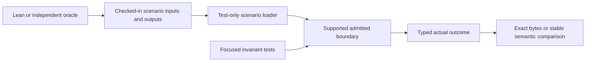

# Consolidate Umpire Go tests into golden scenarios

## Overview

Replace duplicated, setup-heavy Go test matrices in `tools/umpire` with a smaller set of behavior-oriented golden scenarios wherever an authoritative input/output oracle exists. Keep focused tests for invariants that static fixtures cannot prove. The result is a materially smaller and easier-to-read suite without changing Umpire behavior, public APIs, failure precedence, or coverage gates.

## Goal & Context
<!-- scope: business -->

At planning time, `tools/umpire` contains 73 Go test files, about 30,700 test lines, and 489 top-level tests or fuzzers—nearly as much test code as production Go code. Much of that volume repeats artifact loading, execution assembly, and broad pass/fail/inconclusive assertions across packages even though the repository already has Lean-owned canonical fixtures, admitted artifact-set fixtures, portable-evaluation parity outputs, and non-mutating regeneration checks.

This work serves Umpire maintainers. End users, runtime behavior, and operators see no product or deployment change. The cleanup runs only after the Go execution-surface refactor has settled the supported facade and final package ownership.

## Architecture & Data Models
<!-- scope: technical -->



A closed, test-only scenario format groups existing canonical inputs with independently authoritative expected outputs and a small manifest naming the expected status or error classification and comparison policy. Scenario runners reuse the same artifact admission, resident execution, and Run Evaluation boundaries used by supported callers after the execution-surface refactor. They do not duplicate production orchestration.

Deterministic Artifacts and generated outputs remain byte-exact. Results containing run identities, timestamps, temporary paths, or other runtime-assigned values compare only the explicitly stable semantic projection while separately validating every dynamic value. There is no generic normalization or ignore-field mechanism.

## API Contracts
<!-- scope: technical -->

- The scenario loader is internal test support and accepts only the closed fixture layout used by this suite: named inputs, authoritative expected outputs, oracle provenance, expected typed status or error, and one of the fixed comparison modes.
- A scenario expected output must come from Lean or another implementation-independent source. The Go code under test must never generate its own expected result.
- Ordinary package and integration tests read checked-in fixtures and do not invoke Lean, rewrite fixtures, or mutate the checkout. Deliberate regeneration writes to a temporary output root and byte-diffs the complete fixture tree before any reviewed update.
- Deterministic content is compared byte-for-byte. Runtime-variable content uses named stable fields plus structural validation of dynamic fields; failures retain scenario identity, fixture path, typed status or error code, and established diagnostic precedence.

## Edge Cases & Constraints
<!-- scope: technical -->

- Missing, unreadable, malformed, duplicate, unsupported-version, or incomplete fixture members fail before the scenario invokes the boundary under test and identify the scenario and path.
- Fixture values are immutable between parallel subtests; mutations use test-local copies so one scenario cannot contaminate another.
- Golden scenarios must not replace focused coverage for malformed JSON grammar, fuzzing, N/N+1 Limits, checksum and closure mutations, diagnostic precedence, protocol framing and process cleanup, cancellation, overlap and single-flight behavior, uncertain cleanup and poisoning, Temporal resource ownership, or concurrency.
- Model-derived scenarios preserve exact Artifact identities and pass through normal admission and executor preparation. Unsupported checked semantics originate from real checked model inputs rather than post-compilation hand construction.
- The complete tagged live suite and inherited-failure identity policy remain intact. Moving or renaming a live test must preserve the complete `TestUmpire` selector.
- The shared harness must remain test-only, add no third-party dependency, and add no production import, service, schema, format, configuration, or runtime work.

## Quick commands

```bash
go test -count=1 -tags test_dep ./tools/umpire/...
go test -count=1 -tags 'test_dep integration' ./tests -run '^TestUmpire'
make umpire-check-portable-evaluation-fixtures
make umpire-check-regression
make fmt-imports
make lint-code
```

## Acceptance Criteria
<!-- scope: both -->

- **R1:** One internal test-only scenario harness loads closed input/output fixtures, admits them through the supported post-refactor boundary, and compares deterministic bytes or the explicitly stable semantic projection without a general-purpose normalizer. Errors: missing, unreadable, malformed, duplicate, unsupported-version, incomplete, or unexpectedly extra fixture members fail before scenario execution with the scenario name and path; invalid expected outputs fail independently rather than becoming an oracle.
- **R2:** Broad duplicated behavior is represented by a compact scenario matrix covering at least normal success, duplicate-delivery violation, incomplete-closure or correlation-conflict inconclusive outcomes, required external obligations, and binding/checksum mismatch rejection before runtime I/O. Errors: every scenario asserts the established typed status or error category and diagnostic precedence; a golden pass/fail value alone is insufficient.
- **R3:** Specialized coverage remains focused and explicit for grammar and fuzzing, Limits and cardinality boundaries, checksums and closure, process and protocol hardening, cancellation, single-flight and poisoning, Temporal lifecycle and concurrency, and generator structure. Errors: any candidate whose correctness depends on interleaving, resource lifetime, bounded allocation, malformed-stream position, or mutation precedence remains a focused test rather than being hidden in a static golden.
- **R4:** Every golden has reviewable oracle provenance, and fixture regeneration is deliberate, deterministic, complete-tree, temporary-root, and non-mutating by default. Errors: ordinary tests never require Lean; generator unavailability fails only explicit generation/check commands; interrupted generation cannot leave a partial fixture tree; Go-under-test output cannot update or bless its own oracle.
- **R5:** Against the post-execution-refactor baseline recorded by the early proof task, handwritten `tools/umpire` `_test.go` lines and top-level `Test`/`Fuzz` functions each decrease by at least 15%, every removed test maps to a retained scenario or focused-test category, and added human-authored harness/manifest code is smaller than the handwritten test code it replaces. Errors: generated tests and checked-in oracle payload bytes are reported separately and cannot be used to manufacture the reduction.
- **R6:** Package-local, fixture-drift, full regression, and complete tagged live gates retain or improve their pre-cleanup coverage and failure identities, while public behavior, APIs, Artifact bytes, runtime performance, trust policy, and production dependencies remain unchanged. Errors: selector narrowing, newly omitted packages, changed inherited-failure identities, runtime Lean/tool invocation, or any production behavior/API change fails acceptance.

## Boundaries
<!-- scope: business -->

- No blanket conversion of unit, fuzz, race, resource-lifecycle, concurrency, protocol-hardening, or boundary tests into goldens.
- No production refactor, new public test API, third-party snapshot framework, schema change, generated protocol change, or test-only hook exposed to production callers.
- No automatic fixture rewrite, broad generated Lean API drift verification, or new CI workflow coverage; existing focused generator goldens and current gates remain.
- No work on future replay, campaign, canary-fleet, exploration, or promotion packages that have not landed when this spec starts.
- No semantic hardening, new validation, changed diagnostic precedence, or cleanup of unrelated tests outside `tools/umpire` and its existing Umpire live-suite gates.

## Decision Context
<!-- scope: both — conditionally substructured -->

### Motivation
<!-- scope: business -->

The suite should communicate a small number of complete behaviors instead of requiring maintainers to understand hundreds of near-duplicate assembly tests. Existing cross-language goldens and tagged live tests prove that the repository already has authoritative inputs, outputs, and execution seams suitable for this consolidation.

### Implementation Tradeoffs
<!-- scope: technical -->

A single universal end-to-end test was rejected because Umpire must complement specialized unit, fuzz, race, boundary, and resource-lifecycle tests. A general snapshot framework or arbitrary field normalizer was rejected because it would obscure semantic drift and create a new test language. Scenarios therefore use a small closed format, exact bytes where determinism exists, and explicit stable-field assertions where runtime identity is intentionally dynamic.

The new spec depends on the Go execution-surface simplification rather than competing with its test relocation and deletion. Its completed facade becomes the primary scenario seam; independently useful Artifact admission and Run Evaluation boundaries remain valid secondary seams. The declined-memory decision `generated-api-drift-verification` remains authoritative: generator-focused goldens stay, but broad drift verification and new CI coverage remain out of scope.

Performance and scalability are unchanged in production because the harness is test-only. Test runtime should not increase materially: ordinary goldens perform no Lean startup, independent package scenarios may run in parallel, and only the existing explicitly tagged live proofs use a disposable Temporal environment. Security coverage is preserved by retaining focused malformed-input, bounds, path, process, and lifecycle tests.

## Open questions

- None blocking. Task `.1` records the exact post-`fn-61` baseline and re-anchors physical file ownership before migration; it may narrow coordinates but not the scenario contract, retained coverage classes, or reduction target.

## Early proof point

Task `.1` proves that one shared test-only loader can drive the surviving resident execution boundary with existing Lean-owned normal and duplicate-delivery fixtures while deleting duplicated setup and preserving exact outcomes. If it cannot do so without a broad normalizer, a self-authored Go oracle, or restored legacy packages, reconsider the shared scenario boundary before migrating more tests.

## References

- Umpire 4 rules SCP-04, ART-01, ART-04, ART-07, ART-08, EVD-04, EVD-05, EVD-08, and CLI-01 through CLI-03.
- `fn-61-simplify-the-umpire-go-execution-surface`, which establishes the supported post-refactor execution facade and final test ownership.
- Project memory: full integration gates must select the complete migrated suite; portable model plans need exact artifacts and checked obligations; behavior-neutral refactors must not strengthen validation; generated API drift verification remains declined.

## Requirement coverage

| Req | Description | Task(s) | Gap justification |
|-----|-------------|---------|-------------------|
| R1 | Closed test-only golden scenario harness | `.1` | — |
| R2 | Behavior-oriented success, failure, inconclusive, obligation, and pre-I/O rejection scenarios | `.1`, `.2`, `.3`, `.4` | — |
| R3 | Specialized invariant coverage retained | `.2`, `.3`, `.4`, `.5` | — |
| R4 | Independent oracle provenance and non-mutating regeneration | `.1`, `.4`, `.5` | — |
| R5 | Measurable suite-size and complexity reduction | `.1`, `.2`, `.3`, `.4`, `.5` | — |
| R6 | Existing gates and production contracts preserved | `.2`, `.3`, `.4`, `.5` | — |
