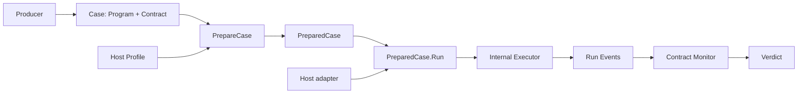

# Umpire Case Runtime
> HTML render lens (local): `.flow/artifacts/fn-64-umpire-case-runtime/spec.html` — regenerable, markdown is the record. <!-- flow-next:artifact-link -->

## Overview

Replace the scenario-specific Umpire4 `PortableTestPlan` execution path with a standalone,
data-driven Umpire Case Runtime. A Producer emits a Case containing a bounded Program and Contract;
generic execution and verification modules prepare it once, then run it repeatedly through an
authorized Host. The first complete proof is an async Nexus-success Case compiled by Lean and
verified exclusively from declared server-side observations.

The approved architecture is recorded in `.plans/UMPIRE_CASE_RUNTIME_DESIGN.md`. This spec owns the
implementation and hard cutover of that design.

## Quick commands

```bash
go test -count=1 -tags test_dep ./tools/umpire/internal/execution/... ./tools/umpire/verification/...
go test -count=1 -tags test_dep ./tools/umpire/temporal/server/... ./tools/umpire/temporal/worker/...
go test -count=1 -tags 'test_dep integration' ./tests -run TestUmpireAsyncNexusCase
make umpire-build-model
make umpire-check-regression
make fmt-imports
make lint-code
```

## Goal & Context
<!-- scope: business -->

Today, changing a model property or Temporal scenario often requires a matching Go adapter and Go
property checker. That duplicates semantics outside Lean, grows the runtime by scenario, and makes
the portable path inseparable from caller closure. The new runtime moves variability into a typed,
bounded IR: Go performs generic interpretation, while the Case carries the requested actions,
captures, and deterministic verification machines.

This serves three groups:

- Go/runtime developers get small execution, verification, and Host APIs that are testable without
  Lean or a Temporal cluster.
- Lean model authors get one compilation target whose semantics do not require scenario-specific Go
  changes.
- Operators get immutable prepared Cases that can drive isolated repeated Runs; production canary
  orchestration remains a later consumer.

## Architecture & Data Models
<!-- scope: technical -->



The public Umpire namespace owns versioned Case, Program, Contract, Run, and Verdict types. The root
Go package owns the public Profile, Host, and effect-handle adapter contract and composes two deep
portable modules:

- internal execution owns admission, entrypoint-local DAG scheduling, typed outcomes and Slots, Run
  recording, typed request construction and response projection, Monitor calls,
  abort/drain/cleanup, and immutable PreparedCase reuse;
- verification owns deterministic Contract-machine preparation and live/offline evaluation.

Internal execution imports neither verification, the root facade, nor Temporal. Verification
implements the internal Monitor contract. The root facade translates its public Host adapter to the
private execution driver and composes execution with verification; Temporal packages implement the
public Host contract and are never imported by the root. Normal callers therefore use the root
facade and public data only, while Go's `internal` boundary prevents them from assembling schedulers,
recorders, Slots, or Monitor factories. A standalone caller may supply another Host without using
Lean or Temporal.

The Temporal Host is split by authority:

- the server runtime owns descriptor catalogs, endpoint roles, authorization, channels,
  credentials, arbitrary unary protobuf RPC invocation, and Nexus completion HTTP calls;
- the worker runtime owns worker registration plus workflow, activity, and Nexus-handler
  interpreters, and may use only the relevant Temporal SDK APIs;
- Nexus handlers remain inside the worker runtime; there is no third Nexus runtime.

Every Program entrypoint is a separate bounded DAG. Dependency edges cannot cross entrypoints. The
Host activates controller entrypoints directly and worker entrypoints through explicit symbolic
workflow/handler bindings, attaching a stable Run and activation identity. Cross-context transfer
uses target-visible effects or the private Run-scoped Slot bridge, never a hidden graph edge.
Controller nodes are Executor dispatch units; a worker entrypoint activation is one Host-owned
in-flight effect with replay-local scheduling, outcomes, and Slots. Its bounded activation authority
is reserved through the dispatch barrier before the controller effect that can trigger it. Stop
prevents new controller dispatches and activation reservations, then cancels existing handles.
An already-reserved activation may receive work or issue SDK commands until cancellation takes
effect; no synchronous per-worker-instruction stop is promised. Delayed delivery remains part of
that in-flight effect. Unreserved or closed-session activations reject without starting a new DAG.

Each ordinary controller instruction declares its reservations as a bounded list of worker
entrypoint/count pairs. Admission rejects nonpositive counts, duplicate targets, wrong contexts,
cleanup reservations, and worst-case totals that exceed the global activation limit when scaled by
dispatch-attempt bounds. Hosts allocate fresh Run-local reservation identities before dispatch;
neither arbitrary RPC names nor request payloads imply reservation behavior.

In v1 each controller entrypoint activates once per Run; reservation targets are workflow or
Nexus-handler entrypoints, while Activity targets reject. The total activation bound includes those
controller activations plus the maximum reservation total under both per-node and global attempt
caps. Reservation handles support identity, consumption and cancellation; unreserved or closed
delivery rejects before worker interpretation. Contract preparation/factories receive only an
immutable Program Observation/bounds view, never mutable scheduler or Slot state.

Slots are immutable single-assignment operational values. Observations are declared typed Run Event
fields visible to Contracts. Raw payloads and ordinary Slots are not evidence unless explicitly
projected to an Observation. Opaque Host-capability Slots cannot be inspected or projected.
Repeated projections preserve protobuf list order; an emitted element's source ID is derived from
the producing attempt and element index. Literal map lookup never introduces map iteration order.

## API Contracts
<!-- scope: technical -->

The complete normal-path Go API is:

```go
prepared, err := umpire.PrepareCase(case, profile)
run, verdict, err := prepared.Run(ctx, host)
```

`PrepareCase` performs static work only, prepares the Contract evaluator, and returns either a
concurrency-safe PreparedCase or an admission error. `Run` validates the live Host identity and all
nil-capable Host values, then creates fresh bindings, Host session, Slot store, recorder, and one
Monitor from the prepared Contract before Run creation. Failure to instantiate that already-prepared
Monitor is an internal pre-Run invariant failure with no Run or target effects. The Host may share
long-lived channels and workers.

PreparedCase execution returns a structured Run and Verdict after Run creation; operational and
target failures are represented there rather than collapsed into an admission error. A Host or
descriptor/profile mismatch detected before Run creation remains an error with no target effects.

The internal execution MonitorFactory binds to the prepared Program view without I/O and creates one
Monitor per Run. The Monitor receives each immutable Run Event synchronously after append, returns
only Continue or Stop, and returns a Verdict at closure. It cannot mutate scheduling, evidence, or
cleanup. Every Monitor method accepts an Executor-bounded context and must return when it is
cancelled; Executor does not wrap callbacks in goroutines to manufacture timeouts. The verification
Evaluator supplies the only production factory; internal fakes exercise execution failure paths.
There is no public arbitrary-Monitor substitution that could bypass the Case's Contract.

The initial Program instruction capabilities are:

| Instruction | Controller | Workflow | Activity | Nexus handler |
| --- | ---: | ---: | ---: | ---: |
| `InvokeRPC` | yes | no | no | no |
| `AwaitSlot` | yes | no | no | no |
| `CompleteNexusOperation` | yes | no | no | no |
| `StartNexusOperation` | no | yes | no | no |
| `Await` | no | yes | no | no |
| `Finish` | no | yes | no | no |
| `RespondNexus` | no | no | no | yes |

Every instruction produces a typed outcome record that later guards may reference. Protocol
non-success, SDK failure, and bounded timeout are outcome values; response payload fields become
available only through declared typed Slot projections. A missing required unguarded Slot is an
execution invariant failure, not a target outcome.

`InvokeRPC` accepts a symbolic endpoint role, fully qualified method, typed request assignments,
declared response projections, and explicit bounds. It can invoke every authorized unary method in
the pinned descriptor catalog. The v1 path grammar permits singular field traversal, repeated
`[*]` fan-out, literal map keys, and explicit presence/oneof selection. It rejects computed indexes,
filters, functions, and streaming methods. Well-known types follow their protobuf descriptors;
unknown enum values and traversal inside an unpacked `Any` are rejected, while an exactly typed
whole `Any` value may be copied from a Slot.

Execution and the shared typed IR build the request, apply response projections, assign Slots, and
append Observations. The Temporal server Host receives a prepared method plus a constructed request
and returns only the raw typed response and protocol status; it never reaches into Executor state.
Capability opacity applies to private bridge values. Profile authorization for an RPC also permits
its declared response projections, including callback fields returned by `PollNexusTaskQueue`.
This is ordinary response data, not a way to inspect the private Slot. Host-injected credentials
remain outside the IR. No special method denylist, payload redaction, or secret-tracking machinery
is required by this clarification.

Contracts are finite deterministic machines with ordered typed transitions, safety or
bounded-liveness kind, terminal states, explicit horizons, and supporting Run Event references.
Each rule may declare typed, single-assignment scalar captures of Observations, including bounded
text/bytes and enums, for cross-event comparisons. A matching transition reads the pre-transition
capture state, then atomically assigns declared captures and changes state. Captures retain their
source Run Event references, are isolated per rule and Run, and are available to subsequent
predicates only through declared capture references. Preparation checks types, definite assignment
(or explicit presence guards), single assignment on every reachable path, and count/byte/work
ceilings. Captures cannot read Slots or capabilities; dynamic collections and arbitrary history
queries are outside v1. The Nexus Contract captures a scheduled event ID and compares later
`scheduled_event_id` Observations against it.

Unmatched events self-loop. Before transitions for every recorded Run Event, pending liveness
rules expire when the Executor-supplied elapsed coordinate is greater than or equal to their
Run-relative deadline. A witness is eligible only strictly before that deadline. Timeout and
closure events use this same ordering; Contracts never arm an invisible timer or use target
timestamps. Expiry therefore becomes observable on the first subsequent recorded event, not
necessarily exactly at the deadline. Completed execution closing before a pending deadline yields
an inconclusive Verdict without waiting or inventing a violation. Once execution/evaluation is
incomplete, elapsed time alone cannot establish a new absence-based violation; pending rules remain
inconclusive, while an already proved violation is retained. The event establishing incompleteness
records that status before horizon processing. Live and offline evaluation consume the same
recorded events, failure status, captures, and closure rules.

### Prepared worker values

Worker adapters reuse a small prepared value interface that owns opcode-aware outcome validation,
declared-field lookup, immutable snapshots and precharged expression/copy work. Controller outcome
staging delegates to the same implementation. Adapters do not obtain mutable compiler internals or
rebind types, paths or expressions. Each SDK activation owns its replay-local lookup state; the
shared value operations are deterministic and do not acquire controller-store locks, perform I/O or
schedule goroutines. False guards create no outcome. Failed producers retain their typed status,
while guarded reads of absent result values remain absent.

`StartNexusOperation` schedules an SDK future and has no `VALUE` outcome. Preparation rejects a
declared `VALUE` on that opcode. `Await` owns the target result; `Finish` and `RespondNexus` retain
their evaluated-result semantics. An asynchronous response is not the eventual operation result.
Success with a required but missing value, undeclared payloads, protocol fields in
worker outcomes, malformed values and size/work exhaustion retain the shared failure semantics.

### Reserved activation delivery

Reservations authorize delivery; they cannot be matched by arrival order or by coincidental equality
of authored request values. Profile carrier policy is declarative: it lists authorized reservation
carrier methods and their supported activation context/cardinality shape. Preparation freezes and
validates this policy, including duplicate/subset/aggregate bounds, without Temporal RPC names in
the generic runtime. A method being authorized for ordinary unary calls does not authorize it as a
reservation carrier. Unsupported carrier methods or reservation shapes reject during preparation.

The initial Temporal carrier is `WorkflowService/StartWorkflowExecution`, with exactly one declared
workflow activation per call and the explicitly declared Nexus-handler reservations it may trigger.
Multiple workflows in one Run use multiple controller nodes. This concrete Host restriction does not
remove general reservation counts from the IR or require other Hosts to use the same carrier shape.
Unreserved authorized unary calls retain their generic transport behavior. Signal-with-start and
multi-operation carriers require their own concrete use case and are not implemented here.

Preparation assigns every potential `StartNexusOperation` node in a reserved workflow to exactly one
explicitly reserved handler with matching service/operation. Handler ordinals follow prepared node
order, never delivery order; repeated workflow reservations in other carrier policies include the
workflow ordinal in that ordering. Duplicate matching handler bindings, missing targets and counts
that do not cover the potential source nodes exactly reject. Guards may leave reservations unused;
they do not alter the assignment. Role/endpoint/physical-queue compatibility is checked by Host
binding before worker startup or target calls, without rewriting authored namespace, workflow type,
workflow ID, taskqueue or payload fields.

The composite Host binds a fresh route bundle to the exact controller coordinate and returned
reservation identities before accepting the triggering effect. It clones the constructed request
and adds a versioned, bounded reserved workflow header. Any authored occurrence of that reserved
key rejects, even when equal. The final transmitted request, including the header, must fit the
instruction and Profile request limits. This is an explicit Host delivery-metadata exception to
execution-owned request construction; it does not permit semantic request rewriting or reservation
inference from RPC names. The server transport remains responsible only for the resulting unary
call and raw typed result.

The route binds the Umpire Run, controller origin, reservation identity/ordinal, prepared entrypoint,
and Host binding to the requested namespace/workflow ID/queue. First admitted delivery pins the
Temporal workflow Run ID. The eventual start response must agree with that pin. Missing, malformed,
oversized, unknown-version, crossed, stale or conflicting routes reject before SDK commands or
capability publication. A valid delivery consumes its reservation once. Replay and matching
redelivery reuse the immutable admitted activation and cannot consume another reservation. Changing
Host state is not consulted at each workflow opcode; immutable admission data remains retained until
the accepted SDK execution and its replay/drain obligations end. Process-restart recovery remains
out of scope.

The SDK outbound Nexus interceptor propagates the preassigned handler route through the Nexus header,
without changing the full typed Umpire value payload. Nexus request identity pins retry/redelivery;
a conflicting request cannot consume an existing handler route. Header decoding and Host admission
stay outside the context-local instruction interpreter. Routing identifiers are non-secret Host
metadata, never callback credentials or completion authority. The Host adds no route facts to Run
Events or diagnostics. Authorized RPC response fields remain ordinary data, including echoed
headers; no additional response redaction or provenance tracking is introduced.

Reservation lifecycle distinguishes reserved, admitted, terminal and canceled authority. Cancellation
atomically prevents unadmitted delivery and requests SDK cancellation for admitted executions using
the exact pinned Temporal Run ID. It never cancels a foreign execution by workflow ID alone. Every
accepted handle remains owned through cancellation, drain and quarantine. Pre-acceptance trigger
rejection retires the associated unconsumed routes. A non-success, canceled or uncertain trigger
result revokes remaining unconsumed routes and boundedly cancels admitted work; it cannot prove that
the remote effect did not occur. Guards false before controller admission create no reservations.

When a workflow becomes terminal, remaining unconsumed handler reservations are released. This is
reported only as reservation release, not proof that an SDK operation ran or did not run. Delayed
delivery then rejects. Reservations never consumed may complete their handle lifecycle without an
activation success claim; failures of admitted required activations still make the owning Run
incomplete. Terminal transitions and resource release are idempotent. Late failures and publications
remain bounded Host diagnostics and cannot mutate closed Run/Verdict data.

Shared workers register their complete workflow/Nexus signature before starting. Reuse requires a
compatible registration and physical-queue binding; incompatible registries must not poll the same
queue or modify an already-started worker. Shared-worker fatal errors affect dependent sessions;
unrelated workers/Runs remain usable. Registry, route, session and quarantine capacity are bounded
under Host policy, and capacity held by actual unfinished work is released only when it finishes.

## Edge Cases & Constraints
<!-- scope: technical -->

- Preparation validates versions, identifiers, sizes, all graph and work bounds, entrypoint-local
  dependencies, Slot dataflow, result references, instruction contexts, descriptors, methods,
  paths, types, Contract machines, Host authorization, and every nil-capable Host interface form.
- PreparedCase binds to stable non-secret Host Profile and descriptor-catalog identities. Credential
  rotation is allowed behind the same authority; a different declared identity requires preparation.
- Identical duplicate source IDs with identical canonical event content are deduplicated. Reusing a
  source ID for different content is an execution invariant violation and makes the Run incomplete.
- Monitor observation is a dispatch barrier for controller nodes and worker activation reservations.
  Once Stop is returned, neither can cross it; already in-flight effects, including reserved worker
  activations, are cancelled and drained within declared bounds. SDK commands may race cancellation
  inside those activations and remain subject to cleanup.
- A safety violation always stops new ordinary dispatch. Pending bounded liveness expires before
  processing an event at or beyond its deadline; incomplete observation cannot prove absence.
- Cleanup uses a fresh bounded context, cannot be suppressed by Monitor decisions, and has an
  outcome independent from Run disposition and Verdict. Drain expiry and uncooperative effects are
  diagnosed without blocking Run closure indefinitely.
- A violation already proved remains violated after monitor, harness, or cleanup failure. Otherwise
  incomplete execution/evaluation is inconclusive.
- Host dispatch returns a Host-owned effect handle within its context bound. Executor cancellation
  and drain operate on that handle; a non-terminating effect is quarantined behind a Profile-wide
  ceiling after drain expiry. Executor never creates an unbounded goroutine around a synchronous
  Host call, and bounded closure is not promised for a Host method that violates its context contract.
- Monitor callbacks return on context cancellation. Callback error or cooperative timeout stops
  ordinary work and starts cleanup; an internal test fake that ignores cancellation violates the
  Monitor contract and has no bounded-closure guarantee.
- Private Slot-bridge publications carry an opaque Run/activation capability whose callback URL,
  headers, and token cannot be read by expressions or projected. They are isolated across concurrent
  Runs, reject conflicting or post-close writes, and are discarded at session closure.
- Closed Runs and Verdicts are immutable. Post-close arrivals, including quarantined effect
  completion and Slot publication, are rejected and sent to bounded Host diagnostics keyed by Run
  identity. They cannot change returned data or another Run; late handle completion still releases
  its Host quarantine capacity. Failures accepted before closure follow terminal precedence.
- Shared worker failure marks only Runs whose required activation/capability failed as incomplete;
  unaffected Runs remain isolated.
- Per-Run state and work are bounded. Preparation indexes descriptors, paths, scheduling, and
  Contract transitions so repeated canary-style Runs do not repeat static work.
- A process crash may lose an active in-memory Run; supervisors report a lost iteration and never
  synthesize a Verdict.

The terminal precedence is fixed:

| Ordinary/monitor outcome | Run disposition | Cleanup/Host close | Verdict |
| --- | --- | --- | --- |
| all instructions and rules complete | `completed` | succeeded | `satisfied` |
| ordinary execution closes before a pending liveness deadline | `completed` | any recorded outcome | `inconclusive` |
| target/protocol non-success accepted by the Contract | `completed` | any recorded outcome | Contract result |
| safety or closed-horizon liveness violation | `stopped_by_monitor` | any recorded outcome | `violated` |
| execution/recorder/invariant failure before violation | `incomplete` | any recorded outcome | `inconclusive` |
| Monitor error/timeout before violation | `incomplete` | any recorded outcome | `inconclusive` |
| drain expiry after a proved violation | `stopped_by_monitor` | any recorded outcome | `violated` |
| cleanup or Host close fails after ordinary outcome is fixed | unchanged | failed with diagnostics | unchanged |

## Conformance and cutover evidence
<!-- scope: technical -->

The public facade has a small closed conformance corpus with exactly six proof classes: satisfied,
violated, inconclusive, static preparation rejection, cleanup failure after a proved violation, and
cross-Run isolation. Concurrency, cancellation, descriptor/path grammar, fuzzing, cardinality, and
resource-lifecycle invariants remain focused tests rather than static goldens.

Deterministic Lean-produced Case and Contract fixtures compare exact bytes. Run-assigned identities,
elapsed coordinates, and other intentional runtime values compare through a closed named stable
projection and receive separate structural validation; no generic normalizer or ignore facility is
allowed. Expected results come from Lean or fixed hand-authored oracle tables that do not invoke the
Go runtime under test. Ordinary Go tests neither invoke Lean nor rewrite expectations. Fixture
generation writes and validates a complete temporary tree before diffing the checkout, so interruption
cannot partially update checked-in fixtures; promotion is a separate reviewed action.

Before deletion, a reviewed migration ledger accounts for every removed top-level legacy Test/Fuzz
and inherited failure identity as `preserved`, `replaced`, or `intentionally-retired`, with the new
owner/replacement and a retirement reason where applicable. Any unaccounted row blocks cutover. The
complete live integration selector remains `-run '^TestUmpire'`. Scenario-neutral fn-5 checked-
promotion types and validation must remain buildable without caller-closure imports after the fixed
caller-closure candidate, command, and binding are removed.

## Acceptance Criteria
<!-- scope: both -->

- **R1:** The versioned Umpire API represents a standalone Case as one bounded Program plus one Contract, with symbolic roles, typed values/paths/outcomes, declared Slots/Observations and bounded rule captures, context-tagged entrypoint DAGs, cleanup, limits, Run data, and Verdict data; Go and Lean generated types agree. Errors: unsupported versions or instruction variants, duplicate/invalid IDs, cross-entrypoint dependencies, cycles, and limit overflow are rejected before I/O.
- **R2:** `PrepareCase` performs all static validation once from Case plus Profile, prepares the Contract's default evaluator, and returns an immutable, concurrency-safe PreparedCase bound to exact non-secret Profile/catalog identities; the public `Run(ctx, host)` preflight validates the live Host before internal execution creates fresh state and one Contract Monitor. Errors: nil/typed-nil Profile values fail preparation; nil/typed-nil or mismatched Host values and internal Monitor-instantiation failure fail Run preflight; missing capabilities, unauthorized methods, type/dataflow/path/presence/oneof/cardinality mismatches, and profile/catalog changes cause no Run or target effects. The scheduler, recorder, Slots, and Monitor factory are not publicly constructible or importable.
- **R3:** Generic Contract evaluation produces identical transitions, supporting-event references, and Verdicts live and offline; it stops synchronously on the first safety violation, checks expiry before every event transition with an exclusive witness deadline, and applies the declared early-closure/incomplete rules. Typed single-assignment rule captures support cross-event correlation with retained evidence references. Every callback accepts an Executor-bounded context and returns on cancellation. Errors: malformed/non-deterministic machines, invalid predicates, unknown Observations, excessive states/work, callback error, and cooperative timeout are rejected or yield incomplete/inconclusive exactly as their phase requires; an internal test fake that ignores cancellation violates the Monitor contract and has no bounded-closure guarantee.
- **R4:** The internal Executor schedules controller DAGs and bounded worker activation effects; worker interpreters own replay-local DAG state. Execution constructs typed requests and applies projections, exposes typed instruction outcomes to guards, maintains immutable Slots, appends ordered Run Events with monotonic elapsed coordinates, and applies the declared precedence table without importing verification or Temporal implementations. Errors: missing unguarded Slots, conflicting duplicate source IDs, and recorder/invariant/global-limit failures accepted before closure make the Run incomplete; post-close arrivals go to bounded Host diagnostics without mutating the closed Run or Verdict; exact at-least-once duplicates are deduplicated. External callers cannot import or assemble this machinery.
- **R5:** Any proven safety violation creates an unconditional dispatch barrier for controller nodes and worker activation reservations, cancels and boundedly drains Host-owned effect handles, then runs unsuppressible cleanup with a fresh bounded context. Errors: stop/dispatch races cannot admit a new controller effect or worker activation reservation; SDK commands inside already-reserved activations may race cancellation and are treated as in-flight work; drain expiry quarantines unterminated handles under the Profile ceiling; cleanup/Host-close failure follows the precedence table; a Host method that ignores its own context is diagnosed as a Host-contract violation and has no bounded-closure guarantee.
- **R6:** The Temporal server runtime dynamically invokes every Host-authorized unary protobuf RPC by accepting a prepared method/request and returning raw typed response plus protocol status; execution owns request construction, Slot/Observation projections, and stable `EmitEach`. The server runtime also owns controller-side Nexus completion without exposing Host-injected credentials or private capability values to the IR. Method authorization permits declared response projections; bridge opacity is not a general response-secrecy guarantee and requires no additional filtering machinery. Errors: unknown/streaming/unauthorized methods, unsupported `Any` traversal, unknown enum values, malformed assignments, fan-out/size limits, and endpoint/transport failure follow the preparation-versus-Run failure boundary.
- **R7:** The Temporal worker runtime generically interprets the approved workflow and Nexus-handler instructions using SDK clients/APIs only, with Nexus registration inside worker lifecycle, activation-level cancellation, replay-local DAG state, and a private Run-scoped opaque capability Slot. Errors: controller opcodes in SDK contexts reject at preparation; worker registration/activation failure, crossed Run capabilities, conflicting/late publication, capability inspection/projection, and shared-worker shutdown produce isolated rejection or incomplete Runs where applicable.
- **R8:** Lean first compiles an orthogonal `GetSystemInfo` Case with an empty request, typed `server_version` projection, different Contract topology, and the exact authorized WorkflowService descriptor; it prepares through the public Go API with zero Host I/O and requires no instruction or runtime branch. Lean also compiles a reproducible async Nexus-success Case that starts a workflow, starts a Nexus operation, transfers opaque completion authority, completes it asynchronously, reads bounded history through `InvokeRPC`, and reaches its Contract Verdict solely from declared authoritative server-history Observations with captured event-ID correlations; matching and mismatched correlations are tested. Errors: unsupported model constructs fail compilation explicitly; generated Case/type mismatch fails preparation; missing worker/endpoint/history or timeout produces the declared outcome or an incomplete Run, never scenario-specific Go verification.
- **R9:** One PreparedCase safely drives repeated sequential and concurrent Runs with fresh per-Run state and shared permitted Host resources. Errors: Run/activation/Slot/Event identity collisions, cross-Run data leakage, capability loss, Profile quarantine exhaustion, and concurrent worker failure are detected under race-enabled tests and cannot mutate another Run.
- **R10:** The repository cuts over to one active Case Runtime: legacy `PortableTestPlan` service/execution, property-specific portable evaluation, Run Evaluation checker, scenario-specific Temporal Nexus adapter, and caller-closure model/fixtures/tests are removed; normative specifications, package docs, commands, and regression gates describe and exercise only the new path. A blocking migration ledger accounts for every deleted top-level Test/Fuzz and inherited failure identity. The six-class independent-oracle conformance corpus uses exact deterministic bytes or named stable projections, regenerates into a complete temporary tree, and cannot invoke Lean or rewrite expectations from ordinary Go tests. The full `^TestUmpire` selector, inherited failure policy, root-surface/import guards, and scenario-neutral fn-5 promotion primitives remain enforced. Errors: no compatibility reader or replacement public network/CLI service, generic normalizer, broad generated-Lean API drift enforcement, or new GitHub Actions coverage is added; historical references may remain only when explicitly marked superseded.

## Early proof point

Task 2 first proves arbitrary protobuf method/type/path binding. Tasks 11 and 12 prove immutable
Program/policy and Contract admission; task 3 supplies the actual evaluator. Task 13 then proves
public PrepareCase composition without Host I/O. Failure at any of these boundaries requires
re-evaluating that shared IR/Host boundary before downstream execution work.

Tasks 16–18 close the worker prerequisites before task 6: shared prepared outcome/value semantics,
declarative carrier/topology admission, and bounded Host reservation delivery. Task 18 first proves
two identical concurrent Runs with reversed deliveries using fake activation handles; task 6 then
proves the same ownership through real SDK interception and replay. Failure reopens the delivery
contract before composing the live async Case.

Execution is then proved at three boundaries: task 14 builds typed requests and projects responses
without Host I/O; task 15 proves append/Monitor/admission serialization with injected operations;
task 4 integrates both in controller DAG scheduling and reservation races against a fake Host.
Task 9 retains complete termination, cleanup, bounded drain/quarantine and public Run reuse. This
delivery split does not change execution semantics or remove the integrated scheduler proof.

The preparation split does not add a temporary public Run implementation. Task 13 tests private
preflight and the public preparation facade; task 9 exports PreparedCase.Run with real scheduling,
cleanup and terminal precedence. Internal execution owns root-independent policy/driver contracts;
the root translates the public Profile and Host into those contracts.

## Boundaries
<!-- scope: business -->

- No caller-closure support or legacy-plan compatibility reader.
- No replacement public gRPC executor service, CLI, or production canary controller in v1; the
  supported standalone surface is the public Go API and protobuf types.
- No streaming RPCs, implicit retries, unbounded loops, or general JSONPath/expression language.
- No SDK-side self-reporting or verification of behavior with no authoritative server-visible effect.
- No durable Run recovery, replay/audit digests, protocol signatures, or trust-store machinery.
- No cross-process private Slot transport or additional activity/SDK instructions without a concrete
  Case.
- No public Monitor replacement API; alternate Host adapters are the external execution extension
  seam, while Contract evaluation remains authoritative.
- No broad conversion of focused unit, fuzz, concurrency, cancellation, or lifecycle tests into
  golden fixtures.
- No broad generated-Lean API drift gate or new GitHub Actions coverage; see the recorded decline in
  `.flow/memory/declined/generated-api-drift-verification.md`.

## Decision Context
<!-- scope: both — conditionally substructured -->

Umpire remains the umbrella and public vocabulary; internal execution and verification are deep
modules behind a small root facade rather than new Playbook/Rulebook products. Alternate Hosts are
the external extension seam, while the prepared Contract's Monitor is authoritative and cannot be
replaced by a caller. The runtime interprets typed data rather than a
Kitchensink-style expanding action dispatcher, which keeps scenario and property semantics in the
Producer's Case. Dynamic RPC is server-only because workflow code must remain replay-safe and use
SDK APIs. Server-side Temporal history is the initial verification authority, avoiding a second
workflow event protocol. Nexus handling belongs to worker lifecycle, while completion is a
controller-side Nexus client effect.

Entrypoint DAGs are intentionally isolated and Host-activated; hidden cross-context dependencies
would make bounded scheduling and replay ambiguous. Conflicting source-ID reuse is an invariant
failure rather than silent replacement. Typed outcome references make error branches explicit while
preserving protocol failures as facts for the Contract. Slot bridge state is scoped by opaque
Run/activation capability and destroyed at closure.

The legacy public executor RPC is removed without replacement because the requested standalone
boundary is an importable Go API, not another transport. `fn-61-simplify-the-umpire-go-execution-surface`
and `fn-63-consolidate-umpire-go-tests-into-golden` target the discarded PortableTestPlan path and
are superseded rather than dependencies. Fn-64 retains fn-61's shallow-call-site goal through the
root facade and fn-63's useful fixture discipline through a small independent-oracle corpus, without
retaining their resident-executor or broad-consolidation assumptions. Later replay, qualification,
canary, release-evidence, and exploration specs must be replanned around PreparedCase, Run, and
Verdict.

Activation-level cancellation keeps workflow interpretation replay-safe with a small Host
interface. Bounded captures supply the required history correlations. RPC response authority stays
with the existing Profile method policy. Event-driven expiry preserves deterministic replay, with
detection delayed until the next recorded event. Closed-result immutability keeps late resource
cleanup in the Host.

## Requirement coverage

| Req | Description | Task(s) | Gap justification |
| --- | --- | --- | --- |
| R1 | Versioned standalone Case IR and generated types | Task 1, Task 2, Task 11 | — |
| R2 | One-time admission, immutable preparation, and root facade | Task 11, Task 12, Task 13, Task 16, Task 17, Task 9, Task 10 | — |
| R3 | Deterministic live/offline Contract evaluation | Task 12, Task 3, Task 15 | — |
| R4 | Internal generic DAG scheduling, Slots, outcomes, and Runs | Task 11, Task 14, Task 15, Task 4, Task 16, Task 10 | — |
| R5 | Safety barrier, effect drain, and cleanup | Task 3, Task 15, Task 4, Task 17, Task 18, Task 9 | — |
| R6 | Authorized arbitrary unary RPC server runtime | Task 2, Task 11, Task 13, Task 5, Task 18 | — |
| R7 | SDK-only worker and Nexus handler runtime | Task 11, Task 13, Task 16, Task 17, Task 18, Task 6 | — |
| R8 | Lean-produced async Nexus integration | Task 7 | — |
| R9 | Safe prepare-once/run-many reuse | Task 11, Task 13, Task 14, Task 15, Task 4, Task 5, Task 16, Task 17, Task 18, Task 6, Task 7, Task 9 | — |
| R10 | Hard cutover, documentation, and regression gates | Task 1, Task 8, Task 10 | — |
