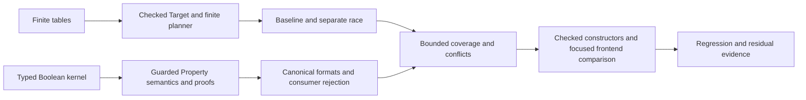

# Design and prototype approachable Nexus2 feature authoring

> HTML render lens: open local `.flow/artifacts/fn-65-design-and-prototype-approachable/spec.html` — regenerable and gitignored; markdown is the record. <!-- flow-next:artifact-link -->

## Goal & Context

Design an authoring experience for ordinary developers with little Lean knowledge, then prototype it under `model/Temporal/Feature/Nexus2`. Authors must be able to define finite states/transitions as well as Properties, Behaviors, and Queries. The user selected the current Nexus lifecycle followed by a cancellation/completion race. Product-owner readability is a stretch goal.

This is a separate experiment from fn-62. The working design is [Nexus2 DESIGN.md](../../model/Temporal/Feature/Nexus2/DESIGN.md). The user authorized prototyping fn-65 before retaining only fn-62’s uncovered requirements and delegated necessary design/replanning decisions. The recorded design authorizes prototype planning and implementation, while illustrative syntax remains uncompiled and the final interface depends on measured comparison evidence.

## Architecture & Data Models

Use finite typed transition data to derive the existing FiniteMachine/AuthoredTarget/checkTarget path. Existing Property, Behavior, Query, and planning modules remain authoritative. Extend `Umpire.Property` with typed Boolean conditions and named guarded cases while preserving legacy clause meanings; update checking, evaluation, proofs, canonical formats, and affected consumers together. Compare ordinary typed constructors and a focused frontend over those same declarations. Preserve explicit typed domains, stable keys, alternatives, provider selection, and bounds. Generic support lives behind the existing Umpire owners; feature examples live in Nexus2.

## API Contracts

The proposed interface and examples are in `model/Temporal/Feature/Nexus2/DESIGN.md`. The baseline preserves the existing four-state/three-transition behavior through explicit identity mapping. A separate proposed race Target distinguishes a cancellation request from either canceled or successful terminal resolution. Checkers return language-owned typed failures; a frontend may map them to authored syntax. Routine authors must not edit extraction/coverage proofs.

Every applicable Property/case obligation holds together. Named `unless` conditions narrow applicability at the triggering prior-state/Action context; they neither waive independent invariants nor cancel outstanding temporal obligations when later events occur. Case groups may explicitly require completeness and exclusivity. Bounded analysis reports coverage, overlaps, contradictions, and modeled incompatibility with exact scope and evidence; it never chooses a winning Property.

## Edge Cases & Constraints

Keep model-owned outcomes, distinct witness/verification claims, stage-specific bounds, and conditional Property semantics. Reject malformed or duplicate identities, unknown typed references, unsupported expressions, invalid finite tables, and contradictory scenarios. Preserve explicit inconclusive search results. Never hide new compiler trust behind syntax or turn a generated representation guarantee into product correctness.

No existing Nexus behavior, inspector registrations, or runtime execution is changed by the design phase. Existing unrelated working changes are outside this work. Do not commit unless requested.

## Acceptance Criteria

- **R1:** Record a concrete authoring design for the user-selected baseline and race, including examples, alternatives, ownership, scope, and technical uncertainties. Errors: predicates outside the designed Boolean vocabulary and unmodeled race cases are explicitly identified; illustrative syntax is never presented as compiled.
- **R2:** Ordinary finite model changes can be expressed without proof editing, encoded ModelValue assembly, or support-code changes. Errors: invalid domains/results, duplicate keys, unused Actions, and ambiguous encodings must reject through the stated authoring boundary.
- **R3:** Properties, Behaviors, and Queries retain their existing checked semantics, including explicit Query form and units. Errors: invalid references, missing capabilities, contradictory constraints, unsupported syntax, and Limit Reached preserve their responsible status.
- **R4:** The prototype checks baseline behavioral equivalence and both race outcomes, plus a counterexample to cancellation always winning. Errors: request-only, no-trigger, and unsatisfiable cases are separately explained and tested; bounded model results make no runtime claim.
- **R5:** Compare constructor and focused-syntax authoring with actual compilation, admission, source diagnostics, trust audits, editor observations, and the relevant repository gates. Errors: unmeasured UX and human-usability claims remain explicitly unproven; no silent native-proof fallback.
- **R6:** Record the concrete design decisions under the user’s delegated design/replanning authority before freezing the prototype implementation plan. Explicitly identify the narrow GOV-02/AUT-07/AUT-08 prototype exceptions described in DESIGN.md. Errors: do not claim a line-by-line human grammar review, human usability evidence, or final syntax approval; unresolved implementation measurements and broader adoption remain visible.
- **R7:** Named guarded cases and exceptions use a typed portable Boolean vocabulary owned by `Umpire.Property`, with all applicable obligations conjoined and explicit trigger-time evaluation. Update the checker, evaluator, agreement proofs, identities, canonical encoding, version handling, and affected consumers while preserving legacy semantics. Errors: reject missing/wrong-kind references, empty Boolean groups, unsupported comparisons or future/result-state guards; exceptions never waive independent invariants, turn unknown inputs into truth, or silently withdraw a pending bounded obligation; missing replacement behavior remains explicit.
- **R8:** The finite prototype demonstrates ordinary/special cases, compatible overlaps, uncovered complete groups, overlapping exclusive groups, contradictory same-step expectations, and bounded modeled incompatibility with source-linked evidence. Errors: distinguish a single violation from contradiction, unexercised guards from coverage, dead ends from conflicting Properties, and Limit Reached from exhaustive results; no general/unbounded compatibility claim is permitted, and case order never selects a winner.

## Boundaries

No migration of established Nexus, general external DSL, arbitrary temporal predicates, interruptible progress obligations, general conflict solving, infinite-state verification, System links, Evidence collection, or live execution. The bounded typed Boolean/guarded-case extension is included; compound temporal responses and arbitrary cross-field equality remain outside it. Enum derivation and a generated product-owner view are optional later experiments, not first-baseline requirements. No broad revision of fn-62 or Umpire rules is implied. The narrow prototype exceptions recorded in DESIGN.md permit generic kernel-checked finite evidence in place of author-written mechanical witnesses and an isolated syntax comparison frontend. The existing semantic owners, complete proof obligations, checked admission, and no-hidden-native-trust boundary remain mandatory. Broader adoption requires a recorded rule reconciliation after measured evidence.

## Decision Context

The user asked to design and eventually prototype the assessed interface using Nexus2, selected the current lifecycle then cancellation/completion race, and requested explicit property conditions, exceptions, and conflict handling in the design. The recommended candidate is a typed table with explicit alternatives, deep generic validation, guarded cases within the existing Property language, and separate authoring languages. The principal early experiments are checked-admission ergonomics, kernel-proof cost, and bounded case/conflict analysis. See the working design for alternatives and the rationale for the initially abstract race.

The delegated decisions select explicit catalogs/tables, constructors first, baseline then abstract race, trigger-time guarded cases with conjunctive obligations, and bounded coverage/conflict evidence. AUT-08’s author evidence responsibility and AUT-07’s wrapper prohibition are concrete conflicts, not resolved merely by lowering to existing types. Their narrow prototype exceptions and remaining adoption boundaries are recorded in DESIGN.md. fn-62 remains deferred; only actual prototype evidence may establish which of its requirements are covered. Human usability and editor observations remain explicitly unmeasured until performed.

## Implementation plan

Task `.5` ends when this breakdown is reviewed and validated; it does not execute its child tasks. Implementation tasks `.6`–`.19` depend on that planning gate directly or transitively. No implementation depends on deferred fn-62. The Property facade partition fn-58 and Case Runtime foundation fn-64 are complete; reuse their public ownership and fail-closed consumer boundaries.

| Task | Bounded outcome | Depends on |
| --- | --- | --- |
| `.6` | Typed finite catalog/table validation | `.5` |
| `.7` | Generic FiniteMachine proof evidence and checked admission | `.6` |
| `.8` | Baseline identity mapping, all three operations and finite planner transport | `.7` |
| `.9` | Separate abstract race and bounded Query outcomes | `.8` |
| `.10` | Typed Boolean predicate validation, semantics and agreement | `.5` |
| `.11` | Same-step guarded cases, exceptions and whole-Property agreement | `.10` |
| `.12` | Trigger-time exceptions for existing bounded temporal responses | `.11` |
| `.13` | Canonical/version and affected-consumer compatibility | `.12` |
| `.14` | Reachable bounded coverage and exclusivity evidence | `.9`, `.13` |
| `.15` | Logical contradiction versus bounded modeled incompatibility | `.14` |
| `.16` | Checked constructor authoring over the completed semantic owners | `.8`, `.13`, `.15` |
| `.17` | Source-aware checked Property frontend and trust measurements | `.15`, `.16` |
| `.18` | Behavior/Query frontends and whole editor/interface comparison | `.17` |
| `.19` | Consolidated regression/docs and fn-62 evidence inventory | `.18` |

These are fourteen substantive M-sized slices, not setup/documentation fragments. The gap review split three oversized tasks at real contracts: validated table data before generic evidence, same-step cases before temporal obligations, and Property frontend before Behavior/Query adapters. Boolean agreement, consumer compatibility, coverage and conflict analysis are separate proof/behavior boundaries. `.11` and `.12` deliberately include affected consumers to preserve compiling, fail-closed intermediate states: first admission/emission of each guarded form installs version discrimination and typed unsupported rejection atomically. `.13` completes the consumer inventory and compatibility fixtures; it never licenses an earlier success path that drops a guard. `.10` admits no new public guarded clause; `.11` explicitly rejects guarded temporal clauses until `.12`.

Finite authoring and the internal predicate kernel are independent research/implementation candidates. Constructor task `.16` overlaps `.9`, `.14` and `.15` in Nexus2/Query tests; its dependency on `.15` serializes all three pairs transitively. Executable case analysis belongs behind Umpire.Planning with Query-owned inputs: exporting a Planning-dependent analyzer from Umpire.Query would create an import cycle. `.14` extracts the existing private candidate traversal into a shared bounded seam used by both planning and analysis; `.15` reuses its budget accounting and exhaustive completion evidence. Public `plan` stops at its first selected trace and cannot supply that evidence alone. The user's no-worktree/no-commit instructions remain in force. A task may extend an existing facade to expose its new API, but may not introduce a parallel authoring language outside the narrow isolated frontend experiment.



## Early proof point

Task `.6` establishes validated finite table data; `.7` must demonstrate kernel-checked admission and a state/transition extension with no author proof or support edit. `.8` then demonstrates actual checked baseline Query execution without transport proofs. If generic evidence or admission cost fails the stated trust boundary, reconsider the implementation seam or retain the tested successful-branch route before frontend work; never silently adopt native proof trust. `.10`–`.12` similarly establish agreement and negative semantics before syntax can obscure them.

## Verification commands

For planning task `.5`, baseline has no code gate: validate Flow structure, task dependencies, requirement/error coverage and document references. Planning snippets are not compilation evidence. Implementation tasks use their own focused Quick commands, including new roots after creation; do not rerun the full prototype suite after every edit. Preserve observed pre-edit failures distinctly, and never narrow a failing aggregate to claim success.

## Quick commands

```bash
/Users/stephan/.codex/plugins/cache/flow-next-marketplace/flow-next/4.5.1/scripts/flowctl validate --spec fn-65-design-and-prototype-approachable --json
```

Task `.19` owns these cumulative final gates, in addition to task-focused checks and transitive axiom audits:

```bash
(cd model && mise exec -- lake build Temporal.Feature.Nexus2.Tests Temporal.Feature.Nexus2.AuthoringTests UmpireTests TemporalModelTests TemporalExperimentalTests)
make umpire-build-model
make lint-model
make umpire-check-regression
make lint-code GOLANGCI_LINT_FIX=false
```

The model workspace uses its pinned Lean/Batteries versions and Make's platform-aware `LEAN_LAKE` wrapper when direct invocation needs the macOS SDK environment. Other Lake workspaces are not consumers unless Shared is touched, which is outside this plan. Any affected Go tests use `-tags test_dep`; existing focused generation checks remain required for changed generated outputs. Broad API/protobuf drift gates and new CI workflows remain outside scope, per the declined generated-api-drift-verification memory.

## Requirement coverage

| Req | Outcome | Tasks | Gap justification |
| --- | --- | --- | --- |
| R1 | Concrete design and model scope | `.1`–`.3` | Design recorded; implementation evidence is not inferred |
| R2 | Finite authoring without proof/encoding/support edits | `.6`–`.8`, `.16`, `.19` | — |
| R3 | Checked declaration and explicit bounded Query semantics | `.8`, `.9`, `.13`, `.16`–`.19` | — |
| R4 | Baseline equivalence and race/negative outcomes | `.8`, `.9`, `.19` | — |
| R5 | Compiled constructor/frontend, source diagnostics, trust and editor comparison | `.6`, `.7`, `.16`–`.19` | Human usability remains unproven until human evaluation |
| R6 | Delegated decisions and narrow prototype exceptions | `.4`, `.5` | No global rule reconciliation or final syntax approval claimed |
| R7 | Typed Boolean guards, exceptions, proof and compatibility extension | `.10`–`.14`, `.16`–`.19` | — |
| R8 | Finite case/conflict evidence and precise inconclusive statuses | `.11`, `.12`, `.14`, `.15`, `.17`–`.19` | — |

## Evidence and residual replanning

Task `.19` must deliver a separate evidence row for each fn-62 R1–R9, with implementation and executable-test paths, observed gate/trust results, covered/partial/uncovered assessment, exact remaining requirement, and any contract mismatch. In particular, generic proof responsibility differs from fn-62 R2, compile-time frontend checking differs from its R5 author-success-evidence rule, and Nexus2 equivalence is not established Nexus migration (R8). Observation (R1/R6), model-owned Known Gaps (R7), family-rooted identity specifics (R4), planner transport (R3), and full ordinary/expert docs (R9) require explicit evidence or residual statements. This plan does not mark any fn-62 requirement superseded and does not rewrite its seven deferred tasks; that is a later evidence-based replan/review.

## Research and implementation constraints

Reuse `FiniteMachine.lean:12` and its kernel/completeness constructors, `Planning/Engine.lean:149` checked-Query adaptation, and the `Umpire.Property` facade. The Property owners are `Language.lean:35–98`, `Check.lean:293–476`, and `Evaluation.lean:464–575`; extend their checker/evaluator/denotation together. Observation's clause consumers and Case's explicit unsupported lowering must not omit new semantics. Target's source capture at `Language.lean:924` is reusable, but its `checkedTarget` native default at line 890 is not the approved proof path.

The affected users are model authors and maintainers; product-owner readability is a stretch measurement, while operators receive no runtime/configuration change. New work remains pure checked data and bounded finite computation. At 10x model/declaration volume, record admission/elaboration and bounded-analysis work rather than weakening validation; exhausted work yields its responsible Limit Reached status. No persistence/service/crash-recovery mechanism is introduced: failed admission publishes no checked declaration and incomplete analysis establishes no negative theorem. The security boundary is portable inert data with no callbacks, ambient providers or hidden compiler trust.

Research included repo, spec, memory, documentation-gap and flow-gap roles. Host thread capacity required sequential reuse of one scout thread; short depth intentionally omitted the three web-research scouts. Grounding was local pinned code. Remaining uncertainties are implementation measurements (kernel admission cost, finite-analysis cost/precision and editor support), not permission to drop specified semantics.
