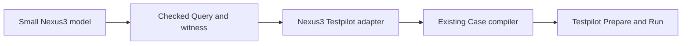

# Minimal Nexus3 success demonstration

## Goal & Context

Prove that the readable Nexus3 authoring surface can become functioning Lean and produce a Case that executes against Temporal. Implement exactly one operation: scheduled → started → succeeded. The audience is the engineer evaluating authoring usability; the executable feature file must retain the approachable block-shaped spelling from `Nexus.md`, not expose Umpire's record construction details. No product, deployment, or operational platform changes are needed.

The existing drafts remain the broader design reference. The executable demonstration contains only the success model, one Property, one exact Behavior, and one witness Query. Completing it establishes this slice, not full Nexus3 or cancellation support.

## Architecture & Data Models

Use ordinary Lean vocabulary declarations plus a small Nexus3 command-syntax layer that expands the success-only `model`, `property`, `behavior`, `limits`, and `query` blocks into existing finite-target and Property/Behavior/Query owners. Keep the feature-facing file at most 250 physical lines including its relevant teaching comments. `Nexus3.Syntax` owns only grammar and macro expansion; `Nexus3.Authoring` owns typed construction and admission; integration remains separate. The supported grammar is only the demonstrated success slice and must reject unsupported spellings during elaboration; it is not a general Umpire parser or a second semantic language. Capture declaration names from each block declaration and derive IDs rather than repeat them in a registry.

The checked Target starts only at scheduled, with awaitStart and awaitSuccess leading to distinct acknowledged/completed outcomes and the corresponding states. Express successfulResult with the existing transition-contract vocabulary on awaitSuccess; the exact two-step Behavior ensures that occurrence is exercised and is the final step. Plan the witness before lowering it.

The success-only Producer consumes the checked Query, its checked meaning, and selected witness. Reuse the existing async Nexus physical Program mechanics, but derive Case provenance and the acceptance monitor from those inputs. `Temporal.Feature.Nexus3.Testpilot` owns that feature adapter. Reusable Case-building mechanics live under `Temporal/Testpilot/`; the top-level `Temporal.Testpilot` module remains a thin generic facade and does not own Nexus semantics. Existing renderer and test entry points call the feature Producer directly. No independently authored copy of the same success requirement remains active.



## API Contracts

- Expose one Case-production result for completion, returning the existing typed lowering error on unsupported or inconsistent input; no partial Case.
- Support only this exact witness form, two-action trace, and checked success Property. Inspect semantic fields, not only IDs or display names. Capture their checked fingerprints in Case metadata.
- IDs derive from declaration names plus named owners/members, never source order. Authors do not write a parallel definitions registry, compatibility override, or per-declaration version label for this demonstration. A rename changes identity and requires downstream fixture regeneration. Keep an explicit identity or version input only where a concrete existing consumer requires it, and document that dependency. Reject malformed, duplicate, wrong-kind, or conflicting derived references through existing admission boundaries.
- Retain the existing async-nexus renderer selector, Testpilot Case wire format, Profile/Driver, and test fixture location. The renderer imports the Nexus3 adapter directly; do not retain a feature-specific Case constant or alias in the generic Testpilot facade. Do not add a demo CLI or runtime instruction.
- Physical setup schedules the operation; waits recognize correlated history events. A fixture may cause asynchronous handler completion, but only recorded history establishes the modeled result.

## Edge Cases & Constraints

The monitor must correlate scheduled, started, and completed history for the same workflow/run and operation using the existing scheduled-event/request references. Missing, duplicate-only, or foreign-operation evidence never satisfies the Contract. Execution deadlines remain operational bounds: do not turn a model transition count into milliseconds or add a stronger temporal Property; unresolved evidence closes inconclusive.

Cancellation, operation-scoped liveness, and other Query/Property forms are unsupported by this Producer and reject before Case publication or Driver I/O. Keep those examples as inert design documentation. The completion Query carries checked `capability-contract` Known Gaps for cancellation and operation-scoped progress; Task 2 converts them once with `KnownGapSet.toCaseKnownGaps` into Case metadata. They disclose this slice's limitations without weakening or waiving its success requirement.

Fixture generation owns the existing two Temporal example fixtures separately from the fixed six conformance classes. Reuse the current fixture tool and transactional publisher with a separate example manifest/root; build and validate the complete owned tree before comparison or publication. Ordinary Go tests consume checked-in bytes and never invoke Lean. No broad API drift verification or CI changes.

## Acceptance Criteria

- **R1:** The compact executable authoring file builds and visibly retains the approachable `model lifecycle`, `property successfulResult`, `behavior successfulCompletion`, `limits shortTrace`, and `query completion` blocks from `Nexus.md`, narrowed only to scheduled → started → succeeded. Their expansion uses the existing language owners and planning finds exactly that trace through awaitStart/awaitSuccess. Grammar and expansion live only in `Nexus3.Syntax`; typed construction and admission live only in `Nexus3.Authoring`; both stay outside the feature file. Errors: an unsupported block form, undeclared result, outgoing terminal row, impossible Behavior, or missing success step cannot publish a successful witness; no placeholder proofs or unchecked extraction fallback.
- **R2:** Declaration names and named owners/members derive all required IDs and metadata automatically, with no hand-maintained definitions registry, user-facing identity override, pinned ID expectation, or redundant per-declaration version string. Test reference consistency, rename-driven identity changes, reorder/comment stability, and semantic fingerprint changes where consumed. Errors: malformed, duplicate, wrong-kind, or conflicting derived declarations reject at admission.
- **R3:** `Temporal.Feature.Nexus3.Testpilot` lowers checked success semantics into the current Program/Contract format, with source IDs/fingerprints bound to its inputs. Reusable generic Case-construction helpers live under `Temporal/Testpilot/`, while feature-specific Property, evidence correlation, Program, and monitor construction stay beside Nexus3. `Temporal/Testpilot.lean` contains no Nexus-specific definition or alias. Changing/removing a success transition or changing its Property under the same IDs changes the output meaning or rejects; returning the existing constant Case is insufficient. Errors: wrong Target/trace, absent witness, altered unsupported Property/Action/form, or cancellation produces a typed error and no Case. Missing/foreign evidence cannot satisfy the generated monitor; model-step bounds are never converted into runtime timeouts.
- **R4:** The existing async-nexus fixture is generated deterministically from Nexus3 and the existing renderer delegates to the new Producer. Repeated generation yields identical bytes; the example fixture tree is compared/published transactionally and the six conformance classes are unchanged. Errors: renderer/decoder failure, stale bytes, or incomplete generated trees fail without publishing partial output; ordinary tests perform no generation.
- **R5:** The existing live async Nexus test uses that fixture through Testpilot and the real local Temporal Driver. It returns completed disposition, satisfied Verdict, and successful cleanup, supported by the three correctly correlated history events. Missing or foreign terminal evidence fails a focused offline monitor test. Preserve the focused live test as a required pass, not an allowed inherited failure; update the existing demo documentation with exact support and commands. No error surface beyond the admission/evidence/runtime failures named above.

## Boundaries

No cancellation implementation, retries, multi-operation composition, scoped-step monitor, general-purpose DSL/parser beyond the five success-slice blocks, universal Property compiler, new runtime opcode, ID registry, new executable, new artifact format, deployment, broad cleanup, benchmarks, or CI expansion. No migrations of the original Nexus/Nexus2 models.

## Decision Context

- Four sequential tasks: executable authoring, metadata/identity derivation, checked Testpilot lowering, then fixture/live-test integration. Stabilize derived provenance before generating fixtures. Avoid a framework project around a single demonstration.
- Preserve the five-block Nexus3 spelling as the demonstrated public surface. Implement only its success forms and expand them into the existing checked owners; avoid a reusable grammar framework until another model requires it.
- Keep the Testpilot adapter co-located in Nexus3, with imports flowing Testpilot → Nexus only; do not relax import lint or make the pure model import runtime bindings. Generic Testpilot support must not import Nexus3.
- Preserve the complete Markdown drafts while creating the narrower executable Lean modules alongside them.
- fn-67 supplies design provenance; completed fn-62 and fn-64 supply authoring and runtime dependencies. Independent fn-66 cleanup is not a blocker.
- Broad generated API drift verification and CI expansion remain outside this demonstration, consistent with the existing declined-scope decision.

## Quick commands

```sh
(cd model && mise exec -- lake build Temporal.Feature.Nexus3.Tests temporal-testpilot)
mise exec -- go test -count=1 -tags test_dep ./tests/testcore/testpilot/...
mise exec -- go test -count=1 -tags 'test_dep integration' ./tests -run '^TestTestpilotAsyncNexusCase$'
```

The Go commands run from the repository root. Task acceptance records fixture generation/check commands using the existing tool. Final verification also runs the existing model and lint gates, with unrelated failures reported separately.

## Early proof point

Task 1 must produce the exact checked witness from the compact block-shaped authoring file before runtime extraction begins. If the syntax layer cannot keep that file close to the successful subset of `Nexus.md` within the size bound, simplify the elaboration seam before Task 2; do not expose record assembly in the feature file.

## Requirement coverage

| Req | Task(s) | Gap justification |
| --- | --- | --- |
| R1 | fn-68-minimal-nexus3-success-demonstration.1, fn-68-minimal-nexus3-success-demonstration.4 | — |
| R2 | fn-68-minimal-nexus3-success-demonstration.4 | — |
| R3 | fn-68-minimal-nexus3-success-demonstration.2 | — |
| R4 | fn-68-minimal-nexus3-success-demonstration.3 | — |
| R5 | fn-68-minimal-nexus3-success-demonstration.3 | — |

## References

UMPIRE4 checked authoring, closed Case, and evidence contracts; Lean Authoring Guidelines; fn-67 design decisions; completed fn-62 authoring and fn-64 Case Runtime work. Concrete source anchors and commands belong to the child tasks.
