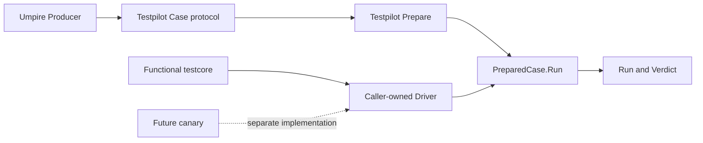

# Extract Testpilot from Umpire

> HTML render lens: local file `.flow/artifacts/fn-69-extract-testpilot-from-umpire/spec.html` (gitignored; open locally) — regenerable, markdown is the record. <!-- flow-next:artifact-link -->

## Conversation Evidence

> user (turn 1): "tools/umpire/internal/ir and tools/umpire/internal/execution etc define a contract of how to execute \"anything\" and verify it. I think it should be come part of the server and be detached from Umpire itself. makes it more managable and defines a clear boundary with umpire then. dodes that makse sense? suggest a name and location for code"
> user (turn 2): "suggest better names"
> user (turn 3): "isn't this about instructing, remote controlling, pupeteering the server?"
> user (turn 4): "wouldn't we want to land it in common/testing/<name>? and then have a functional test-specific adapter in tests/testcore/<name>? then common/testing can be used for a canary impl too"
> user (turn 5): "use testpilot as name"
> user (turn 6): "yes, let's write a new spec for this change"
> user (turn 7): "update .plans/UMPIRE4_ORDER.md to execute this new spec before fn-68"
> user (turn 8): "does the spec include renaming the protos to also called testpilot instead of umpire?"
> user (turn 9): "yes, it should. maybe put it under proto/internal/testpilot/v1 or similiar; just not proto/internal/temporal/server/api"
> user (turn 10): "actualy; let's keep it at proto/internal/temporal/server/api/testpilot/v1"
> user (turn 11): "let's ammend fn-69 to add a task to clean it up like this"

## Overview

Move the completed Case Runtime behind a server-owned Testpilot boundary without changing its
behavior. Introduce the renamed protocol first, extract the generic runtime and its public facade,
cut over Lean/API identities and functional fixtures, move the functional Temporal Driver, migrate
remaining Umpire Producer-side consumers, and remove the old
owners only after exhaustive reference and compatibility checks.

## Goal & Context
<!-- scope: business -->
<!-- Goal & Context: 100% [paraphrase] -->

Separate the Case protocol, execution, and verification from Umpire model authoring. Umpire remains responsible for describing behavior and producing Cases; Testpilot becomes the server-owned module that defines the Case protocol, admits a bounded Case, directs an authorized environment, records what happened, and evaluates the Case Contract.

The separation gives functional tests and future production canaries one execution module while allowing each environment to own its remote-control adapter. It also gives Umpire a clear handoff: Umpire produces Testpilot Case data, while protocol ownership, execution state, and environment authority remain outside Umpire.

## Architecture & Data Models
<!-- scope: technical -->
<!-- Architecture & Data Models: 80% [paraphrase], 20% [inferred] -->

The deep module is named Testpilot and lives at `common/testing/testpilot`. It owns the reusable Case representation bindings, descriptor and expression admission, Program scheduling, immutable value flow, event recording, Contract preparation and evaluation, Run closure, and Verdict production. Its public interface remains small while its scheduler, recorder, expression machinery, and evaluator remain internal.

Testpilot also owns the protobuf contract. Proto sources live at `proto/internal/temporal/server/api/testpilot/v1`, use the protobuf namespace `temporal.server.api.testpilot.v1`, and generate the Go package at `api/testpilot/v1`. The former Umpire proto source, namespace, generated Go package, helper files, and import paths are removed after consumers and generated artifacts migrate.

An environment implements Testpilot's Driver interface. The functional-test implementation lives at `tests/testcore/testpilot` and owns functional cluster access, namespaces, credentials, SDK workers, RPC channels, and other test-harness mechanics. Server and worker authority remain separate inside that adapter even when composed as one Driver.

A canary implementation may supply another Driver without importing the functional test harness. Testpilot owns no canary policy, credentials, leases, scheduling, publication, or deployment behavior; those remain with the canary caller.

The final dependency direction is Umpire Producer to Testpilot's canonical Case protocol to Testpilot execution to an injected Driver. Testpilot must not import Umpire tooling or either environment adapter, and adapters must not define Program or Contract meaning.



## Approach

Freeze the fn-64 compatibility corpus and import graph before moving code. Establish the Testpilot
protobuf package alongside the old generated package long enough to keep each migration step
buildable, then extract the private core and public facade without exporting internals. Cut over
Lean/API identities and namespace-bearing functional fixtures, move the functional Driver onto the
new boundary, and migrate remaining Umpire Producer-side consumers. Remove every old proto,
runtime, forwarding, and path reference in the final slice. The temporary coexistence is an
implementation staging device only: it performs no translation and is absent at completion.

After the private core is extracted, refine the temporary parity schema before publishing the facade:
split broad files by domain responsibility, establish consistent human-facing names, remove
producer-specific or speculative concepts Testpilot does not interpret, and encode cross-field
invariants structurally where protobuf supports them. Adapt the core without changing runtime
semantics or adding a translation layer.

## API Contracts
<!-- scope: technical -->
<!-- API Contracts: 65% [paraphrase], 35% [inferred] -->

- `testpilot.Prepare(case, profile)` performs static admission without Driver access or target I/O and returns an immutable prepared value.
- The prepared value's `Run(ctx, driver)` method verifies Driver identity and authorization, creates fresh per-Run state, executes the admitted Program, records immutable events, evaluates the admitted Contract, and returns the existing Run and Verdict shapes.
- `testpilot.DecodeCaseProtoJSON(encoded)` and `testpilot.PackCaseProtoJSON(encoded)` preserve the existing strict canonical Case ingestion used by generators, conformance checks, functional tests, and non-functional callers without exposing private IR or evaluator types.
- The returned type remains `PreparedCase`; environment-facing `Host` terminology becomes `Driver`, including `DriverIdentity`, while the public execution sequence and behavioral error categories remain unchanged.
- Driver and per-Run Session interfaces expose only authorized effects, reservations, completion, cleanup, and diagnostics required by the admitted Program. They cannot replace the evaluator, synthesize observations, alter the Contract, or reinterpret a Verdict.
- Case, Program, Contract, Run, Verdict, and value semantics remain recognizable domain concepts. The temporary Testpilot descriptor may be reorganized and renamed before public adoption; every intentional difference must preserve or explicitly retire its prior runtime meaning.
- Existing checked-in Case data and generated views are regenerated for the namespace move and approved Testpilot model refinement. Every changed artifact must trace to an intentional schema decision; no compatibility translation format or dual protocol is introduced.
- Umpire consumers migrate to Testpilot's interface. Any temporary forwarding facade exists only during the migration and is absent at completion.

## Edge Cases & Constraints
<!-- scope: technical -->
<!-- Edge Cases & Constraints: 45% [paraphrase], 55% [inferred] -->

Preparation must reject malformed, unsupported, over-limit, unauthorized, or internally inconsistent Cases before environment I/O. Run preflight must reject nil, typed-nil, mismatched, or unauthorized Drivers before effects begin. Existing deterministic error categories and failure precedence remain stable.

Cancellation, concurrent independent Runs, recorder atomicity, bounded cleanup, quarantine, replay, incomplete execution, proven-violation precedence, intentional descriptor migration accounting, and defensive ownership of mutable protobuf values retain their established behavior. The move must not add retries, instructions, evidence sources, callbacks, or runtime work.

Functional and canary Drivers cannot import each other. A Driver may perform only effects authorized by the prepared Profile and Program, and all Contract evidence must still enter through Testpilot's recorder. A Driver failure cannot manufacture success or erase an already committed violation.

The existing older common testing Umpire framework is not merged into Testpilot. Historical implementations and open downstream specifications remain unchanged except where their active Case protocol or Case Runtime dependency must point to Testpilot.

During migration, old and new generated packages or runtime trees may coexist only when the task
records their exact consumers and the repository remains buildable. They share no translation path,
registry, or fallback. The last task must prove the old owners have zero active imports before
deletion. Tests that currently reach through Go `internal` boundaries move with their owner or are
rewritten through the public prepared-plan view; the extraction must not widen the public API for
test convenience.

## Quick commands

```bash
go test -count=1 -tags test_dep ./common/testing/testpilot/...
go test -count=1 -tags test_dep ./tests/testcore/testpilot/...
make proto
make umpire-gen-lean-api
make umpire-check-case-runtime-conformance
make umpire-check-regression
```

## Acceptance Criteria
<!-- scope: both -->

- **R1:** Testpilot is the single owner of the Case protobuf contract, strict canonical Case decoding and packing, generic Case admission, Program execution, recording, and Contract evaluation under the server's shared testing layer; it has no dependency on Umpire tooling, the functional test harness, or a canary implementation. Proto sources retain the established Temporal server API hierarchy with a Testpilot-owned leaf namespace. Errors: forbidden dependency directions, private IR exposure, or a second protocol, execution, or evaluation owner fail the migration.
- **R2:** The public sequence is `Prepare(case, profile)` returning `PreparedCase`, followed by `prepared.Run(ctx, driver)`, with immutable prepared state and fresh Run-local state. Preparation performs no target I/O; Run validates Driver identity and authorization before effects. Errors: malformed or over-limit Case/Profile input and nil, typed-nil, mismatched, or unauthorized Drivers fail before target effects.
- **R3:** Driver is the only environment-control seam. It exposes the existing bounded effect, reservation, completion, cleanup, and diagnostic capabilities without authority to change Program or Contract semantics, recorded evidence, or Verdict interpretation. Errors: undeclared effects, observations, retries, or evaluator substitution are rejected or structurally impossible.
- **R4:** The functional test adapter is owned by the functional test-core layer and preserves the separate server and worker authorities while passing the existing focused, conformance, and live Case Runtime tests through Testpilot. Errors: crossed authority, lost cleanup, changed failure identity, or dependence from Testpilot back into the adapter fails verification.
- **R5:** A non-functional external-package Driver uses only Testpilot's public interface to prepare and execute a bounded Case, including cleanup and failure handling, proving that a future canary does not need the functional test harness. Errors: inaccessible required capabilities or canary policy, credentials, leases, publication, or deployment behavior entering Testpilot violates the seam.
- **R6:** Admission outcomes, authorized effects, Run events, Verdict meaning, diagnostics, cancellation and cleanup precedence, concurrency behavior, and bounded 10x-load characteristics remain unchanged. Proto descriptors and serialized Cases may change only through the namespace move and pre-adoption Testpilot model refinement, with each changed concept mapped to its prior runtime meaning or identified as unused producer metadata. Errors: unexplained semantic, ordering, error-category, resource-bound, descriptor, or generated-artifact differences fail completion.
- **R7:** All active Case protocol and runtime consumers, generators, fixtures, descriptor catalogs, architecture rules, test selectors, and downstream dependencies name Testpilot as the owner; the former Umpire proto package and runtime implementation are removed without aliases or a permanent forwarding layer, and fn-68 depends on this migration before execution. Existing comments are preserved. Errors: stale active imports, proto names, generated files, fixtures, documentation, or selectors; reduced test coverage; parallel protocol/runtime paths at completion; an unaccounted consumer; or fn-68 executing first prevents completion.
- **R8:** The Testpilot v1 protobuf contract uses small cohesive domain files and one human-readable naming scheme, contains no stale Umpire or Host terminology, retains only concepts Testpilot interprets or concrete Cases require, and makes contradictory expression, slot, activation, and presence states structurally impossible where protobuf can express the invariant. Errors: grab-bag files, ambiguous names, speculative taxonomy, or undocumented hidden cross-field validity rules prevent public adoption.

## Boundaries
<!-- scope: business -->

- No runtime semantic expansion during protobuf refinement: no new Program instruction, Contract rule, evidence source, effect, retry, or capability. The temporary Testpilot descriptor may change before public consumer cutover, without a compatibility translation layer. [user]
- No change to Umpire's Lean authoring, planning, Query, Producer, or canonical Case semantics. [paraphrase]
- No production canary implementation, policy, credentials, leases, reconciliation, publication, or deployment work. [paraphrase]
- No redesign or consolidation of the older common testing Umpire framework. [inferred]
- No broad generated-API drift gate or new CI coverage; required regeneration and repair of existing selectors remain in scope.

## Decision Context
<!-- scope: both -->
<!-- Decision Context: 85% [paraphrase], 15% [inferred] -->

- Testpilot describes the module's role as the pilot that owns the executable Case protocol, directs a system under test, and observes the resulting Run; Umpire remains the behavior author and Producer. [user]
- The shared server testing layer owns reusable execution and verification, while the functional test-core layer owns the concrete functional-cluster Driver. [user]
- Environment adapters remain caller-owned so the same Testpilot module can later support a canary without depending on functional-suite infrastructure. [user]
- This is a fresh follow-up to the completed Case Runtime rather than a rewrite of its behavioral contract; that implementation and corpus provide the compatibility baseline. [inferred]
- The migration precedes fn-68 so the first Nexus3 success demonstration exercises the final ownership seam. [user]
- Testpilot proto sources retain the established Temporal server API source hierarchy while replacing the Umpire leaf with Testpilot; generated Go code remains under the server API output tree with a Testpilot package identity. [user]
- `PreparedCase` remains the public prepared-value name; package context permits the entry point to shorten from `PrepareCase` to `Prepare`, while `Driver` states the environment-control responsibility more accurately than `Host`.
- Canonical Case decoding and deterministic packing move into the top-level Testpilot boundary because protocol ingestion is shared by Umpire generators, functional tests, and future non-functional callers; a separate shallow artifact package would split ownership again.
- Temporary side-by-side packages keep intermediate tasks buildable but expose no translation or fallback and are deleted after consumer migration.
- Broad generated-API drift verification remains declined in `.flow/memory/declined/generated-api-drift-verification.md`; this migration regenerates owned outputs and repairs existing gates only.

## Early proof point

Task fn-69-extract-testpilot-from-umpire.2 proves that a renamed protobuf descriptor is generated by
the existing toolchain and supplies a temporary parity baseline for core extraction. Task .9 proves
the refined public model compiles and preserves runtime semantics before the facade or producers
adopt it. If refinement requires runtime translation or changes execution meaning, re-evaluate it
before consumer cutover.

## Requirement coverage

| Requirement | Planned task |
| --- | --- |
| R1 | fn-69-extract-testpilot-from-umpire.2, .3, .9, .4, .8 |
| R2 | fn-69-extract-testpilot-from-umpire.3, .4, .8 |
| R3 | fn-69-extract-testpilot-from-umpire.3, .4, .6 |
| R4 | fn-69-extract-testpilot-from-umpire.6, .8 |
| R5 | fn-69-extract-testpilot-from-umpire.4, .8 |
| R6 | fn-69-extract-testpilot-from-umpire.1, .2, .3, .9, .4, .5, .6, .7, .8 |
| R7 | fn-69-extract-testpilot-from-umpire.1, .9, .5, .6, .7, .8 |
| R8 | fn-69-extract-testpilot-from-umpire.9 |
