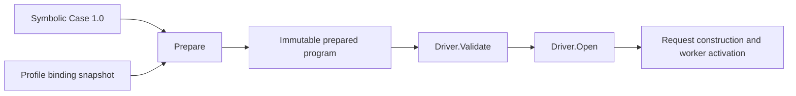

# Explicit environment binding for Testpilot Cases

> HTML render lens: [.flow/artifacts/fn-73-explicit-environment-binding-for/spec.html](../artifacts/fn-73-explicit-environment-binding-for/spec.html) — regenerable, markdown is the record. <!-- flow-next:artifact-link -->

## Goal & Context
<!-- scope: business -->

A checked Temporal Case must run in independently configured environments without editing its behavioral Program or Contract. Today the Temporal Producer embeds `default` in workflow-start and history requests and embeds a physical task queue in workflow-start requests, while worker activation resolves task-queue roles through separately supplied Driver options. Carrier checks reject disagreement, but selecting another Profile cannot retarget the Case consistently.

Introduce one explicit resource-binding mechanism shared by request construction and worker activation. The primary consumer is the checked Nexus3 success selection established by fn-68; the outcome is the same Case prepared against two environment snapshots, with consistent namespace, queue and Nexus endpoint identities and unchanged Contract semantics. This is a portability prerequisite for a later canary, not a canary implementation.

Implementation dependencies: fn-71-standalone-lean-testpilot-protocol (standalone Lean Testpilot IR and codec) supplies the protocol ownership boundary; fn-72-extract-the-reusable-temporal-testpilot (shared Temporal Driver extraction) supplies the final reusable Driver location. Final end-to-end acceptance depends on fn-68's checked Nexus3 lowering. This spec owns binding behavior across those boundaries, not their extraction or lowering work.



## Architecture & Data Models
<!-- scope: technical -->

Use declared symbolic text resources, resolved during immutable preparation. The Case declares required resource IDs; the environment supplies their concrete values in the Profile snapshot. Case declarations contain no physical resource names, credentials, client handles or callback URLs.

The new vocabulary is deliberately limited:

- `EnvironmentDefinition` contains `binding_id`, a nonempty unique symbolic ID. Its value type is text; no arbitrary values, expression evaluation, defaults or transformations are supported.
- `EnvironmentRef` contains `binding_id` and is a new Program expression variant permitted only as the direct value of a request assignment to a singular text field. It is not permitted in Contract expressions, guards, payload expressions or arbitrary nested expressions.
- Program gains `environment`, the list of definitions.
- RoleDefinition gains `namespace_binding_id` and `resource_binding_id`, each optional when the role has no such resource. A worker role uses the namespace reference. A task-queue role uses both references. An endpoint role may use a resource reference for a named Nexus endpoint; transport endpoint roles continue to carry transport authority in the Driver, with no transport URL supplied through this mechanism. Participant roles cannot use these fields in this slice.
- `ProfileSpec` gains `EnvironmentBindings`, a collection of `EnvironmentBinding` records containing `ID` and `Value` strings. Snapshot deep-copies the collection. The existing role policies continue to authorize roles and methods; binding values never grant new capabilities.

Namespace and task queue assignments in the Temporal Producer refer to the same IDs as its worker and task-queue declarations. Nexus endpoint role resolution uses the same snapshot's declared endpoint name. Workflow IDs and request IDs retain their existing Run-derived construction. Workflow/activity types, Nexus service and operation names, request/result payloads, limits, guards, Properties and Contract predicates remain behavioral inputs, not environment settings.

Preparation validates declarations and references, snapshots bindings, resolves text values into private prepared instruction inputs, and exposes immutable resolved role resource data through the existing PreparedProgram/EntrypointPlan facade. Request construction stays inside generic execution. The Driver consumes prepared role resources and never substitutes request fields. PreparedCase's source Snapshot remains the original symbolic Case; callers cannot mutate the private resolved plans.

The reusable Temporal Driver delivered by fn-72 (the sibling `temporal` package, retaining server/worker/delivery ownership) consumes this same Profile snapshot. Its constructor freezes and validates the worker configuration against that snapshot and its binding fingerprint; preflight must establish their agreement before Driver.Open. Case references select only resources explicitly supplied and authorized by the Profile, and cannot expand role/method authorization or introduce a physical resource absent from that snapshot. Resource-bearing Cases take physical namespace, task-queue and Nexus endpoint names only from the Profile snapshot. Live transport connections, SDK clients, callback transport and worker lifecycle settings remain explicit environment-owned Driver inputs. SDK clients must be configured by the caller for the bound namespace. The existing SDK client interface does not expose reliable namespace introspection, so this spec does not claim static validation of an opaque client's actual configuration. The caller that constructs it must derive its namespace from the same frozen binding snapshot; the two-environment live test verifies actual routing. Remote SDK misconfiguration remains an execution failure.

The shared Driver freezes `ProfileSpec.EnvironmentBindings`; `WorkerRoleID` remains a logical configuration input. Transport connections, SDK clients, callback authority, HTTP clients and lifecycle timeouts remain explicit. Constructor validation operates without target I/O; `Validate` handles prepared Program relationships; `Open` derives worker resources from immutable prepared metadata without mutating the prepared plan.

Prepared identity includes a deterministic binding fingerprint in addition to existing Profile and Catalog identities, so reusing a caller-supplied Profile identity cannot hide binding changes. Compute the fingerprint from canonically ordered, length-delimited binding ID/value pairs for the snapshot. PreparedCase preflight compares it with Driver identity before opening a session. Binding data remains immutable and contains no Run state.

## API Contracts
<!-- scope: technical -->

`Prepare(Case, Profile)` keeps its existing entry point and no-target-I/O contract. It either returns an immutable PreparedCase with all declared bindings resolved or returns a static admission error identifying the offending declaration, role or request assignment. Binding failures produce no Run and dispatch no effects.

The exhaustive additions to existing public data shapes are:

- Program: `environment: repeated EnvironmentDefinition`.
- EnvironmentDefinition: `binding_id: string`.
- ProgramExpression oneof: `environment: EnvironmentRef`.
- EnvironmentRef: `binding_id: string`.
- RoleDefinition: `namespace_binding_id: string`, `resource_binding_id: string`.
- ProfileSpec: `EnvironmentBindings: []EnvironmentBinding`.
- EnvironmentBinding: `ID: string`, `Value: string`.
- DriverIdentity: `Bindings: string`, a deterministic binding fingerprint.
- Driver: `Validate(context.Context, PreparedProgram) error`, a required static no-target-I/O validation hook.

PreparedCase.Run checks context, obtains Driver identity, compares the complete identity including bindings, invokes Driver.Validate, creates the monitor, and only then calls Driver.Open, passing the immutable prepared Program where applicable. Identity mismatch skips Validate. The hook may inspect only prepared metadata and frozen Driver configuration; it must not dial clients, provision resources, register workers, dispatch requests, or mutate the prepared plan. The shared Temporal Driver uses it for carrier/request/role relationships that require Temporal protocol knowledge. Generic admission remains scenario-neutral. Validation errors return no Session, Run or Verdict. This spec owns migration of all existing Driver implementations and test doubles to this hook; implementations with no extra static requirements explicitly accept the admitted Program. If fn-74's public preparation-error categories already exist when this work lands, binding failures use those categories; otherwise this work preserves current error behavior and leaves classification to fn-74 rather than introducing a competing taxonomy.

PreparedProgram exposes copied immutable role records containing role ID, kind, namespace/resource binding IDs and resolved namespace/resource text. Resolved request-assignment values remain private execution inputs; Validate inspects preserved symbolic assignment metadata alongside copied instruction source and prepared roles. Existing role-kind checks govern which fields are meaningful. For binding-bearing Cases, a bound task queue must share its namespace reference with its worker role, and reservation-carrier request assignments must reference the worker namespace and reserved entrypoint's task queue resource IDs. Checking reference identity, rather than merely equal current values, prevents a later rebind from silently separating previously equal literals. These relationships must be validated before Driver.Open: generic declaration/type closure belongs to Prepare, and Temporal method-specific carrier checks belong to the shared Driver.Validate hook. Legacy literal-only Cases retain their existing physical carrier validation and do not acquire a requirement to contain environment references.

The Temporal validation matrix for this slice is exact: `StartWorkflowExecution.namespace` references the reserved worker namespace binding; `StartWorkflowExecution.task_queue.name` references the reserved workflow entrypoint queue resource binding; `GetWorkflowExecutionHistory.namespace` references that same worker namespace binding; and `StartNexusOperation.endpoint_role_id` names an endpoint role with a resource binding. Resource-bearing RPC transport roles, missing endpoint resources, roles used incompatibly for both RPC transport and Nexus routing, equal physical text reached through different symbolic IDs, and all other unsupported role/resource combinations reject before Open.

All required IDs must be supplied exactly once; missing definitions, unused Program definitions, undeclared references, duplicate IDs, empty values, wrong destination type, unsupported expression placement and incompatible role resource declarations reject. Binding IDs use the existing nonempty identifier grammar. Exact Case 1.0 is the sole format. A resource-bearing Program must contain a complete closed binding graph; a resource-free Program may have an empty environment. Extra bindings declared in the Profile but unused by a Case are allowed so one authorized Profile can serve multiple Cases. Duplicate and empty supplied entries still reject. Program definitions and Profile bindings each use the existing 10,000-entry static collection ceiling, and validated UTF-8 IDs and values count toward a cumulative request-byte ceiling. Final materialized request size remains enforced during generic request construction because Run-derived values are not known at Prepare time.

This spec owns the complete wire evolution: new protobuf fields and generated Go, the standalone Lean IR/public codec delivered by fn-71, descriptor exports, compiler/admission support and cross-language fixtures. The symbolic binding contract is a breaking semantic change within exact Case 1.0; there is no legacy literal-resource path or Case 1.1 format. Admission rejects every other version and unknown behavior-affecting field.

## Edge Cases & Constraints
<!-- scope: technical -->

Binding is static configuration, not namespace/queue/endpoint provisioning or discovery. Provision resources before constructing the environment snapshot. Namespaces and named Nexus endpoint routes must already exist; remote absence or server rejection remains an ordinary execution failure, with existing cleanup and Verdict behavior. Local declaration errors must not be deferred to remote calls.

Two simultaneously prepared Cases may share a symbolic source while using disjoint physical resources. Caller mutations after Prepare or Driver construction cannot change either prepared execution. Repeated and concurrent Runs continue to use Run-derived workflow identities and independent monitors. This mechanism promises isolation for distinct bindings; it does not invent allocation, locks, or a guarantee for callers deliberately supplying identical physical resources.

A name used as test data remains a literal. Only explicit environment references are substituted. No string matching, global replacement, reflective request rewriting, hidden environment variables, configuration callbacks or arbitrary injection framework are introduced. The binding resolver is a small deterministic module tested independently of Temporal clients.

Bound the definition/entry counts using the existing static admission collection ceilings and bound text storage with the existing request-byte ceiling; preparation must reject oversized collections/values before materialization. Canonical fingerprinting covers every validated Profile binding, including unused bindings: sort by ID, hash a domain separator followed by fixed-width length-delimited ID/value byte pairs with SHA-256, and expose lowercase hexadecimal identity. Preparation is linear in declarations/references apart from deterministic sorting; it does no target I/O and retains no live Profile. Increased Run concurrency adds no shared mutable binding state. A crash does not require recovery of binding state; existing Run cleanup and external resource ownership apply.

Preserve existing comments when changing code. No new third-party dependency or proof axiom is needed. Follow Umpire ART-04, ART-09, ART-10, EVD-01 and EVD-17. Binding fingerprints describe environment identity and must not alter model Behavior Fingerprints or producer provenance claims.

Update active Umpire architecture, model, package and Nexus3 integration documentation for the binding boundary, exact Case 1.0 and the Validate-before-Open order. Historical design records stay unchanged. Use the existing focused protocol, authoring, fixture, model and live-test gates; broad generated-API drift verification and new CI coverage remain outside this spec.

## Quick commands
<!-- scope: technical -->

```bash
make proto
make umpire-check-testpilot-protocol
make umpire-check-testpilot-authoring
make umpire-check-case-runtime-conformance
TMPDIR=/private/tmp CGO_ENABLED=0 GOFLAGS=-p=1 mise exec -- go test -count=1 -tags test_dep ./common/testing/testpilot/... ./tests/testcore/testpilot/...
(cd model && mise exec -- lake build Testpilot TestpilotTests Temporal.Feature.Nexus3.Tests temporal-testpilot)
(cd model && mise exec -- lake exe modelLintTests)
make umpire-check-live-tests
make lint-model
make lint-code
```

## Acceptance Criteria
<!-- scope: both -->

- **R1:** The Case wire contract, standalone Lean IR and public codec represent the declared text bindings, direct request-assignment references and role references above, with deterministic cross-language fixtures. Exact Case 1.0 is the sole format; resource-free Programs may have an empty environment and resource-bearing Programs require a complete closed symbolic graph. Errors: unsupported version/fields, unused Program definitions, undeclared or duplicate IDs, wrong reference placement and wrong assignment type reject.
- **R2:** Prepare resolves all required resources from one immutable Profile snapshot, without target I/O, and request construction and prepared worker-role resources consume those same resolved values. Errors: malformed IDs or UTF-8, missing/empty/duplicate values, incompatible role fields, the 10,000-entry collection ceiling, cumulative binding-byte overflow and final materialized request overflow reject before dispatch; unused valid Profile bindings are allowed.
- **R3:** For resource-bearing Cases, Temporal worker, queue and reservation-carrier relationships are statically checked using their symbolic namespace/resource references before Driver.Open through the no-I/O Driver.Validate hook. Hook tests assert no Open, worker registration or target dispatch on rejection. Errors: inconsistent namespace references, request literals in a carrier field required to use a binding, conflicting queue references, absent endpoint resources and unsupported role combinations reject even if inconsistent references currently resolve to equal text.
- **R4:** PreparedCase and Driver identities include the canonical domain-separated SHA-256 binding fingerprint over all Profile bindings; caller mutation, reordered bindings and concurrent Runs cannot change the admitted snapshot. Errors: a different or unused binding value with the same declared Profile identity rejects at preflight before Open; equivalent reordered bindings produce equal lowercase-hex fingerprints; delimiter-containing values remain unambiguous; ordinary malformed Profile errors remain covered by R2.
- **R5:** The checked Nexus3 selection from fn-68 emits one symbolic Case whose exact 1.0 fixture bytes prepare and run against two distinct namespace/task-queue/Nexus endpoint bindings. Start/history requests, SDK workers and Nexus routing use the intended environment, resources remain isolated, and both Runs satisfy the same checked Contract with unchanged definition bindings, Behavior Fingerprints, Contract bytes and producer provenance meaning relative to the pre-migration semantic baseline. The Program and whole Case bytes may change once for the binding migration, then remain identical across environments. Errors: a deliberately inconsistent or missing binding rejects before any target dispatch; unavailable external resources fail through existing execution outcomes rather than fabricating a satisfied Verdict.
- **R6:** For resource-bearing Cases, the shared Temporal Driver and functional callers use the Profile binding snapshot as the sole physical resource-name source, with no request rewriting or independently maintained namespace/queue literals in the Producer. Behavioral names/payloads and existing Run-derived IDs remain unchanged. Errors: missing bound resources reject locally; remote SDK misconfiguration not observable from static configuration remains an execution error, not a claimed static guarantee.
- **R7:** Focused binding/admission/identity tests, independent resolver tests, cross-language codec fixtures, concurrent preparation/Run isolation tests and the two-environment integration regression pass. Run Go tests with `-tags test_dep`, adding `integration` only for integration tests; run applicable Lean build/lint and regeneration/staleness gates and `make lint-code`. Errors: any required failing gate blocks completion unless handled as a verified pre-existing failure under project policy; ordinary tests never invoke Lean or publish fixtures.

## Boundaries
<!-- scope: business -->

- No standalone Lean protocol extraction; fn-71-standalone-lean-testpilot-protocol owns that move.
- No shared Temporal Driver package extraction; fn-72-extract-the-reusable-temporal-testpilot owns that move.
- No new model scenarios, Actions, Properties or lowering language; fn-68 owns the checked Nexus3 slice.
- No worker activation helper redesign; fn-74-deepen-testpilot-worker-activation owns that work.
- No canary command, recurring scheduling, connection deployment or environment provisioning; fn-70 owns later canary delivery.
- No arbitrary configuration/injection engine, endpoint discovery, credentials in Cases, request rewriting or runtime rebinding.
- No new expression arithmetic, string interpolation, secret store or per-Run resource allocator.

## Decision Context
<!-- scope: both -->

Symbolic references resolved in Prepare provide a single resource source without changing behavioral interpretation. This is a narrow extension of the existing typed request assignments and role declarations, rather than a generic application configuration layer. Explicit text-only declarations avoid a dynamic value/type system; restricting use to resource request assignments and role references prevents environment values becoming hidden scenario inputs.

Environment-specific Case production was considered: it could derive literals consistently, but would require distinct artifacts and put deployment configuration into producer inputs. Driver request rewriting was rejected because EVD-17 assigns request construction to execution and the rewriting would conceal the executed Program. Keeping parallel Driver resource maps in the symbolic path was rejected because equal current values do not establish a durable shared binding. Legacy configuration remains an explicit compatibility mode for existing 1.0 Cases; it never fills a missing symbolic binding. The added static Driver validation hook is necessary because the existing identity method receives no prepared Program and Open is too late for the requested no-I/O rejection boundary. This adds one adapter obligation while preserving the external two-call execution facade.

The binding fingerprint makes immutable identity enforceable instead of relying entirely on a caller updating Profile.Identity. It adds deterministic preparation work and a small identity field, with no per-effect work. This spec deliberately owns its wire change after fn-71 so the public codec cannot silently drift. fn-72 owns package movement; this spec changes binding behavior in the resulting shared package. fn-68 supplies the semantic lowering; this spec demonstrates that changing deployment resources does not change that lowering's Contract meaning.

The repository's declined-decision ledger permits focused protobuf/Lean generation and fixture-staleness checks while declining a broad generated-API drift program and new CI coverage. This plan therefore strengthens the existing local regression path and documentation without adding a new CI policy surface.

## Early proof point
<!-- scope: both -->

Task fn-73-explicit-environment-binding-for.2 validates the core approach by resolving one symbolic Program against immutable, independently fingerprinted Profile snapshots while preserving the symbolic source.
If it fails, re-evaluate the Prepare-time resolver and prepared metadata boundary before adding the Driver validation and Temporal integration layers.

## Requirement coverage
<!-- scope: both -->

| Req | Description | Task(s) | Gap justification |
|-----|-------------|---------|-------------------|
| R1 | Versioned wire, Lean IR and codec represent symbolic bindings with deterministic compatibility | fn-73-explicit-environment-binding-for.1, fn-73-explicit-environment-binding-for.2, fn-73-explicit-environment-binding-for.5 | — |
| R2 | Prepare resolves one immutable binding snapshot into requests and prepared role resources | fn-73-explicit-environment-binding-for.2, fn-73-explicit-environment-binding-for.5 | — |
| R3 | Temporal symbolic relationships reject before Open through Driver.Validate | fn-73-explicit-environment-binding-for.3, fn-73-explicit-environment-binding-for.4 | — |
| R4 | Prepared and Driver identities carry a canonical immutable binding fingerprint | fn-73-explicit-environment-binding-for.2, fn-73-explicit-environment-binding-for.3 | — |
| R5 | One checked Nexus3 Case runs unchanged in two isolated environments | fn-73-explicit-environment-binding-for.5, fn-73-explicit-environment-binding-for.6 | — |
| R6 | Profile bindings are the sole physical resource-name source for resource-bearing Case 1.0 Programs | fn-73-explicit-environment-binding-for.4, fn-73-explicit-environment-binding-for.5 | — |
| R7 | Focused protocol, resolver, driver, fixture, concurrency, live and lint gates pass | fn-73-explicit-environment-binding-for.1, fn-73-explicit-environment-binding-for.2, fn-73-explicit-environment-binding-for.3, fn-73-explicit-environment-binding-for.4, fn-73-explicit-environment-binding-for.5, fn-73-explicit-environment-binding-for.6, fn-73-explicit-environment-binding-for.7 | — |
