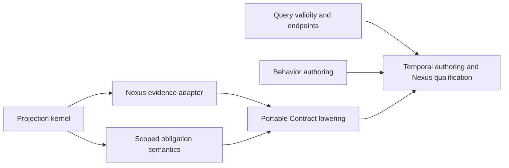

# Typed temporal authoring and checked scoped monitoring

Status: implementation specification; task breakdown, review, and implementation remain future work.
[UMPIRE4_SPEC](../../.plans/UMPIRE4_SPEC.md) remains the normative authority. Delivery order is
recorded in [UMPIRE4_ORDER](../../.plans/UMPIRE4_ORDER.md).

## Problem and outcome

An author should be able to say: “whenever cancellation is confirmed for an operation, observe
canceled or completed within one further transition of that operation.” The model evaluator and
the generated runtime Contract must interpret the same requirement, including correlation,
inclusive deadlines, incomplete evidence, and terminal outcomes.

Deliver five improvements: shared scoped-obligation semantics, explicit command/event ownership
and evidence projection, independently reported query validity, typed bounded temporal notation,
and a readable surface for existing Behavior constraints. Keep the current finite checker and the
Property/Behavior/Query separation; this is not a replacement modeling framework.

## Baseline and evidence

The [DSL experiment](../../.plans/UMPIRE_DSL_EXPERIMENT.md) provides bounded executable evidence: 449,376
monitor/reference comparisons, 1,340 evidence variants, and 3,510 comparisons against the checked
Umpire `eventuallyWithin` evaluator. Its Veil probe established a representation seam only;
full-checker compatibility and symbolic proofs were not established. Experimental syntax and
synthetic evidence are design references, not production contracts or a general compiler proof.

Re-anchor implementation on the current checkout. The fn-68 success Producer has since completed:
[`Nexus3/Testpilot.lean`](../../model/Temporal/Feature/Nexus3/Testpilot.lean) checks the completion
Query/witness before producing its Case. Preserve that working success path and its rejection
tests. Older draft statements that no Nexus3 Producer exists are not the baseline for this spec.
The generic Case compiler assembles supplied lowerings; scoped cancellation lowering still needs
its own checked implementation. Existing bounded Property semantics and Behavior constraints
must be reused rather than counted as missing functionality.

## Scope and ownership

| Owner | Responsibility |
| --- | --- |
| `Umpire.Property` | Typed scoped response clauses, their canonical meaning, passive obligation semantics, and compiler correspondence. |
| `Umpire.Behavior` | Checked declarative trace constraints and their authoring surface. |
| `Umpire.Query` and Planning | Endpoint policy, satisfiability, exercise coverage, answers, semantic scope, and search completeness. |
| Checked Target semantics | Authoritative transitions/outcomes and explicit input versus observation ownership. |
| `Temporal.Feature` | Product requirements and the Nexus cancellation example; no raw history or SDK dependencies. |
| `Temporal.System` and Implementation Links | Correlated implementation evidence, semantic-step projection, and evidence/clock preservation. |
| Temporal Producer | Checked lowering to one Program and Contract, supported capability bindings, and Umpire provenance. |
| Testpilot and its Driver | Generic admitted execution/evaluation and authorized SDK effects; no Nexus-specific scheduler or evaluator branches. |

The conceptual interfaces below describe responsibilities, not mandatory new packages. Extend
existing owners and reuse the semantic facade delivered by fn-75. Public definitions remain within
the languages required by AUT-07. No separately authored monitor language or handwritten second
behavioral model is introduced.

## Requirements

### DSL-1 — Shared scoped obligations

A checked bounded-response clause records a typed trigger predicate, response predicate, correlation
key, semantic clock, natural bound, and endpoint policy. Each trigger creates an independent
obligation with an immutable key and starting coordinate. Repeated triggers must not silently
coalesce; one response may discharge every matching obligation whose individual bound it meets.

Only admitted labeled transitions of the captured operation advance an operation-transition clock.
Other operations, duplicate reads, polling, and command acknowledgements contribute zero ticks.
A labeled self-loop counts even when the abstract state is unchanged. A response is valid on the
trigger coordinate or at the inclusive deadline. After processing the deadline's semantic step,
an unanswered obligation is violated; a later response cannot repair it.

Implement one passive obligation representation with a small `compile / consume / close` interface.
Model evaluation, incremental runtime monitoring, and offline Run evaluation must derive their
meaning from that representation. Preserve the existing Property evaluator as a checked semantic
reference: prove supported lowering agrees with its applicable closed-trace semantics, and state
the additional scoped projection and runtime-prefix correspondence explicitly. The experiment's
per-operation fixture filtering is not that production proof.

Closing a deliberately finite model trace with a live obligation violates the clause. Closing an
incomplete runtime prefix without semantic deadline evidence is inconclusive. A runtime timeout
or search budget must never supply the missing semantic step. Unsupported predicates, clocks,
scope projections, or lowerings reject the entire requested Case with the responsible clause ID.

### DSL-2 — Command ownership and evidence projection

Distinguish controllable command submission from confirmed semantic events at the checked
Target/Producer boundary. Selecting a model transition during exploration is not authority for a
Driver to force its outcome. Observation work must not cause the transition it observes.
Preserve SEM-07: the Target determines outcomes and resulting states; Behaviors never do.

For Nexus, submitting the operation's SDK cancellation request authorizes only that effect.
Only correlated cancellation-request confirmation establishes the corresponding model step.
Canceled and completed remain alternative model-owned resolutions. Keep per-operation cancellation
handles separate from workflow cancellation and activation shutdown. Add only the generic capability
needed for this Case if the current Program/Driver contract cannot express it, with static admission
and focused race tests; do not substitute another RPC or a success-only fixture.

Give evidence projection a deterministic, bounded, run-local `admit` interface. Its result retains
partial evidence, stutters, emits supported semantic steps, or rejects with a typed diagnostic.
Incomplete causal support must remain distinguishable from a justified stutter. An append may
release several buffered steps, but rejecting that append emits none of those new steps and leaves
previously accepted semantic state intact. Missing parents remain pending; known causal cycles,
conflicting identities, invalid transitions, and unsupported relevant evidence reject.

Correlate by declared namespace, workflow/run, operation/scheduled-event identities, and any required
request identity. Use source order and causal references, never cross-source wall-clock order.
Deduplicate by stable source-event identity within that scope. Retain exact supporting Run Event
sequences and transitive causal support for each emitted step. Projection declarations and their
behavior-affecting dependencies participate in provenance and compatibility checks.

Accepted Run Events are immutable. A later conflicting append is a separate rejected input, not
a revision of an accepted event. Report the projection failure separately, without erasing a
previously proved violation. Missing or contradictory evidence must never establish satisfaction.
Reset buffers, keys, counters, support, and errors for every Run.

### DSL-3 — Explicit query validity and endpoints

Report scenario satisfiability, requested trigger coverage, property answer, and search completeness
independently. Absence is established only by a complete search within the declared semantic scope;
otherwise retain unknown/limit-reached. A nonempty scenario with an absent conditional trigger is
distinct from an impossible scenario. Nonvacuity is an explicit query policy, not an implicit
requirement on every Property. A witness selected under that policy must itself exercise the trigger.

Keep witness and universal verification separate. A replay-valid counterexample remains evidence
even if broader search is incomplete; a universal success requires nonempty admissible behavior,
the requested exercise coverage, and complete absence of counterexamples or unresolved obligations.
An incomplete search cannot claim no witness, unsatisfiable, or verified.

Queries must carry an explicit endpoint interpretation: deliberately closed selected finite traces,
runtime prefixes, or terminal-model traces. Terminal-model eligibility follows the Target's declared
terminal semantics, including composition; it is not an undocumented “one operation finished” rule.
Runtime-prefix verification stays unanswered while selected prefixes retain unresolved obligations,
even when enumeration within the declared depth is complete. Preserve valid terminal states without
treating them as backend deadlock errors.

Receipts retain the checked declaration bindings, endpoint/coverage policies, semantic limits,
work limits, completeness, and assurance method. Preserve deterministic finite selection and Exact
Replay. Search may merge paths only when scenario progress, pending obligations, keys, and counting
coordinates are preserved; equal Target states alone are insufficient.

### DSL-4 — Typed bounded temporal authoring

Expose readable temporal notation inside `Umpire.Property` over the checked clause above. An
illustrative spelling is “whenever cancellationRequested, eventually canceled or completed,
for the same operation, within 1 operationTransition.” Final spelling must expose or unambiguously
resolve the key, clock, and endpoint policy; it must not infer milliseconds or unbounded liveness.

Typed constructors and surface notation must elaborate to identical checked meaning. Keep state,
step, trace, and evidence contexts distinct where those distinctions prevent an actual misuse.
Reject raw runtime evidence or command effects in Properties, wrong-scope predicates, incompatible
clock/bound combinations, ambiguous references, and unsupported formulas at their author locations.
Do not introduce a general expression framework merely to mirror existing records.

Ordinary authors must not maintain serialization tags, identity registries, proof plumbing, or
independently authored monitor rules for the supported fragment. Derived IDs and explicit semantic
choices remain inspectable. Existing bounded temporal operators retain their meaning.

### DSL-5 — Existing Behavior constraints

Expose allowed/forbidden actions, required named occurrences, occurrence bounds, ordering, and
adjacency through typed authoring forms that lower to existing checked Behavior declarations.
Ordering allows intervening activity permitted by the Behavior; adjacency requires consecutive
semantic occurrences. Neither form authorizes transitions absent from the Target.

Retain exact action sequences and exact traces for pinned regressions. Changing from exactness to
a broader constraint is a deliberate semantic edit, not a compatibility-preserving syntax rewrite.
Equivalent surface forms lowering to the same existing canonical declaration retain fingerprints.
True union, general interleaving composition, and repetition are outside this delivery even though
the experiment includes a small union constructor.

## Lowering, compatibility, and assurance

Keep one checked Target and one Property authority across planning, compilation, and replay
(SEM-01, SEM-04 through SEM-09, AUT-03 through AUT-08). Input/output ownership may be represented
without replacing the kernel's Action/Outcome representation. If implementation needs different
normative trace concepts, amend their definitions and cite the affected stable rules before that
cutover; this supporting spec does not silently override them.

Portable lowering must produce closed data admitted by the current Testpilot protocol, never Lean
callbacks or raw history access in a Monitor. Reuse Program projections and declared Observations.
Where scoped obligations require additional generic Contract capability, implement and version that
capability as part of scoped lowering, with Lean/Go agreement and unknown-version rejection. The
generic runtime must remain independent of Umpire/Temporal model meaning.

Prove the compiled deadline behavior respects Testpilot's expiry-before-transition ordering
(SEM-17, EVD-12) while accepting an inclusive-bound semantic response. Never implement operation
transitions as a wall-time horizon. Retain static Prepare rejection before Driver I/O, private
Slots, rule-local captures, independent execution/Contract bounds, immutable Run closure, and
cleanup/disposition separate from Verdict (ART-09 through ART-12, EVD-04 through EVD-18).

Preserve existing checked APIs, successful fixtures, fingerprints, and serialized bytes for unchanged
semantics. Give changed ownership, clocks, endpoint policies, and encoded lowering a named versioned
migration; stale readers must reject rather than reinterpret old data. Derived source locations,
comments, and declaration order remain nonsemantic. Preserve expert proof-carrying finite adapters.

Audit changed load-bearing declarations against their existing transitive axiom baseline. No new
custom axioms, placeholders, compiler-trust dependencies, toolchain changes, or third-party libraries
are authorized. Bounded differential tests supplement the required correspondence proofs; they
cannot replace them or strengthen claims into exhaustive implementation correctness.

## Delivery sequence and coordination

| Stage | Deliver | Dependencies |
| --- | --- | --- |
| D1 — Query validity | Checked endpoint/coverage policies, distinct outcomes, deterministic receipts, and focused finite tests. | Existing Query/Planning owners; no architecture-track prerequisite. |
| D2 — Behavior surface | Typed existing constraints, exact-regression compatibility, source diagnostics, and canonicalization checks. | Existing Behavior owner; can proceed alongside D1. |
| D3 — Event/evidence boundary | Checked ownership, scoped semantic-step projection, bounded atomic admission, and Nexus evidence mapping. | Can start alongside D1/D2; coordinate the Target seam with fn-75. |
| D4 — Shared scoped lowering | Obligation semantics and proofs, exact portable lowering, required generic cancellation/Contract support, and online/offline parity. | D3; production integration consumes fn-71's standalone protocol and fn-72's shared Driver. |
| D5 — Temporal surface and qualification | Final typed temporal forms, complete authored cancellation example, deterministic Cases, and live Driver demonstration. | D1/D2/D4. Constructor-level experiments can inform D3/D4 earlier. |

This work follows fn-73 and is a prerequisite for fn-70. Do not absorb environment binding,
shared Driver extraction, activation refactoring, or semantic inventory work. Coordinate overlapping
APIs with fn-74/75/76 and use their delivered contracts.
Keep the completed fn-68 success demonstration available throughout the migration.

[Typed operations and field-level Properties](fn-77-typed-operations-parameterized-actions.md) separately owns typed
API/SDK references, parameterized Action/outcome values, and field/capture expressions. D1/D2 and
label-only semantics remain independent; parameterized D3/D4/D5 variants consume that spec's O1/O2
contracts. Its O3 owns field-value lowering while D4 owns scoped temporal lowering. Reuse those
interfaces for the combined Nexus qualification instead of introducing duplicate expression or
request representations here.

## Implementation plan

Deliver the remaining work as three independently startable checked foundations followed by two
integration layers and final qualification:

1. Extend Query and Planning with explicit endpoint, coverage, answer, and completeness dimensions.
2. Add typed Behavior authoring forms that lower only to existing checked declarations.
3. Define the generic command/event ownership and transactional evidence-projection kernel, then
   adapt correlated Nexus history without moving feature meaning into Testpilot.
4. Build one scoped-obligation semantic kernel and compile its supported fragment into a closed,
   versioned Testpilot Contract capability evaluated identically by Lean and Go.
5. Expose the bounded temporal surface and qualify the authored Nexus cancellation Case through the
   reusable Temporal Driver.

The Query, Behavior, and generic projection tasks may proceed independently. Nexus projection
depends on the projection kernel; scoped semantics depend on that checked step/clock boundary; the
portable lowering depends on both. Final authoring and qualification depend on Query, Behavior, and
portable lowering. Parameterized field expressions remain owned by fn-77; this plan uses its
interfaces only if they have landed and otherwise completes the required label-only semantics.

## Decision context

- Reuse the existing checked Query, Behavior, Property, Target, Observation, and Testpilot owners;
  do not create a parallel modeling or monitor language.
- Keep Case 1.0 as the exact breaking baseline established by fn-73. Encode scoped monitoring as a
  closed capability with its own explicit version and reject unsupported versions before Driver I/O.
- Treat evidence projection as an atomic run-local deep module. A rejected append commits no newly
  released step or support and cannot revise previously accepted evidence or a proved violation.
- Process triggers before responses at one semantic coordinate so a same-coordinate response can
  discharge the newly created bound-zero obligation. Runtime expiry remains a separate ordering rule.
- Retain only declared and authorized evidence fields plus stable identities and causal support;
  raw SDK history remains inside the Temporal worker adapter.
- Broad generated Lean API drift verification and new CI coverage remain declined by
  `.flow/memory/declined/generated-api-drift-verification.md`; use existing focused generator,
  fixture, and staleness checks only.

## Risks and mitigations

- **Semantic divergence:** derive model, incremental, offline, and Go evaluation from one obligation
  transition contract; use correspondence proofs and independently derived differential fixtures.
- **Off-by-one deadlines:** pin bounds zero, one, and larger at trigger, inclusive deadline, and late
  coordinates, including labeled self-loops and Testpilot's expiry-before-transition runtime order.
- **Causal corruption or cross-run leakage:** require declared execution and operation identities,
  transactional admission, bounded buffers/support, immutable accepted events, and fresh state per Run.
- **Compatibility drift:** preserve unchanged canonical declarations, bytes, IDs, and fingerprints;
  reject stale semantic capability versions rather than reinterpret them.
- **Exponential search and retained evidence:** record semantic and work limits, exercise tenfold
  candidate/evidence/obligation loads, and fail closed without converting exhaustion into absence.

## Test notes

Use focused Lean guards and compile-failure tests for each checked owner, axiom audits for changed
load-bearing declarations, protocol and fixture compatibility tests, and Go tests with `-tags test_dep`.
The final task runs `make umpire-build-model`, `make umpire-check-regression`, `make lint-model`, and
`make lint-code`, plus the local integration test with both `test_dep` and `integration`. Tests and
validation must not promote fixtures implicitly.

## References

- Lean 4.33 macro and elaborator reference: https://lean-lang.org/doc/reference/4.33.0/Notations-and-Macros/
- Temporal Nexus lifecycle and cancellation semantics: https://github.com/temporalio/documentation/blob/main/docs/develop/go/nexus/feature-guide.mdx
- Temporal history event reference: https://github.com/temporalio/documentation/blob/main/docs/references/events.mdx
- Protobuf field presence and ProtoJSON evolution: https://protobuf.dev/programming-guides/field_presence/ and https://protobuf.dev/programming-guides/json/

## Acceptance criteria

- **R1:** D1 distinguishes impossible, nonempty-unexercised, satisfied witness, verified, counterexample, unresolved prefix, and work exhaustion. Test exact work-budget boundaries and counterexample discovery before exhaustion. Record scope and policy; no vacuous or incomplete green result.
- **R2:** D2 forms lower to the existing checked declarations with equal fingerprints. Positive and negative tests distinguish ordering from adjacency, exactness from permitted interleaving, and model-impossible occurrences. Existing exact regression fixtures remain unchanged.
- **R3:** Submission alone emits no cancellation-confirmed step. Both terminal resolutions remain admissible. Duplicate or irrelevant evidence stutters; missing parents remain pending; conflicting, wrong-operation, unsupported, cyclic, and invalid-step evidence reject without new emissions. Each emission retains its exact causal support.
- **R4:** Scoped obligations cover bounds zero, one, and larger; response at trigger, deadline, and too late; multiple independent triggers; one response discharging matching obligations; two interleaved operations; and counted self-loops. Invalid model traces reject before evaluation. Closed traces and runtime prefixes have their declared different outcomes.
- **R5:** Checked semantic and compiler relationships connect existing Property meaning, scoped projection, obligation execution, and the actual portable Contract. Incremental and whole-stream evaluation agree, including chunk boundaries inside partial evidence. Inclusive semantic deadlines remain correct under runtime expiry ordering. Unsupported requested forms reject the whole Case.
- **R6:** Compile-failure tests reject wrong contexts, keys, clocks, references, and unsupported temporal forms at the author expression. Typed and temporal forms have identical canonical meaning. A transition or property edit changes one semantic authority and generated consumers, without handwritten duplicate monitor behavior.
- **R7:** A checked Nexus cancellation Query produces a deterministic admitted Case using the existing public Prepare/Run facade and authorized Driver. A local integration Run recognizes either permitted resolution without forcing a selected model outcome. Controlled negative and incomplete evidence fixtures distinguish violation from inconclusive and preserve proof after cleanup failure.
- **R8:** Repeated and concurrent Runs have isolated captures and projection state plus immutable results. Buffer, work, and capture exhaustion fail closed; a stopped or lost execution never supplies a semantic deadline or automatic retry. Existing success, rejection, cross-language, identity, and lifecycle regressions pass.
- **R9:** Compatibility tests retain unchanged bytes, IDs, and fingerprints; reject stale or unsupported encodings; and verify any explicit migration. Trust audits, affected builds and lints, generated staleness checks, and scoped functional tests pass with their command evidence recorded.

## Verification and operational limits

Use focused Lean tests for the changed Property/Behavior/Query/Target/Producer owners, compile-failure
tests, axiom audits, and bounded differential tests against an independent reference. Test the actual
Go Contract evaluator with independently derived expected results and the existing real Driver path;
do not let a shared serialization or monitor bug become its own oracle. Run `make umpire-build-model`,
`make lint-model`, and `make lint-code`, plus affected fixture/staleness gates discovered from the
current Makefile. Go tests always include `-tags test_dep`; add `integration` only for integration
tests. Tests do not regenerate or promote fixtures implicitly.

Finite trace search remains exponential in branching and semantic depth. Record candidate counts,
work limits, retained state, and build/query costs for the existing success slice and the two-operation
case; do not infer production scalability from tiny examples. Projection buffers, live obligations,
support retention, and evaluator work have explicit configurable ceilings rather than copying the
prototype's two-key or 128-event constants. Exercise tenfold input and overlapping-obligation loads
to verify bounded failure and isolation. Hitting any work ceiling cannot prove success or absence.

No new persistent service or crash-recovery mechanism is introduced. An interrupted Run remains
incomplete unless existing recorded evidence already proves a violation; replay must be explicit and
uses immutable evidence. This work adds no implicit redispatch, credential handling, environment
policy, or production deployment.

## Deferred

Full Veil adoption or Veil-centered authoring, symbolic-first Target admission, general LTL,
unbounded liveness/fairness, general scenario algebra, and wholesale fingerprint redesign require
separate evidence and specs. Keep the finite checker as default. Do not import experiment packages
into production or claim the experiment's synthetic projection is a production Implementation Link.
