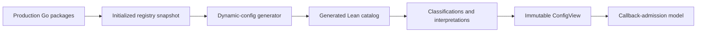

# Umpire Temporal dynamic config

## Overview

Import Temporal's initialized production dynamic-configuration registry into a complete,
deterministic Lean structural catalog, then layer explicit Umpire classifications,
interpretations, resolution, and one bounded callback-admission model over it. The generated
boundary records mechanical facts; handwritten Lean remains the only place that assigns product
meaning.

The design targets model authors and generator maintainers. It does not change live Temporal
configuration behavior, parse deployment YAML, execute arbitrary Go converters in Lean, or expose
a public configuration CLI.

## Goal & Context
<!-- scope: business -->

Umpire semantic models currently cannot name and resolve real Temporal dynamic settings without
manually duplicating registry declarations and precedence behavior. That makes model assumptions
easy to drift from production and leaves custom/default semantics implicit.

This spec establishes a reproducible structural import for every registered production setting and
a small typed authoring layer for only the settings a model deliberately interprets. The first
consumer is a pure callback-admission example that demonstrates context-sensitive resolution and
immutable configuration within one trace.

## Architecture & Data Models
<!-- scope: technical -->



The system has three ownership boundaries:

1. Temporal's Go constructors and registry own setting registration and expose a narrow, immutable
   metadata snapshot without changing runtime lookup behavior.
2. One generator discovers production registration packages, initializes them inside the module,
   validates and canonicalizes the snapshot, and exclusively owns the complete three-module Lean
   structural catalog.
3. Handwritten Umpire modules own classifications, typed interpretations, config-use identities,
   exact resolution, immutable views, and model-specific projections.

The generated vocabulary includes normalized keys, value schemas and canonical values, codec
classes, all current constraint dimensions and precedence policies, concrete/constrained/opaque
defaults, declarations, parity fixtures, descriptions, and mechanical semantic identities.
Descriptions remain inspectable metadata but do not change identity by themselves.

The handwritten vocabulary includes `SettingClassification`, `ConfigInterpretation`,
`ConfigUse`, structured validation/resolution errors, resolved entries, and `ConfigView`. A view is
keyed by config-use identity so one setting may resolve independently for multiple consumers or
contexts.

## API Contracts
<!-- scope: technical -->

- The Go metadata surface returns a deeply copied, read-only snapshot after static package
  initialization. It exposes canonical key, description, exact precedence, Go result-type identity,
  codec class, and concrete or constrained default metadata; it does not expose converter
  functions, mutable registry state, or YAML/client values.
- The generator command accepts an output root and rebuilds exactly the public facade, structural
  types module, and complete settings module. It discovers production compiled packages, excludes
  test-only registrations, blank-imports the discovered packages from a helper located inside the
  module, and treats the initialized runtime snapshot as authoritative.
- `ConfigInterpretation α` binds a generated key and expected structural schema to a checked
  decoder, optional replacement for one exact opaque imported default, and semantic digest.
- `ConfigUse α` binds a stable consumer identity to a classification, interpretation, concrete
  precedence context, sampling point, and change effect.
- Resolution validates the entire requested use/override set before planning, performs ordered
  exact-constraint lookup with override-versus-constrained-default interleaving at every policy
  level, and returns an immutable `ConfigView` or deterministic structured errors.
- Typed reads require the checked `ConfigUse α`; arbitrary string lookup and raw override maps are
  not model interfaces.
- Cross-language fixtures cover accepted canonical structural values and resolution semantics; they
  make no claim to parse YAML, reject duplicate overrides through the production resolver, or
  reproduce arbitrary Go converter fallback behavior. Duplicate exact constraints are a Lean-side
  structural validation error tested outside the production-resolver parity set.

The callback consumer uses this authored transition contract:

| Condition | Authored result |
| --- | --- |
| CHASM callbacks enabled at entity creation | Attach to the CHASM callback route; the captured route remains selected for the trace. |
| CHASM callbacks disabled at entity creation | Attach to the legacy HSM callback route, not a rejected admission. |
| Existing count plus requested count is at most the configured maximum | Admit; equality with the maximum is allowed. |
| Existing count plus requested count exceeds the maximum | Reject admission as over limit. |
| Address is exactly `temporal://system` or `temporal://internal` | Admit regardless of authored external-address rules; path, query, or fragment variants are not special. |
| External address is HTTP or HTTPS with a host and matches a whole-host wildcard rule | Admit when HTTPS is used, or when the matched rule explicitly allows insecure HTTP. |
| External address has an unknown scheme, missing host, no matching rule, or insecure HTTP without permission | Reject address admission. |
| Canonical address-rule input is malformed | Fail interpretation before model execution; unlike the raw Go converter, the Lean boundary does not silently discard malformed raw entries. |
| Destination context is missing | Fail config resolution before model execution. |
| Simulated dispatch elapsed time is less than the positive destination timeout | Dispatch completes within the bounded model. |
| Simulated dispatch elapsed time is equal to or greater than the timeout, or the timeout is non-positive | Produce the timeout outcome. |

## Approach

1. Add metadata contracts at registration time and prove complete, immutable snapshots across every
   constructor/default family.
2. Prove production-package discovery and initialized-registry projection into one canonical
   in-memory catalog, including bounded Go-computed parity fixtures.
3. Render and validate a complete candidate Lean tree, then publish the owned artifacts under a
   single-writer, path-contained, recoverable transaction.
4. Retain the generated catalog, add the generation-only build surface, and integrate the public
   structural import and ownership documentation.
5. Implement the authored classifications, interpretations, config uses, exact resolver, immutable
   view, diagnostics, identities, and Lean/parity coverage.
6. Add the bounded callback-admission consumer and verify different snapshots change outcomes while
   one trace remains pinned.

## Edge Cases & Constraints
<!-- scope: technical -->

- Registry snapshots preserve the existing static-initialization/query boundary. Empty snapshots,
  post-query registration failures, unknown precedence, missing key/type metadata, and
  case-colliding normalized keys fail projection rather than yielding a partial catalog.
- Every current value/default/constraint shape remains visible. A faithful value that cannot be
  projected becomes a typed opaque default with stable reason and provenance; unsupported policy or
  structurally incoherent metadata is a hard error and never grounds omission.
- Canonical ordering is independent of Go map, source, package, override, and requested-use order.
  Duplicate exact constraints are rejected rather than resolved by input order.
- Constraint matching includes set and unset dimensions exactly. Invalid dimensions, incomplete
  contexts, malformed canonical values, and schema disagreement are model errors; the Lean boundary
  does not emulate Go converter fallback.
- Candidate rendering and Lean validation complete before any owned destination is replaced.
  Publication validates realpath/symlink containment, stages on the destination filesystem, excludes
  unrelated authored siblings, serializes concurrent writers, and rolls back handled failures.
  Interrupted publication is detected and recovered before a later invocation may report success;
  the design does not claim portable multi-file atomic rename.
- Generated output is byte-identical for the same initialized registry. Documentation text is
  retained as metadata while semantic identity depends only on mechanical meaning-bearing fields.
- `ConfigView` is immutable for one experiment. Sampling/change metadata is descriptive; no live
  configuration update action or restart simulation enters the trace.
- Shared model-root and build integration occurs only after the semantic-authoring dependency has
  finished its currently owned aggregation work.

## Non-functional targets

- One package-loading/initialization pass and one frozen snapshot per generator invocation.
- Complete catalog generation is deterministic across repeated runs and source iteration order.
- Generator and resolver diagnostics are stable, structured, stage-specific, and identify the
  package, setting/use identity, offending metadata/value/context, and related identities where
  applicable.
- No new third-party dependency is introduced; existing comments and setting behavior are preserved.
- Resolution happens once before planning/transition enumeration, so transition kernels consume
  typed projections rather than registry-scale maps.

## Quick commands

```bash
go test -count=1 -tags test_dep ./common/dynamicconfig ./cmd/tools/genleandynamicconfig
make umpire-gen-dynamic-config
cd model && mise exec -- lake build
make lint-code
```

## Test notes

- Go constructor/snapshot fixtures cover scalar, structural, custom-converter, constrained-default,
  and every precedence/constraint family, including mutation-after-snapshot and collision failures.
- Generator tests cover discovery, test exclusion, unloadable packages, zero/incomplete catalogs,
  canonical encodings, repeated deterministic rendering, managed-path containment, concurrent
  invocation, candidate validation, rollback, and interrupted-publication recovery.
- Go/Lean parity fixtures use real registered settings and cover all eight policies, exact unset
  dimensions, specific/fallback matches, and constrained-default interleaving. Duplicate exact
  constraints are covered separately as Lean structural-validation failures because the production
  collection resolver is first-match rather than duplicate-rejecting.
- Lean tests cover every structured diagnostic, schema and opaque-default behavior, order
  independence, same-key/multi-use resolution, digest provenance, callback address interpretation,
  callback outcomes across snapshots, and within-trace immutability.

## Rollout and rollback

Land the work in dependency order. The Go snapshot is additive and unused by production runtime
paths until the generator consumes it. The generated facade is integrated only after candidate
generation and Lean elaboration pass. The authored resolver is then built against that retained
catalog, followed by the isolated callback consumer.

Rollback removes the generation/build integration and handwritten consumers before removing the
additive registry metadata surface. Generated artifacts are exclusively owned and may be removed as
one unit; runtime dynamic-config behavior and existing settings remain unchanged throughout.

## Risks and mitigations

- **Incomplete package initialization:** typed discovery is only an initializer inventory; the
  runtime snapshot remains authoritative, and unloadable/discovered-but-unregistered packages fail.
- **False converter equivalence:** custom converters remain opaque until a handwritten checked
  interpretation supplies canonical model meaning.
- **Mixed generated tree:** complete staging, validation, locking, managed-path containment,
  rollback, and interruption recovery guard publication without claiming unsupported filesystem
  atomicity.
- **Semantic drift hidden in prose:** descriptions are excluded from semantic identity, while
  schema/default/precedence and interpretation digests invalidate stale authored meaning.
- **Scope expansion into operations:** the structural boundary accepts canonical values only and
  exposes no YAML, live-client, environment-preset, or public CLI capability.

## Acceptance Criteria
<!-- scope: both -->

- **R1:** Temporal settings expose a complete, deeply immutable metadata snapshot covering every
  scalar, structural, custom-converter, and constrained-default constructor family without changing
  existing registration, lookup, validation, or comments. Errors: empty/incomplete snapshots,
  post-query registration, missing key/type metadata, and mutation/case-collision attempts are
  rejected or preserve the existing invariant without leaking partial state.
- **R2:** One generation invocation discovers every production registration package, excludes
  test-only registrations, initializes packages under valid Go internal-import rules, and projects
  the authoritative runtime snapshot without silently dropping a setting. Errors: package load,
  helper build/run, initialization panic, missing registration, zero catalog, and discovery mismatch
  fail with stage/package/setting diagnostics before publication.
- **R3:** The generated structural catalog represents normalized unique keys, every current value
  schema, codec class, filter dimension, all eight exact precedence policies, concrete/constrained/
  opaque defaults, descriptions, provenance, canonical identities, and ordered complete settings.
  Errors: unknown precedence, illegal constraint shapes, duplicate normalized keys/constraints,
  incoherent defaults, unsupported canonical values, and nondeterministic encodings fail; a
  faithfully unprojectable default remains visible as opaque rather than being omitted.
- **R4:** Generation renders, Lean-validates, and publishes exactly one coherent three-module owned
  catalog, with byte-identical output for an unchanged registry and no handwritten content inside
  the owned boundary. Errors: unsafe/symlinked output paths, unexpected artifact sets, invalid Lean,
  concurrent writers, handled publication failures, and detected interrupted publication never
  report mixed/partial output as success and preserve or recover the prior coherent tree.
- **R5:** Handwritten classifications, typed interpretations, config uses, and semantic digests
  admit only generated keys with explicitly authored meaning, including exact opaque-default
  replacements and consumer-specific sampling/change metadata. Errors: unknown/unclassified keys,
  empty classifications, missing/incompatible interpretations, schema/default drift, malformed uses,
  and decoder failures return deterministic structured errors before planning.
- **R6:** Resolution builds exact ordered constraints for each policy, interleaves explicit
  overrides with constrained defaults at every level, falls back to simple defaults only after all
  levels, and returns an immutable use-keyed view with source, matched constraints, context, digests,
  sampling, and change metadata. Errors: illegal/duplicate constraints, incomplete contexts,
  malformed canonical values, schema mismatches, and selected opaque defaults fail deterministically;
  input order never selects a winner.
- **R7:** Bounded Go-computed and Lean-consumed fixtures agree for global, namespace, namespace-ID,
  task-queue, shard-ID, task-type, destination, and CHASM-task-type resolution, including exact unset
  dimensions, specific/fallback matches, and override/constrained-default ordering. Errors: any
  fixture schema, catalog identity, selected source/constraint, or expected canonical value mismatch
  fails focused verification rather than being regenerated as an accepted baseline; duplicate exact
  constraints fail Lean structural validation outside this production-resolver parity set.
- **R8:** A pure callback-admission model consumes typed values for CHASM callback enablement,
  maximum callbacks, allowed addresses, and destination timeout; different immutable snapshots can
  change admission/dispatch outcomes while one trace stays pinned to one snapshot. The authored
  transition table is binding: disabled-at-creation selects legacy HSM routing; count equality is
  admitted and only overflow rejects; the two exact Temporal URLs bypass external rules; whole-host
  wildcards and insecure HTTP follow the matched rule; missing destination or malformed canonical
  rules fail before execution; elapsed time equal to the timeout is timed out. Errors: unknown URL
  schemes, missing hosts, unmatched/insecure addresses, over-limit admission, missing destination,
  malformed rules, and non-positive/equal-or-greater timeout boundaries produce their table-defined
  error or outcome without YAML, live server, restart, or mid-trace mutation behavior.
- **R9:** The repository exposes generation-only build integration, imports the public structural
  catalog and focused experiment tests from the model roots, and documents generated-versus-authored
  ownership plus focused verification commands. Errors introduced by this work in Go tests,
  generation, Lean build, formatting, or linting block completion; inherited repository lint debt
  must be re-run, recorded, and shown unchanged, with every changed package or file clean. No
  separate runtime error surface exists beyond R1-R8.

## Boundaries
<!-- scope: business -->

- Do not parse Temporal dynamic-config YAML or accept raw deployment values in Lean.
- Do not translate, execute, or prove arbitrary Go custom converters in Lean.
- Do not infer classifications, interpretations, sampling, or restart behavior from descriptions or
  call sites, and do not require classification of the complete catalog.
- Do not mutate configuration during a trace, simulate restart/live update, apply overrides to a
  live server, or add runtime environment presets.
- Do not add a public Umpire config CLI or change the existing Protobuf importer.
- Do not add `make umpire-check-dynamic-config`, repository generated-drift verification, GitHub
  Actions, or any other CI wiring.
- Do not add stable generator count/digest output as a public command contract.

## Decision Context
<!-- scope: both — conditionally substructured -->

### Motivation
<!-- scope: business -->

Using the initialized registry imports what production Go actually declared and evaluated, while
explicit Lean interpretations keep model claims reviewable and intentionally partial. The callback
example is the smallest concrete consumer that exercises feature, validation, timing, custom-value,
and multiple precedence semantics without bringing live infrastructure into the model.

### Implementation Tradeoffs
<!-- scope: technical -->

- Runtime registry projection is preferred over a second Go source evaluator for computed defaults,
  generics, and constructor behavior; typed package analysis only discovers what must initialize.
- A closed canonical structural schema eliminates YAML/parser/converter authority from Lean instead
  of managing it with a broader trust layer.
- Opaque defaults preserve catalog completeness without making unsound semantic claims; authored
  replacements bind to imported identity so Go drift invalidates them.
- Canonical malformed address rules fail authored interpretation instead of being silently ignored
  like malformed raw entries in the Go converter; raw conversion is outside the Lean trust boundary.
- Use-keyed views cost more metadata than key-only maps but correctly represent multiple consumers
  and contexts for one Temporal setting.
- Recoverable staged publication is preferred over assuming portable directory-rename atomicity.
- Generated drift verification and CI remain excluded per
  `.flow/memory/declined/generated-api-drift-verification.md` and the user's explicit decision for
  this plan; focused generator and Lean tests provide implementation verification without a retained
  check target.

## Open questions

None. The user explicitly resolved the only prior policy question by keeping generated drift-check
and CI work out of scope.

## Early proof point

Task `fn-8-umpire-temporal-dynamic-config.2` validates the core approach by discovering production
registration packages and projecting one complete initialized runtime snapshot into a canonical
catalog with all eight policies. If it fails, re-evaluate the registry-driven import boundary before
continuing with rendering, authored semantics, or callback-model tasks.

## References

- [Temporal dynamic configuration source contract](https://github.com/temporalio/temporal/blob/main/common/dynamicconfig/collection.go)
- [Temporal dynamic configuration operational format](https://github.com/temporalio/temporal/blob/main/config/dynamicconfig/README.md) (constraint list is stale; source is authoritative)
- [Go package initialization](https://go.dev/ref/spec#Program_initialization_and_execution)
- [Go internal package rules](https://go.dev/cmd/go/#hdr-Internal_Directories)
- [`go/packages` loading API](https://pkg.go.dev/golang.org/x/tools/go/packages)
- [`os.Rename` portability contract](https://pkg.go.dev/os#Rename)
- [Lean elaboration and kernel checking](https://lean-lang.org/doc/reference/latest/Elaboration-and-Compilation/)

## Requirement coverage

| Req | Description | Task(s) | Gap justification |
|-----|-------------|---------|-------------------|
| R1 | Immutable complete Go metadata snapshot | fn-8-umpire-temporal-dynamic-config.1 | — |
| R2 | Production discovery and runtime projection | fn-8-umpire-temporal-dynamic-config.2 | — |
| R3 | Complete canonical structural catalog | fn-8-umpire-temporal-dynamic-config.1, fn-8-umpire-temporal-dynamic-config.2, fn-8-umpire-temporal-dynamic-config.3 | — |
| R4 | Deterministic validated recoverable publication | fn-8-umpire-temporal-dynamic-config.3 | — |
| R5 | Authored classifications, interpretations, and uses | fn-8-umpire-temporal-dynamic-config.5 | — |
| R6 | Exact resolution and immutable ConfigView | fn-8-umpire-temporal-dynamic-config.5 | — |
| R7 | Go/Lean parity for all eight policies | fn-8-umpire-temporal-dynamic-config.2, fn-8-umpire-temporal-dynamic-config.3, fn-8-umpire-temporal-dynamic-config.5 | — |
| R8 | Callback-admission consumer and immutable snapshots | fn-8-umpire-temporal-dynamic-config.6 | — |
| R9 | Generation-only integration, model imports, docs, verification | fn-8-umpire-temporal-dynamic-config.4, fn-8-umpire-temporal-dynamic-config.6 | — |
