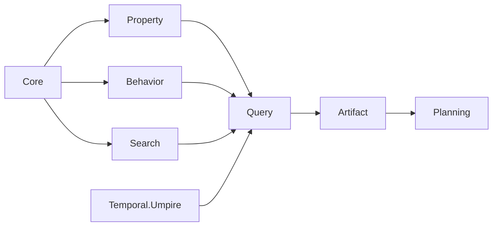

# Umpire reusable DSL package split

> HTML render lens: local file `.flow/artifacts/fn-9-umpire-reusable-dsl-package-split/spec.html` — open from the repository checkout; regenerable, markdown is the record. <!-- flow-next:artifact-link -->

## Conversation Evidence

> user (turn 1, part 1): "can we split the DSLs we created? or rather make them sub packages under model/Umpire? meaning that we wwant to separate the Temporal-specifics from the general re-usableae abstractions."
> user (turn 1, part 2): "and within model/Umpire we can create separate packages for each DSL (but also ofc accomomdate for shared concerns outside of the DSL where needed)."
> user (earlier turn): "keep properties pure and reusable, then separately define how execution evidence is interpreted into semantic observations"
> user (earlier turn): "yes, any model makefile changes should go to top makefile"
> user (turn 2): "1. One Lake library named Umpire"
> user (turn 3): "reusable types move to Umpire.*, Temporal-specific scenarios/adapters move to Temporal.Umpire.*, and the old Temporal.Experiment.* interface is removed rather than retained through compatibility aliases"
> user (turn 7): "1. Vertical DSL modules plus a shared core — recommended"
> user (turn 15): "approved"
> user (turn 16): "3. proceed-anyway"

## Goal & Context
<!-- scope: business -->
<!-- Source-tag breakdown: 70% [user] / 30% [paraphrase] -->

The implemented semantic authoring and planning languages are reusable Umpire abstractions, but
their current module and namespace placement presents them as Temporal-specific. Extract them into
one independently importable Umpire library so Property, Behavior, Query, artifacts, and planning
can be reused by Temporal and by other domains without creating a second authoring path.

This is a prerequisite package extraction after the semantic authoring work and before observation,
discovery, or promotion adds more declarations to the namespace being removed.

## Overview

Perform an additive, dependency-ordered migration: establish the reusable Core first; move each
vertical DSL and planning layer behind it; migrate generic and Temporal scenarios; then switch the
stable build/documentation surface and delete the old tree. Intermediate tasks keep the existing
regression command green. The final task leaves one public interface and no compatibility facade.

## Architecture & Data Models
<!-- scope: technical -->
<!-- Source-tag breakdown: 100% [paraphrase] -->



Core owns semantic identity, values, traces, kernels, capabilities, and checked targets. Property and
Behavior remain independent sibling DSLs. Search owns data-only bounds, policies, and selection
metadata. Query is the first combining layer. Artifact and Planning remain downstream, with planning
completion authority private. Temporal adapters depend on these modules in one direction.

## Approach

1. Add the single Umpire library and move the shared Core plus its deterministic tests.
2. Move Property and Behavior intact and extract the data-only Search contract from Query.
3. Move Query against the three sibling inputs and retain its validation/completeness contracts.
4. Move Artifact and Planning, including planner protocol types and private finalization authority.
5. Promote the switch scenario and its tests into a domain-neutral Umpire example.
6. Move Nexus caller-closure, cross-scenario tests, and the inspector under Temporal Umpire; add the
   final test and executable targets while the old targets still build.
7. Switch the stable regression recipe and user documentation, remove old targets/modules/facades,
   and enforce the final one-way import and stale-interface checks.

## API Contracts
<!-- scope: technical -->

- `Umpire.Core`, `Umpire.Property`, `Umpire.Behavior`, `Umpire.Search`, `Umpire.Query`,
  `Umpire.Artifact`, and `Umpire.Planning` are independently importable modules in one Lake library
  named `Umpire`. [paraphrase]
- `UmpireTests` owns generic module and switch-example tests. `TemporalUmpireTests` owns Nexus and
  cross-scenario integration tests. [paraphrase]
- `temporal-umpire-inspect` remains the Temporal-owned inspector and registers both the Nexus scenario
  and the generic switch example. [paraphrase]
- Public reusable declarations live directly under `Umpire.*`; Temporal-specific scenario and
  inspection declarations live under `Temporal.Umpire.*`. [paraphrase]
- Property and Behavior keep their structured error families. Planning keeps invalid,
  unsatisfiable, budget-exhausted, found, and verified outcomes distinct. [paraphrase]
- Checked-in target-state JSON fixtures for switch and Nexus are the reproducible migration oracle;
  each is derived from the pre-move inspector output by changing only its scenario source path.
  [paraphrase]
- `make umpire-check-regression` remains the stable user and automation entry point. [user]

## Quick commands

```bash
make umpire-check-regression
```

## Edge Cases & Constraints
<!-- scope: technical -->

- Intermediate tasks add the new modules before the final deletion so focused new-target builds and
  the existing stable regression command can both remain green. [paraphrase]
- Moving source files changes only the truthful switch and Nexus provenance locations; declaration
  identity, semantic digest, format version, validation order, and deterministic planner order stay
  unchanged. [paraphrase]
- Canonical artifact bytes may differ only in those explicit source locations. No general
  provenance-difference allowlist or migration format is introduced. [paraphrase]
- Before old targets are deleted, capture both old inspector outputs, apply exactly the two expected
  source-path substitutions, and persist the results as target-state golden fixtures. The new
  inspector must match those fixtures byte-for-byte, and the final suites retain literal identity,
  digest, format-version, and portable-field assertions. [paraphrase]
- Import isolation is checked both by Lean modules compiled from narrow imports and by a source scan
  preventing Umpire imports of Temporal or Nexus. [paraphrase]
- Stale-interface scanning covers live Lean sources, the stable Make recipe, and current model user
  documentation. Historical design and Flow records may describe the migration. [paraphrase]
- Planner result construction and finalization remain private so external callers cannot manufacture
  a verified result. [paraphrase]
- Existing comments move with their declarations unchanged unless a source-path statement must be
  updated to remain truthful. [user]
- Lake and Make propagate ordinary missing-target/build failures; no compatibility diagnostic, old
  target alias, cache migration, or required clean build is added. [paraphrase]

## Boundaries
<!-- scope: business -->

- Do not retain compatibility aliases, old Lake targets, or a second public authoring path. [user]
- Do not implement or scaffold an empty Observation module; its real interface belongs to its own
  feature. [paraphrase]
- Do not redesign `SemanticValue`, add DSL semantics, or change query/planner behavior during the
  move. [paraphrase]
- Do not use, inspect, depend on, reuse, or reference the excluded legacy implementation. [user]
- Do not create multiple Lake libraries or separate manifests for individual DSLs. [user]
- Do not add or extend a model-local Makefile. [user]
- Do not rewrite historical design/spec records merely to erase old names. [paraphrase]
- Confine investigation and implementation to the task-listed files under `model/Umpire/**`,
  `model/Temporal/Umpire/**`, the interface being replaced under `model/Temporal/Experiment/**`,
  their aggregate/build roots, the root `Makefile`, `model/README.md`, and `.plans/UMPIRE_DSL.md`.
  Do not run repository-wide implementation searches or inspect/reuse implementations outside this
  positive allowlist. [user]

## Decision Context
<!-- scope: both — conditionally substructured -->

- Vertical DSL modules keep declarations, validation, evaluation, diagnostics, and canonical meaning
  local to the language that owns them; horizontal technical layers were rejected as shallow.
  [paraphrase]
- One Lake library with independently importable modules enforces the desired seams without
  multiplying manifests and build configuration. [paraphrase]
- The Temporal inspector continues to register the generic switch because this preserves one stable
  regression/inspection entry point while maintaining the allowed Temporal-to-Umpire dependency.
  [paraphrase]
- `UmpireTests`, `TemporalUmpireTests`, and `temporal-umpire-inspect` replace the old internal targets;
  only the stable Make command is a compatibility contract. [paraphrase]
- Narrow-import Lean guards plus a live-source scan were chosen over a new dependency-analysis tool.
  [paraphrase]
- Generalizing the semantic value representation, adding a provenance migration mechanism, or
  implementing Observation during the move was rejected as unrelated semantic work. [paraphrase]

## Acceptance Criteria
<!-- scope: both -->

- **R1:** One Lake library named `Umpire` provides the Core, Property, Behavior, Search, Query,
  Artifact, and Planning modules with the specified acyclic import direction. Errors: a forbidden
  dependency or missing independently importable module fails the build/import-graph check.
  [paraphrase]
- **R2:** All reusable declarations move to `Umpire.*`, all Temporal-specific scenarios/adapters move
  to `Temporal.Umpire.*`, and the old interface is completely removed. Errors: any stale live module,
  import, namespace use, alias, re-export, or old Lake target fails the cutover checks. [paraphrase]
- **R3:** The domain-neutral switch example uses only Umpire modules, while the Nexus caller-closure
  scenario and inspector remain Temporal-owned and import Umpire in one direction. Errors: any
  Umpire import of Temporal or Nexus fails the dependency check. [paraphrase]
- **R4:** The extraction preserves declaration identities, semantic digests, format versions,
  validation behavior, planner ordering, query outcomes, and portable artifact fields. Errors:
  target-state golden fixtures derived before deletion differ by exactly the two truthful scenario
  source-path substitutions, and any other old-versus-new or fixture difference fails. [paraphrase]
- **R5:** Each DSL retains its structured validation errors and Planning retains private completion
  authority and distinct invalid, unsatisfiable, budget-exhausted, found, and verified outcomes.
  Errors: external finalization/forgery guards and negative declaration tests must continue to fail
  closed. [paraphrase]
- **R6:** Generic tests move to `UmpireTests`, Temporal scenario tests move to
  `TemporalUmpireTests`, both scenarios remain available through `temporal-umpire-inspect`, and the
  stable regression command passes. Errors: import-isolation, stale-interface,
  deterministic-output, missing-target, or regression failures return non-zero; no model-local
  Makefile is introduced. [paraphrase]
- **R7:** The extraction does not add Observation semantics, redesign semantic values, create a
  procedural Drive DSL, rewrite historical records, or use the excluded legacy implementation.
  All investigation and implementation stay inside the explicit positive allowlist above. Errors:
  any out-of-allowlist inspection/reuse or such addition is out of scope and must stop or be removed
  before completion. [paraphrase]

## Early proof point

Task `fn-9-umpire-reusable-dsl-package-split.1` proves that the new Lake library can compile Core and
its deterministic tests without importing Temporal or Nexus while the existing regression remains
green. If it fails, re-evaluate the physical library seam before migrating any dependent DSL.

## References

- `fn-3-umpire-semantic-authoring-and-planning` — completed semantic foundation being relocated.
- `fn-4-umpire-observation-and-semantic-verdicts` — reverse dependency; must author against the final
  Umpire namespace.
- `fn-5-umpire-discovery-promotion-and-artifact` — reverse dependency; must index and persist the final
  public namespace.
- Accepted package architecture in the Umpire DSL design record, section 21.

## Requirement coverage

| Req | Description | Task(s) | Gap justification |
|---|---|---|---|
| R1 | Single Umpire library and acyclic vertical modules | fn-9-umpire-reusable-dsl-package-split.1, .2, .3, .4 | — |
| R2 | Clean namespace and target replacement | fn-9-umpire-reusable-dsl-package-split.7 | — |
| R3 | Generic switch and Temporal-owned adapters | fn-9-umpire-reusable-dsl-package-split.5, .6, .7 | — |
| R4 | Semantic and canonical preservation | fn-9-umpire-reusable-dsl-package-split.1, .2, .3, .4, .5, .6, .7 | — |
| R5 | Structured failures and private completion authority | fn-9-umpire-reusable-dsl-package-split.2, .3, .4 | — |
| R6 | Ownership-aware tests, inspector, and stable regression | fn-9-umpire-reusable-dsl-package-split.5, .6, .7 | — |
| R7 | Scope exclusions remain absent | fn-9-umpire-reusable-dsl-package-split.7 | — |
