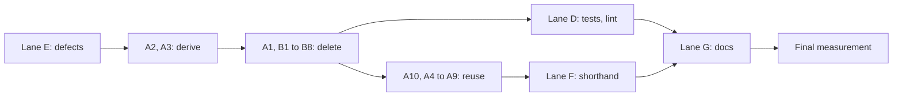

# fn-93-simplify-the-lean-model Simplify the Lean model

## Closed: won't do

Closed on 2026-10-01 as won't-do by the owner. The Lean model is retired in favour of the Scala front end (`model/scalav2`), and the Lean toolchain is removed from this checkout. This specification is a historical record and must not be implemented. Its unfinished tasks are blocked rather than done because the tracker has no won't-do state.

> HTML render lens (local): open `.flow/artifacts/fn-93-simplify-the-lean-model/spec.html` — regenerable, markdown is the record. <!-- flow-next:artifact-link -->

## Umpire4 architecture reconciliation

This spec is a simplification campaign over `model/`. It adds no concept and removes none from the
authoring surface. Its lanes delete code that already-retired rules left behind, derive what is
written out by hand today, and shorten tests and authoring. Purely generated code
(`Temporal.API`, `Temporal.DynamicConfig`) is out of scope. Two rule texts need a restatement
drafted under GOV-02, and only if the owner takes the decisions D1 and D2 below:

- **Glossary, Variations.** fn-33's amendment already says Exploration no longer draws candidates
  from `Umpire.VariationSpace`. Deleting the package (lane B, D1) removes the Variations concept and
  `Umpire.Variations` from the owner list under "Where things live".
- **Glossary, Implementation Link / SEM-08.** SEM-08 stays: `Umpire.ImplementationLink.Language`,
  `Refinement` and the Nexus link declaration stay. Only the offline evaluation path that applies a
  link to an observed trace goes (D2). EVD-02, EVD-03, EVD-09 and ART-08 already retire the
  concepts that path implements: legacy Run evaluation, Evidence normalization, Evidence Links and
  closed portable evaluation. The restatement says the link is checked by refinement, not by
  replaying an observed trace.

`tools/umpire/vocabulary/spec_names_test.go` requires every backticked Lean name in
`UMPIRE4_SPEC.md` to exist in `model/`, and it has no retired-name escape. So the deletion that
removes a name also rewrites the descriptive text that cites it (the "Where things live" owner
list, the Variations, Exploration and Evidence glossary entries) in the same commit. Rule text
proper (SEM-08) is never rewritten in place: it gets a `*Restatement (drafted by fn-93; awaiting
GOV-02 approval.)*` paragraph, as fn-87 did, and that paragraph cites only names that survive.

MOD-01, MOD-03, MOD-09, MOD-10, SEM-01 to SEM-03, SEM-16 to SEM-20, ART-09 and ART-11 hold
unchanged. Every lane keeps every surviving Case fixture, golden, Definition ID and Behavior
Fingerprint byte-identical.

## Goal & Context
<!-- scope: business -->

`model/` holds 128,630 Lean lines in 366 files (measured 2026-09-26, `.lake/` excluded):

| Part | Lines | Notes |
| --- | --- | --- |
| Generated (`Temporal/API.lean`, `Temporal/API/Types.lean`, `Temporal/DynamicConfig/Settings.lean`) | 40,522 | out of scope: purely generated code is not a reduction target |
| Handwritten tests (paths with `Tests`, `Fixture`, `Shared/Test.lean`) | ~36,800 | 180 files |
| Handwritten production | ~51,300 | `Umpire` ~38,600, `Temporal` ~9,500, the rest ModelLint, Testpilot, Shared, Tools |

That is too large for its job. The job is expected behavior for a handful of Temporal features, the
command DSL that states it, and the Producer that lowers it to Cases. A six-way investigation
(recorded under Decision Context) found two sources of the handwritten bulk:

1. **Retired-rule leftovers.** These are whole subsystems with no production consumer: they are
   reached only from tests, from facades, or from a doc generator describing them. Examples are
   `Umpire.Variations` (3,393 lines), the offline Evidence evaluation chain and
   `ImplementationLink.Application` (~5,300 production and ~4,200 test lines), and the Run, Evidence,
   Result and Set artifact families (~2,000 production lines, whose Go readers
   `tools/umpire/CLEANUP_INVENTORY.md` already retired). Keeping them breaks SCP-01. They also make
   a reader learn vocabulary that no longer runs.
2. **Hand-written derivable code.** The owner's "string identifiers and mappings" is this lane:
   - About 100 `X.name : X → String` functions (73 whose arms are all string literals, re-counted
     at planning) carry about 500 match arms. Nearly all of them are the constructor name itself or
     its kebab-case form. About 21 of the 73 sit in modules lane B deletes.
   - Beside them sit duplicate lists, such as `observationKnownGapSuffixes`, which repeats its name
     function string for string.
   - Descriptor tables spell each name twice.
   - Elaborators match keyword strings against enums that already exist.
   - Thirteen copies of one registry pattern.
   - 952 lines of hand-escaped JSON with 38 private copies of `quote`, `array` and `sourceJson`.
   - Five error records with identical fields, each with its own renderer.


The investigation also found real defects, which this spec fixes first:

- **The `schema:` and `evidence:` checks are off for production Models.** `Temporal.Case.Schema` and
  `Temporal.Case.Catalog` install them through `initialize`. Only
  `Temporal/Feature/Nexus/Tests/Commands.lean` imports those two modules. Production Models import
  `Temporal.Case.Syntax`, which imports neither, and `Umpire.Command.checkSchema` accepts every name
  when no check is installed.
- **30 of the 81 `#print axioms` pins print without asserting.** They have no `#guard_msgs`.
- **Seven modules are built by no lakefile root.** They are `Umpire/CoreImportTests.lean`,
  `Umpire/Model/CheckImportTests.lean`, `Umpire/Inventory/Tests/{KnownGaps,SemanticStages,PlanningRuntime}.lean`,
  `Temporal/Tool/InventoryTests.lean` and the facade `Umpire/Inventory.lean`, about 600 lines.
  `Temporal/Lint.lean` and `Umpire/Lint.lean` look unbuilt but are loaded at runtime by the lint
  driver.

Done means `model/` is measurably smaller and nothing it proves, checks or produces got weaker. An
author writes the same or shorter Models, and every remaining module has a production consumer or
is a test of one.

## Architecture & Data Models
<!-- scope: technical -->

Lanes E, A and G are mechanical and need no decision beyond this spec. Lane B carries the owner
decisions D1 to D8 (Decision Context), each of which a task confirms before deleting anything. Lanes
D and F follow the lanes they depend on. Each lane is one or more tasks with its own receipt. The
receipt records the measurement command's before and after numbers for the handwritten test and
production code.

Tasks run in this order: the defects (lane E), then the derivations (A2, A3), then the deletions
(A1, then lane B), then reuse and deduplication over what survives (A10, A4 to A9, lane D, lane F),
and the documentation last (lane G). Derivation work before lane B covers only modules lane B
keeps, so no task derives or deduplicates code a later task deletes. A decision that is declined
hands its module back to the later reuse tasks, which then cover it too.



### Lane E: defects first

- **E1.** Add a negative fixture: a test module that, like a production Model, imports only
  `Temporal.Case.Syntax`, names an unknown `schema:` message and an uncatalogued `evidence:`
  observation, and pins the two rejections with `#guard_msgs`. Today it reports nothing. Make it
  pass by importing `Temporal.Case.Schema` and `Temporal.Case.Catalog` from `Temporal.Case.Syntax`.
  That puts the generated `Temporal.API` and `Testpilot.Protocol` in every Model's closure; the
  import policy must admit it, and the receipt records the cold-build cost. Every production Model,
  including the Worker Model fn-92 adds, must still elaborate; a Model that then fails has a latent
  error, which the task fixes and lists in its receipt.
- **E2.** Replace every `#print axioms` pin with one checker: a `run_cmd`, or a command in
  `Umpire/Shared/Test.lean`, that takes a list of declarations and their allowed axioms. It is built
  on `Lean.collectAxioms`, which the `machine` command's own `sorryAx` guard already uses. It fails
  on `sorryAx`, on any axiom outside the list, and on a declaration that does not exist. The 8
  duplicated pins become one entry each. The "`machine` introduces no `sorryAx`" guarantee stays one
  entry per machine. Its own failure modes are pinned by `#guard_msgs` fixtures. Pins in modules
  lane B deletes are converted anyway, because E2 lands first and a declined decision keeps them.
- **E3.** Wire the unbuilt test modules into a root that `lake build` checks, fixing whatever is
  red, or delete a module whose behavior another built test already pins. The receipt names that
  test. The facade `Umpire/Inventory.lean` is imported by a root or deleted.

### Lane A: derive and deduplicate, byte-identical

- **A1. Dead declarations.** Remove the declarations with zero references anywhere, including:
  - the unused `Command/Records.lean` block (`Timer`, `SetupParameter`, `EvidenceBinding`,
    `EvidenceLine`, `MachineDeclaration`, `Declarations`, `machineFor`, `actionsOf`, `classesOf`);
  - `Command/Finite.lean`'s test-only `enumerate`/`enumerateBounded`/`EnumerationRefusal`. The
    machine command's bound check and `machineTooLargeMessage` call the surviving one;
  - `NoFact`, `factAt`, `ignoreEnumFields`, `promotionSpec`, `translateStep`,
    `canonicalImplementationLinkErrorJson`, `toStutteringSimulation`, `HasUniqueIds`,
    `semanticallyEqual` and `Scenario.exactlyOneAction`. `setupParameters` is not dead (about 20
    references in the Producer, `Instances` and the command elaborators) and stays;
  - `Records.lean`'s `Action.example?` stays, because `Command/Claims` uses it, and so does
    `Finite.lean`'s `enumerateOver`, which the `machine` command calls;
  - the unreferenced non-`@[simp]` theorems the investigation listed.

  Theorems ARCHITECTURE.md cites (`rpcSchema_inj`) or that read as design guarantees
  (`references_complete`, `settle_*_sublist`) move into tests rather than vanish. A removed
  `@[simp]` lemma is removed only when `lake build` of every root stays green without it.
- **A2. `WireName` deriving handler.**
  - Add a `WireName` derivation with a kebab-case default and a per-constructor override. It
    generates `name`, `ofName?` and `all` as top-level structural definitions, so `rfl`, `unfold`
    and `simp [T.name]` keep working where proofs used the hand-written ones. It is modelled on the
    existing `Finite` handler in `Umpire/Command/Finite`.
  - Lean rejects attributes on constructors, so the override is attached after the declaration
    (`attribute [wire_name "…"] T.ctor`) and the derivation runs as `deriving instance WireName
    for T` after it. Constructor docstrings are also not visible to a handler that runs inside
    `deriving`.
  - Constructors with fields keep the payload out of `name`; `ofName?` and `all` are generated only
    for field-less types, and the derivation refuses other types with a message that names the
    type.
  - **Import policy.** `ModelLint`'s `semanticModelIsolation` rule forbids the semantic roots
    (`Umpire.Property`, `Query`, `Scenario`, `Search`, `Artifact.Types` and the rest) from reaching
    `Lean.Elab.Term`, and the check follows external modules too. A handler that imports
    `Lean.Elab` is therefore unusable in those modules. The first A2 task settles this before any
    conversion: either the handler's closure avoids `Lean.Elab.Term`, or the derivation is an
    `Init`-only command macro that declares the enum and its three functions together. The receipt
    records which, with the lint output. If neither works for semantic roots, those enums keep their
    hand-written functions, and R4 is reported as met for the rest.
  - Replace the hand-written name functions in modules lane B keeps with it, and the lists that
    repeat them (the Known Gap suffix lists and `gapKindTerm`'s parse). `Evidence/Reading/Check`'s
    encode/decode pair goes with B2 instead.
  - Take `constructorClassifiers`' `name` field from the derived name.
  - Before any old function is deleted, its equivalence with the derived one is checked for every
    constructor: a kernel theorem (`cases` then `rfl`) where the function is used in proofs, a
    `#guard` table otherwise. The check is deleted in the same commit as the old functions.
- **A3. Typed keywords in the elaborators.**
  - One helper resolves a keyword ident to a constructor of a given inductive. It builds the "one
    of ..." diagnostic from the constructor list, in constructor order.
  - It replaces the string matches for set purpose, `driven`/`observed`, coverage goal, Known Gap
    kind, and the authoring roles in the parts of the `Elab` modules that B4 keeps.
  - `Registry.SetEntry.purpose` and the elaborator carry the enum, not its spelling.
  - `DefinitionFamily.id` takes a closed `IdKind` instead of a free kind string, with identical
    rendering.
- **A4. Command implementation.**
  - One `registry_entry` macro replaces the 13 extension-plus-accessor blocks in
    `Umpire.Command.Registry` and the 2 in `Temporal.Case.Registry` (`case`, `canary`);
    `ModelEntry` and `MachineEntry` merge. The macro expands to `initialize` declarations, so an
    extension is declared in a module other than the ones that populate it.
  - One seen-keys loop per keyed command replaces the 28 `duplicateKeyMessage` checks.
  - One `resolveRegistered` helper replaces the 10 `realizeGlobalConstNoOverloadWithInfo`
    try/catch copies.
  - One undeclared-name message function, with a hint argument, replaces the 8.
  - Derived `ToExpr` replaces the hand-quoting functions.
  - One `evalDecl` replaces the 6 `unsafe`/`implemented_by` pairs.
  - The duplicates inside `machine` go (`*KeyFor`, `keyArray`/`keyList`, the `ends:`/`starts:` field
    lookup, the `ClassValue.head` match), and `find:`/`verify:` share one rule.
  - `Instances.lean`'s admission setup calls `Authoring.checkAdmitted`'s.
- **A5. One diagnostic and one JSON helper set.**
  - `DefinitionError`, `ScenarioError`, `QueryError`, `SpaceError` and `ImplementationLinkError`
    become one `Diagnostic` over a kind parameter, with one renderer. The renderer keeps the
    `implementationLinkId` field name and the canonical ID sort.
  - The 38 private `quote`/`array`/`sourceJson` copies become one module.
  - The hand-escaped writers that survive lane B move to `CanonicalJson.object`, which preserves
    insertion order.
  - This is fn-60's goal re-scoped to what remains (Decision Context), and it includes
    `Property/Check`.
- **A6. Validate once.**
  - `CheckedTable` is passed from the first validation onward instead of re-validated four times per
    Query.
  - `CheckedFieldProperty` is replaced by `CheckedProperty`.
  - The Producer's raw-Property round-trip becomes a checked constructor.
  - A test pins which diagnostic wins when a table is both non-canonical and invalid. The order
    visible to an author does not change.
  - The counting test also covers a machine built by fn-92's `compose`, `restrict:` and `extend:`,
    so those paths do not add a validation of their own.
- **A7. Realization scaffolding.**
  - The copies in `Realization/{Workflow,Nexus,Rpc}.lean` move into `Temporal/Case/Support.lean`
    (`workerNamespaceBinding`, `taskQueueBinding`, `rpc`, `historyAssignments`, `startWorkflowNode`,
    `awaitCloseNode`, `workflowTypeOf`, `sharedObservations`, `sharedRoles`, `historyNode`), and so
    do `Conformance.lean`'s private role copies.
  - Method paths come from the generated `Method.fullName`, and event attribute field names from
    `EventKind.attributesField?`.
  - Realization action IDs are built through `DefinitionFamily`. `case` checks at elaboration that
    each bound action ID is one the set's Model declares.
  - This runs after fn-89 and fn-92, which both edit these files.
- **A8. Library reuse and idiom (second sweep).** Replacements come from core Lean and Std only.
  Production `Umpire` imports no Batteries today, and adding it would widen the import policy.
  - **Toolchain.** The second sweep checked every name below against Lean 4.33.1. fn-88.12 moved
    `model/` to Lean 4.32.0 (Batteries v4.33.0 to v4.32.0; the receipt is in
    `experiments/umpire-dsl/VEIL_RESULTS.md`). Planning re-checked each one against the v4.32.0
    tag's sources, and all are present with unchanged signatures: `List.isSublist`,
    `List.isPrefixOf`, `List.getLastD`, `String.capitalize`/`decapitalize`, `Array.eraseReps`,
    `T.ctorIdx`, the `LawfulBEq` deriving handler, `List.mergeSort`'s default `le`, `List.zipWith`,
    `Array.qsort`, `Lean.collectAxioms`, and the core `ToExpr` and `Ord` deriving handlers. The first
    A8 task re-checks only if `model/lean-toolchain` has moved again by then. A name that is missing
    keeps its hand-written helper, and the receipt says so.
  - **`DefinitionId` ordering.** A public `LE DefinitionId` (with `DecidableRel`) defined on
    `.value` replaces the hand-written comparators: 13 private `idLe`/`definitionIdLe` copies, 24
    `xLe l r := idLe l.id r.id` wrappers and about 18 `decide (left.id.value ≤ right.id.value)`
    bodies, counting the surviving modules only. `DefinitionId.canonicalSet` in `Umpire.Core`
    replaces the private `canonicalIds` copies that survive lane B, and one `stringLe` replaces the
    survivors of three. Derived `Ord` with `compare a b != .gt`
    replaces the 9 `ModelValue` comparators and those for `RoleBinding`, `Edge` and
    `Scenario.Order`, following `Umpire/Query.lean:132`. The lookalikes that compare more than
    `.value` keep their own relation: `Property/Check.lean:278` `meaningLe`,
    `Canonical.definitionLe`, and the `Variations` sort that skips `eraseDups`.
  - **First duplicate.** One `List.firstDuplicateBy?` (keeps input order) and one
    adjacent-after-sort variant in `Umpire/Core` replace the 19 recursive copies. Each call site
    keeps the variant it has today (first, second, or after sorting), because the reported element
    is in pinned diagnostic text.
  - **Required-ID checks.** The 5 `requireDefinitionId` and 5 `requireUniqueIds` copies become one
    generic pair over A5's `Diagnostic` kind. They keep the literal `"<empty>"`.
  - **Short forms.** The 54 `match x with | some d => throw … | none => pure ()` sites become
    `if let some d := x then throw …`. `Umpire/Evaluation.lean:143` already does this.
  - **Deriving.** `PropertyPredicate`'s hand-written `decEq` stays: the type is nested
    (`List PropertyPredicate`), and core's `DecidableEq` and `LawfulBEq` handlers refuse nested and
    mutual inductives. Derive `LawfulBEq` beside `BEq, DecidableEq` wherever the type is neither
    nested nor mutual and that removes a workaround: `decideMem` in `Case/Projection/Lowering` and
    `exactListMember?` in `ImplementationLink/Application` if B2 keeps it. Derived `Ord` on a
    nested type is a `partial def`, opaque to `decide` and `rfl`, so it replaces a comparator only
    where no proof unfolds it, and only after a check that its field order gives the old order.
    Use `T.ctorIdx` for `searchOutcomeConstructorIndex`; `Search.lean` is editable once fn-88
    closes. Leave `fieldRootData`, `predicateCode` and every other index that feeds canonical bytes
    alone.
  - **Core list and string functions.**

    | Hand-rolled | Location | Core replacement |
    | --- | --- | --- |
    | `isSubsequence` | `Scenario/Check.lean` | `List.isSublist` |
    | `isPrefix` | `Scenario/Check.lean` | `List.isPrefixOf` |
    | `lastString` | `Callback/Configuration.lean` | `List.getLastD` |
    | `collectPositions` | `Property/Evaluate.lean` | `List.mapM id` |
    | `capitalizeFirst` ×2 | `Case/Catalog.lean`, `Case/EventKind.lean` | `String.capitalize` |
    | `decapitalize` | `Command/Syntax.lean` | `String.decapitalize` |
    | `adjacentOrders` | `Scenario.lean` | `List.zipWith` over `l` and `l.tail` |
    | 3 `uniqueSorted*` / `nameLess` copies | `Tools/`, `ModelLint/ModuleIndex.lean` | `Array.qsort` plus `Array.eraseReps`, in one shared helper |

  - **Types and lemmas.** `Scenario.Order` becomes `DefinitionGraph.Edge` if the import direction
    allows it. `mapOutcome` becomes an `@[simp] def` in place of its three restating lemmas. One
    `FiniteMachine.domain_mem_iff` replaces the five `target_*Domain` theorems in
    `Examples/Switch.lean` and the five `*Domain_eq` theorems in `Temporal/System/Nexus/Core.lean`.
  - **What stays.** The hand-written SHA-256 and hex walks stay, because they are deliberately
    axiom-clean and nothing in the toolchain replaces them. So do the two local monad stacks. JSON
    writers are not derived, since derived output would change field order and escaping.
- **A9. Property stack and Producer internals (second sweep).**
  - One `PropertyPattern.toAtom?`/`ofAtom?` pair in `Property.lean` replaces the five hand-written
    pattern/atom conversions (`Case/Producer.lean:411-427`, `Property/Correlated.lean:44-57`,
    `Property/Check.lean:430,451,1127-1149`). The Producer's `patternHolds` calls the shared step
    evaluator.
  - `Property/Check.checkClause` (214 lines) extracts `checkException` (four copies) and
    `checkTemporalShape` (three copies). If B6 keeps the guarded forms, their two identical arms
    merge.
  - One `PropertyPredicate.atoms` enumeration (every atom, through disjunction and negation)
    replaces the traversals with that meaning: the private `fieldOperands` copy, `predicateAtoms`
    and `predicateReferences`. `establishedFields` deliberately ignores disjunction and negation,
    and Case lowering's `conjuncts` rejects them; they keep that structure and may share only a
    structure-preserving fold with explicit per-connective handling. The existing negative tests
    for presence established under a disjunction or negation, and for lowering a disjunction, pin
    this.
  - The Producer's `resolveEvidence` and `alternativeRules` become one walk over the witness steps.
    The pinned precedence between `evidence.action-unmapped` and `evidence.kind-ambiguous` stays.
  - The order in which diagnostics fire does not change anywhere in A9.
- **A10. Test-only production surface.**
  - `Operation/Parameterized.lean`, which only tests import, moves into test support. It cannot
    simply go: the parameterized fixture feeds fn-88's `Search/Tests/{BackendVeil,Product}` and
    `Workflow/Start/Tests`.
  - The `Run` and `Verdict` namespaces of `Testpilot/Authoring.lean` and about 20 builders with no
    production use move to test support. fn-94's lane G deletes builders in the same file; the
    task re-reads fn-94's state first and moves only what is still there.
  - `SearchView.ofFinite`, `ofCheckedQuery?` and `FiniteKernelOrder`, which only tests reach, move
    to test support (fn-88 is closed by then).

### Lane B: retire code of retired rules (decisions D1 to D8)

- **B1 (D1). `Umpire.Variations`.**
  - Delete the package and its tests, together with `Examples/SwitchTests`' uses and
    `checkVariationSpace_baseQuery`.
  - Its module paths and `VariationSpace` enter the retired-vocabulary gate.
- **B2 (D2). The offline Evidence evaluation chain.**
  - Delete `Evidence/Evaluate/{Raw,Structure,Admission}`, `Evidence/Reading/Check`,
    `Evidence/Check`, `Evidence/PropertyStatus`, and the observed-trace sections of
    `ImplementationLink/Application`.
  - Delete `Temporal/System/Nexus/{ImplementationLink,Evidence}`'s evaluate path
    (`evaluateFeatureProperty`, `applyImplementationLink`), and the tests of all of these.
  - The list above is deleted in full when D1 and D3 are taken. When either is declined, the
    modules that decision keeps import part of the chain, and B2 deletes only what lies outside
    their import closure (§Decision interactions), listing the rest and its Inventory families.
  - Keep what Case, Testpilot and the Inventory tool read: `Evidence/Evaluate/Types`,
    `EvidenceValue`, `ObservationStatus`, `ObservationDiagnostic`, and the `Reading.lean` field and
    disposition types. Two kept modules import doomed ones today: `Evidence/Evaluate/Types` imports
    `Evidence/Reading/Check`, and `Inventory/KnownGaps` imports the `Evidence.Evaluate` facade. A
    first, byte-identical step moves what they use onto kept modules before anything is deleted.
  - `Temporal/System/Nexus/Evidence` also feeds the Cancellation section of the Nexus
    Implementation Link. Only the evaluate path goes; the rest stays unless it too is reached only
    from tests.
  - The Inventory tool's outcome families that come from the deleted modules (the Implementation
    Link application and Property status families) leave `INVENTORY.md`; no surviving row changes.
    No Go code reads those families.
  - Keep the SEM-08 link declaration and its refinement check.
  - **Order.** The chain still has consumers that other deletions remove:
    `ImplementationLink/Application` and the Nexus evaluate path use `Evidence/Evaluate/Admission`'s
    `EvidenceBackedTrace` and `ObservationResult`, and `Artifact/Result` imports both
    `ImplementationLink.Application` and `Evidence.PropertyStatus`. So the lanes run: move the kept
    Evidence types (B2), move the artifact binding (B3), delete the artifacts (B3), delete the
    observed-trace path (B2), and only then delete the Evidence chain itself. Every intermediate
    commit builds.
- **B3 (D3). The Run, Evidence, Result and Set artifacts.**
  - Delete `Artifact/{RunRecord,Evidence,Result,Set}`, their tests, their goldens
    (`RuntimeConfigurationV2`, `ExperimentRunV2`, `RawEvidenceV2`, `EvidenceV2`, `ResultV2`,
    `ArtifactSetV2`), their `Temporal.Tool.Goldens` entries, their `Fingerprint.lean` derive
    functions, and their Inventory rows.
  - Keep `Artifact/Planning`, `Codecs` and `SwitchPlanV2.json`, which `internal/artifactv2` reads.
  - `RunRecord` is not artifact-only. Production Exploration (`Campaign`, `Session`) uses its
    `ArtifactBinding` and `Plan.artifactBinding`, which move to a kept Artifact module first,
    byte-identically. `Inventory/KnownGaps` uses `ResultArtifact.knownGapCarryMapping`; the Known
    Gap rows that describe the Result artifact's carry mapping go with it, and so do the Inventory
    tool's run-record outcome families. `INVENTORY.md` loses those rows and changes no other.
- **B4 (D4). The test-only second authoring path.**
  - Remove `property%`, `scenario%` and `query%` (`query%` has zero uses) and the
    `field_compare%`/`correlated_response%` macros. Their tests are rewritten with the commands, or
    dropped where a command-level test pins the same behavior.
  - Remove `Umpire/Tests/MigrationCompatibility.lean`. Its two distinct behaviors (occurrence moves
    keep the checked product and the planner result, and diagnostics follow the occurrence) move to
    `Model/Tests/Composition.lean`.
  - Move the test-only APIs into test support: the parts of `Model/Table.lean`'s
    `CheckedTableModel` family that only tests use, `Property.lean`'s step sugar,
    `withEquivalentMachine`/`withoutPlanning`, and the test-only `canonical*Json` renderers.
    `Command/Authoring`'s `modelVocabulary` uses `validate`, `stateValue`, `actionValue`,
    `outcomeValue` and `factValue`, and `FiniteTable.checkModel` has production callers; those
    stay.
  - `DraftModel.make` stays for the Nexus System side.
- **B5 (D5). `Temporal.System.Configuration`.**
  - Shrink: a `ConfigUseSpec` takes `setting := Settings.x` and keeps only owner-authored fields
    (impacts, sampling, change effect, decode). `SettingClassification`, `ConfigInterpretation` and
    `ConfigUseDefinition` collapse into it.
  - `matchesSetting`'s restated checks go, because `settingIdentity` already pins key, policy,
    schema, codec and default.
  - The hand-mirrored Go regexp schema in `Callback/Configuration.lean` stays: it exists
    deliberately, to detect drift.
- **B6 (D6, after fn-88 closes). `Search/Branches`, the Property result layer and the guarded
  forms.**
  - fn-88 R12 keeps `analyzeBranches` on the path fold while the frozen reference engine exists.
    Once fn-88's final task lands, delete `Search/Branches.lean` if nothing but tests reaches it,
    together with the test-only wrapper `AdmittedQuery.analyzeBranches`, the imports in
    `Command/Authoring` and the Variations compiler, and its `semanticRoots` entry in the lint
    policy.
  - With B2 and `Branches` gone, nothing in production reaches `evaluateProperty`'s full-result and
    joint-obligation layer (`Property/Evaluate.lean:1729-2175`). That layer comprises
    `PropertyClauseResult`, `PropertyEvaluation`, the case-applicability and overlap analyses, and
    the `Joint*` types. Delete it too.
  - Nor does anything reach the guarded forms `guardedEventuallyWithin` and `guardedNeverWithin`,
    which no command can author. They occupy `Evaluate.lean:1198-1386`, the guarded arms of
    `checkClause`, their JSON writers, `PropertyUnless` and `PropertyTemporalClause`. Delete them,
    and the arms that reject them by name in the Search product Monitor and in Case projection
    lowering. Those arms reject a form no command can author, so no reachable diagnostic changes.
  - `.branches` keeps the trivial one-group, one-case, same-step shape
    `Case/Relation.lean:131` builds, so relation fingerprints stay byte-identical.
  - About 700–900 production lines go, and about 1,000 test lines (`GuardedCases`,
    `GuardedTemporal`, `JointConflicts`, and part of `Evaluation`).
- **B7 (D7). Bool/Prop denotation copies in `Property/Evaluate`.**
  - About 29 constructs have an executable evaluator, a Prop `denote` that copies it line for line,
    and an `_agrees` theorem: 34 in `Evaluate.lean`, plus `Property.lean`'s
    `denotes`/`matches_agrees`. `PropertyFieldOperator.matches` is the executable comparator
    `PropertyAtom.evaluate` calls, not a copy, and stays. Both sides call the same executable `checkedPositions`, so
    the theorems prove only that Bool and Prop agree. They check no independent semantics.
  - Delete the `denote` copies and their `_agrees` theorems, and keep the evaluators. The bridges to
    independent semantics stay: `evaluatePropertyClause_correlated_positions`,
    `Correlated/Reference.checked_eventuallyWithin_agrees`,
    `Shared.CorrelatedObligation.closed_agrees`, `Case/CorrelatedProofs`, and
    `Case/Correlated.lean`'s `window_property`/`observed_property`.
  - The import pins in `Property/ImportTests.lean` and the axiom entries in
    `Property/Tests/{Fields,Boolean,GuardedTemporal}.lean` go with them. About 700 lines go, or
    about 400 net of B6.
- **B8 (D8). Lean-side correlated Monitors outside the proof path.**
  - Delete `Property/Correlated.lean:162-431` (`Execution`, `Monitor`) and
    `Case/Projection/Correlated.lean`, together with their tests.
  - `UMPIRE4_SPEC.md`'s Monitor glossary entry names `Testpilot.Correlated.Monitor` as the Lean
    Monitor, which B8 keeps, and
    `Case/Correlated.lean:386-434` already proves its windows equal `evaluatePropertyClause`.
  - Production uses only `Compiled` and `compile` from `Property.Correlated`, and `Case/Correlated`
    imports `Projection.Correlated` without using anything from it. `Compiled.start` sits inside
    the deleted range but is used by `Case/CorrelatedTests`; it stays if a surviving test needs it.
  - `Property/Tests/Correlated/{Fixtures,Structured}` import `Case.Projection.Correlated` and use
    `Execution`'s `consumeMany`, and they feed `umpire-correlated-fixtures`, which generates the
    conformance corpus. B8 first moves what the corpus generator needs onto
    `Testpilot.Correlated.Monitor` or into test support, and the corpus stays byte-identical.
  - fn-94's lane E1 may change `Case/Correlated`'s produced fields and 13 fixtures. That is fn-94's
    deliberate change, not a B8 byte drift; B8 re-reads fn-94's state first and compares against
    the fixtures as they are when it starts.
  - About 400 production lines go.

### Lane D: tests and lint

- **D-fixtures.**
  - One evidence fixture parameterized by ID prefix (only if B2 is not taken).
  - One checked-table builder over `FiniteTable.checkTypedModel`, and one `Test.messageOwner` for
    the 7 private `owner : RpcOwner` copies.
  - One bridge-test helper set for the Exploration and Replay bridge tests, and one IO test helper
    set (`fail`, `require`) for the 8 IO test mains.
  - One `Except.error?` for the 7 `errorKindOf` copies and the other surviving functions with the
    same `.error e => some e.kind` body.
- **D-goldens.** `Artifact/Tests/Goldens.lean` becomes the only in-Lean byte comparison of a
  golden. Duplicate `include_str` comparisons and checksum pins are deleted, and so is
  `SwitchPlanV2.json` or `SwitchCompiledArtifact.json` (they are byte-identical), once
  `internal/artifactv2` reads the survivor.
- **D-tables.** Near-duplicate tests become table-driven:
  - the 10 `runCheck ... isNone` theorems in `Success/Tests.lean`;
  - the Known Gap rejections run through every entry point from one case list;
  - `ImportGraphTests`' ten isolation tests, as one table with one direct and one transitive
    violation per rule.

  Positive `#check` import lists shrink to one representative `example` per import surface. Every
  negative pin stays.
- **D-dups.**
  - `Nexus/Tests/Machines.lean` stops redeclaring `nexusProduct` and its Caller pins.
  - The machine rejections move onto a minimal machine.
  - Triple-pinned messages keep one pin.
- **D-lint.**
  - Retire the `HANDWRITTEN_INVENTORY.md` ledger: `Temporal.Testpilot` joins `authoringPathRoots`,
    with `CaseSupport` and `Conformance` as `authoringPathExceptions`, and the reconcile code, its
    tests and the Markdown file go.
  - Delete the dead `nexusExperimentalIsolation` rule and its tests, and the stale policy entries
    for `TemporalExperimentalTests` and `GenerateTestsIOTestsMain`.
  - Move `Temporal/Tool/Inventory.lean`, which imports only Umpire, under `Umpire/`.
  - fn-88's `search-backend-isolation` rule has already landed in the same `Rule` enum, and fn-92
    adds a `feature-entity-uniqueness` lint and a ledger row; D-lint rebases on both.
  - Until D-lint lands, a lane B task that deletes a ledgered module edits its
    `HANDWRITTEN_INVENTORY.md` row in the same commit, so `lint-model` stays green between tasks.

### Lane F: authoring shorthand (user-facing, expressiveness-preserving)

- **F1.** An `evidence:` line may be a bare `x`, meaning `x: x` (49 of 60 lines today).
- **F2.** `limits` `actions:` defaults to `steps:` (20 of 22 blocks set them equal).
- **F3.** `scenario` `starts:` is optional when the machine has exactly one start state. `starts:`
  resolves one of the machine's declared start states; with two or more, omitting it is a located
  error that lists them.
- **F4.** `scenario` takes `machine:` like `property` (SEM-19: one key for one concept), and `model:`
  on `scenario` is rejected with a located error naming `machine:` (SEM-20).

Each shorthand elaborates to the same records, so no Definition ID or Behavior Fingerprint moves.
Models are rewritten to use them, and the `AUTHORING.md` regions the drift test quotes are updated
in the same commit.

### Lane G: prose and documentation (second sweep)

The rule throughout is to keep comments that say why and remove narrative that says what happened.
The history belongs in git and Flow.

- **G1.** Move `Temporal/Feature/Nexus/DESIGN.md` (887 lines) to `.plans/` as a historical document,
  or delete it (decision DG1, recommended: delete; git keeps the history). By its own account nothing compiles against it and nothing imports it, and it
  shares 604 six-word runs with AUTHORING.md. The 21 Lean comments that cite its sections, and
  AUTHORING.md:9, are rewritten to stand alone. The inbound `.plans/` links are retargeted or get
  `allowedMissingLinks` entries.
- **G2.** Merge `model/README.md` (525), `model/ARCHITECTURE.md` (378) and
  `model/Umpire/ARCHITECTURE.md` (416) into one README (build, regenerate, run: about 200 lines) and
  one ARCHITECTURE (about 450). The Go runtime boundary is written once, pointing at
  `common/testing/testpilot/*/README.md`. The three copies of "Superseded runtime history" go.
  Everything that reads these files follows them to where the text lands:
  - the text fragments `tools/umpire/regression/ci_workflow_test.go:214-228` pins;
  - the `requiredFiles` list in `tools/umpire/internal/retiredvocabulary/check.go:60-63`, and its
    test;
  - the Makefile's README grep;
  - inbound anchors from `.plans/`.
- **G3.** Strip the history narrative from Lean comments (29 `fn-NN` lines, task `.N` references,
  dated decisions, a commit pin, a timing log) and fix the three stale claims:
  - `Nexus/Tests/Commands.lean:14-16` says `machine` "is not a command yet".
  - `Case/Schema.lean:26` says a member "becomes checkable once … fn-85 `.8`".
  - `TemporalModelTests.lean:26-28` says "until fn-86 .7 re-authors it".

  Deferral pointers that state current scope stay, such as "cancellation deferred to fn-79".
- **G4.** Trim the block prose in the Nexus tests (`Success/Tests`, `Tests/Machines`,
  `Tests/Commands`, `Caller/Tests`: 542 lines) to one line per pinned behavior. The trim must not
  move any line a pinned position depends on.
- **G5.** Fold `Umpire/Property/COMPATIBILITY.md`, whose table names modules lane B deletes, into
  the Property module docstring. Share the Nexus action docstrings that four redeclarations copy;
  that is part of D-dups.

### Measurement

The command lives in the spec and every receipt uses it:

```sh
cd model && find . -path ./.lake -prune -o -name '*.lean' -print | xargs wc -l | tail -1
```

Each receipt splits the total into generated (first line `-- Code generated`), test (path contains
`Tests`, `Fixture`, or is `Umpire/Shared/Test.lean`) and production. The floors in R12 apply to
the handwritten parts only.

## API Contracts
<!-- scope: technical -->

The shapes below are illustrative. The tasks settle exact names and module paths.

```lean
-- A2: derived wire names; kebab-case of the constructor unless overridden.
-- Lean rejects attributes on constructors, so the override follows the declaration.
inductive SearchOutcome where
  | verified
  | rawValueLeakage                        -- "raw-value-leakage"
attribute [wire_name "verified-within-limits"] SearchOutcome.verified
deriving instance WireName for SearchOutcome
-- (or, if the import policy forbids an elaborator-side handler in semantic roots,
--  one Init-only command that declares the enum, its overrides and the three functions)
-- generated: SearchOutcome.name    : SearchOutcome → String
--            SearchOutcome.ofName? : String → Option SearchOutcome
--            SearchOutcome.all     : List SearchOutcome

-- A3
inductive IdKind where | action | state | query | property | scenario | occurrence | behavior | set | ...
def DefinitionFamily.id (family : DefinitionFamily) (kind : IdKind) (key : String) : DefinitionId

-- A5
structure Diagnostic (Kind : Type) where
  kind : Kind
  id : DefinitionId
  sourcePath : String
  offendingValue : String
  relatedDefinitionIds : List DefinitionId

-- E2
assert_axioms [someTheorem, otherTheorem] allowing [propext, Quot.sound]
```

The authoring surface keeps every construct it has today. F1 to F4 add shorthand forms, and F4
renames one key. No command, key or value kind is removed. The Testpilot wire, the Case format
(`FormatVersion` 1.0), the bridge frame vocabulary and the proto names stay as they are.

## Edge Cases & Constraints
<!-- scope: technical -->

- **Byte identity is the oracle.**
  - Lanes A, D, E, F and B5 keep every file under `*/Fixtures/`, every Case fixture, the
    conformance corpus and `INVENTORY.md` byte-identical, with `make umpire-check-goldens` and
    `make umpire-check-regression` as the check.
  - Lane B deletes goldens but changes none that survive.
  - A diff anywhere else is a failure, not a regeneration.
- **Pinned diagnostics.** A3, A4 and A5 keep every `#guard_msgs` text byte-identical. The
  deliberate exceptions are F4's new rejection and F3's new "which start state" error. A task that
  finds a needed text change lists it and stops before re-pinning; under an autonomous run the
  conductor treats that as a blocked task, not an approval.
- **Strings that stay strings.**
  - Definition IDs, Behavior Fingerprint version tags, format versions, Known Gap codes and catalog
    IDs.
  - Bridge frame kinds, keys and statuses.
  - Proto and schema names.
  - Testpilot node, role and binding IDs.
  - Parties, which are open by design.
  - The `settingIdentity` SHA pins and the Go-schema mirror.

  Lane A types these internally and never changes their spelling.
- **Trust.** Deleting a theorem never changes another declaration's axiom inventory. E2's checker
  is the audit; a task that widens an inventory stops. `native_decide` stays where it is today and
  spreads nowhere new.
- **Deleted theorems (B6, B7).** A theorem is deleted only when no surviving proof uses it and no
  rule text or architecture document cites it. The kept bridges named in B7 are the audit list.
- **Proof dependence.** A2's derived `name` must be definitionally usable where proofs unfold the
  old function (`constructorClassifiers_exactlyOne`). If a proof breaks, the task adds the missing
  API lemma (LEAN_GUIDELINES §2) rather than unfolding the derived code.
- **Concurrent specs.**
  - fn-93 depends on fn-88, fn-89 and fn-92 at the spec level, so no fn-93 task runs while any of
    them is open. Lanes E, A, B and D do edit files those specs edit (`Search/**`, the Case
    Producer and projection, `Command/Syntax` and `Registry`, `ModelLint/**`, the Nexus tests, the
    model docs). Each such task names the spec surface it depends on, and re-reads the file at
    start instead of trusting a planning-time line number.
  - A7 edits the Realization files after fn-92 lands; B6, A8's `ctorIdx` and A10's Search moves
    touch `Search.lean` and `Search/**` after fn-88's final task (fn-88.7).
  - D-lint rebases on fn-88.5's `Rule` enum and fn-92.1's lint.
  - A6's counting test covers the machines fn-92's `compose`, `restrict:` and `extend:` build, so
    they reuse the checked table rather than validate again.
  - fn-94 is planned concurrently and has two Lean touchpoints: `Testpilot/Authoring.lean`
    builders (A10) and `Case/Correlated`'s produced fields with 13 fixtures (B8). Neither spec
    depends on the other. Whichever lands second re-reads the first's result, and a fixture
    change fn-94 makes is its own deliberate change, not an R10 breach here.
- **Retired vocabulary.** Every deleted module path, macro name and compound identifier enters
  `make umpire-check-retired-vocabulary` (SEM-20). Bare words are not added. A dotted entry
  (`Umpire.Variations`) gets no slash or lowerCamel variant, so a deleted module path is entered in
  both its dotted and its slash form where prose cites either.
- **Green between tasks.** Every task leaves `lake build`, the goldens, the vocabulary gate, the
  plan-index check, `spec_names_test.go` and `lint-model` green on its own. A deletion edits in the
  same commit every reader that names what it deletes: aggregator imports, facades,
  `ModelLint/ModuleIndex`'s hard-coded module list, the ledger row, the Goldens tool, the Inventory
  tool, E2's axiom-checker entries and the docs.
- **Vocabulary gate reach.** The gate scans every `.plans/UMPIRE4_*.md` and the open Flow specs. A
  retired token that such a document still uses as current prose is reworded there in the same
  task; a historical mention uses the gate's existing exemption mechanism. A token that would also
  match kept code (lowerCamel and `V<n>` variants included, such as `RawEvidence` or
  `ArtifactSet`) is narrowed to its module path instead.
- **fn-88's Search pins.** fn-88 R12 pins `Search.lean`'s line count and its `#check` surface. A
  fn-93 task that shrinks `Search.lean` lowers the pinned count and the surface in the same commit;
  growth still fails.
- **Decision interactions.** A declined decision keeps its modules, and a later deletion keeps
  whatever those kept modules import (their import closure), listing it in its receipt; that is
  not an R9 block. The known cases: D3 declined keeps `Artifact/Result`, which imports
  `ImplementationLink.Application` and `Evidence.PropertyStatus` (and through it the
  `Evidence.Evaluate` facade), so B2's observed-trace and chain deletions keep that closure; D1 declined keeps `Variations/Compiler`, which imports `Search.Branches`, so
  B6 keeps `Branches`.
- **A blocked task.** When a task stops on R9's unlisted consumer or on a needed text change, the
  conductor marks it blocked and continues with tasks that do not depend on it; it never re-points
  the consumer or re-pins the text on its own.
- **Plans.** ARCHITECTURE.md, `model/Umpire/ARCHITECTURE.md`, README.md and AUTHORING.md are updated
  in the task that invalidates them. `.plans/index.json` keeps its `allowedMissingLinks` entries for
  deleted files, with a reason.

## Acceptance Criteria
<!-- scope: both -->

- **R1:** E1's negative fixture, which imports only `Temporal.Case.Syntax`, reports the schema and
  catalog diagnostics (pinned by `#guard_msgs`), and every production Model elaborates with both
  checks installed. Errors: a production Model that fails is fixed and listed in the receipt, not
  exempted; an import-policy violation from the new imports fails `lint-model`.
- **R2:** One axiom checker replaces every `#print axioms` pin. Each entry asserts an exact allowed
  set, and a seeded `sorry` in a checked declaration fails `lake build`. Errors: an entry naming a
  missing declaration fails.
- **R3:** No `.lean` file under `model/` outside `.lake/` is left unbuilt by the lakefile roots and
  the test aggregators they import; the two lint modules the lint driver loads at runtime are the
  only exception, and a test names them. Errors: a newly wired test that is red is fixed or its
  module is deleted, with the covering test named.
- **R4:** No hand-written enum-to-string function remains where the `WireName` derivation produces
  the same strings, and no list restates a name function. An old/new equivalence check (a kernel
  theorem where proofs use the function, a `#guard` table otherwise) passed in the commit that
  deleted the old functions. Errors: any golden or Fingerprint byte change fails R10; a type the
  derivation cannot serve (a payload-carrying constructor in `all`, a semantic root the import
  policy closes) keeps its hand-written function and is listed in the receipt; `make lint-model`
  must stay green, including `semanticModelIsolation`.
- **R5:** No elaborator matches a keyword string against an enum that exists, and
  `Registry.SetEntry.purpose` is the enum. `DefinitionFamily.id` takes `IdKind`. Errors: an unknown
  keyword produces the same located diagnostic text as today.
- **R6:** The command and Case registries have one extension per entry kind, generated by one macro.
  The keyed commands use one seen-keys check, and name resolution uses one helper. Every
  `#guard_msgs` in the command tests passes unchanged. Errors: a duplicate key and an unresolvable
  name produce today's located text; no error surface beyond that.
- **R7:** One `Diagnostic` type and one JSON helper module serve the model, and no private
  `quote`/`array`/`sourceJson` copy remains. Errors: a rendered diagnostic that changes bytes fails
  R10.
- **R8:** A table is validated once per Query elaboration (a counting test pins this, including a
  machine built by `compose`, `restrict:` or `extend:`), and the Producer builds checked Properties
  without re-checking a raw one. Errors: a table that is both non-canonical and invalid reports the
  same diagnostic first as today, pinned by a test.
- **R9:** For each of D1 to D8 the owner's decision is recorded in the task that deletes, before the
  deletion, as `taken` or `declined` with who decided. For each deletion taken:
  - no production module imports the deleted code;
  - its retired names are in the vocabulary gate;
  - for D1 and D2, the GOV-02 restatement is drafted in `UMPIRE4_SPEC.md`, awaiting approval, and
    `spec_names_test.go` passes.

  Errors: a deleted module that turns out to have an unlisted production consumer blocks the task;
  the task does not re-point the consumer. The consumers this spec names (Exploration's artifact
  binding, the Known Gap carry mapping, the Evidence types the Case and Inventory read, the
  production parts of the checked-table model) are moved first, byte-identically, and are not
  such a consumer. A declined decision closes its tasks with the decision recorded and no deletion,
  and a later deletion keeps the import closure of the modules it kept (§Decision interactions),
  listed in that task's receipt.
- **R10:** Lanes A, D, E, F and B5 leave every golden, Case fixture, conformance corpus file,
  Definition ID, Behavior Fingerprint and `INVENTORY.md` byte-identical. Lane B leaves every
  surviving one byte-identical; `INVENTORY.md` loses exactly the rows of the families and Known
  Gaps the deleted modules defined, and no other row changes.
- **R11:** F1 to F4 elaborate to records equal to the long forms (a `#guard` per shorthand), the
  Models use them, and AUTHORING.md's drift test passes. Errors: `model:` on `scenario` is rejected
  with a located error naming `machine:`; omitting `starts:` on a machine with two or more start
  states is a located error listing them; a bare `evidence:` name that is not an observation fails
  as the long form does today.
- **R12:** The final receipt reports the measurement against two baselines: the 2026-09-26 one, and
  the one the first fn-93 task records after fn-88, fn-89 and fn-92 have landed (the tree already
  held 131,958 lines at planning). The floors apply to the second, so code those specs add does
  not count against this one. Floors:

  | Part | Without lane B | With B1 to B8 |
  | --- | --- | --- |
  | Handwritten production | at least 6% smaller (lanes A, B5, D-lint, G3: ~3,200 lines) | at least 25% smaller (~15,000 lines) |
  | Handwritten tests | at least 4% smaller (lane D, G4: ~1,700 lines) | at least 22% smaller (~10,000 lines) |
  | Markdown in `model/` | at least 40% smaller (G1, G2, G5: ~1,550 lines) | the same |

  With every recommended decision, handwritten Lean goes from about 88,100 lines to about 63,000.
  Errors: a floor missed is reported with the reason, not waived silently.
- **R13:** `make umpire-check-regression` exits 0 with the current count of passing live identities.
  `make lint-model` reports no new findings, and the 24 inherited `--wfail` warnings are fixed where
  their code survives. `make umpire-check-retired-vocabulary`, `make umpire-check-plan-index` and
  `make lint-code-fast` pass.
- **R14:** No private `DefinitionId` comparator, `canonicalIds` copy or recursive first-duplicate
  helper remains. Every sort and duplicate diagnostic is byte-identical (R10), and every changed
  declaration passes E2's axiom checker with the inventory it had before. Errors: a swap that widens
  an axiom inventory is reverted, not approved.
- **R15:** `model/` holds one README and one ARCHITECTURE document, and `DESIGN.md` is out of it. No
  Lean comment carries a spec or task history reference other than a current deferral pointer. The
  three stale claims are corrected. `ci_workflow_test.go`, the retired-vocabulary `requiredFiles`
  list and `make umpire-check-plan-index` pass against the moved text. Errors: a pinned fragment
  that no longer fits the merged text is moved with the test's key, never dropped; an inbound link
  to a removed file is retargeted or gets an `allowedMissingLinks` entry with a reason.
- **R16:** The dead declarations A1 lists and the test-only production surface A10 lists are gone
  from production modules, moved to test support where a test still uses them. The theorems A1
  moves still build in tests. Errors: a declaration found to have a surviving production reference
  stays and is listed in the receipt; no error surface beyond that.
- **R17:** The Realization modules and `Conformance` share one set of scaffolding helpers in
  `Temporal.Case.Support`, method paths and event attribute names come from the generated API,
  and `case` rejects at elaboration a bound action ID the set's Model does not declare. Errors:
  that rejection is a located error naming the action and the Model; every Case fixture and the
  conformance corpus stay byte-identical (R10).
- **R18:** One pattern/atom conversion pair, one `PropertyPredicate.atoms` enumeration for the
  traversals that visit every atom, and one witness walk in the Producer replace the copies A9
  lists, and `checkClause` shares its exception and temporal-shape checks. Errors: every
  diagnostic fires in the same order as before, including `evidence.action-unmapped` before
  `evidence.kind-ambiguous`; a field whose presence is established only under a disjunction or
  negation is still rejected, and a disjunction is still refused by Case lowering.
- **R19:** Lane D leaves one helper per test concern (the D-fixtures list), one in-Lean golden
  comparison per golden, table-driven forms of the tests D-tables lists, no redeclared Nexus
  product machine, and no `HANDWRITTEN_INVENTORY.md` ledger or dead lint rule; every negative pin
  that existed before still exists. Errors: a table-driven rewrite that loses a case, and a moved
  lint policy that admits a module the ledger rejected, both fail the task.

## Boundaries
<!-- scope: business -->

- No new concept, command, or behavior beyond F1 to F4's shorthand and A7's elaboration-time
  rejection of an undeclared action ID; no Case format, Testpilot wire, Go runtime or Driver change
  beyond `internal/artifactv2` reading the surviving plan golden.
- No edit to another spec's Flow record or to fn-94's files; the vocabulary-gate rewording above
  touches only prose that uses a retired token as current.
- No change to a generator or to generated code (`Temporal.API`, `Temporal.DynamicConfig`); B5 and
  A7 change only how handwritten code refers to it.
- No rename of a Definition ID, Fingerprint tag, Known Gap code, bridge frame word or proto name.
- `Umpire.Exploration`, `Umpire.Replay`, `Umpire.Promotion`, the Implementation Link's declaration
  and refinement, `Case.Projection`, the Correlated contract and `Search.lean` (frozen by fn-88) stay. B8 removes only Lean-side
  Monitors outside the Contract's proof path; `Testpilot.Correlated.Monitor` and the Correlated
  contract stay.
- No Veil, TLA+ or checker change; no fn-79 cancellation scope.
- No deletion under lane B without its decision recorded; no GOV-02 restatement treated as approved.

## Decision Context
<!-- scope: both -->

### How the campaign was scoped

Six read-only investigations covered: string identifiers and mappings; parallel representations and
codecs; the command DSL; tests; the Temporal half; and dead code. A second sweep covered three
more: library reuse and idiom (A8), the internals of the largest surviving modules (A9, A10, B6 to
B8), and prose (lane G). The Temporal-half scout also
measured Generated Data. Handwritten code reads 7 of 325 generated RPC methods, so narrowing the
generator would remove about 28k lines. The owner ruled generated code out of scope, so no lane
does this. Their headline
numbers and file references are in this spec. The key consumer claims were re-verified by grep
before writing: `evaluateFeatureProperty`'s only callers are in `TemporalModelTests`; Variations'
only importers are facades, the module index and `SwitchTests`; the Go Result, Evidence, Runtime
and Set readers are retired in `tools/umpire/CLEANUP_INVENTORY.md`; and no production Model imports
the schema or catalog checks.

The string-identifier lane alone is under 2% of the handwritten code. The owner's impression is right
in kind, but most of the handwritten size comes from the retired subsystems. That is why
the campaign leads with deletions and derivation rather than a new abstraction layer.

### Owner decisions (confirmed per task before deletion)

- **D1, delete `Umpire.Variations`: recommended.** No production or Go consumer. fn-33 already
  detached Exploration from it, and it is the clearest SCP-01 violation. fn-83 once placed future
  realization types there; no open spec does.
- **D2, delete the offline Evidence evaluation chain: recommended.** It implements concepts EVD-02,
  EVD-03 and EVD-09 retired. Its one consumer is a test-only Temporal module, so SEM-08 is met only
  on paper today. Refinement, which stays, is what checks the link. This removes the most code of
  any single decision.
- **D3, delete the Run, Evidence, Result and Set artifacts: recommended.** Their Go readers were
  retired as "Case `Run` and `Verdict` are the current result contract". The goldens are rendered
  from test values and pin only themselves. fn-84 left RunRecord's fate to fn-22, fn-33, fn-79 and
  fn-80: three are complete, and fn-79 (deferred) plans cancellation over Case Runs, not RunRecord.
- **D4, drop the test-only term elaborators and migration tests: recommended.** Commands are the one
  authoring path since fn-86, and nothing an author writes changes.
- **D5, shrink `Temporal.System.Configuration` rather than retire it: recommended.** No production
  consumer yet, but SEM-02 makes `Temporal.System` the home of implementation behavior, and a
  realization that reads configuration is plausible soon. Shrinking removes the restated generated
  data. Retiring (~2,800 lines) is the alternative if the owner prefers to rebuild it on
  demand.
- **D6, delete `Search/Branches`, the Property result layer and the guarded forms after fn-88:
  recommended.** Once B2 and fn-88 land, only tests reach them, and no command can author a guarded
  form. Lean-term expressiveness shrinks; command expressiveness does not.
- **D7, delete the Bool/Prop denotation copies: recommended.** Each `_agrees` theorem compares an
  evaluator with a line-for-line transcription of itself over the same executable core. It adds
  proof weight without adding an independent semantics. The theorems that do connect independent
  semantics are named in B7 and stay. The alternative, if the owner wants a denotational semantics,
  is to write one that is genuinely independent: fewer constructs, stated over traces rather than
  over `checkedPositions`.
- **D8, delete the Lean-side correlated Monitors outside the proof path: recommended.** The spec
  already names `Testpilot.Correlated.Monitor` as the Lean Monitor, and the Contract's proofs go
  through it, not through these.
- **How each decision is recorded.** The task that deletes records its decision (`taken` or
  `declined`, who decided, and the default it followed) as the first line of its Done summary,
  before the deletion commit. An autonomous conductor takes the recommended default. A declined
  decision closes the task with no deletion; the later reuse tasks then cover the kept modules.
- **D9, rewrite `UMPIRE4_SPEC.md` descriptions that cite a deleted name in the deleting commit:
  recommended.** `spec_names_test.go` fails otherwise, and the descriptions (the owner list, the
  Variations, Exploration and Evidence glossary entries) only report where code lives. SEM-08's
  rule text is not rewritten; it gets a drafted restatement. The alternative is to hold B1 and B2
  until a human approves the restatements.
- **DG1, delete `Nexus/DESIGN.md` rather than move it to `.plans/`: recommended.** Nothing compiles
  against it, AUTHORING.md already carries its current content, and git keeps the history. The
  alternative moves it verbatim under `.plans/` with a historical banner.
- **DG2, keep `Umpire/Artifact/Tests/Fixtures/SwitchPlanV2.json` and drop the byte-identical
  `Examples/Fixtures/SwitchCompiledArtifact.json`: recommended.** B3 already keeps the plan golden,
  and `internal/artifactv2` reads it. The alternative keeps the Examples copy.
- **DG3, Known Gap codes whose source module lane B deletes: drop the row unless Go still emits
  or reads the code (recommended).** The code is a string that stays a string while anything uses
  it. The task greps the Go tree before dropping a row.
- **DG4, `WireName` placement if the import policy closes semantic roots to an elaborator-side
  handler: an `Init`-only command macro (recommended), else keep those enums hand-written.**
  Widening `semanticModelIsolation` is rejected: the rule exists to keep the elaborator out of the
  semantic core.
- **Retire the module index (`ModelLint/ModuleIndex*`, ~1,360 lines): not in scope.** It calls
  itself a navigation aid. It is cheap to keep and no check depends on it. An owner request can add
  it to lane D.

### Why fn-60 is folded in, not resumed

fn-60 scopes Space and Observation, which lane B deletes. It excludes Property "while fn-58
partitions" it, but fn-58 is done and `Property/Check` is now the largest hand-escaped writer. Its
R4 also forbids A5's renderer consolidation. A5 is its re-scoped successor. When this spec closes,
fn-60 moves to `superseded` in `.plans/index.json` and in the ORDER document's deferred table.
fn-93 does not depend on fn-60.

### Planning choices

- **Decisions live in the deleting task,** as the first line of its Done summary, not in a
  separate decision task: a separate task would record eight lines and nothing else, and the
  deleting task is where a declined decision has to stop the work.
- **Derivation before deletion covers only survivors.** The requested order is defects,
  derivations, deletions, reuse, documentation. Deriving names or merging JSON helpers in a module
  lane B deletes would be wasted, so those modules are skipped until their decision is known.
- **No spec dependency on fn-94.** The two overlap in two Lean files and 13 fixtures, and fn-94
  is planned concurrently; both re-read the other's state instead, as §Concurrent specs says.
  Rejected adding the edge as overkill: it would serialize two campaigns over two files.
- **Tasks are mostly serial.** Lanes share aggregators, the vocabulary gate, the module index and
  the model docs, so real parallelism is small; `Touches` are declared so a conductor can find it.

### Implementation tradeoffs

- **Deriving over tables.** A `WireName` handler costs about 80 lines once and makes a new enum's
  wire name impossible to misspell. A single data table would still need a per-type reverse lookup.
  The override attribute keeps the 36 real exceptions visible at the constructor.
- **Performance.** Lanes A and B shorten elaboration and remove modules from every cold build;
  nothing adds runtime work.
- **Failure modes.** Byte identity catches drift in lanes A, D, E and F. The vocabulary gate catches
  a deleted concept coming back. E1 makes the schema check real for every production Model.

## Quick commands

```sh
cd model && find . -path ./.lake -prune -o -name '*.lean' -print | xargs wc -l | tail -1
make umpire-build-model
make umpire-check-goldens
make lint-model
make umpire-check-retired-vocabulary
make umpire-check-plan-index
make umpire-check-regression
cd model && lake build <Module.Name>          # focused build of one module
LEAN_NUM_THREADS=1 make lint-model             # 16 GB machines
go test ./tools/umpire/vocabulary/... ./tools/umpire/authoring/... ./tools/umpire/regression/...
```

## Early proof point

Task fn-93-simplify-the-lean-model.4 settles where the `WireName` derivation can live under
`semanticModelIsolation` and converts the first enums byte-identically. If neither an
elaborator-side handler nor an `Init`-only macro is admitted in the semantic roots, R4 is re-scoped
to the modules outside them (DG4) before tasks .5 and .6 start. Task .10 is the first deletion; it
proves the per-deletion gate set (vocabulary gate, `spec_names_test`, module index, ledger row)
that tasks .11 to .22 repeat.

## Requirement coverage

| Req | Description | Task(s) | Gap justification |
|-----|-------------|---------|-------------------|
| R1 | Schema and catalog checks on for production Models | .1 | — |
| R2 | One axiom checker | .2 | — |
| R3 | No unbuilt module | .3 | — |
| R4 | Derived wire names, no restating lists | .4, .5, .6 | — |
| R5 | Typed keywords, `IdKind` | .7, .8 | — |
| R6 | One registry macro, shared command helpers | .24, .25, .26 | — |
| R7 | One `Diagnostic`, one JSON helper set | .27, .28 | — |
| R8 | Validate once | .29 | — |
| R9 | Decisions recorded; deletions clean | .10 to .22 | — |
| R10 | Byte identity | every task; lane B tasks .10 to .22 carry it explicitly | — |
| R11 | Authoring shorthand | .38, .39 | — |
| R12 | Measured floors | .43 (start baseline recorded by .1) | — |
| R13 | Every gate green | .43; each task keeps its gates green | — |
| R14 | No private comparators or duplicate helpers | .31, .32 | — |
| R15 | One README, one ARCHITECTURE, clean comments | .40, .41, .42 | — |
| R16 | Dead and test-only surface gone | .9, .17, .23 | — |
| R17 | Shared realization scaffolding | .30 | — |
| R18 | Property stack and Producer internals | .33 | — |
| R19 | Lane D | .34, .35, .36, .37 | — |

