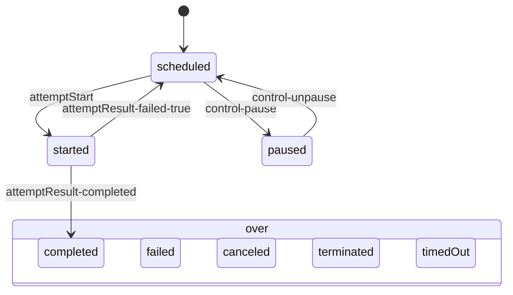

# Visualizing Umpire Models

Research note, 2026-10-05 (claude-fable-5-1, read-only). How to render Models so engineers understand them and review changes to them.

## Recommendation

Generate a small, fixed set of views per machine from the checked-in IR plus the Go reader's tables, render each with D2 used as a Go library (ELK engine, pinned version, content-hashed IDs, `OmitVersion`), and check in both the `.d2` source and the `.svg` under `model/views/`, gated like `model/ir` and `model/cases` (`umpire-check-views` fails on a diff; `umpire-gen-model` regenerates). Declare nothing in the Scala DSL: every machine gets the phase view, every refinement the refinement view, every composition the sync view, every derived design the diff view, every IR file the signature view; views are a pure function of the IR and never IR data, which keeps the author's cognitive load at zero and the IR boundary intact (`.flow/specs/fn-126-…md:7`, `:474-475`). Keep interactivity to SVG `<title>` tooltips (D2 `tooltip`, which works in any SVG-aware viewer) and treat the pull-request review artifact as the *text* diff of the `.d2` beside the rendered image, because GitHub's image diff is a visual aid, not a reviewable delta. A self-contained HTML viewer with real hover and source links is a cheap phase 3, generated from the same data, hosted or opened locally; it is additive and never the thing the gate checks. TALA is now open source and bundled in D2 ≥ 0.9.0 with no key or binary, but its layout is intentionally randomized and small edits cascade, so use it only for the signature view, if at all, and never for phase diagrams.

## What the pipeline already gives a renderer

- The IR carries declarations, not tables: "steps are pure functions over values, and the tables are what the interpreter computes from them" (`proto/.../umpire/v1/ir.proto:8-9`). So a renderer must go through the Go reader (`tools/umpire/model`), not read JSON alone. It cannot be Scala-side without re-implementing the interpreter; that settles "IR, not source" and also "Go, not Scala".
- The lint's per-operation modality table is already the phase projection a diagram needs: `lint.Table{Machine, Field, Cells, Rules}` with `Rule{Class, Label, States, Modality, Text, Position, Predicates, Holes, Pinned}` (`tools/umpire/lint/holes.go:61-70`, `:40-58`). `umpire-lint --tables model/ir/activity.json` printed `activityProduct` as 11 classes × 3-5 rules each, e.g. `control-pause: scheduled, started MAY accepted -> paused [statusPaused] StandaloneActivity.scala:274 by: terminal, pausable`. The grouping field today is "the state record's first enum-typed field" (`holes.go:63-64`), which is `phase` for every activity and Nexus machine but `caller` (3 values) for the nine close-policy designs, whose state type has 6,720 states.
- Every machine, action, function, Query, property and scenario carries a `Position{file,line}`; actions carry `party`, `on`, `inputs`, `schemas`, `examples` (seen in `model/ir/activity.json`). Doc comments are *not* in the IR (no `doc` field in `ir.proto`); the only free text is a step's `because`.
- Hover material beyond the tables exists on disk: lint findings and acceptance reasons (`model/ir/*.lint.json`: `silent-rejection`, `never-enabled`, `unconstrained-result` with `because`), law claims with `cites` (`model/ir/activity.laws.json`: `"cites": {"rejected": ["chasm/lib/activity/activity.go"]}`) and the law prose the lint prints ("promises: … does not promise: …").
- Refinement is checked per row by the reader: `checker.Refinement{Machine, Product, Rows []RefinementRow{Key, Product *string}, MapState}` (`tools/umpire/model/internal/checker/refine.go:12-38`), so "which System phase reads as which Product phase" is derivable without touching Scala.
- A `find` Query's answer carries `Witness *Trace` and `Rows []string` (`checker/claims.go:101-121`), deterministic by construction, and is the same path the lowered Case in `model/cases` encodes.
- "Derived from" is not an IR field, but it is inferable: `staleAdmission` binds `currentAdmission.rules.dispatch/control/answerDelivery/…` and only `staleAdmission.rules.attemptStart` of its own; `staleRecord` likewise (from `model/ir/activity-system.json`). The base is the machine whose rule functions a machine shares most.
- The gate already runs Go steps and regenerates checked-in artifacts (`model/README.md:137-160`, `Makefile:776-784`); `.gitattributes` holds only LFS rules for png/jpg, nothing for generated files.

## Renderer comparison

| Renderer | Deterministic | SVG quality / hover | License, cost | CI / sandbox | Go or Scala integration | Verdict |
| --- | --- | --- | --- | --- | --- | --- |
| **D2 + dagre or ELK** (`github.com/d2lang/d2`, MPL-2.0) | Pure-Go ports: dagro "308 finite outputs match Dagre 3.1.1 bit-for-bit" (https://pkg.go.dev/github.com/d2lang/dagro); elk-go pinned to ELK.js 0.12.0 with deterministic fixtures (https://pkg.go.dev/github.com/d2lang/elk-go). Element IDs are content hashes with `Salt`; `OmitVersion` strips the version string | `tooltip` → `<title>`, `link` → `<a>` (d2svg.go); fonts embedded as base64 subset "to give deterministic outputs" (https://github.com/d2lang/d2/tree/master/d2renderers/d2fonts) | Free; no key, no network | Yes, no browser: `d2lib.Compile` + `d2svg.Render` | Go library (what the rest of `tools/umpire` is) | **Choose.** Pin version in `go.mod` |
| **D2 + TALA** | Open-sourced and bundled in 0.9.0: "TALA is now open source and bundled with D2 … No separate plugin installation or license key is required" (https://d2lang.com/releases/0.9.0, verified). But "Has randomness. A small change to a label can cascade into an entirely different layout" (https://d2lang.com/tour/tala/); `--tala-seeds` makes a run reproducible, not edit-stable | Same as above | Free since 0.9.0 (the old `TSTRUCT_TOKEN`/watermark model is gone) | Yes | Same | Opt-in for the signature view only; never for diffs of phase diagrams |
| **Graphviz dot** | Maintainers: "the algorithms we use are nondeterministic" (https://forum.graphviz.org/t/how-to-plot-the-same-graph-repeatedly/1148); open issues #1767, #1789; Debian reproducible-builds flags it | `tooltip` → `xlink:title`, `URL` → `<a>`; fonts referenced, not embedded | EPL-2.0 | `dot` not installed here; `goccy/go-graphviz` runs it as WASM via wazero (no CGO) | Go via WASM | Reject for checked-in diffs |
| **Mermaid** (`stateDiagram-v2`) | `deterministicIds` defaults false (date-based IDs) (https://mermaid.js.org/config/schema-docs/config-properties-deterministicids.html); layout is dagre-JS | GitHub renders it natively in Markdown via the sandboxed viewscreen iframe (https://docs.github.com/en/get-started/writing-on-github/working-with-advanced-formatting/creating-diagrams); `click`/links disabled under `securityLevel=strict`, broken on GitHub per community reports | MIT | `mmdc` needs puppeteer + Chromium; no Go/JVM library | None | Use as *text* for the overview `README.md` (already the precedent at `model/README.md:95`), not for SVGs |
| **ELK directly** | Layered `randomSeed` defaults to 1 → deterministic | Layout only; you write the SVG | EPL-2.0, Java | JVM | Scala side only | Not needed; elk-go gives the same inside D2 |
| **PlantUML** | Depends on Graphviz or Smetana; float noise across machines (forum 11852) | `[[url{tooltip}]]` links | GPL/LGPL/… jars | Java + Graphviz | None for Go | Reject |
| **Structurizr/C4** | – | – | – | – | – | Not a state-machine tool |
| **Stately, TLC `-dump dot`, Peasy, ITF viewer, tlsd** | Interactive or trace-centric; TLC docs: dot "only useful for small state spaces" (https://docs.tlapl.us/using:generating_state_graphs) | – | – | – | – | Prior art, not renderers for us |

Unverified: that `oss.terrastruct.com/d2` still resolves after the move to `github.com/d2lang/d2`; D2's typical SVG byte size; whether D2 pretty-prints one element per line. Neither D2 nor `dot` is installed in this sandbox (`which d2 dot` empty), so no local render was tried.

## Proposed views

Each view answers one question; all read the IR through the reader. Sizes are from the real IR (`model/ir/*.json`, counts computed 2026-10-05).

### 1. Signature: who can do what to which entity

- **Data:** `actions[]` (`party`, `on`, `inputs`, `schemas`, `examples`, timers/internal), per IR file. No reader needed.
- **Size:** activity 12 actions, Nexus caller 12, activity-system 21. Tiny.
- **Hover:** request/response schemas, the `examples` ("ApplicationFailureRetryable"), `file:line`.
- **Layout:** dagre or TALA (stable enough at this size, and this view changes rarely).

```d2
direction: right
caller: {shape: person}
worker: {shape: person}
system: {label: "system (timers, internal)"; shape: hexagon}
activity: {shape: cylinder; tooltip: "Entity(key = activityId) — StandaloneActivity.scala:111"}
caller -> activity: start {tooltip: "inputs: scheduleToClose, scheduleToStart, startToClose\nschema: StartActivityExecutionRequest\nStandaloneActivity.scala:128"}
caller -> activity: control(pause|unpause|requestCancel|terminate) {tooltip: "results: Delivery\nschemas: Pause/Unpause/RequestCancel/TerminateActivityExecutionRequest"}
worker -> activity: attemptStart {tooltip: "schema: PollActivityTaskQueueResponse"}
worker -> activity: attemptResult(completed|failed(retryable)|canceled)
system -> activity: timers.timeout, timers.backoff
system -> activity: deadline.scheduleToClose, scheduleToStart, startToClose
```

### 2. Phase diagram per machine (the core view)

- **Data:** `lint.Table.Rules` for the machine: one edge per MAY rule whose result changes phase, labelled by action class; stutters (`-> itself`) as self-loops on a group; `?` (silent) and `MUST NOT` rows omitted from the picture and carried on the phase node's tooltip. Groups ("over" = terminal phases) come from the rule labels that list the same phase set, which is exactly how the lint already folds them.
- **Size:** activityProduct 9 phases / 11 classes / ~15 edges; activityProtocol 12 phases / 22 classes (the 8 `start-*` classes collapse to one edge); nexusProtocol 8 / 23; forgedCompletion 8 / 24; the record designs 6 / 13; the queues 4-5 / 8-9. All readable. The close-policy designs project onto `caller` (3 values) and will need a better projection (open question 1).
- **Hover on an edge:** facts recorded, `because`, the rule's `file:line`, `by:` predicates (`held`, `pausable`), `pinned:` claims. **On a phase:** the disabled classes with their lint kind and acceptance reason (e.g. `control-unpause in scheduled: silent-rejection — "The server answers FailedPrecondition…"`), and law cells (`pausedIsNotDispatched: attemptStart MUST NOT`).

From `activityProduct`'s actual rules (lint table, `StandaloneActivity.scala:256-286`):

```d2
direction: down
scheduled.tooltip: "init. disabled here: attemptResult-* (silent-rejection), control-unpause (silent-rejection: !paused), workerStop (never-enabled)"
paused.tooltip: "law pausedIsNotDispatched: attemptStart MUST NOT, control-pause MUST NOT"
over: terminal {
  completed; failed; canceled; terminated; timedOut
  tooltip: "laws terminalStatesAreFinal, closedIsRejectedUniformly: every class MUST NOT leave"
}
scheduled -> started: attemptStart {tooltip: "accepted -> started [statusStarted] (:256)"}
started -> completed: attemptResult-completed {tooltip: "[statusCompleted] by: held (:262)"}
cancelRequested -> completed: attemptResult-completed
started -> failed: attemptResult-failed-false
cancelRequested -> failed: attemptResult-failed-false
started -> scheduled: attemptResult-failed-true {tooltip: "retry: reads scheduled again [statusScheduled] (:265)"}
cancelRequested -> canceled: attemptResult-failed-true, attemptResult-canceled
scheduled -> paused: control-pause {tooltip: "by: pausable (:274)"}
started -> paused: control-pause
paused -> scheduled: control-unpause {tooltip: "[statusScheduled] pinned: pausedIsNotDispatched (:275)"}
scheduled -> cancelRequested: control-requestCancel
started -> cancelRequested: control-requestCancel
paused -> cancelRequested: control-requestCancel
scheduled -> terminated: control-terminate
started -> terminated: control-terminate
paused -> terminated: control-terminate
cancelRequested -> terminated: control-terminate
scheduled -> timedOut: timeout
started -> timedOut: timeout
paused -> timedOut: timeout
cancelRequested -> timedOut: timeout
over -> over: control-* → notFound {style.stroke-dash: 3; tooltip: "a control of an activity that is over is not found; cited chasm/lib/activity/activity.go (:273)"}
```

The same data as a GitHub-native Mermaid block for the feature's `README.md` (no SVG involved):



### 3. Refinement: which System phases read as which Product phase

- **Data:** `machine.refines{product, map}` evaluated by the reader over reachable states (`checker.Refinement.MapState`), grouped by phase; plus `RefinementRow.Product == nil` to mark stuttering classes.
- **Size:** activityProtocol → activityProduct: 12 → 9 phases, 12 dashed edges; currentAdmission → activityProduct: 6 → 5; the queues: 5 → 4. Nexus: 8 → 6.
- **Hover:** on a dashed edge, the `toProduct` case and its line (`StandaloneActivity.scala:355-365`); on a System phase, which classes stutter (`pauseRequested` reads as `started`, its request stutters).

```d2
direction: right
product: ActivityProduct { scheduled; started; paused; cancelRequested; over }
system: ActivityProtocol { unstarted; scheduled; backingOff; started; pauseRequested; paused; cancelRequested; over }
system.unstarted -> product.scheduled: {style.stroke-dash: 4}
system.scheduled -> product.scheduled: {style.stroke-dash: 4}
system.backingOff -> product.scheduled: {style.stroke-dash: 4; tooltip: "a retryable failure backs off; the caller reads scheduled again (:398-400)"}
system.started -> product.started: {style.stroke-dash: 4}
system.pauseRequested -> product.started: {style.stroke-dash: 4; tooltip: "the worker still holds the attempt; the request stutters (:350-358)"}
system.paused -> product.paused: {style.stroke-dash: 4}
system.cancelRequested -> product.cancelRequested: {style.stroke-dash: 4}
system.over -> product.over: {style.stroke-dash: 4}
```

### 4. Composition and syncs

- **Data:** `compositions[].members{field, machine, standsFor}` and `syncs{name, first, second}`.
- **Size:** 2 members and 2-3 syncs everywhere (standaloneActivity, nexusCaller, the seven `*OverQueue` compositions).
- **Hover:** the sync's name, both actions' `file:line`, `standsFor` ("a detailed provider replacing an opaque one", `ir.proto:484-486`).

```d2
standaloneActivity: {
  activity: activityProtocol; worker: activityWorker
  activity <-> worker: "sync attemptStart ↔ serve" {tooltip: "StandaloneActivity.scala:696"}
  activity <-> worker: "sync workerStop ↔ workerStop" {tooltip: ":695"}
}
```

### 5. Derived-design diff (`TrustingActivityRecord` vs `ActivityRecord`)

- **Data:** base inferred as the machine whose `rules.*` functions the derived one shares most (`staleAdmission` shares 6 of 7 with `currentAdmission`); then a diff of the two `lint.Table.Rules` keyed by `(class, state)`. Rendered as the base's phase diagram with removed edges red-dashed, added edges green, and a one-line legend "1 binding rebound: attemptStart".
- **Size:** 1 changed class for the record designs; 1-2 for each queue variant; the close policy's 9 designs differ by 0-1 bindings each from `rejectAfterClose`.
- **Hover:** the derived binding's `file:line` (`Record.scala:1116-1121`), the `because` texts, and the Queries that expect a violation (the `NegativeControl` evidence of decision 20).

### 6. Query witness as a sequence diagram

- **Data:** `Answer.Witness` / `Rows` from the reader (or the Case's program in `model/cases`); participants are the actors, the entity and the system; each step is an arrow labelled by class, with a note giving the phase after the step and the facts.
- **Size:** 3-8 steps per Query; one diagram per `find` Query with an `expect`.
- **Hover:** the step's outcome, facts, `because`, and the Property clause that fired (`Exercised`).
- **Format:** Mermaid `sequenceDiagram` text in the feature README is enough; an SVG adds little here.

### 7. Feature overview

A generated `model/views/README.md` per IR file: the signature SVG, then one row per machine linking its phase, refinement and diff SVGs, with the lint coverage line. No new data.

## Declaration and generation

**Where views are declared: nowhere.** Convention gives every machine views 2, 3 (if `refines`), 5 (if a base is inferred), every composition view 4, every IR file views 1 and 7, and every expecting `find` Query view 6. This follows the guiding principle ("An author writes what the Model means and nothing the tooling can infer", spec `:7`), adds no section to R20's closed set (`:267`), and needs no IR schema change (non-goal, `:475`). A `view(...)` in `exports` would make the author name and keep in sync something the IR already determines, and a separate config file is the same cost with worse locality. Views are a pure function of the IR, not IR data: the IR says what a Model *means*; a view is one reading of it, like a lint table. If a Model ever needs an opt-out (a machine too big to draw), that is a single accepted finding in `<file>.lint.json`-style sidecar, not a DSL feature.

**Generator:** a Go package `tools/umpire/render` (depends on `model` and `lint` only, like `export`) and a command `tools/umpire/cmd/umpire-render [--check|--update] [ir files…]`, mirroring `umpire-gen-cases`. For each IR file it loads the model, builds the lint `Result` (tables, findings, laws), derives the views, writes `<view>.d2`, compiles it with `d2lib.Compile` using the ELK layout, renders with `d2svg.Render{OmitVersion: true, Salt: "umpire"}` and a fixed theme/font, and writes `<view>.svg`. Node and edge order come from the reader's catalog order (`checker/table.go:43-44`), so the `.d2` text is stable before layout ever runs.

**Artifacts:** `model/views/<irfile>/<machine>.phase.{d2,svg}`, `<machine>.refines.{d2,svg}`, `<machine>.diff.{d2,svg}`, `<composition>.syncs.{d2,svg}`, `signature.{d2,svg}`, `README.md`. In `.gitattributes`: `model/views/**/*.svg linguist-generated=true` so GitHub collapses the SVG text by default ("hidden by default in diffs", https://docs.github.com/en/repositories/working-with-files/managing-files/customizing-how-changed-files-appear-on-github) while the reviewer expands the rendered 2-up/swipe/onion-skin diff when wanted (https://docs.github.com/en/repositories/working-with-files/using-files/working-with-non-code-files); the `.d2` is the reviewable text delta.

**Gate:** `model/check` runs `umpire-render --check` after lint and `umpire-gen-model` runs `--update`, so a Model change that moves a rule shows up as a `.d2`/`.svg` diff in the same PR, exactly as `model/ir` and `model/cases` do today (`model/README.md:142-152`).

## Interactivity plan

- **Phase 1, SVG `<title>` tooltips only.** D2's `tooltip` becomes an SVG `<title>` ("Tooltips are implemented with HTML title tags", https://d2lang.com/tour/interactive/), which browsers show on hover without scripts (https://developer.mozilla.org/en-US/docs/Web/SVG/Reference/Element/title). GitHub serves raw SVG with `content-security-policy: default-src 'none'; … sandbox` (verified by the research agent with `curl -I`), so scripts and `<foreignObject>` are dead, but `<title>` and inline `<style>` survive. Whether the tooltip fires when GitHub wraps the SVG in its viewscreen iframe or an `` is **unverified**; it certainly works when the SVG is opened directly, in an IDE, or in the HTML viewer below. Links inside ``-embedded SVG are not clickable, so `link` is omitted from checked-in SVGs; it also avoids commit-SHA churn in URLs.
- **Everything hover shows must also be greppable:** the `.d2` carries the same tooltip text, so a reviewer reading the text diff sees the acceptance reason or `because` change even if the tooltip never fires.
- **Phase 3, HTML viewer.** One self-contained `model/views/index.html` generated from the same view data (inline JSON, no CDN), with hover panels (facts, guard, predicates, pinned claims, lint reason, law prose), links to source lines, a machine selector, and a witness player. Hosted on GitHub Pages from the branch or opened from a checkout. It lives beside the SVGs and is also gated (deterministic output), but it is for exploration, not review. This is the Stately/Spectacle lesson: "interactive simulation beats static BFS output" (https://emptysqua.re/blog/interactive-tla-plus/), while static images stay "helpful in documentation, including GitHub pull requests" (https://stately.ai/docs/image).
- Not doing: Mermaid `click`, CSS `:hover` tricks, animated multi-board SVGs.

## Risks and open questions

1. **Projection for non-phase machines.** The lint's "first enum field" picks `caller` for the close policy (6,720 states). `object rules extends Rules(_.phase)` already declares the projection in Scala (spec `:209`, `:542`) but the lifter does not emit it. Either add one optional field `Machine.projection` (a function name) to the IR, a small, declaration-shaped addition, or draw the close policy with a two-field label. Decide in phase 1.
2. **Diff noise from D2's embedded font subset.** The base64 `@font-face` is content-dependent; a new glyph changes a multi-KB blob. Mitigations: a custom fixed `.ttf` with the full subset, or post-processing to strip `@font-face` (bytes stay deterministic; rendering then depends on the viewer's font). Measure in the spike.
3. **Layout cascade on edits.** ELK and dagre are deterministic, not edit-stable: adding one edge can re-rank a column. Mitigate with fixed node order from the catalog, `direction: down`, grouping terminal phases, and accepting that a rule change *should* move the picture. The `.d2` diff stays small regardless.
4. **Doc comments are not in the IR**, so hover cannot show the effect's doc without either reading Scala (breaks the IR boundary) or adding `doc` to `Function`/`Action` positions (an IR change; defensible as declaration metadata, like `examples`). Defer; `because`, guards, predicates, law prose and lint reasons cover most of the need.
5. **Dependency weight.** D2 pulls a sizeable module tree into `tools/umpire`; `model/ownership_test.go` import rules must allow it in `render` only. TALA, if enabled, adds its runtime. Check build time and binary size in the spike.
6. **GitHub rendering details are partly unverified:** tooltip behaviour in the blob/rich-diff view, `linguist-generated` effect on PR line counts, D2's exact SVG formatting. None affects the gate; they affect how pleasant review is.
7. **Volume.** ~40 machines today, 2-3 SVGs each plus compositions: ~100 files. Fine for git, but `umpire-render` must stay under a few seconds so the gate does not slow.

## Phased outline and rough cost

| Phase | What | Cost |
| --- | --- | --- |
| 0 Spike | Add `github.com/d2lang/d2` to `tools/umpire`, render `activityProduct.phase` from `lint.Table.Rules` with ELK and dagre, commit the SVG twice and inspect byte stability, font blob size and GitHub's PR rendering (2-up, tooltip) | 1-2 days |
| 1 Core views and gate | `tools/umpire/render` + `umpire-render --check/--update`; views 1, 2, 4 for every IR file; `model/views/`, `.gitattributes`, gate step, README section; settle open question 1 | 4-6 days |
| 2 Derived views | Refinement view (3) from `checker.Refinement`, diff view (5) with base inference, witness sequence (6) as Mermaid text, generated overview (7) | 3-4 days |
| 3 HTML viewer | Single generated `index.html` with hover panels, source links, witness player; GitHub Pages or local open | 3-5 days |
| Later | `doc` in the IR for hover prose; TALA for the signature view if dagre is ugly; opt-out sidecar if a Model is too big to draw | as needed |

Sources: repo files cited inline (`model/README.md`, `model/SEMANTICS.md:165-184`, `.flow/specs/fn-126-…md`, `proto/…/ir.proto`, `tools/umpire/lint/holes.go`, `tools/umpire/model/internal/checker/{table,refine,claims}.go`, `model/ir/*.json`, lint `--tables` output run 2026-10-05); web sources as linked, gathered 2026-10-05, with TALA/D2 0.9.0 and the D2 README verified directly; items marked unverified were not confirmed from a primary source. The `umpire-lint --tables` run for `nexus-close.json` and `activity-system.json` timed out at 500 s under the shared-machine lock, so those sizes come from the IR JSON, not the lint tables.