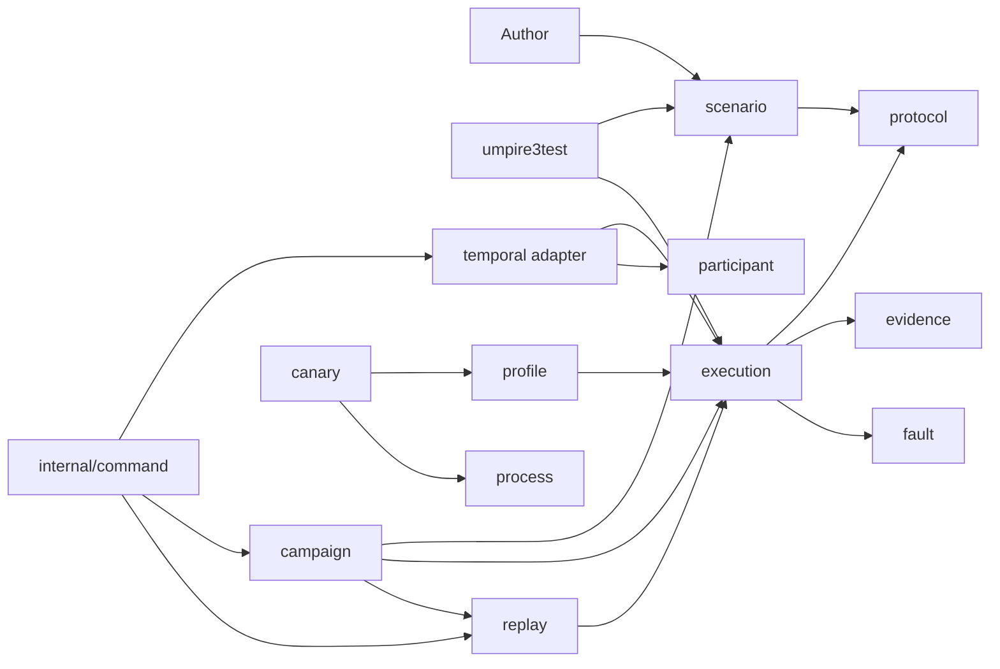

# Umpire3 structural refactor plan

## Context

`tests/umpire3` is a new, fast-growing subsystem: its two commits currently contain about 17,800 lines of non-test Go across more than 20 top-level Go packages. The central execution path is already deep, but several surrounding packages are shallow aliases, lifecycle fragments, or generic names for narrower domain concepts. Understanding one regression currently requires following `regress` into `compiler`, `umpire3test` into `runtime` and `environment`, `runner` into `temporal`, and `replay` into both `artifact` and `runtime`.

This refactor should increase **depth** by concentrating behavior behind a smaller set of stable **interfaces** at real **seams**. The desired outcome is more **leverage** for authors and more **locality** for maintainers: scenario authoring, execution, deployment authority, campaign discovery, replay, and Temporal realization should each have one obvious owning **module**.

No `CONTEXT.md`, `CONTEXT-MAP.md`, or applicable ADR exists in the repository today. The current domain language comes from `tests/umpire3/README.md`, its focused guides, the Lean modules, and the generated semantic catalog.

## Goals

- Give each major concept one owning module and one canonical name.
- Remove pass-through packages and duplicate construction interfaces rather than retaining aliases.
- Put ports at the module that owns the behavior; keep concrete **adapters** on the other side of the **seam**.
- Make each retained module testable through the same interface its callers use.
- Preserve all Lean semantics, generated artifact formats, security properties, CLI behavior, comments, and Umpire2 independence.
- Keep the refactor buildable and verifiable after each phase.

## Non-goals

- Do not change the Lean product, system, refinement, monitor, or proof semantics.
- Do not change JSON format versions, field names, hashes, redaction rules, release status, or qualification meaning.
- Do not share implementation with Umpire2; use it only as architectural precedent.
- Do not split `protocol` into one shallow package per document type.
- Do not add concurrency, persistence, a cache, a third-party dependency, or new canary authority as part of the structural work.
- Do not keep deprecated Go packages as compatibility wrappers. The supported compatibility command binaries remain, but their implementation should delegate to the canonical modules.

## Pattern Survey

### Analogous Features

- `tests/umpire2/protocol_facade.go:40` — `DefaultProtocol` presents one compiled protocol facade while keeping catalogs and stores internal; `protocol_facade_test.go:10` explicitly guards that small surface.
- `tests/umpire2/umpiretest/regression.go:25` — `RunRegression` owns validation, compilation, harness construction, execution, and artifact capture; `RequireRegression` at line 138 supplies the higher-level test affordance.
- `tests/umpire3/regress/nexus/nexus.go:10` — `OperationHandle` hides action identifiers, identity projection, resource construction, and complete lifecycle assembly behind domain methods.
- `tests/umpire3/model/Temporal.lean:6` — the Lean model separates Product, System, Refinement, API, Experiment, and Monitor namespaces; `product_boundary_test.go:10` enforces that product vocabulary excludes mechanism terms.
- `tests/umpire3/runtime/run.go:120` — the core execution engine already behaves as a deep module: one request/result operation owns capability preflight, environment lifecycle, realization, observation, evidence, faults, cleanup, and outcome classification.

### Reusable Utilities

- `tests/umpire3/compiler/compile.go:16` — `Compile` — converts sparse scenarios into deterministic, validated experiment suites while loading the canonical catalog, composition, and monitors internally.
- `tests/umpire3/environment/environment.go:70` — `Factory` / `Session` — small ports separating orchestration from environment preparation, realization, observation, recovery, and cleanup.
- `tests/umpire3/environment/prepared.go:17` — `PrepareOnce` — adapts an already-created session back to the single-use factory contract.
- `tests/umpire3/profile/profile.go:86` — `Define` — derives validated authority, attestation, capability, isolation, and retention policy from a deployment configuration; `Bind` at line 252 decorates an environment through the shared factory seam.
- `tests/umpire3/umpire3test/require.go:67` — `RequireRegression` — existing author-facing facade over compilation, execution, conformance checking, artifact retention, and diagnostics.
- `tests/umpire3/evidence/graph.go:82` — `NewBuilder` — owns bounded, validated evidence graph construction; `evidence/source.go:19` provides the narrow ingestion adapter.
- `tests/umpire3/artifact/artifact.go:40` — `Encode` / `Decode` — owns validation, redaction, digest binding, bounds, and replay metadata for retained failures.
- `tests/umpire3/process/supervisor.go:56` — `NewSupervisor` — encapsulates killable worker lifecycle, bounded output, restart/crash/stop semantics, and attempt snapshots.

### Convention Anchors

- Semantic ownership: Lean owns product meaning and state-machine semantics; Go owns transport, bounded orchestration, evidence normalization, and generated artifact consumption (`tests/umpire3/MODELING.md:3`, `tests/umpire3/README.md:91`).
- Generated vocabulary authority: resource, action, property, capability, and identifier constructors come from the Lean-derived catalog and generated Go facade (`tests/umpire3/regress/catalog.gen.go:1`, `tests/umpire3/protocol/catalog.go:109`).
- Authoring hierarchy: structural combinators live in `regress`, semantic lifecycles live in domain packages such as `regress/nexus` and `regress/workflow`, and test policy lives in `umpire3test` (`tests/umpire3/AUTHORING.md:8`, `tests/umpire3/AUTHORING.md:19`).
- Canonical data flow: authored `Scenario` becomes compiler `Suite`, versioned protocol `Experiment`, runtime `Result`, then artifact/replay evidence (`tests/umpire3/compiler/types.go:65`, `tests/umpire3/compiler/types.go:299`, `tests/umpire3/runtime/run.go:89`, `tests/umpire3/artifact/artifact.go:33`).
- Fail-closed boundaries: validation and capability checks occur before environment allocation, while semantic outcomes remain structured results and infrastructure failures remain errors (`tests/umpire3/profile/profile_test.go:69`, `tests/umpire3/runtime/run.go:120`).
- Enforced dependency independence: layout tests prohibit Umpire3 from importing prior Umpire implementations, so Umpire2 is architectural precedent rather than a reusable dependency (`tests/umpire3/layout_test.go:51`).
- Current shallow-boundary pattern: `regress` aliases compiler types and forwards constructors (`tests/umpire3/regress/regress.go:11`), while `regress/fault` and `regress/capability` are pass-through packages (`tests/umpire3/regress/fault/fault.go:5`, `tests/umpire3/regress/capability/capability.go:5`).
- Current vocabulary overlap: “Profile” has distinct representations in `environment`, `profile`, and `runner` (`tests/umpire3/environment/environment.go:53`, `tests/umpire3/profile/profile.go:46`, `tests/umpire3/runner/runner.go:90`), and generic `Run`/`Request`/`Result`/`Report` surfaces recur across runtime, campaign, replay, process, explore, and canary.
- Current umbrella packages span multiple concepts: `protocol` contains experiments, semantic catalog, composition, monitors, proof/release/parity manifests, protobuf inventory, and outcomes; `runtime` contains execution, minimization, and replay-drift comparison; `temporal` contains connection, API interpretation, SDK environments, Nexus, Update, and Workflow Task adapters.

### Proposed Alignment

Blend the Umpire2 facade/internal precedent with Umpire3’s existing Lean layering, generated domain handles, and `Factory`/`Session` execution port; these are the strongest demonstrated deep-module forms. Preserve the strict semantic/runtime boundary and generated vocabulary authority while treating the observed umbrella, pass-through, lifecycle, and overloaded-profile surfaces as the structural seams needing clearer ownership.

## Canonical vocabulary

Add these domain-only definitions to `tests/umpire3/CONTEXT.md` before renaming code. Keep package placement and implementation details in `README.md`, not in the glossary. Lean and the generated semantic catalog remain authoritative for resources, actions, properties, capabilities, observations, evidence, faults, modules, and targets.

| Term | Canonical meaning | Avoid |
| --- | --- | --- |
| Scenario | Sparse author intent before compilation. | Calling a compiled experiment a scenario. |
| Experiment | A validated, versioned, executable semantic artifact. | Calling arbitrary test configuration an experiment. |
| Regression | A test that compiles a Scenario and executes every resulting Experiment. | Using it as the name of the Scenario data structure. |
| Execution | One Experiment run against one Environment. | Generic “runtime” or “runner” when this operation is meant. |
| Environment | An adapter that realizes actions, observes evidence, and cleans up. | Using “environment” for a deployment profile. |
| Environment identity | The non-secret build, configuration, isolation, authority, evidence, and capability facts reported by the prepared Environment. | `EnvironmentProfile` or another competing Profile type. |
| Deployment profile | The validated maximum authority, capabilities, isolation, and attestation allowed for a deployment kind. | `Config`, `Definition`, and partial `Profile` values with overlapping meanings. |
| Participant program | Concrete Temporal commands used to realize an Experiment. | Generic “plan” outside participant internals. |
| Replay bundle | A redacted, digest-bound Experiment and Result plus reproduction metadata. | Generic `artifact.Record`. |
| Result | The evidence and semantic claim from one Execution. | Unqualified `Result` outside a module; use `execution.Result`, `canary.Result`, etc. |
| Qualification receipt | The signed-off result of checking a candidate release against external execution evidence. | Generic report or artifact. |

Use the architecture terms **module**, **interface**, **implementation**, **seam**, **adapter**, **depth**, **leverage**, and **locality** consistently in design documentation. Reserve “Temporal API” for the actual Temporal protocol surface.

## Current structural findings

### 1. Deployment-profile truth is inconsistent — Strong, top priority

The same deployment names currently map to different invariants:

- `profile.Define` assigns `local-in-process` in-process evidence and isolated local fault authority, and assigns `remote-deployment` approved remote fault authority.
- `runner.Validate` assigns those names public-history evidence and no fault authority.
- `temporal.NewSDKFactory` can synthesize another set of default authority strings.
- `cmd/umpire3-canary-worker` supplies yet another set directly.

This is more than naming drift: capability and fault preflight can depend on which construction path was used. The `profile` module must be the only source of deployment-profile meaning. An Environment adapter may narrow a deployment profile to its realized authority; it must never broaden it.

### 2. Execution lifecycle crosses four modules — Strong

`runner.Execute` prepares a Temporal session, starts the SDK worker, wraps the session with `environment.PrepareOnce`, and calls `runtime.Run`, which prepares the Environment again. The canary worker repeats the same registration/start/cleanup sequence.

The `runtime.Run` implementation passes the deletion test and should be retained as the core of a renamed `execution` module. The `environment` package and `runner` package do not: their behavior can move into `execution` and the Temporal adapter without spreading across callers. A prepared Temporal Environment should own registration, worker start/stop, client closure, and cleanup exactly once.

### 3. Scenario authoring has two public construction interfaces — Strong

`regress` aliases seven `compiler` types and forwards most compiler constructors. `regress/nexus` and `regress/workflow` reach back into `compiler` and duplicate caller-source capture. Campaign promotion generates `compiler` calls directly even though `AUTHORING.md` declares the generated domain facade to be the preferred entry point.

Make `scenario` the one authoring and compilation module. Absorb `compiler`; centralize source capture; generate the author facade there; keep behavior-rich Nexus and Workflow handles; fold the tiny activity, callback, capability, and fault re-export packages into the root scenario interface. Tests, migration, exploration, campaigns, and promoted source should no longer import a second construction interface.

### 4. Replay knowledge is split three ways — Strong

`artifact` owns the replay-bundle format, redaction, and corpus; `replay` owns reproduction; `runtime/replay.go` owns drift classification. Deleting either shallow edge merely moves replay knowledge to its neighbor.

Make `replay` own `Bundle`, strict encoding/decoding, redaction, corpus persistence, reproduction, and drift classification. Preserve `umpire3/replay-bundle/v1` byte semantics.

### 5. Campaign discovery has three orchestration paths — Strong

`campaign.Run`, `campaign.RunMutationGate`, and the unified command each assemble different portions of mutate → rank → execute → minimize → retain → replay → promote. `runtime/minimize.go` is campaign-specific behavior in the execution package.

Make `campaign.Run` the one workflow. Move minimization into `campaign`; make the mutation gate validate the canonical report; make the command delegate to the same workflow. Keep mutation helpers private unless a non-campaign caller needs them.

### 6. Temporal and participant SDK responsibilities lack locality — Worth exploring in the same refactor

The SDK-specific participant implementation is in `participant/sdk.go`, while `temporal/sdk.go` constructs it and adds environment behavior. Keep the `participant.Runner` seam: its SDK adapter and in-memory test adapter are two justified adapters. Move the SDK adapter implementation to `temporal`, leaving `participant` responsible for participant-program validation, compilation, and session semantics.

The direct Nexus, Update, and Task Ack negative-control factories have no callers outside `temporal` tests. Make those implementations private to the Temporal module so they stop enlarging its external interface.

### 7. Two speculative seams should be removed — Worth doing late

- `evidence.SourceAdapter` and `evidence.Ingest` have no non-test adapter. Delete them until a second adapter exists; continue testing evidence through `Builder` and execution results.
- `process.Run` and `Supervisor` duplicate subprocess, process-group, timeout, and bounded-output mechanics. Keep the concrete process module, but implement the one-shot operation through the supervisor implementation so policy has one locality. Preserve both caller-facing operations because canary and crash/restart tests need different behavior.

### Deliberately retained modules

- `protocol` remains the strict versioned wire module and generated-artifact owner. Its broad data surface is intrinsic; splitting it would add shallow packages.
- `evidence`, `fault`, `process`, `canary`, `qualification`, `migration`, `explore`, and `wirecase` retain distinct behavior that would spread to multiple callers if deleted.
- `temporal/internalhistory` remains a specialized adapter because its location enforces the security/dependency rule that black-box profiles cannot import server history internals.
- `umpire3test` remains the high-leverage regression test facade even though its implementation is small.

## Target module map

| Current package(s) | Target module | Interface intent |
| --- | --- | --- |
| `regress`, `compiler`, small `regress/*` re-exports | `scenario` | Author and compile a Scenario; explain the resulting Experiment suite. |
| `runtime`, `environment` | `execution` | Execute one Experiment through an Environment seam and return one Result. |
| `runner` plus remote lifecycle in `temporal` | `temporal` adapter | Construct an Environment that owns Temporal client/worker lifecycle. |
| `artifact`, `replay`, `runtime/replay.go` | `replay` | Capture, persist, decode, reproduce, and compare replay bundles. |
| `runtime/minimize.go`, campaign workflows | `campaign` | Mutate, execute, minimize, retain, replay, and promote candidates. |
| `participant/sdk.go`, Temporal SDK realization | `temporal` adapter | Implement the participant seam with the Temporal SDK. |
| `profile` plus competing profile construction | `profile` | Define one Deployment profile and compute an adapter-narrowed Environment identity. |
| duplicated command logic | `internal/command` | Parse and execute supported commands behind one dependency-injected interface. |



The diagram shows module dependencies, not a request to introduce an interface on every arrow. Apply “one adapter means a hypothetical seam; two adapters means a real one” before adding any port.

## Implementation steps

1. **Pin vocabulary and behavior before moving packages.**
   - Add `tests/umpire3/CONTEXT.md` with only the canonical domain terms above. Update `tests/umpire3/README.md`, `AUTHORING.md`, `MODELING.md`, `OPERATIONS.md`, `SECURITY.md`, and `SUPPORT.md` so the Scenario → Experiment → Execution → Result → Replay bundle flow is used consistently.
   - Add package comments to the retained public modules describing their interface and invariants. Preserve existing comments and move them with the code they describe.
   - Add characterization tests for the five deployment kinds, current CLI flags/output, replay-bundle bytes, generated facade source locations, compilation determinism, Environment prepare/cleanup counts, and Temporal worker start failure.
   - Extend `tests/umpire3/layout_test.go` with import-direction checks, but do not remove its current directory assertions until the corresponding packages are deleted.

2. **Make `profile` the single deployment-profile module.**
   - In `tests/umpire3/profile/profile.go`, rename the construction input to `Spec` and the validated output to `Profile`; keep `Local`, `CI`, `Remote`, `BlackBox`, and `Canary` as the only deployment-kind constructors.
   - Replace free-form capability strings in the profile interface with `protocol.CapabilityID` where they cross package seams.
   - Move the mappings now in `runner.Validate`, `temporal.NewSDKFactory`, and `cmd/umpire3-canary-worker` behind `profile.Define`. Delete `runner.Profile` and prevent Temporal options from accepting independent evidence/authority strings.
   - Separate maximum deployment authority from realized Environment identity. `profile.Bind` computes the intersection of the profile and adapter capabilities; a missing fault realizer forces effective fault authority to `none` before execution.
   - Remove `profile.Dimensions`, `Assignment`, `Pairwise`, and `CoversEveryPair` unless a non-test caller is introduced in this phase. They are unrelated, unused profile surface; do not move them into a new utility package.
   - Test every deployment kind, invalid endpoints, secret exclusion, hard-budget requirements, deterministic digesting, capability narrowing, and refusal to advertise unimplemented fault authority.

3. **Deepen `runtime` and `environment` into `execution`.**
   - Move the behavior in `tests/umpire3/runtime/run.go` and the ports/data in `tests/umpire3/environment` into `tests/umpire3/execution`; rename `runtime.Request`, `runtime.Result`, and `runtime.Limits` to their `execution` equivalents.
   - Define the Environment seam in the owning execution module. `Prepare` should return a session together with its non-secret Environment identity, so identity is explicit rather than discovered by optional type assertions.
   - Keep `Run` as the primary interface. It must validate the Experiment, capabilities, limits, and fault authority before allocating or realizing more than required, and it must still return semantic non-conformance as a structured Result rather than an infrastructure error.
   - Migrate `profile`, `temporal`, `umpire3test`, `canary`, `qualification`, root tests, and test fakes in one phase. Do not leave forwarding `runtime` or `environment` packages.
   - Move minimization and replay comparison out before deleting `runtime`; later steps name their final owners.
   - Replace unit tests that only exercise moved helpers with tests at `execution.Run`. Retain focused internal tests only for behavior that cannot be observed through the execution interface.

4. **Make the Temporal adapter own the complete worker lifecycle.**
   - Move `runner.Execute` and its connection validation into a concrete remote Environment implementation in `tests/umpire3/temporal`. The adapter owns client dial/close, participant registration, worker start/stop, and session cleanup.
   - Change `tests/umpire3/cmd/umpire3-canary-worker/main.go` and the unified command to construct the same adapter rather than repeating lifecycle ordering.
   - Delete `tests/umpire3/runner` and `environment.PrepareOnce`. An Execution must call Environment preparation exactly once.
   - Add adapter contract tests for dial failure, prepare failure with a partial session, worker start failure, action/observation failure, parent cancellation, cleanup timeout, and successful stop. Assert cleanup and worker stop occur exactly once.
   - Keep local embedded-cluster construction available to root tests without making remote client lifecycle the root test’s responsibility.

5. **Deepen scenario authoring and compilation.**
   - Rename `tests/umpire3/regress` to `tests/umpire3/scenario` and move `tests/umpire3/compiler/{types,normalize,enumerate,compile}.go` into the same module. Preserve `Compile`, `Limits`, `Suite`, `Explain`, and typed compiler errors as the advanced interface used by exploration and diagnostics.
   - Make Scenario and Term construction originate only in `scenario`. Remove all compiler type aliases and forwarding functions.
   - Centralize `runtime.Caller` source attribution so structural combinators and typed domain handles report the same author call site.
   - Keep deep Nexus and Workflow handles, but move the tiny activity/callback handles and capability/fault re-exports into the generated root scenario facade. Internalize raw helpers that no external caller requires.
   - Update `cmd/umpire3-export`, `Makefile` variables `UMPIRE3_AUTHOR_FACADE` and related generation code, migration contracts, exploration templates, campaign promotion, root tests, and `umpire3test` to use the scenario interface.
   - Change campaign promotion so emitted ordinary regression source imports `scenario`, the typed protocol values it genuinely needs, `execution` for the Environment seam, and `umpire3test`; it must never import an implementation-only compiler package.
   - In `tests/umpire3/migration/contracts.go`, type target, property, entity, action, fault, relation, capability, and verdict fields with generated protocol identifiers. Replace the one-element `Properties []string` invariant with a singular property.
   - Regenerate the author facade and verify that semantic identifiers and generated JSON do not change beyond intentional Go package/import paths.

6. **Deepen replay and campaign workflows.**
   - Move `artifact.Record` and `ReplayMetadata` to replay-specific names such as `replay.Bundle` and `replay.Metadata`. Move encoding, strict decoding, redaction, `FileCorpus`, reproduction, and drift classification into `tests/umpire3/replay`.
   - Rename generic replay operations so their role is visible at call sites: capture/encode a bundle, decode a bundle, and reproduce a bundle. Keep the external format `umpire3/replay-bundle/v1` unchanged.
   - Move `runtime.MinimizeActions` and `runtime.MinimizeExperiment` to `tests/umpire3/campaign`; minimization is part of qualified campaign discovery, not generic execution.
   - Refactor `campaign.Run` to own the complete mutate → rank → execute → minimize → capture → replay → promote workflow. Make `RunMutationGate` validate or parameterize this workflow rather than implementing it again.
   - Change `cmd/umpire3 campaign` to call `campaign.Run`; make replay and bundle-writing commands call only the replay module.
   - Delete `tests/umpire3/artifact` after all call sites and tests move. Replace old shallow-module tests with bundle and campaign interface tests.

7. **Restore participant/Temporal locality and shrink external interfaces.**
   - Keep participant-program validation, compilation, `Runner` port, and session semantics in `tests/umpire3/participant`.
   - Move `participant/sdk.go` and its SDK-specific workflow/activity implementations into the Temporal adapter. Rename SDK construction around its adapter role instead of another generic Runner.
   - Make Nexus, Update, and Task Ack negative-control factories private to the `temporal` module unless an external production caller is found. Their integration tests can remain in the same package.
   - Delete `evidence.SourceAdapter` and `Ingest` because no production adapter satisfies that seam. Test bounded evidence normalization through `evidence.Builder` and `execution.Result`.
   - Refactor `process.Run` to use the same internal subprocess attempt implementation as `Supervisor`, preserving process-group termination, output bounds, restart/crash semantics, and existing public operations.

8. **Collapse command duplication and enforce the target graph.**
   - Extract the unified command’s dispatch, strict bounded file I/O, diagnostic encoding, connection flags, and dependency injection into `tests/umpire3/internal/command` behind one small interface.
   - Keep `cmd/umpire3` as the supported entry point. Convert `cmd/umpire3-run` and `cmd/umpire3-qualify` into thin compatibility adapters that select the canonical command behavior while preserving their existing flags and output shape.
   - Keep generator, migration, canary-controller, canary-worker, and participant executables separate where their generation or security process is materially different; do not force them through a generic command abstraction.
   - Replace `TestIndependentLayout`’s hard-coded list of old package directories with assertions for the intended public modules and import direction. Retain the Umpire1/Umpire2 independence and black-box history-import guards.
   - Remove empty directories and update all documentation, Makefile targets, generated paths, and command examples.

## Test strategy

The interface is the test surface. When a shallow module is absorbed, replace its tests with tests at the deepened module’s interface instead of retaining duplicate tests for the old internal shape.

| Module | Required interface tests |
| --- | --- |
| `scenario` | Typed handle happy paths; inferred dependencies/capabilities; all-path enumeration; cycle, ambiguity, missing projection, rebind, type mismatch, and every budget failure; stable source location; deterministic suite/digests; promoted source compiles. |
| `execution` | Conforming, violating, unsupported, inconclusive, and evidence-failure claims; identity grounding; optional/required observations; independent corroboration; fault lifecycle; outcome classification; cleanup after every failure stage; count/time/evidence budgets. |
| `profile` | One canonical meaning per kind; strict endpoint rules; secret exclusion; attestation/digest stability; hard-budget isolation; capability intersection only narrows; no fault authority without a realizer. |
| `temporal` | Remote/local connection validation; worker registration/start/stop ordering; exact-once cleanup; target-specific public-history evidence; independent history; participant adapter contract; negative controls remain non-qualification evidence. |
| `replay` | Strict unknown/trailing/oversize rejection; digest binding; complete redaction; atomic `0600` corpus writes; semantic, realization, schedule, observation, evidence, footprint, profile, and capability drift. |
| `campaign` | Deterministic selection/ranking; budget drops; exact violation identity preservation; multi-axis minimization; canonical bundle/replay path; ordinary regression promotion; gate rejection of unapproved discoveries. |
| `process` / `canary` | Deadline and output kill; process-group cleanup; crash/restart; durable recovery before execution; resume cleanup; profile/approval digest mismatch; cleanup remains inconclusive until complete. |
| commands | Golden `umpire3/diagnostic/v1` output for every subcommand; flag errors; bounded file reads; file permissions; compatibility entry-point parity; secrets absent from output. |

Use `require` throughout. Prefer equality on complete values over separate field assertions, and use `require.Eventually` for asynchronous lifecycle assertions.

## Error handling and failure modes

- Preserve the existing split: malformed configuration, transport failure, and infrastructure failure return errors; semantic unsupported/inconclusive/violating outcomes remain in `execution.Result`.
- Validate Scenario, Experiment, profile, capabilities, bounds, and approvals before Environment allocation whenever possible.
- If preparation returns a cleanup-capable partial session with an error, run bounded cleanup and join errors. Worker-start failure must use the same path.
- Cancellation must not suppress cleanup. Use `context.WithoutCancel` plus an independent cleanup timeout where the existing security contract requires it.
- No profile migration may broaden capability, fault authority, endpoint access, or evidence claims. Effective authority is always the intersection of profile and adapter truth.
- Preserve strict JSON decoding, byte/depth limits, canonical digests, secret exclusion, replay redaction, atomic file publication, and `0600`/`0700` permissions.
- Preserve process-group kill behavior and wait for child reaping on deadline, output exhaustion, crash, and stop.
- Preserve deterministic ordering and bounded memory/time. At 10× candidates or paths, the system must stop at explicit limits rather than truncate silently or grow unbounded goroutines.
- Generated path changes can invalidate Makefile gates or imports without changing semantics. Regenerate once after moves, review all generated diffs, and fail if semantic JSON or hashes drift unexpectedly.

## Trade-offs

- **Complexity:** The target has fewer, larger Go packages. This is intentional: depth is leverage at an interface, not a line-count ratio. Keep implementation files focused inside each package rather than recreating shallow subpackages.
- **Migration cost:** Removing aliases creates substantial import churn, but retaining compatibility packages would preserve the shallow seams and make the final architecture harder to understand.
- **Performance:** Package moves should be runtime-neutral. One owned Temporal lifecycle removes redundant preparation. Do not add semantic-catalog caching without a benchmark; immutable cached indexes can be a later deep module only if repeated decoding is material at campaign scale.
- **Scalability:** Keep deterministic bounded enumeration and campaign execution unchanged in this refactor. A future concurrency change belongs behind the campaign interface and requires separate design.
- **Security:** Centralizing profiles and worker lifecycle reduces divergent authority checks, but mistakes there have larger impact. Land characterization and negative tests before deleting the old paths.
- **Test maintenance:** Tests that inspect internals will be deleted or rewritten. This reduces white-box precision in exchange for tests that survive implementation changes and enforce the real interface.

## Verification

Run focused tests after each phase, always with `test_dep`:

```sh
go test -count=1 -tags test_dep ./tests/umpire3/profile ./tests/umpire3/temporal ./tests/umpire3/execution
go test -count=1 -tags test_dep ./tests/umpire3/scenario/... ./tests/umpire3/umpire3test ./tests/umpire3/migration ./tests/umpire3/explore
go test -count=1 -tags test_dep ./tests/umpire3/replay ./tests/umpire3/campaign ./tests/umpire3/canary ./tests/umpire3/process
go test -count=1 -tags test_dep ./tests/umpire3/cmd/...
```

After generated paths or facade code change:

```sh
make umpire3-gen
make umpire3-check-generated
```

Before completion:

```sh
make fmt-imports
make umpire3-check
go test -count=1 -tags test_dep ./tests -run '^TestUmpire3' -timeout 20m
make lint-code
```

When a local Temporal cluster is available, also run:

```sh
make umpire3-integration
```

Expected results:

- Generated semantic JSON, proof manifests, experiment digests, and replay format remain unchanged except for explicitly reviewed Go source/package changes.
- All retained and root Umpire3 tests pass; Umpire2 remains independently buildable and unchanged.
- Every compatibility command builds and matches its characterized flags/output.
- The package graph contains no imports of deleted packages and obeys the direction shown above.
- `git diff --check` is clean and no credentials, temporary artifacts, or generated build directories are added.

## Context files

- `tests/umpire3/README.md` — subsystem contract, supported workflows, and primary domain flow.
- `tests/umpire3/AUTHORING.md` — intended author interface and generated-domain hierarchy.
- `tests/umpire3/MODELING.md` — Lean/Go semantic ownership seam.
- `tests/umpire3/SECURITY.md` — strict input, credential, authority, worker, and replay constraints.
- `tests/umpire3/IMPLEMENTATION_VERIFICATION.md` — meaning of model proof, adapter tests, integration evidence, and qualification.
- `tests/umpire3/compiler/types.go` and `compiler/compile.go` — current Scenario construction and compilation interface.
- `tests/umpire3/regress/regress.go` and `regress/nexus/nexus.go` — shallow forwarding interface and deep typed-handle precedent.
- `tests/umpire3/runtime/run.go` — deep execution implementation and semantic/infrastructure error split.
- `tests/umpire3/environment/environment.go` and `environment/prepared.go` — current Environment seam and lifecycle workaround.
- `tests/umpire3/profile/profile.go`, `runner/runner.go`, and `temporal/sdk.go` — duplicated profile truth and split Temporal lifecycle.
- `tests/umpire3/artifact/artifact.go`, `replay/replay.go`, and `campaign/gate.go` — split replay and campaign workflows.
- `tests/umpire3/participant/participant.go` and `participant/sdk.go` — participant seam and misplaced SDK adapter.
- `tests/umpire3/layout_test.go` — current hard-coded package topology and dependency guards.
- `Makefile` Umpire3 targets — generation destinations and required verification gates.
