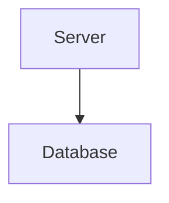

# Building Temporal from the Ground Up

To understand the design decisions that were made in building the Temporal platform, we look at
the problem of building a durable execution platform from the ground up. This first
principles-oriented approach aims to help build an intuition of the system architecture of Temporal.

---

### What problem are we solving?

We need a platform that allows us to:

- **effectively** express complex business logic
- run **reliably** in the face of failures
- **scale** to handle increasing load
- complete work with optimal **performance**
- run **efficiently** using minimum resources

### Event History

Given our requirement to support complex business logic effectively, a full-fledged programming
languages such as Java, Python and JavaScript is the only feasible option here since they provide a
huge ecosystem of training, documentation, support, libraries, testing frameworks, deployment
options, profiling and monitoring. Any other declarative, low-code or no-code approach would be
too limiting for the complex (and always changing!) world the user is operating in.

Now, imagine the user developers the business process of ordering a pizza for pickup:

```python
def order_pizza_for_pickup(customer, size, toppings):
    if is_invalid(size, toppings):
        raise Exception("invalid order")

    if charge_customer(customer.credit_card_id):
        send_success_notification(customer.mobile_number)
        prepare_pizza(size, toppings)
    else:
        send_failure_notification(customer.mobile_number)
```

The code does two things:

- make decisions (e.g. validating the order, deciding on steps after 
charging)
- execute side effects (e.g. charge credit card, send notifications)

We'll refer to  this kind of program as a **Workflow** from now on, or more specifically: the 
code is a **Workflow Function** and the execution is a **Workflow Execution**.

Running it as-is **won't be reliable** since the execution can fail at any step. For example,
the host can crash right after the customer is charged. How do we mitigate that? The code cannot 
just be executed again since it will charge the customer again! That means, there are only two 
options to safely proceed from here:

- _restore_ the state and resume
- _abort_ the entire Workflow, cancelling the charge

For business reasons, restoring the state is often much more desirable, especially if the failure
was transient. But for that, the user needs to manually adapt their program by adding 
a snapshot/recovery mechanism - requiring more code, more development time, and increasing the 
complexity. The actual business logic would be harder to identify, verify and change.

Instead, if the program could stop the execution _at any point_ and _pick up again from there_
without running the same side effects again, it could resume from any kind of failure at any point.
We'll call this **durable execution**. It requires capturing every state change in
the program as an **Event**. The event is an immutable record that captures the state change at
a specific point in time. To restore a program's state, we'll need to replay the sequence of
all recorded events - we'll call that the **Event History**. It can only be appended to, never
removed from.

### Replay

- replay solves the resume issue
- requires deep integration with language environment
- there are a lot of hidden side effects; like "current time of day", "UUID"

### Separate Responsibilities

Since the Event History is required to resume a Workflow Execution, it cannot be exclusively stored 
on the same host that executes the Workflow.



---
