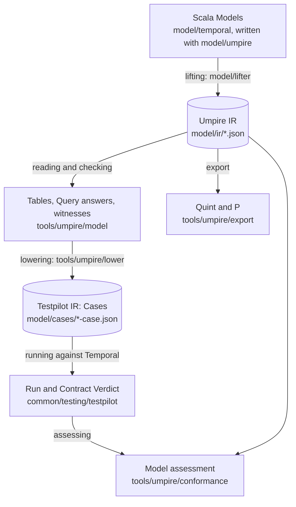

# The Temporal behavior model

This directory holds a description of how Temporal features are expected to behave, written so
that tools can use it. You describe a feature once, as a small state machine and the promises it
makes. From that one description you get:

- **A check of the description itself.** The Go evaluator walks every path the state machine allows,
  within stated limits, and reports any path on which a promise fails.
- **Generated tests.** A path that shows a promise at work becomes a test that runs against a real
  Temporal server. Nobody writes the test by hand.
- **A judgment of what the server did.** The record of such a test is checked twice: against the
  test's own pass conditions, and against the description as a whole.
- **Second opinions.** The same description is exported to two other checkers, Quint and P, and
  their answers are compared with ours.

Paths on this page are relative to the repository root.

## The terms, with one example

The example is one promise about a Nexus operation, which is a call a workflow makes to a handler
in another service: when the handler answers the call synchronously, the operation succeeds and the
workflow history records its completion. The example runs through the whole page.

A **Model** is the description of one feature: its state machines and everything declared about
them. A **machine** is a finite state machine: its states, the actions that can happen, and a step
function per action that says what the next state is and which facts the step records. The Nexus
caller Model is in `model/temporal/nexuscaller`, and its machine `nexusProtocol` is declared in
`Model.scala`.

A **Property** is one promise a machine makes: a condition its steps must meet. This is the
example's Property (`model/temporal/nexuscaller/Properties.scala`, line 22), named after its
`val`:

```scala
/** A synchronous reply settles the operation as succeeded, and the completed event records it. */
val syncSucceeds = nexusProtocol.property when handlerReply(Reply.syncSuccess) holds { s =>
  s.state.phase == Phase.succeeded && s.records(ProtocolFact.nexusOperationCompleted)
}
```

A **Scenario** is a path through a machine: a start state and a sequence of actions. Here the
caller schedules the operation and the handler replies synchronously
(`model/temporal/nexuscaller/Queries.scala`, line 28):

```scala
val syncReplied = nexusProtocol.scenario.actions(schedule(), handlerReply(Reply.syncSuccess))
```

The path starts where the machine does, in `unscheduled`, the state before the operation exists.
`schedule()` leaves each of the operation's three optional timeouts at its first value, `unset`;
`schedule(Inputs.scheduleToStart := expires)` sets one by name.

A **Query** is a bounded question that joins the two: find a path of this Scenario on which the
Property is put to work, or verify that the Property holds on every path of it (line 106, without
its exploration settings):

```scala
val syncCompletion = (query find syncSucceeds in syncReplied limits two total 384)
  .expect(satisfied)
```

The path a `find` Query returns is its witness. `limits two` bounds the search to two steps.
`total 384` is the author's count of the Query's static combinations, which the reader checks; see
[Counting a Query's total](#counting-a-querys-total).
`.expect(...)` states what a real run of this path should be judged as, here `satisfied`, the
Model's `RunExpectation(Conformance.conformant, Outcome.satisfied)`; see
[Following the example to a Verdict](#following-the-example-to-a-verdict).

A **realization** says how to act a path out on a real server: which API calls perform each
action, and which recorded events are evidence of each fact. The Nexus caller's realization is
`model/temporal/nexuscaller/Realization.scala`.

The remaining terms name what the tools produce:

- The **IR** (intermediate representation) is a language-neutral file format that tools read
  instead of source code. There are two, described in the next section.
- **Lifting** turns the compiled Scala Models into the first IR.
- **Lowering** turns a Query's witness, through its realization, into a Case.
- A **Case** is one executable test: a Program of instructions to run against Temporal, and a
  Contract of rules that the recorded evidence must satisfy.
- A **Run** is the record of one execution of a Case: an ordered list of events.
- A **Verdict** is the Contract's conclusion about one Run: `satisfied`, `violated` or
  `inconclusive`.

## The layers

Scala declares a Model, the lifter reads its compiled declarations, and Go evaluates the resulting
IR. The Scala DSL supplies types and step functions for authoring; Go is the single Model evaluator.



Two IRs sit between the layers, and each has one writer side and one reader side:

- The **Umpire IR** is a lifted Model. Scala writes it (the lifter); Go reads it (the reader,
  lowering, conformance, export and exploration under `tools/umpire`). Its schema is
  `proto/internal/temporal/server/api/umpire/v1/ir.proto`, and the checked-in files are
  `model/ir/*.json`. Go never runs Scala code: everything it knows about a Model comes from
  this file.
- The **Testpilot IR** is the Case, Run and Verdict format. Lowering writes Cases; Testpilot, the
  Case runtime, reads them and writes Runs and Verdicts. Its schema is
  `proto/internal/temporal/server/api/testpilot/v1`. Testpilot knows nothing about Models.

| Layer | What happens | Module | Command |
| --- | --- | --- | --- |
| Authoring | Models are written in Scala with a small DSL (a library of declarations such as `machine`, `property` and `query`) | DSL `model/umpire`, Models `model/temporal` | `make lint-model`, `make fmt-model` |
| Lifting | The compiled Models are translated to the Umpire IR, built as the ScalaPB classes of its schema and written as ProtoJSON. A construct outside the supported subset is refused at its source line | `model/lifter`, run by the gate `model/gate` | `make umpire-gen-model` writes `model/ir`; `make umpire-check-model` requires it to be current |
| Umpire IR | The checked-in lifted Models | `model/ir`; schema in `api/umpire/v1` | `make protoc` after a schema change |
| Reading and checking | Go loads and validates the IR, builds each machine's table, and answers every Property, Query and refinement | `tools/umpire/model` | `go test -tags test_dep ./tools/umpire/model/...` |
| Lowering | A `find` Query's witness becomes a Case through its realization | `tools/umpire/lower` | `make umpire-gen-cases` writes `model/cases`; `make umpire-check-cases` requires it to be current |
| Testpilot IR | The checked-in Cases, and `manifest.json`, which accounts for every Query | `model/cases`; schema in `api/testpilot/v1` | |
| Running | Testpilot admits a Case, runs its Program through the Temporal Driver, records the Run and evaluates the Contract into a Verdict | `common/testing/testpilot`, `common/testing/testpilot/temporal` | `make umpire-check-live-tests` (in-process server); `make umpire-run` builds `.build/umpire-run` for any deployment |
| Assessing | The Run's evidence is compared with the whole Model | `tools/umpire/conformance` | part of the live tests above |
| Export | The IR is written for Quint and P, and their answers are compared with Go's | `tools/umpire/export` | `make umpire-check-backends` (needs the tools its README names) |

## Running the gate

The gate is the one command that checks the whole model pipeline:

```sh
make umpire-check-model
```

It is a Scala program, `model/gate`. In order, it checks that the files under `model/` keep to the
model's own vocabulary, compiles and tests the DSL and the Models, runs the lifter's own tests,
lifts every IR file the Models declare in one lifter run, requires every file of `model/ir` and
`model/cases` to equal what it just produced, and runs `go vet` and `go test` over `./tools/umpire/...`. It stops at the first failure
and changes no checked-in file. scala-cli, the JDK, protoc and Go come from the repository's
`mise.toml`.

After you change a Model, regenerate the checked-in files with the same program:

```sh
make umpire-gen-model     # the gate with --update: rewrites model/ir and model/cases
```

Then read the diff of `model/ir` and `model/cases` like any other code change.

Each file of `model/ir` is declared once, in Scala, beside the Models it holds (the folder's
`IrFiles.scala`): its name and its roots, named by value.

```scala
val nexusControlFile =
  irFile("nexus-control")(forgedCompletion, NexusRealization.forgedCompletion)
```

A root is a machine, a composition, a Query, a list of Queries, a progress claim or a realization;
the file holds it and everything it reaches. A root that names nothing does not compile. A
declaration may be a root of several files and is lifted into each, and one that no file names
stays out of `model/ir`, so a design can be kept out of the checked files. The lifter reads the
compiled Models once and lifts every file apart, with nothing carried from one to the next; a
refusal follows a line naming the file it was lifting. `lift --ir <jar=prefix> <classpath file>
<directory> [name...]` is that run, and `lift <jar=prefix> <classpath file> <out.json> <root>...`
lifts the roots named by their fully qualified names, as the lifter's fixtures do.

The gate packages the linked Temporal API, Testpilot and well-known ScalaPB classes in
`model/gen/api-scalapb.jar`. Its descriptor and tool stamp is checked before a build; editing a
Model reuses that jar. If the gate reports a missing or stale `proto/api.binpb`, run the named
`make proto/api.binpb` target; if it reports stale generated internal protobuf code, run
`make protoc`. The gate reports the declaration's source line when a typed selection cannot be
lifted. The compiler reports misspelled fields, wrong request or response roots and wrong value
types before lifting.

`make umpire-check-model MODEL_GATE_ARGS=--skip-go-checks` leaves out the `go vet` and `go test`
step, for when you run the Go tests separately. `go test -tags test_dep ./tools/umpire/...` runs the
Go side alone from the checked-in IR and needs no JVM.

## Following the example to a Verdict

**Lifted.** `make umpire-gen-model` lifts the Query into `model/ir/nexus-caller.json`. This is its
entry there, without the `exploration` field:

```json
{
  "name": "syncCompletion",
  "position": {
    "file": "model/temporal/nexuscaller/Queries.scala",
    "line": 106
  },
  "form": "FORM_FIND",
  "property": {
    "machine": "nexusProtocol",
    "name": "syncSucceeds"
  },
  "scenario": {
    "machine": "nexusProtocol",
    "name": "syncReplied"
  },
  "limits": {
    "name": "two",
    "steps": 2,
    "actions": 2,
    "search": 512
  },
  "expectedRun": {
    "property": "OUTCOME_SATISFIED",
    "conformance": "CONFORMANCE_CONFORMANT"
  }
}
```

The Property, the Scenario, the machine and its step functions are lifted into the same file the
same way, each with its Scala source position. Step functions become expression trees, which
[SEMANTICS.md](SEMANTICS.md) defines how to evaluate.

**Checked.** The Go reader builds the table of `nexusProtocol` from the IR and answers the Query:
it finds the two-step path and confirms that `syncSucceeds` holds on its last step. That path is
the witness.

**Lowered.** `tools/umpire/lower` turns the witness into the Case
`model/cases/nexus-caller-syncCompletion-case.json`, with the Case ID
`temporal.case.scala.nexus-caller.syncCompletion`. Its Program has three parts: a workflow that
schedules a Nexus operation, a handler that replies synchronously, and a controller that starts
the workflow and reads its history. Its Contract holds one rule. This is the rule, with the two
comparisons left out:

```text
"ruleId": "fact-nexusOperationCompleted",
"trigger": { … },
"response": { … },
"clock": "CORRELATED_CLOCK_OPERATION_TRANSITIONS",
"bound": "1",
"ending": "TRACE_ENDING_PARTIAL"
```

The trigger matches the step whose action is `schedule-unset-unset-unset`, and the response matches
a step whose fact is `nexusOperationCompleted`. In words: once the Run shows the operation
scheduled, the completed fact must follow within one more transition of that operation.
`model/cases/manifest.json` lists the Query as `lowered` and repeats what `.expect(...)` declared.

**Run.** `tools/canary/assessment/testdata/nexus-caller-syncCompletion-run.json` is a recorded Run
of exactly this Case against the in-process test server. It holds 27 events and ends with this
Verdict:

```json
{
  "status": "VERDICT_STATUS_SATISFIED",
  "rules": [
    {
      "ruleId": "fact-nexusOperationCompleted",
      "status": "RULE_VERDICT_STATUS_SATISFIED",
      "terminalStateId": "correlated.satisfied",
      "supportingEventSequences": ["9", "19"]
    }
  ],
  "supportingEventSequences": ["9", "19"]
}
```

Event 9 is the evidence that the operation was scheduled, and event 19 is the history's
`EVENT_TYPE_NEXUS_OPERATION_COMPLETED` event. To produce such a Run yourself,
run every lowered Case against an in-process server:

```sh
go test -tags 'test_dep integration' ./tests -run '^TestTestpilotGeneratedCases$'
```

**Two judgments, kept apart.** The Verdict above is the *Contract Verdict*. It says the Case's own
rule was met, and nothing more: the rule checks that the completion was recorded, not that the
operation's phase was `succeeded`, because a Property's clause about one field of the state does
not lower to a Contract rule yet.

The *model assessment* is the second judgment. It asks whether some execution the Model allows
explains all the evidence in the Run (conformance: `conformant`, `nonconformant` or
`inconclusive`), and what the Query's Property is on every execution that does (`satisfied`,
`violated` or `inconclusive`). The assessment is not stored in the Run. For `syncCompletion` the
declared expectation is `conformant` and `satisfied`, and `TestTestpilotGeneratedCases`
requires exactly that of a live Run and of its replay.

**What is not supported.** These limits are current and recorded, not hidden:

- `syncCompletion` is the only one of the Nexus caller's seven `find` Queries whose Property the
  assessment settles. The other six Cases run and satisfy their Contracts, but their Property stays
  `inconclusive`, because the Model also allows another execution that explains the same evidence
  and on which the Property fails or is never evaluated. Each Query's `.expect(...)` states the
  reason.
- Of the 264 Queries in the checked-in IR, 16 lower to a Case. 150 are `verify` Queries, which have
  nothing to run. 95 belong to machines that declare no realization yet. 3 standalone activity
  Queries are `unsupported`: their path needs something a Case cannot do or record in order yet,
  and the manifest names it at its source line.
- A Run samples one execution of the server. A satisfied Verdict is evidence about that Run, not a
  proof about every schedule.
- The recorded Run above was made on a test server. No Run of a real deployment is checked in.

## Where things are

| Path | What it holds |
| --- | --- |
| `model/umpire` | The DSL: what an author writes a Model with. Realization declarations and their script helpers are in `umpire/realize` |
| `model/temporal` | The Models, one folder per feature: `nexuscaller`, `standaloneactivity`, `worker`; `taskqueue`, the shared task-queue entity features compose; and `realize`, the shared Temporal realization kit |
| `model/lifter` | The lifter. `testdata` holds Models it must lift and Models it must refuse |
| `model/ir` | The checked-in Umpire IR, one file per `irFile` the Models declare |
| `model/cases` | The checked-in Cases and `manifest.json` |
| `model/gate` | The gate program. It generates the IR's ScalaPB classes from the schema into `model/gen` (`--generate-ir`) and runs the lifter once over every IR file the Models declare |
| `model/project.scala` | The build settings of the DSL and the Models |
| [SEMANTICS.md](SEMANTICS.md) | The evaluation rules of the Umpire IR: what every construct means |
| [Known bugs](../.plans/UMPIRE4_VISION.md#known-bugs-knownbugs) | Vision for acknowledging a known bug; not implemented |
| `model/gen` | Build output of the gate; ignored by git |

The module map, [.plans/UMPIRE_MODULES.md](../.plans/UMPIRE_MODULES.md), states each module's job,
its public interface and what it may import. Each module outside this directory has its own README:

- [tools/umpire](../tools/umpire/README.md): the Go tooling that reads the Umpire IR, and its commands.
- [tools/umpire/export](../tools/umpire/export/README.md): the Quint and P comparison.
- [common/testing/testpilot](../common/testing/testpilot/README.md): the Case runtime and the Testpilot IR.
- [common/testing/testpilot/temporal](../common/testing/testpilot/temporal/README.md): the Temporal Driver.
- [tests/testcore/testpilot](../tests/testcore/testpilot/README.md): the Cases the functional tests pin.
- [tools/canary](../tools/canary/README.md): the canary, which runs one pinned Case against a
  production deployment when an operator dispatches it.

## Writing a Model

`make lint-model` checks formatting and lint rules for the DSL, the Models, the lifter and the
gate; `make fmt-model` formats them and `make fix-model` applies the lint rewrites. A construct a
lint rule forbids where no rewrite keeps the behavior carries a line-scoped
`// scalafix:ok <rule>`.

The lifter reads what an author wrote, as written:

- **Declarations:** `machine[S, O, F] { … }` blocks, with `forEntity`, `starts`, `ends`,
  `evidence`, `unobservable`, `refines` and `steps(a ~> f, …)`; the derivations `restrict`,
  `rebind`, `extend`, `refining`, `assuming` and `unmonitored`; action chains
  (`action`, `timer`, `internal`, `on`, `creates`, `input[T]`, `schema`, `results`, `example`);
  input tokens, `val scheduleToStart = input[Timeout]` declared on an action with
  `.input(scheduleToStart)`, each input named after its token's `val`; classes, `flip`, the
  positional `start(unset, expires, unset)` and `start()`, every input at its domain's first value
  (`start(unset, unset, unset)`, and for an action with no input its one class);
  Properties, Scenarios, Queries, Limits, monitors, assumptions, holes, channels, compositions,
  progress claims and realizations. A composition names its members by field selector
  (`_.activity -> currentRecord`), and so do its `sync`, `replaces` and `withMember`; a `sync`
  with no name is named after its first member's action; a Scenario
  or `whenAction` of it names a sync by one member action it pairs, `c.synced(_.activity ->
  dispatch)`, and a member's own action by `c.own(_.activity, control(Control.pause))`.
- **Shared claims:** `property` and `scenario` are declared on `Declares[S]`, the supertype of a
  machine and a composition, so one function over `m: Declares[S]` declares a Property on either.
  A function-valued argument of such a function names a def of the lifted sources, which the
  lifter binds where the function is called, as it binds a machine argument; a type parameter
  reads as the type the call applies it to. A case class whose every field is a Property, Scenario
  or Query bundles claims: built by its constructor in such a function, it lifts as its claims, and
  `x.field` reads one back.
- **Types:** enums with and without case fields, case classes, and bounded counters `UpTo[N]`: a
  field `attempts: UpTo[2]` has the values 0, 1 and 2, lifted as the IR int range 0..2, and a step
  writes one with `UpTo(n)`. It replaces integer fields bounded by the per-record
  `given Finite[Int] = Finite.upTo(…)` beside the state's `Finite`, which Models not yet migrated
  keep.
- **Step functions:** `if`, `match` with case, alternative, binding and wildcard patterns, local
  `val`s, `copy`, constructors, comparisons, arithmetic, list literals and `++`, and calls of other
  functions; `Step(…)` and `steps.because("…")` on steps written out, and named choices,
  `choose(committed -> …, redelivered -> …)` over tokens `val committed = choice`. `require`
  becomes the function's precondition; `ensuring` is not lifted.
- **Realization script helpers** (core, `umpire/realize/Scripts.scala`): `script(id, activation)`
  of `always(command)`, `onPath(classes*)(command)` and `perform(step -> command, …)` items;
  `command(instruction, …)`; `rpc(role, method) { … }`, `poll(…) { … }` and `call.setting { … }`,
  which appends assignments and keeps the call's name; `statusTable(fact -> value, …)`. A command
  is named after its `val` in kebab case (`val pauseActivity` is `pause-activity`) unless written
  out as `Command(id, …)`. A declaration referred to by value is written as its id, a monitor as
  its name (`MonitorExpectation(terminalFinality, …)` in a Query's expected Run), and a fact as
  its enum case, or the companion of a case with fields. A lookup `table(fact)` is resolved when
  the lifter lifts. The lifter refuses a command no `val` declares, a `perform` or `onPath` with no
  class, a lookup of a fact its table lists twice or not at all, a request-scope line of an `rpc`
  or a `poll` that is neither `field(_.x) := v` nor `Assignment.typed(…)`, and evidence that
  records a case of another enum than the facts its machine records.
- **Sugar** (`umpire/Syntax.scala`, lifted by `lifter/Syntax.scala`): `accept(state, facts*)`,
  `stay(s)`, `disabled`, `x.in(a, b, …)`, `a implies b` and `after.records(fact)`. Each is lifted to
  the IR its core form lifts to, and nothing else: `List(Step(accepted, state, List(facts*)))`,
  `List(Step(accepted, s))`, `Nil`, `List(a, b, …).contains(x)`, `!a || b` and
  `after.facts.contains(fact)`. `accept` and `stay` answer the outcome one
  `given Accepted[Outcome] = Accepted(Outcome.accepted)` names; `in` is written dotted and takes at
  least one member; `implies` reads its right side only where its left side holds. A composition's
  `after.records(_.member, fact)` lifts as `after.facts.contains("member_fact")`, the composed key
  it records. A named call `start(scheduleToStart := expires)` lifts as the positional
  `start(unset, expires, unset)`. The kit's `field(_.name) := operand`, in
  `temporal/realize/Syntax.scala`, lifts as `Assignment.typed(Field[Req, V](_.name), operand)`,
  where `Req` is the request type of the scope the enclosing `rpc` or `poll` opened.
- **Claim patterns** (sugar, the same files): `once(over).keeps(_.x)`, `never(to)`,
  `never(to).from(before)`, `stays(p)` and `stays(p).unless(release)` on a Property builder, each
  lifted to the Property its lambda declares: `holdsAcross((before, after) => !over(before) ||
  after.state.x == before.x)`, `holds(after => !to(after))`, `holdsAcross((before, after) =>
  !before(before) || !to(after))`, `holdsAcross((before, after) => !p(before) || p(after.state))`
  and the same with `|| release(after)`. Each predicate is lifted as `holds` lifts its lambda and
  called from the Property's function; `keeps` takes a field path, or a def whose body is one.
- **The monitor pattern** (sugar, the same files): `val retainedOutcome = sticky(outcomePreserved)`
  and `val ownerAcknowledgment = stickyAcross(ackOnlyWhenKept)` declare a monitor of a promise that,
  once a step breaks it, stays broken, named after its `val`. Each lifts as the monitor
  `monitor[S, O, F, Boolean](false)((broken, before, after) => broken || !p(after))(broken =>
  broken)`, with `!p(before, after)` for `stickyAcross`, read after every step. A promise about
  another state type than the monitor's does not compile. A monitor that needs history, such as
  one counting the outcomes recorded, is written with `monitor`.

A declaration takes its name from the `val` that declares it, and its family from the
`given Family` in scope. A machine states its three types once, in `machine[S, O, F]` or as the
`val`'s type:

```scala
given Family = Family("fixture.store")

val put = action(Party("client"))
val store = machine[Store, Outcome, Fact] { … }
val putOnly = store.restrict(put)
val putStores = store.property when put holds (after => after.facts.contains(Fact.stored))
val putOnce = store.scenario.actions(put)
val two = Limits(steps = 2, actions = 2, search = 64)
val putStoresOnce = query find putStores in putOnce limits two total 2
```

The same holds for `timer`, `internal`, `compose[S](_.field -> machine, …)`,
`monitor[S, O, F, M](initial)…`, `assume`, `hole`, `channel[M](capacity = …, …)` and
`Realization(machine = …, …)` without `name`, and for `Party()`, `Entity(key = …)` and
`Observation(on = …, read = …)`, whose `name`, read as `attemptCount.name` in an evidence line or a
kit body, is their `val`'s.

A name is written as a string only where it differs from the `val`'s, or where no `val` declares
it, and each kind has one form for that: `machine[S, O, F](family, name)`, `action(name, party)`,
`monitor[S, O, F, M](name, initial)`, `assume(name)`, `property(name)`, `scenario(name)`,
`query(name)` and `Limits(name, …)`. A timer, internal step, hole, channel, derived machine and
composition has none: each is named after its `val`, and a composition names its members, syncs and
Scenario classes by field selector, never by a string key. A progress claim is always named,
`m.leadsTo(name)(…)`. A Property or Scenario with no `val`, built in a list or in a function over a
machine argument, keeps `property("…")` or `scenario("…")`. A Query that neither a `val` nor `query("…")` names is named
`<machine>.<scenario>.<property>`, after the machine its Scenario is declared on, its Scenario and
its Property: `query verify notPaused in any` over a design `m` is `m.any.notAdmittedWhilePaused`.
Any other captured form with no `val`, or with a name the compiler made up such as an anonymous
given's, is refused at its line. So are two declarations that would share a name: two machines or
compositions, two Properties or two Scenarios of one machine, two Queries (two unnamed Queries of
one Scenario and Property among them), two syncs of one composition, monitors, assumptions, holes,
channels or realizations, Limits of one name with different bounds, and two actions one machine
binds. A monitor a Query's expected Run names by value is refused where no `val` declares it or the
Query's machine does not watch it, and a `given Family` whose root is not a string literal.

A feature's files are split by kind, and its larger subjects into folders that repeat the same
file names. The standalone activity is the example:

```text
standaloneactivity/
  Model.scala         vocabulary, the product and protocol machines, their composition with the worker
  Properties.scala    what those machines promise, and the promises the folders below declare
  Queries.scala       the Scenarios (`Paths`), Limits and Queries that ask about them
  Realization.scala   the realization
  admission/          Model.scala, Properties.scala, Queries.scala: the record and its designs
  compositions/       Model.scala, Properties.scala, Queries.scala: the designs over the task queue
```

`Model.scala` holds domains, actions, step functions, machines, compositions and monitors, since a
machine names its monitors and the two files would otherwise initialize each other in a cycle.
`Properties.scala` holds what the machines promise, the specification a reviewer reads on its own;
`Queries.scala` holds Scenarios, Limits and Queries, since a Scenario means nothing except as the
path of a Query. A folder is a subpackage (`package standaloneactivity; package admission`), so it
reads its parent's vocabulary without imports and its `Model.scala` does not collide with the
parent's. Each machine's vocabulary is an object of its own (`Product`, `Protocol`, `Admission`):
its status sets, which steps and promises read by name (`Product.terminal`, `Protocol.held`), and
its step functions, named after the actions they answer (`attemptStart ~> Protocol.attemptStart`).
A file that declares Properties over a machine argument returns them as a bundle (below), so its
Queries read them by field rather than declaring them.

Two families in one package cannot both be package-level givens, since each file would see both.
Each then lives in an object of its own, `object SystemFamily: given family: Family = …`, and each
file imports the one its declarations take (`import SystemFamily.given`), as the standalone
activity's files do: its Model.scala declares `ActivityFamily` and `SystemFamily`, and the files of
its `admission/` and `compositions/` import `SystemFamily.given`.

An action, monitor, assumption, hole, channel with the actions it derives, or realization takes its
Definition ID from its `val`'s owner and name. Declarations moved to a new owner keep their IDs
through one `given DefinitionScope = DefinitionScope("pkg.Former$package$")` there, the compiler's
name for the former owner: each ID is `<former owner>.<val name>`. An owner pins once, not inside
an owner that pins and not to itself, and no two declarations may share an ID. Owners nested in a
pinned one keep their own IDs. No declaration names an ID of its own.

Type names follow the same pin. A top-level type belongs to its package, not its file, so a type at
the top level of a file whose declarations pin a former file owner `pkg.File$package$` takes the IR
name `pkg.<Type>` it had there; a pin of an object owner `pkg.Obj$` leaves type names alone. Two
types one lift reads that would share an IR name are refused.

A derived machine is another machine's declaration with one thing changed, named after its own
`val` in the `given Family`, as a restricted one is. Chained, they lift from the `val` of the last:

```scala
val stiffLamp = lamp.rebind(press ~> pressStiff)       // replaces a bound step function, in place
val faultyLamp = lamp
  .extend(burnOut ~> burnOutLamp)                      // binds actions the source does not, after its own
  .refining(viewUnderFaults)(seen)                     // replaces the refinement, keeping what it lets through
  .assuming(burnOutAssumed)                            // appends assumptions, each once
val plainLamp = lamp.unmonitored                       // drops the monitors and the refinement
```

Each keeps everything else its source declares: starts, ends, evidence, unobservable timers,
monitors, assumptions and refinement. The lifter refuses rebinding an action the source does not
bind, extending by one it binds, binding one action twice, an assumption named twice, replacing a
refinement the source does not declare or by a machine of other state, outcome or fact types, and
a machine derived from or aliased to itself.

A composition is written with field selectors, and one derives from another by replacing a member:

```scala
val currentOverQueue = compose[OverQueue](_.activity -> currentRecord, _.queue -> dispatchQueue)
  .sync(_.activity -> dispatch, _.queue -> enqueue)
  .sync("admit", _.activity -> attemptStart, _.queue -> deliver)
  .ends(s => Admission.ends(s.activity))
val staleOverQueue = currentOverQueue.withMember(_.activity -> staleRecord)
val stale = currentOverQueue.scenario.actions(
  currentOverQueue.synced(_.activity -> dispatch),
  currentOverQueue.own(_.activity, control(Control.pause))
)
```

`->` pairs a member with its value; it never means a transition. A sync with no name is named
after its first member's action, here `dispatch`; one written with its name, `admit`, is that name.
A selector, a sync and a member's action are resolved by the field and the action's declaration,
not by the strings the IR keys them with: `synced` finds the one sync that pairs that member's
action, and `own` an action that member binds and no sync pairs. `withMember` keeps the syncs, ends and member order and names
the derived composition after its `val`; a member that replaces a machine replaces, in the derived
one, the machine its new machine declares it refines. The lifter refuses a selector that names no
field or no member, a member of another state type, a sync of an action the member does not bind,
a `synced` that matches no sync or several, an `own` of a paired or foreign action, and a
replacement of a replacing member by a machine that refines nothing.

The queue in that example is the task queue, `model/temporal/taskqueue`: a shared entity
(`taskQueue`, keyed by the queue's name) that a feature composes by synchronizing its own actions
with `enqueue`, `deliver` and `acknowledge`, and that imports nothing of any feature. It owns the
opaque contract `dispatchQueue`, the providers that refine it (`matchingQueue`, the lossy one and
the violating controls), the laws `queueLaws` every provider is held to, and the provider Queries.
A feature keeps its own syncs and its cross-entity claims, as the standalone activity's
`compositions/` does. The queue is a bounded abstraction, not a general queue: one message at a
time, delivered at most twice before its acknowledgment. The detailed provider's table, and a
design composed with it, has depth ten, so its free Queries run within `twelve`. Its declarations
keep the family, Definition IDs and type names they had in the standalone activity's system
contract, through the pin and the type-name rule above.

A claim over several designs is one function over `Declares[S]` whose state-dependent parts are
parameters, and each call passes defs of the lifted sources:

```scala
def notAdmittedWhilePaused[S](m: Declares[S])(paused: S => Boolean, running: S => Boolean) =
  m.property("notAdmittedWhilePaused").never(s => running(s.state)).from(paused)

val onRecord = notAdmittedWhilePaused(currentRecord)(Admission.paused, Admission.running)
```

A lambda passed for such a parameter is refused at its line, naming the def to write, and so is a
claim pattern after `when` (a pattern reads every step) and a `keeps` projection that is not a field
path.

Such a function returns several claims as a bundle, a case class whose every field is a Property,
Scenario or Query. The lifter folds the constructor's call to its claims, and a field read to the
one claim it names, as `providerQueries` reads `laws.delivers`:

```scala
final case class QueueLaws(delivers: Property[QueueDetail], committedStays: Property[QueueDetail])

def queueLaws(m: Machine[QueueDetail, QueueOutcome, QueueFact]): QueueLaws = QueueLaws(
  m.property("delivers") when deliver holds (after => after.records(QueueFact.delivered)),
  m.property("committedStays")
    .stays(_.custody != Custody.nowhere)
    .unless(_.records(QueueFact.acknowledged))
)
```

Sugar is kept apart from the core. The core is what the IR needs declared: `machine`, the
derivations `rebind`, `extend`, `refining`, `assuming` and `unmonitored`, `given Family`, `action`
and its classes (`start()` among them), `input`, `UpTo`, `steps` and `~>`, `Step` and `because`,
`Declares[S]`, `property` with `holds`, `holdsAcross` and `when`, `monitor`, `leadsTo`, `compose`
with `sync` (named or after its first member's action), `synced`, `own` and `withMember`,
`scenario`, `query` (named or after its Scenario and Property), `Limits`, `.total`,
`DefinitionScope`, `choose`, `irFile`, and the realization declarations, among them the script helpers `rpc`,
`poll`, `perform`, `onPath`, `always`, `script`, `command` and `statusTable`, `Actuator`,
`MonitorExpectation` and the kit's roles and bindings. Sugar is a form whose meaning a core form
already says: `implies`, `in`, `records`, `accept`, `stay`, `disabled`, the claim patterns (`once`,
`keeps`, `never`, `from`, `stays`, `unless`), the monitor pattern (`sticky`, `stickyAcross`) and
both spellings of `:=`, named inputs and request
fields. It lives in the `Syntax.scala` files of the DSL (`umpire/Syntax.scala`), the kit
(`temporal/realize/Syntax.scala`) and the lifter (`lifter/Syntax.scala`). Each form is documented
with `Core form:` and the core spelling it stands for, and a lifter fixture lifts it beside that
spelling and requires the same IR. No core file imports sugar, and a sugar word is defined in no
other file; `make lint-model` checks these three rules.

Three symbols, each with one meaning: `~>` binds an action to its step function, `->` pairs a key
with its value, `:=` gives a named slot a value; everything else the DSL adds is a word.

`:=` is one operator (`@targetName("set")`) for both kinds of named slot, an action's input token
and a request's field. A named call `start(scheduleToStart := expires)` is sugar for the positional
`start(unset, expires, unset)`: the supplied inputs take the action's declaration order, and an
omitted input takes its domain's first value, here `unset`. `start()`, which omits every input, is
core: the class of every input at its first value, `start(unset, unset, unset)`, and the one class of
an action with no input. The lifter refuses, at the call's line, a token that is no input of the
action, a token supplied twice and an omitted input whose domain has no value. A value of the wrong type for its
token is a compile error.

A step that can go more than one way names each result with `choose`, which is core: it says
what no other form does, the names of the alternatives, which the IR records on each step record
as its `choice`.

```scala
val committed = choice
val redelivered = choice

def admitted(s: AdmissionState): List[AdmissionStep] = choose(
  committed -> accept(s.copy(message = Message.empty), AdmissionFact.statusStarted),
  redelivered -> accept(s.copy(message = Message.redelivery), AdmissionFact.statusStarted)
    .because("the channel may deliver the message again")
)
```

A name is inert metadata (model/SEMANTICS.md, Named choices): the rows, fingerprints, Query
answers and Cases are the ones the same steps give written as an unnamed list, and the IR differs
from that list's only by the names. Each alternative is one step written out, `accept(…)`,
`stay(s)`, `List(Step(…))` or one of those with `.because("…")`, and each name is the simple name
of its token's `val`. A choose of one alternative does not compile; the lifter refuses, at the
alternative's line, a name given twice in one choose (one token twice, or two tokens whose `val`s
share a simple name), an alternative that is not one step written out (a helper's steps, `Nil` or
`disabled`, two steps, an `if`), a token no `val` declares, and an alternative kept in a `val`
rather than written in the call. Unnamed lists of several steps still lift while Models move to
`choose`.

A name is a token of its own, not a case of an enum: an enum used only for names would be lifted
as an IR type the Model does not otherwise need, and the names of different step functions are not
one closed set.

A Scenario without `starts` starts in its machine's one declared start, and a composition's in the
record of its members' starts; where there is not exactly one, it is refused. Evidence is optional.
A fact no line names is confirmed by evidence of its own name, so `evidence { case … }` lists only
the exceptions. A fact case with fields needs a line that covers all its values.

`query … in s` takes no given. A Property of the machine the Scenario's machine `refines` is read
through that refinement; a Property of an unrelated machine is refused at the Query's line.

### Counting a Query's total

Every Query states `total n`, the number of its static combinations, which the author works out and
the Go reader recomputes. It is what a reviewer reads to see how large a question is before anything
runs. Count the Scenario machine's states, its whole state catalog: the product of its fields'
catalogs, an enum counting each case times its fields. Then:

- a pinned Scenario counts states times the scheduled slots within the step limit,
  `min(steps, scheduled actions)`;
- a free Scenario counts states times the machine's action classes times `steps`. Each bound action
  has one class per assignment of its inputs: an action without inputs is one class, and one with
  inputs the product of their catalogs. A composition counts its own state record, and as classes
  each member's classes that no sync takes plus, for each sync, the classes of its first action times
  those of its second.

`syncCompletion` above pins two actions within `limits two`. `ProtocolState` has a `Phase` of 8
cases, `attempts` of 0 to 2 and three two-valued `Timeout`s, so 8 × 3 × 2 × 2 × 2 = 192 states, and
the total is 192 × min(2, 2) = 384. A free Scenario of the same machine within three steps would
count 192 × 23 × 3 = 13248: `schedule` has 2 × 2 × 2 = 8 classes, `handlerReply` 4 + 2 = 6 (one of
its five replies carries a Boolean), `complete` 3, and the six actions without inputs one each.

The count is taken before anything is reached. Unreachable states, disabled steps, states the search
meets twice and a search that stops at its first witness all count, and a named choice's alternatives
are results of one class, not more classes. So the total bounds what the search could be asked to
look at; it does not predict the paths it visits, which the Query's answer reports, or what a Run
executes. A Query read through a refinement counts its own Scenario machine, `limits` with 0 steps
count 0, and a total changes no table, fingerprint, answer, Case or exploration identity.

A Query declared inside a `def` over a machine argument, such as a list of Queries applied to several
providers, takes the total of each Query whose count differs between instances as an `Int` parameter,
and each call supplies the literal: `providerQueries(lossyMatchingQueue, anyTotal = 3240)`. A literal
in the body is right only when every instance counts the same. The lifter refuses a Query with no
total, a second `total` on one Query, a negative one, and a total that is not an integer literal or a
parameter supplied as one, each at its line. A total that is not the count is refused by the reader
at the Query's line with both numbers and the factors, for example
`query syncCompletion declares a total of 380, and its static combination count is 192 states × 2
scheduled slots (the least of 2 steps and 2 scheduled actions) = 384`. IR lifted before totals
existed has none and is still read; generating Cases from `model/ir` requires one on every Query.

Anything else, such as a `var` or a loop, stops the lift with its source line. The lifter works on
the compiler's typed trees (TASTy) and not as a macro, because a macro sees a function's body only
inside its own compilation run and only after pattern matching has been compiled away. The cost is
that a refusal arrives from the lift step, a few seconds after compiling, and not as a compile
error.

Scala compilation rejects type errors such as binding a step to an action with different inputs.
Positional calls are typed per position, so a value of another type, or another number of values
than the action has inputs, does not compile.
The lifter rejects constructs it cannot express in the IR. Go then reports Model problems such as
a start outside the state domain, a stuck state, a class bound twice or a failed refinement from
the IR at the Scala source line recorded by the lifter. These semantic errors surface through
`make umpire-check-model`, rather than a Scala unit test.

A Query that should become a Case needs two more things: a realization on its machine, and
`.expect(RunExpectation(...))` on the Query, which states the model assessment a Run of it should
get. A missing or malformed expectation fails generation. What a realization may declare, and how
each declaration lowers, is in [SEMANTICS.md](SEMANTICS.md) under Realizations and Generated Case
expectations.

What every Temporal realization says alike is declared once, in the kit `model/temporal/realize`:
the roles (`workflowService`, `caseWorker`, `taskQueue`, `handlerTaskQueue`, `nexusEndpoint`) and
the environment bindings a run supplies for them, the correlation window, the controller script,
the one interval a read polls at (`await`), the helpers that declare evidence from the Run's own
record (`answered`, `answeredAs`, `delivered`), the deadlines a request sets, and
`temporalRealization`, which takes what a feature says differently. The standalone activity and
the Nexus caller realizations both use it. A feature that reads a status back declares what each
fact reads as once, `statusTable(fact -> value, …)` beside its realization, and its `awaitStatus`
reads the status it polls for from that table. The table is the realization-side form of the
`Describable` status map of [.plans/SEMANTIC_PROTOCOLS.md](../.plans/SEMANTIC_PROTOCOLS.md); the
lifter reads it when it lifts, and it adds nothing to the IR.

### Naming protobuf data in a Model

Actions name message types, and realizations use generated unary method constants and typed field
selectors. For example:

```scala
import io.temporal.api.workflowservice.v1.StartActivityExecutionRequest
import io.temporal.api.workflowservice.v1.WorkflowServiceGrpc.METHOD_START_ACTIVITY_EXECUTION
import umpire.*
import umpire.realize.*
import temporal.realize.*

val start = action("start", Party("caller")).schema[StartActivityExecutionRequest]
val startActivity = rpc(workflowService, METHOD_START_ACTIVITY_EXECUTION) {
  field(_.namespace) := workerNamespace
  field(_.activityId) := run
}
```

The call is the command `start-activity`, after its `val`. The scope `rpc` opens fixes the request
type, `StartActivityExecutionRequest`, so each line selects a field of it and no line repeats the
type. It stands for the record the lifter writes, whose core form
`Instruction.rpc(role, method)(Vector(Assignment.typed(Field[Req, V](_.x), operand)), Vector.empty)`
still lifts to the same IR.

`Recorded.read` and `Recorded.single` keep the method's request type and the selected response
message type in an `Evidence.read` reference. `poll`, the kit's `await` and `Instruction.poll` take
that reference, so their assignments use the method's request type and their condition selects
fields of the projected message. `Field[Root, Value]` also names evidence fields, operation keys,
response reads and Run Event guards. Select an optional nested message with a generated `get...`
accessor, each repeated element with `.map`, and a oneof arm through its generated selector. A
dynamic Run Event payload starts from `Operand.Projected.as[InstructionOutcome]` so the selected
root is explicit.

Constant messages remain symbolic: `Proto[Payload](ProtoField.typed(...))` names a message and its
fields by type; `ProtoValue.mapping(ProtoEntry.typed("encoding", ProtoValue.utf8("json/plain")))`
writes `Payload.metadata` data with its `String` key and `ByteString` value. The generated API and
ScalaPB runtime are authoring and lifting dependencies only. Scala never builds or sends a Temporal
request; Go still checks the lifted IR against descriptors and executes the Case.

## Generated Cases

`make umpire-gen-model` and `make umpire-gen-cases` write `model/cases/*-case.json` and
`model/cases/manifest.json`. The manifest gives every Query of every checked-in IR file one
standing: `lowered`, `nothing-to-realize`, `no-realization`, or `unsupported` with located reasons.
The generator builds and validates a complete tree before it replaces anything, and the check
fails on a changed, missing or left-over file. Ordinary Go tests never rewrite the tree.

Two other trees pin Cases from this one, byte for byte:
`tests/testcore/testpilot/testdata/generated` for the functional tests
(`make umpire-gen-fixtures`, `make umpire-check-fixtures`) and `tools/canary/casebinding/testdata`
for the canary (`make canary-gen-case`, `make canary-check-case`). After a Model change the order
is `umpire-gen-model`, `umpire-gen-fixtures`, then `canary-gen-case`.

`TestTestpilotGeneratedCases` (`tests/testpilot_generated_test.go`) discovers every
lowered file, binds two independent namespaces and task queues, runs them concurrently twice under
each Nexus implementation, and compares the Contract Verdict and the declared assessment, live and
replayed. A Case that needs a capability the environment lacks is reported before any resource is
provisioned.

`.build/umpire-run --case model/cases/<file>` with `--grpc`, `--http`, `--namespace` and
`--task-queue` runs one Case against any deployment and reports its Verdict. A Case that needs
delivery control is skipped there with its preparation reason, before anything is dialed, and the
command exits with status 3.

A generated Case's Contract checks the authored evidence path, the terminal evidence and the events
that support them. It does not check exact payload equality, ID spellings, the complete SDK attempt
sequence, or isolation by cross-namespace reads. Closing one of those gaps means declaring an
observation in the Model, not writing a Go assertion for one Query.

## Bounded exploration and replay

A `find` Query can declare `.explore(Exploration(...))`: finite alternatives for named positions
of its Scenario, integer priorities, a Run budget and a bounded prefix-deletion sweep. These are IR
declarations. `tools/umpire/explore` enumerates their combinations and has the same reader and
lowering produce a Case for every candidate. Enumerating the candidates is exact model coverage;
running one is a single sampled execution. Neither is an exhaustive search of server schedules.

`make umpire-ir-bridge` builds `.build/umpire-ir-bridge`, which serves candidates from `model/ir`
to the campaign and replay commands. `make umpire-fuzz-run` and `make umpire-replay-run` build it
and run those commands; both need a deployment. Replay first requires two fresh Runs that
reproduce the original failure, then tries the declared deletions and keeps an edit only when two
Runs reproduce the same failure again. An incomplete or unreproduced failure produces no proposal.
`TestTestpilotExplorationDiscoversUnpinnedExecution` and
`TestTestpilotNexusControlReplaysThroughTheCommand` run both against an in-process server; set
`UMPIRE_EXPLORATION_DIR` to keep their Cases, Runs, reports and HTML traces.

The control machine `Control.forgedCompletion` (`model/temporal/nexuscaller/Model.scala`)
deliberately admits a forged success beside the real failed callback. It is a negative control that
shows a violated Verdict being found and replayed, not a server defect.
