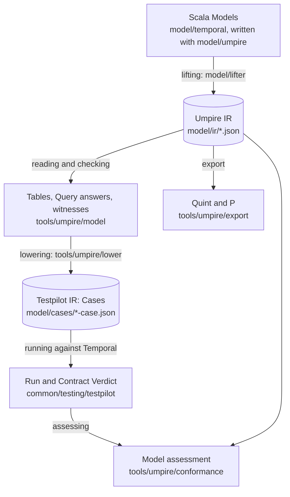

# The Temporal behavior model

This directory holds a description of how Temporal features are expected to behave, written so
that tools can use it. You describe a feature once, as a small state machine and the promises it
makes. From that one description you get:

- **A check of the description itself.** The Go evaluator walks every path the state machine allows,
  within stated limits, and reports any path on which a promise fails.
- **Generated tests.** A path that shows a promise at work becomes a test that runs against a real
  Temporal server. Nobody writes the test by hand.
- **A judgment of what the server did.** The record of such a test is checked twice: against the
  test's own pass conditions, and against the description as a whole.
- **Second opinions.** The same description is exported to two other checkers, Quint and P, and
  their answers are compared with ours.

Paths on this page are relative to the repository root.

## The terms, with one example

The example is one promise about a Nexus operation, which is a call a workflow makes to a handler
in another service: when the handler answers the call synchronously, the operation succeeds and the
workflow history records its completion. The example runs through the whole page.

A **Model** is the description of one feature: its state machines and everything declared about
them. A **machine** is a finite state machine: its states, the actions that can happen, and a step
function per action that says what the next state is and which facts the step records. The Nexus
caller Model is in `model/temporal/nexuscaller`, and its machine `nexusProtocol` is declared in
`Model.scala`.

A **Property** is one promise a machine makes: a condition its steps must meet. This is the
example's Property (`model/temporal/nexuscaller/Claims.scala`, line 25):

```scala
/** A synchronous reply settles the operation as succeeded, and the completed event records it. */
val syncSucceeds: Property[ProtocolState] =
  nexusProtocol.property("syncSucceeds") when handlerReply(Reply.syncSuccess) holds { s =>
    s.state.phase == Phase.succeeded && s.facts.contains(ProtocolFact.nexusOperationCompleted)
  }
```

A **Scenario** is a path through a machine: a start state and a sequence of actions. Here the
caller schedules the operation and the handler replies synchronously (line 101):

```scala
val syncReplied: Scenario[ProtocolState] = nexusProtocol
  .scenario("syncReplied")
  .starts(unscheduled)
  .actions(schedule(unset, unset, unset), handlerReply(Reply.syncSuccess))
```

`unscheduled` is the state before the operation exists. The three `unset` arguments are the
operation's three optional timeouts, none of them set.

A **Query** is a bounded question that joins the two: find a path of this Scenario on which the
Property is put to work, or verify that the Property holds on every path of it (line 171, without
its exploration settings):

```scala
val syncCompletion: Query = (query("syncCompletion") find syncSucceeds in syncReplied limits two)
  .expect(RunExpectation(Conformance.conformant, Outcome.satisfied))
```

The path a `find` Query returns is its witness. `limits two` bounds the search to two steps.
`.expect(...)` states what a real run of this path should be judged as; see
[Following the example to a Verdict](#following-the-example-to-a-verdict).

A **realization** says how to act a path out on a real server: which API calls perform each
action, and which recorded events are evidence of each fact. The Nexus caller's realization is
`model/temporal/nexuscaller/Realization.scala`.

The remaining terms name what the tools produce:

- The **IR** (intermediate representation) is a language-neutral file format that tools read
  instead of source code. There are two, described in the next section.
- **Lifting** turns the compiled Scala Models into the first IR.
- **Lowering** turns a Query's witness, through its realization, into a Case.
- A **Case** is one executable test: a Program of instructions to run against Temporal, and a
  Contract of rules that the recorded evidence must satisfy.
- A **Run** is the record of one execution of a Case: an ordered list of events.
- A **Verdict** is the Contract's conclusion about one Run: `satisfied`, `violated` or
  `inconclusive`.

## The layers

Scala declares a Model, the lifter reads its compiled declarations, and Go evaluates the resulting
IR. The Scala DSL supplies types and step functions for authoring; Go is the single Model evaluator.



Two IRs sit between the layers, and each has one writer side and one reader side:

- The **Umpire IR** is a lifted Model. Scala writes it (the lifter); Go reads it (the reader,
  lowering, conformance, export and exploration under `tools/umpire`). Its schema is
  `proto/internal/temporal/server/api/umpire/v1/ir.proto`, and the checked-in files are
  `model/ir/*.json`. Go never runs Scala code: everything it knows about a Model comes from
  this file.
- The **Testpilot IR** is the Case, Run and Verdict format. Lowering writes Cases; Testpilot, the
  Case runtime, reads them and writes Runs and Verdicts. Its schema is
  `proto/internal/temporal/server/api/testpilot/v1`. Testpilot knows nothing about Models.

| Layer | What happens | Module | Command |
| --- | --- | --- | --- |
| Authoring | Models are written in Scala with a small DSL (a library of declarations such as `machine`, `property` and `query`) | DSL `model/umpire`, Models `model/temporal` | `make lint-model`, `make fmt-model` |
| Lifting | The compiled Models are translated to the Umpire IR, built as the ScalaPB classes of its schema and written as ProtoJSON. A construct outside the supported subset is refused at its source line | `model/lifter`, run by the gate `model/gate` | `make umpire-gen-model` writes `model/ir`; `make umpire-check-model` requires it to be current |
| Umpire IR | The checked-in lifted Models | `model/ir`; schema in `api/umpire/v1` | `make protoc` after a schema change |
| Reading and checking | Go loads and validates the IR, builds each machine's table, and answers every Property, Query and refinement | `tools/umpire/model` | `go test -tags test_dep ./tools/umpire/model/...` |
| Lowering | A `find` Query's witness becomes a Case through its realization | `tools/umpire/lower` | `make umpire-gen-cases` writes `model/cases`; `make umpire-check-cases` requires it to be current |
| Testpilot IR | The checked-in Cases, and `manifest.json`, which accounts for every Query | `model/cases`; schema in `api/testpilot/v1` | |
| Running | Testpilot admits a Case, runs its Program through the Temporal Driver, records the Run and evaluates the Contract into a Verdict | `common/testing/testpilot`, `common/testing/testpilot/temporal` | `make umpire-check-live-tests` (in-process server); `make umpire-run` builds `.build/umpire-run` for any deployment |
| Assessing | The Run's evidence is compared with the whole Model | `tools/umpire/conformance` | part of the live tests above |
| Export | The IR is written for Quint and P, and their answers are compared with Go's | `tools/umpire/export` | `make umpire-check-backends` (needs the tools its README names) |

## Running the gate

The gate is the one command that checks the whole model pipeline:

```sh
make umpire-check-model
```

It is a Scala program, `model/gate`. In order, it checks that the files under `model/` keep to the
model's own vocabulary, compiles and tests the DSL and the Models, runs the lifter's own tests,
lifts every Model, requires every file of `model/ir` and `model/cases` to equal what it just
produced, and runs `go vet` and `go test` over `./tools/umpire/...`. It stops at the first failure
and changes no checked-in file. scala-cli, the JDK, protoc and Go come from the repository's
`mise.toml`.

After you change a Model, regenerate the checked-in files with the same program:

```sh
make umpire-gen-model     # the gate with --update: rewrites model/ir and model/cases
```

Then read the diff of `model/ir` and `model/cases` like any other code change.

The gate packages the linked Temporal API, Testpilot and well-known ScalaPB classes in
`model/gen/api-scalapb.jar`. Its descriptor and tool stamp is checked before a build; editing a
Model reuses that jar. If the gate reports a missing or stale `proto/api.binpb`, run the named
`make proto/api.binpb` target; if it reports stale generated internal protobuf code, run
`make protoc`. The gate reports the declaration's source line when a typed selection cannot be
lifted. The compiler reports misspelled fields, wrong request or response roots and wrong value
types before lifting.

`make umpire-check-model MODEL_GATE_ARGS=--skip-go-checks` leaves out the `go vet` and `go test`
step, for when you run the Go tests separately. `go test -tags test_dep ./tools/umpire/...` runs the
Go side alone from the checked-in IR and needs no JVM.

## Following the example to a Verdict

**Lifted.** `make umpire-gen-model` lifts the Query into `model/ir/nexus-caller.json`. This is its
entry there, without the `exploration` field:

```json
{
  "name": "syncCompletion",
  "position": {
    "file": "model/temporal/nexuscaller/Claims.scala",
    "line": 171
  },
  "form": "FORM_FIND",
  "property": {
    "machine": "nexusProtocol",
    "name": "syncSucceeds"
  },
  "scenario": {
    "machine": "nexusProtocol",
    "name": "syncReplied"
  },
  "limits": {
    "name": "two",
    "steps": 2,
    "actions": 2,
    "search": 512
  },
  "expectedRun": {
    "property": "OUTCOME_SATISFIED",
    "conformance": "CONFORMANCE_CONFORMANT"
  }
}
```

The Property, the Scenario, the machine and its step functions are lifted into the same file the
same way, each with its Scala source position. Step functions become expression trees, which
[SEMANTICS.md](SEMANTICS.md) defines how to evaluate.

**Checked.** The Go reader builds the table of `nexusProtocol` from the IR and answers the Query:
it finds the two-step path and confirms that `syncSucceeds` holds on its last step. That path is
the witness.

**Lowered.** `tools/umpire/lower` turns the witness into the Case
`model/cases/nexus-caller-syncCompletion-case.json`, with the Case ID
`temporal.case.scala.nexus-caller.syncCompletion`. Its Program has three parts: a workflow that
schedules a Nexus operation, a handler that replies synchronously, and a controller that starts
the workflow and reads its history. Its Contract holds one rule. This is the rule, with the two
comparisons left out:

```text
"ruleId": "fact-nexusOperationCompleted",
"trigger": { … },
"response": { … },
"clock": "CORRELATED_CLOCK_OPERATION_TRANSITIONS",
"bound": "1",
"ending": "TRACE_ENDING_PARTIAL"
```

The trigger matches the step whose action is `schedule-unset-unset-unset`, and the response matches
a step whose fact is `nexusOperationCompleted`. In words: once the Run shows the operation
scheduled, the completed fact must follow within one more transition of that operation.
`model/cases/manifest.json` lists the Query as `lowered` and repeats what `.expect(...)` declared.

**Run.** `tools/canary/assessment/testdata/nexus-caller-syncCompletion-run.json` is a recorded Run
of exactly this Case against the in-process test server. It holds 27 events and ends with this
Verdict:

```json
{
  "status": "VERDICT_STATUS_SATISFIED",
  "rules": [
    {
      "ruleId": "fact-nexusOperationCompleted",
      "status": "RULE_VERDICT_STATUS_SATISFIED",
      "terminalStateId": "correlated.satisfied",
      "supportingEventSequences": ["9", "19"]
    }
  ],
  "supportingEventSequences": ["9", "19"]
}
```

Event 9 is the evidence that the operation was scheduled, and event 19 is the history's
`EVENT_TYPE_NEXUS_OPERATION_COMPLETED` event. To produce such a Run yourself,
run every lowered Case against an in-process server:

```sh
go test -tags 'test_dep integration' ./tests -run '^TestTestpilotGeneratedCases$'
```

**Two judgments, kept apart.** The Verdict above is the *Contract Verdict*. It says the Case's own
rule was met, and nothing more: the rule checks that the completion was recorded, not that the
operation's phase was `succeeded`, because a Property's clause about one field of the state does
not lower to a Contract rule yet.

The *model assessment* is the second judgment. It asks whether some execution the Model allows
explains all the evidence in the Run (conformance: `conformant`, `nonconformant` or
`inconclusive`), and what the Query's Property is on every execution that does (`satisfied`,
`violated` or `inconclusive`). The assessment is not stored in the Run. For `syncCompletion` the
declared expectation is `conformant` and `satisfied`, and `TestTestpilotGeneratedCases`
requires exactly that of a live Run and of its replay.

**What is not supported.** These limits are current and recorded, not hidden:

- `syncCompletion` is the only one of the Nexus caller's seven `find` Queries whose Property the
  assessment settles. The other six Cases run and satisfy their Contracts, but their Property stays
  `inconclusive`, because the Model also allows another execution that explains the same evidence
  and on which the Property fails or is never evaluated. Each Query's `.expect(...)` states the
  reason.
- Of the 264 Queries in the checked-in IR, 16 lower to a Case. 150 are `verify` Queries, which have
  nothing to run. 95 belong to machines that declare no realization yet. 3 standalone activity
  Queries are `unsupported`: their path needs something a Case cannot do or record in order yet,
  and the manifest names it at its source line.
- A Run samples one execution of the server. A satisfied Verdict is evidence about that Run, not a
  proof about every schedule.
- The recorded Run above was made on a test server. No Run of a real deployment is checked in.

## Where things are

| Path | What it holds |
| --- | --- |
| `model/umpire` | The DSL: what an author writes a Model with. Realization declarations are in `umpire/realize` |
| `model/temporal` | The Models, one folder per feature: `nexuscaller`, `standaloneactivity`, `worker` |
| `model/lifter` | The lifter. `testdata` holds Models it must lift and Models it must refuse |
| `model/ir` | The checked-in Umpire IR, one file per lifted Model |
| `model/cases` | The checked-in Cases and `manifest.json` |
| `model/gate` | The gate program. It generates the IR's ScalaPB classes from the schema into `model/gen` (`--generate-ir`), and `Roots.scala` lists which declarations go into which IR file |
| `model/project.scala` | The build settings of the DSL and the Models |
| [SEMANTICS.md](SEMANTICS.md) | The evaluation rules of the Umpire IR: what every construct means |
| [Known bugs](../.plans/UMPIRE4_VISION.md#known-bugs-knownbugs) | Vision for acknowledging a known bug; not implemented |
| `model/gen` | Build output of the gate; ignored by git |

The module map, [.plans/UMPIRE_MODULES.md](../.plans/UMPIRE_MODULES.md), states each module's job,
its public interface and what it may import. Each module outside this directory has its own README:

- [tools/umpire](../tools/umpire/README.md): the Go tooling that reads the Umpire IR, and its commands.
- [tools/umpire/export](../tools/umpire/export/README.md): the Quint and P comparison.
- [common/testing/testpilot](../common/testing/testpilot/README.md): the Case runtime and the Testpilot IR.
- [common/testing/testpilot/temporal](../common/testing/testpilot/temporal/README.md): the Temporal Driver.
- [tests/testcore/testpilot](../tests/testcore/testpilot/README.md): the Cases the functional tests pin.
- [tools/canary](../tools/canary/README.md): the canary, which runs one pinned Case against a
  production deployment when an operator dispatches it.

## Writing a Model

`make lint-model` checks formatting and lint rules for the DSL, the Models, the lifter and the
gate; `make fmt-model` formats them and `make fix-model` applies the lint rewrites. A construct a
lint rule forbids where no rewrite keeps the behavior carries a line-scoped
`// scalafix:ok <rule>`.

The lifter reads what an author wrote, as written:

- **Declarations:** `machine[S, O, F](family, name) { … }` blocks, with `forEntity`, `starts`,
  `ends`, `evidence`, `unobservable`, `refines` and `steps(a ~> f, …)`; `restrict`; action chains
  (`action`, `timer`, `on`, `creates`, `input[T]`, `schema`, `results`, `example`); Properties,
  Scenarios, Queries, monitors, compositions, progress claims and realizations.
- **Types:** enums with and without case fields, case classes, and integer fields bounded by the
  `given Finite[Int] = Finite.upTo(…)` beside the state's `Finite`.
- **Step functions:** `if`, `match` with case, alternative, binding and wildcard patterns, local
  `val`s, `copy`, constructors, comparisons, arithmetic, list literals and `++`, and calls of other
  functions. `require` becomes the function's precondition; `ensuring` is not lifted.

Anything else, such as a `var` or a loop, stops the lift with its source line. The lifter works on
the compiler's typed trees (TASTy) and not as a macro, because a macro sees a function's body only
inside its own compilation run and only after pattern matching has been compiled away. The cost is
that a refusal arrives from the lift step, a few seconds after compiling, and not as a compile
error.

Scala compilation rejects type errors such as binding a step to an action with different inputs.
The lifter rejects constructs it cannot express in the IR. Go then reports Model problems such as
a start outside the state domain, a stuck state, a class bound twice or a failed refinement from
the IR at the Scala source line recorded by the lifter. These semantic errors surface through
`make umpire-check-model`, rather than a Scala unit test.

A Query that should become a Case needs two more things: a realization on its machine, and
`.expect(RunExpectation(...))` on the Query, which states the model assessment a Run of it should
get. A missing or malformed expectation fails generation. What a realization may declare, and how
each declaration lowers, is in [SEMANTICS.md](SEMANTICS.md) under Realizations and Generated Case
expectations.

### Naming protobuf data in a Model

Actions name message types, and realizations use generated unary method constants and typed field
selectors. For example:

```scala
import io.temporal.api.workflowservice.v1.{StartActivityExecutionRequest, WorkflowServiceGrpc}
import umpire.realize.*

val start = action("start", Party("caller")).schema[StartActivityExecutionRequest]
val call = Instruction.rpc("endpoint", WorkflowServiceGrpc.METHOD_START_ACTIVITY_EXECUTION)(
  Vector(
    Assignment.typed(
      Field[StartActivityExecutionRequest, String](_.namespace),
      Operand.run()
    )
  ),
  Vector.empty
)
```

`Recorded.read` and `Recorded.single` keep the method's request type and the selected response
message type in an `Evidence.read` reference. `Instruction.poll` takes that reference, so its
assignments use the method's request type and its condition selects fields of the projected
message. `Field[Root, Value]` also names evidence fields, operation keys, response reads and Run
Event guards. Select an optional nested message with a generated `get...` accessor, each repeated
element with `.map`, and a oneof arm through its generated selector. A dynamic Run Event payload
starts from `Operand.Projected.as[InstructionOutcome]` so the selected root is explicit.

Constant messages remain symbolic: `Proto[Payload](ProtoField.typed(...))` names a message and its
fields by type; `ProtoValue.mapping(ProtoEntry.typed("encoding", ProtoValue.utf8("json/plain")))`
writes `Payload.metadata` data with its `String` key and `ByteString` value. The generated API and
ScalaPB runtime are authoring and lifting dependencies only. Scala never builds or sends a Temporal
request; Go still checks the lifted IR against descriptors and executes the Case.

## Generated Cases

`make umpire-gen-model` and `make umpire-gen-cases` write `model/cases/*-case.json` and
`model/cases/manifest.json`. The manifest gives every Query of every checked-in IR file one
standing: `lowered`, `nothing-to-realize`, `no-realization`, or `unsupported` with located reasons.
The generator builds and validates a complete tree before it replaces anything, and the check
fails on a changed, missing or left-over file. Ordinary Go tests never rewrite the tree.

Two other trees pin Cases from this one, byte for byte:
`tests/testcore/testpilot/testdata/generated` for the functional tests
(`make umpire-gen-fixtures`, `make umpire-check-fixtures`) and `tools/canary/casebinding/testdata`
for the canary (`make canary-gen-case`, `make canary-check-case`). After a Model change the order
is `umpire-gen-model`, `umpire-gen-fixtures`, then `canary-gen-case`.

`TestTestpilotGeneratedCases` (`tests/testpilot_generated_test.go`) discovers every
lowered file, binds two independent namespaces and task queues, runs them concurrently twice under
each Nexus implementation, and compares the Contract Verdict and the declared assessment, live and
replayed. A Case that needs a capability the environment lacks is reported before any resource is
provisioned.

`.build/umpire-run --case model/cases/<file>` with `--grpc`, `--http`, `--namespace` and
`--task-queue` runs one Case against any deployment and reports its Verdict. A Case that needs
delivery control is skipped there with its preparation reason, before anything is dialed, and the
command exits with status 3.

A generated Case's Contract checks the authored evidence path, the terminal evidence and the events
that support them. It does not check exact payload equality, ID spellings, the complete SDK attempt
sequence, or isolation by cross-namespace reads. Closing one of those gaps means declaring an
observation in the Model, not writing a Go assertion for one Query.

## Bounded exploration and replay

A `find` Query can declare `.explore(Exploration(...))`: finite alternatives for named positions
of its Scenario, integer priorities, a Run budget and a bounded prefix-deletion sweep. These are IR
declarations. `tools/umpire/explore` enumerates their combinations and has the same reader and
lowering produce a Case for every candidate. Enumerating the candidates is exact model coverage;
running one is a single sampled execution. Neither is an exhaustive search of server schedules.

`make umpire-ir-bridge` builds `.build/umpire-ir-bridge`, which serves candidates from `model/ir`
to the campaign and replay commands. `make umpire-fuzz-run` and `make umpire-replay-run` build it
and run those commands; both need a deployment. Replay first requires two fresh Runs that
reproduce the original failure, then tries the declared deletions and keeps an edit only when two
Runs reproduce the same failure again. An incomplete or unreproduced failure produces no proposal.
`TestTestpilotExplorationDiscoversUnpinnedExecution` and
`TestTestpilotNexusControlReplaysThroughTheCommand` run both against an in-process server; set
`UMPIRE_EXPLORATION_DIR` to keep their Cases, Runs, reports and HTML traces.

`model/temporal/nexuscaller/Control.scala` deliberately admits a forged success beside the real
failed callback. It is a negative control that shows a violated Verdict being found and replayed,
not a server defect.
