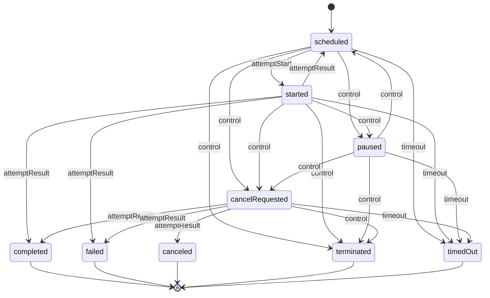

# activityProduct: phases

Generated; do not edit. Self-loops and the fields besides the phase are left out.

```mermaid
stateDiagram-v2
    [*] --> scheduled
    scheduled --> started: attemptStart
    scheduled --> paused: control
    scheduled --> cancelRequested: control
    scheduled --> terminated: control
    scheduled --> timedOut: timeout
    started --> completed: attemptResult
    started --> failed: attemptResult
    started --> scheduled: attemptResult
    started --> paused: control
    started --> cancelRequested: control
    started --> terminated: control
    started --> timedOut: timeout
    paused --> cancelRequested: control
    paused --> terminated: control
    paused --> scheduled: control
    paused --> timedOut: timeout
    cancelRequested --> canceled: attemptResult
    cancelRequested --> completed: attemptResult
    cancelRequested --> failed: attemptResult
    cancelRequested --> terminated: control
    cancelRequested --> timedOut: timeout
    completed --> [*]
    failed --> [*]
    canceled --> [*]
    terminated --> [*]
    timedOut --> [*]
```
